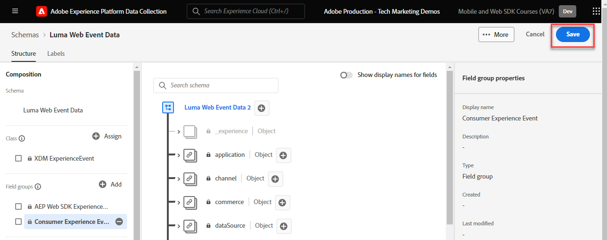

# 為網頁資料建立XDM結構描述

了解如何在 Adob&#x200B;&#x200B;e Experience Platform Data Collection 介面中為 Web 資料建立 XDM 架構。

Experience Data Model (XDM)結構描述是在Adobe Experience Platform中收集資料的建置組塊、原則和最佳實務。

Platform Web SDK會使用您的結構描述將網頁事件資料標準化、傳送給PlatformEdge Network，最終將資料轉送給資料流中設定的任何Experience Cloud應用程式。 此步驟至關重要，因為它會定義將客戶體驗資料擷取到Experience Platform所需的標準資料模型，並啟用建置在這些標準上的下游服務和應用程式。

>[!NOTE]
>
>使用Web SDK實作Adobe Analytics、Adobe Target或Adobe Audience Manager時，XDM結構描述&#x200B;_非必要_ （資料可以在`data`物件中傳遞，而非您稍後看到的`xdm`物件中）。 XDM結構描述是平台原生應用程式(如Journey Optimizer、Real-time Customer Data Platform、Customer Journey Analytics)進行最高效能實作所必需的。 雖然您可以決定在自己的實作中不要使用XDM結構描述，但您應在本教學課程中這樣做。

## 為何要為資料建立模型？

企業有自己的語言來溝通其網域。 汽車經銷商處理廠商、型號和汽缸。 航空公司負責處理航班編號、服務等級和座位分配。 其中有些辭彙是特定公司所特有的，有些辭彙是在垂直產業中共用，有些辭彙則是由幾乎所有企業共用。 對於在垂直產業或更廣的產業之間共用的詞語，當您以共同的方式命名和建構這些詞語時，就可以開始使用您的資料做強大的事情。

例如，許多企業都會處理訂單。 如果這些企業集體決定以類似的方式為訂單建模，該怎麼辦？ 例如，如果資料模型包含具有`priceTotal`屬性（代表訂單的總價）的物件，該怎麼辦？ 如果此物件也有名為`currencyCode`和`purchaseOrderNumber`的屬性，該怎麼辦？ order物件可能包含名為`payments`的屬性，該屬性將是付款物件的陣列。 每個物件代表訂單的付款。 例如，某位客戶可能以禮品卡支付部分訂單，而其他則以信用卡支付。 您可以開始建構類似以下的模型：

```json
{
  "order": {
    "priceTotal": 89.50,
    "currencyCode": "EUR",
    "purchaseOrderNumber": "JWN20192388410012",
    "payments": [
      {
        "paymentType": "gift_card",
        "paymentAmount": 50
      },
      {
        "paymentType": "credit_card",
        "paymentAmount": 39.50
      }
    ]
  }
}
```

如果處理訂單的所有企業都決定以一致的方式針對業界常見的辭彙建立其訂單資料的模型，那麼奇蹟般的事情可能會開始發生。 資訊可以在組織內外的交流更流暢，而不需要持續解讀和翻譯資料（prop和evar，還有誰？）。 機器學習可更輕鬆地瞭解資料&#x200B;_的意義_，並提供可操作的深入分析。 用於呈現相關資料的使用者介面可能會變得更直覺。 您的資料可與遵循相同模型的合作夥伴和廠商緊密整合。

這是Adobe[體驗資料模型](https://business.adobe.com/products/experience-platform/experience-data-model.html)的目標。 XDM為業界常見的資料提供規範性模型，同時允許您擴充模型以滿足特定需求。 Adobe Experience Platform是圍繞XDM建置的，因此，傳送至Experience Platform的資料需要採用XDM。 與其思考在傳送資料給Experience Platform之前可以在哪裡以及如何將目前的資料模型轉換為XDM，不如考慮在您的組織內更普遍地採用XDM，以便幾乎不需要進行翻譯。


>[!NOTE]
>
> 為了示範，本課程中的練習會建立範例結構描述，以擷取客戶在[Luma示範網站](https://luma.enablementadobe.com/content/luma/us/en.html)中檢視的內容和購買的產品。 雖然您可以使用這些步驟建立不同的結構描述以供您個人使用，但建議您先依照建立範例結構描述一起來瞭解結構描述編輯器的功能。

若要深入瞭解XDM結構描述，請參加課程[使用XDM為您的客戶體驗資料建立模型](https://experienceleague.adobe.com/?recommended=ExperiencePlatform-D-1-2021.1.xdm)，或檢視[XDM系統概覽](https://experienceleague.adobe.com/en/docs/experience-platform/xdm/home)。

## 學習目標

在本課程結束時，您將能夠：

* 從資料收集介面中建立XDM結構描述
* 新增欄位群組至您的XDM結構描述
* 使用最佳實務為網頁事件資料建立XDM結構描述

## 先決條件

在[總覽](overview.md)頁面上說明Data Collection和Adobe Experience Platform的所有必要布建和使用者許可權。

## 建立 XDM 結構描述

XDM結構描述是以Experience Platform描述資料的標準方式，可讓所有符合結構描述的資料在組織間重複使用，而不會產生衝突，甚至可在多個組織間共用。 若要深入瞭解，請參閱結構描述組合的[基本知識](https://experienceleague.adobe.com/en/docs/experience-platform/xdm/schema/composition)。

在本練習中，您將使用建議的基準欄位群組來建立XDM結構描述，以擷取[Luma示範網站](https://luma.enablementadobe.com/content/luma/us/en.html){target="_blank"}上的網頁事件資料：

1. 開啟[資料收集介面](https://launch.adobe.com/tw/){target="_blank"}
1. 確定您處於正確的沙箱。 在右上角找到沙箱

   >[!NOTE]
   >
   >如果您是Real-Time CDP或Journey Optimizer等平台型應用程式的客戶，我們建議您在本教學課程中使用開發沙箱。 如果沒有，請使用&#x200B;**[!UICONTROL Prod]**&#x200B;沙箱。

1. 前往左側導覽中的&#x200B;**[!UICONTROL 結構描述]**
1. 選取右上方的&#x200B;**[!UICONTROL 建立結構描述]**&#x200B;按鈕

   
1. 在下列畫面中選取&#x200B;**[!UICONTROL 體驗事件]**
1. 選取&#x200B;**[!UICONTROL 下一步]**

   

1. 在&#x200B;**[!UICONTROL 結構描述顯示名稱]**&#x200B;欄位下輸入結構描述的名稱，在此案例中為`Luma Web Event Data`

   >[!TIP]
   >
   >XDM結構描述的常見命名慣例是將結構描述命名在資料的來源後面。


1. 選取完成

   

## 新增欄位群組

如前所述，XDM是標準化客戶體驗資料的核心架構，可提供用於下游Adobe Experience Platform服務的通用結構和定義。 只要遵循XDM標準，就可以將&#x200B;_所有客戶體驗資料_&#x200B;合併到一般表示中。 此方法可讓您從客戶動作中獲得有價值的深入分析、透過區段定義客戶對象，以及使用來自多個來源的資料來針對個人化目的表達客戶屬性。 如需詳細資訊，請參閱[資料模型化的最佳實務](https://experienceleague.adobe.com/en/docs/experience-platform/xdm/schema/best-practices)。

可能的話，建議使用現有的欄位群組，並遵守與產品無關的模型和命名慣例。 若貴組織的特定資料不符合上述預先定義的欄位群組，您可以建立自訂欄位群組。 請參閱[使用結構描述編輯器建立結構描述](https://experienceleague.adobe.com/en/docs/experience-platform/xdm/tutorials/create-schema-ui#create)，以取得自訂結構描述的詳細步驟。

>[!TIP]
> 
>在本練習中，您新增了建議的預先定義欄位群組，以進行Web資料收集： _**[!UICONTROL AEP Web SDK ExperienceEvent]**_&#x200B;和&#x200B;_**[!UICONTROL 取用者體驗事件]**_。
>


1. 在&#x200B;**[!UICONTROL 欄位群組]**&#x200B;區段中，選取&#x200B;**[!UICONTROL 新增]**

   

1. 搜尋[!UICONTROL `AEP Web SDK ExperienceEvent`]
1. 核取方塊
1. 搜尋[!UICONTROL `Consumer Experience Event`]
1. 核取方塊
1. 選取&#x200B;**[!UICONTROL 新增欄位群組]**

   

對於這兩個欄位群組，請注意，您有權存取網站上資料收集所需的最常用索引鍵/值組。 每個欄位的[!UICONTROL 顯示名稱]會顯示在平台式應用程式的區段產生器介面中，供行銷人員使用，您可以視需要變更標準欄位的顯示名稱。 您也可以移除不要的欄位。 當您按一下任一欄位群組名稱時，介面會醒目顯示哪些索引鍵/值組群組屬於該介面。 在下列範例中，您看到哪些欄位屬於&#x200B;**[!UICONTROL 消費者體驗事件]**。


本課程只是一個起點。 建立您自己的網頁事件結構描述時，您必須探索並記錄您的業務需求。 此程式類似於為Adobe Analytics實作建立[業務需求檔案](https://experienceleague.adobe.com/en/docs/analytics-learn/tutorials/implementation/implementation-basics/creating-a-business-requirements-document)和[解決方案設計參考](https://experienceleague.adobe.com/en/docs/analytics-learn/tutorials/implementation/implementation-basics/creating-and-maintaining-an-sdr)，但應該包含&#x200B;_所有下游資料收件者_&#x200B;的需求，例如平台、Target和事件轉送目的地。


### identitymap物件

有一個特殊欄位可用來識別名為`[!UICONTROL identityMap]`的網頁使用者。


它是任何網路相關資料收集的必備物件，因為它內含識別網路使用者所需的Experience CloudID。 這也是為已驗證身分的使用者設定內部客戶ID的關鍵。 `[!UICONTROL identityMap]`將在[設定身分](configure-identities.md)課程中進一步討論。 它會自動包含在使用&#x200B;**[!UICONTROL XDM ExperienceEvent]**&#x200B;類別的所有結構描述中。


>[!IMPORTANT]
>
> 在儲存結構描述之前，可以啟用結構描述的&#x200B;**[!UICONTROL 設定檔]**。 **此時不要**&#x200B;啟用它。 為設定檔啟用結構描述後，如果不重設整個沙箱，就無法停用或刪除它。 目前也無法從結構描述中移除欄位，不過可以[棄用UI中的欄位](https://experienceleague.adobe.com/en/docs/experience-platform/xdm/tutorials/field-deprecation-ui#deprecate)。 當您在生產環境中使用自己的資料時，請務必牢記這些含意。
>
>
>此設定將在[設定Experience Platform](setup-experience-platform.md)課程中詳細討論。
>

若要完成本課程，請選取右上方的&#x200B;**[!UICONTROL 儲存]**。




現在，當您將Web SDK擴充功能新增至標籤屬性時，便可參考此結構描述。


[下一步： ](configure-identities.md)

>[!NOTE]
>
>感謝您投入時間學習Adobe Experience Platform Web SDK。 如果您有任何疑問、想分享一般意見或有關於未來內容的建議，請在這篇[Experience League社群討論貼文](https://experienceleaguecommunities.adobe.com/t5/adobe-experience-platform-data/tutorial-discussion-implement-adobe-experience-cloud-with-web/td-p/444996)上分享
