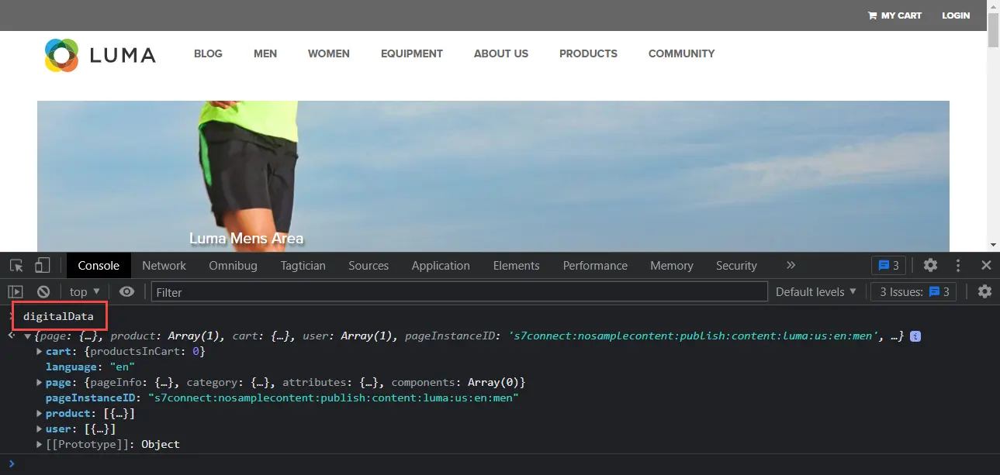

# 建立資料元素

瞭解如何使用Experience PlatformWeb SDK建立擷取資料所需的基本資料元素。 在上擷取內容和身分資料 [Luma示範網站](https://luma.enablementadobe.com/content/luma/us/en.html). 瞭解如何使用您先前建立的XDM結構描述，透過名為XDM物件的新資料元素型別使用Platform Web SDK收集資料。

>[!NOTE]
>
> 為了示範，本課程中的練習會以期間使用的範例為基礎進行擴充。 [設定結構描述](configure-schemas.md) 步驟；建立範例XDM物件，擷取已檢視的內容和使用者的身分 [Luma示範網站](https://luma.enablementadobe.com/content/luma/us/en.html).

>[!IMPORTANT]
>
>本課程資料來自 `[!UICONTROL digitalData]` Luma網站上的資料層。 若要檢視資料層，請開啟您的開發人員主控台，然後輸入 `[!UICONTROL digitalData]` 以檢視完整的可用資料層。


無論Platform Web SDK為何，您都必須繼續在標籤屬性內建立資料元素，這些元素會對應至來自網站的資料收集變數，例如資料層、HTML屬性或其他。 建立這些資料元素後，您必須將其對應至您於建立期間的XDM結構描述 [設定結構描述](configure-schemas.md) 課程。 為此，Platform Web SDK擴充功能提供名為XDM物件的新資料元素型別。 因此，建立資料元素包含兩個動作：

1. 將網站變數對應至資料元素，以及
1. 將這些資料元素對應至XDM物件

對於步驟1，您會使用任何核心標籤擴充功能的資料元素型別，繼續以目前的方式將資料層對應至資料元素。 對於步驟2，Platform Web SDK擴充功能會建立一組先前未提供的新資料元素型別：

* 事件合併ID
* 身分對應
* XDM物件

本課程著重於XDM物件和身分對應資料元素型別。 您將建立XDM物件以擷取Luma訪客的活動和驗證狀態。

## 學習目標

在本課程結束時，您能夠：

* 建立資料元素以擷取內容和使用者登入ID資料
* 建立身分對應資料元素
* 將資料元素對應至XDM物件資料元素


## 先決條件

您已瞭解資料層是什麼，並熟悉 [Luma示範網站](https://luma.enablementadobe.com/content/luma/us/en.html){target="_blank"} 資料層，並瞭解如何參照標籤中的資料元素。 您必須完成本教學課程中下列先前的步驟

* [設定許可權](configure-permissions.md)
* [設定XDM結構描述](configure-schemas.md)
* [設定身分名稱空間](configure-identities.md)
* [設定資料流](configure-datastream.md)
* [安裝在標籤屬性中的Web SDK擴充功能](install-web-sdk.md)

>[!IMPORTANT]
>
>此 [Experience CloudID服務擴充功能](https://exchange.adobe.com/experiencecloud.details.100160.adobe-experience-cloud-id-launch-extension.html) 實作Adobe Experience Platform Web SDK時不需要使用，因為ID服務功能內建於Platform Web SDK中。

## 建立資料元素以擷取資料層

在開始建立XDM物件之前，請先建立下列一組對應至 [Luma示範網站](https://luma.enablementadobe.com/content/luma/us/en.html){target="_blank"} 資料層：

1. 前往 **[!UICONTROL 資料元素]** 並選取 **[!UICONTROL 新增資料元素]** (或 **[!UICONTROL 建立新資料元素]** 如果標籤屬性中沒有現有的資料元素)

   

1. 將資料元素命名為 `page.pageInfo.pageName`
1. 使用 **[!UICONTROL JavaScript變數]** **[!UICONTROL 資料元素型別]** 指向Luma資料層中的值： `digitalData.page.pageInfo.pageName`

1. 勾選&#x200B;**[!UICONTROL 值強制小寫]**&#x200B;和&#x200B;**[!UICONTROL 清除文字]**&#x200B;方塊，以標準化大小寫格式並移除多餘空格

1. 離開 `None` 作為 **[!UICONTROL 儲存期間]** 設定，因為此值在每個頁面上都不相同

1. 選取 **[!UICONTROL 儲存]**

   

請依照相同的步驟，建立以下四個額外的資料元素：

* **`page.pageInfo.server`**  對應至
  `digitalData.page.pageInfo.server`

* **`page.pageInfo.hierarchie1`**  對應至
  `digitalData.page.pageInfo.hierarchie1`

* **`user.profile.attributes.username`**  對應至
  `digitalData.user.0.profile.0.attributes.username`

* **`user.profile.attributes.loggedIn`** 對應至
  `digitalData.user.0.profile.0.attributes.loggedIn`

* **`cart.orderId`** 對應至 `digitalData.cart.orderId` (您將在以下期間使用此功能： [設定Analytics](setup-analytics.md) 課程)


>[!CAUTION]
>
>此 [!UICONTROL JavaScript變數] 資料元素型別會將陣列參照視為點而不是括弧，因此參照使用者名稱資料元素會是 `digitalData.user[0].profile[0].attributes.username` **無法運作**.

## 建立身分對應資料元素

接下來，您可以建立Identity Map資料元素：

1. 前往 **[!UICONTROL 資料元素]** 並選取 **[!UICONTROL 新增資料元素]**

1. **[!UICONTROL 名稱]** 資料元素 `identityMap.loginID`

1. 作為 **[!UICONTROL 副檔名]**，選取 `Adobe Experience Platform Web SDK`

1. 作為 **[!UICONTROL 資料元素型別]**，選取 `Identity map`

1. 這會提示右側的熒幕區域 **[!UICONTROL 資料收集介面]** 供您設定身分識別：

   

1. 作為  **[!UICONTROL 名稱空間]**，選取 `Luma CRM Id` 您先前在中建立的名稱空間 [設定身分](configure-identities.md) 課程。

   >[!NOTE]
   >
   >    如果您沒有看到您的 `Luma CRM Id` 名稱空間，確認您也在預設的生產沙箱中建立它。 只有在預設生產沙箱中建立的名稱空間目前才會顯示在名稱空間下拉式清單中。

1. 晚於 **[!UICONTROL 名稱空間]** ，則必須設定ID。 選取 `user.profile.attributes.username` 在本課程前面建立的資料元素，會在使用者登入Luma網站時擷取ID。

<!--  >[!TIP]
   >
   >You can verify the **[!UICONTROL Luma CRM ID]** is collected in a data element on the web property by going to the [Luma Demo site](https://luma.enablementadobe.com/content/luma/us/en.html), logging in, [switching the tag environment](validate-with-debugger.md#use-the-experience-platform-debugger-to-map-to-your-tag-property) to your own, and typing `_satellite.getVar("user.profile.attributes.username")` in the web browser developer console.
   >
   >   
-->

1. 作為 **[!UICONTROL 已驗證狀態]**，選取 **[!UICONTROL 已驗證]**
1. 選取 **[!UICONTROL 主要]**

1. 選取 **[!UICONTROL 儲存]**

   

>[!TIP]
>
> Adobe建議傳送代表個人的身分，例如 `Luma CRM Id`，作為 [!UICONTROL 主要] 身分。
>
> 如果身分對應包含兩者 `Luma CRM Id` 和ECID，然後 `Luma CRM Id` 成為 [!UICONTROL 主要] 身分。 如果身分對應只包含ECID，則ECID會變成 [!UICONTROL 主要] 身分。


<!--
1. Once the data element is configured in **[!UICONTROL Data Collection interface]**, it can be tested on the Luma web property like any other Data Element. Enter the following script in the browser developer console
   
   
   ```
   _satellite.getVar('identityMap.loginID')
   ```  

   
   
   >[!NOTE]
   >
   >ECID identifier will NOT populate in the Data Element, as this is configured already with Platform Web SDK.   
-->

## 將資料元素對應至XDM物件

您建立的所有資料元素都必須對應至XDM物件。 此物件應符合您在「 」期間建立的XDM結構描述 [設定結構描述](configure-schemas.md) 課程。

有不同的方式可將資料元素對應至XDM物件欄位。 您可以將個別資料元素對應至個別XDM欄位，或將資料元素對應至整個XDM物件，前提是資料元素必須符合XDM物件中存在的精確索引鍵/值配對結構描述。 在本課程中，您將透過對應至個別欄位來擷取內容資料。 您將學習如何 [將資料元素對應至整個XDM物件](setup-analytics.md#Map-an-entire-array-to-an-XDM-Object) 在 [設定Analytics](setup-analytics.md) 課程。

建立XDM物件以擷取內容資料：

1. 在左側導覽中，選取 **[!UICONTROL 資料元素]**
1. 選取 **[!UICONTROL 新增資料元素]**
1. ****&#x200B;將資料元素命名為 **`xdm.content`**
1. 作為 **[!UICONTROL 副檔名]** 選取 `Adobe Experience Platform Web SDK`
1. 作為 **[!UICONTROL 資料元素型別]** 選取 `XDM object`
1. 選取平台 **[!UICONTROL Sandbox]** 您於以下期間在中建立XDM結構描述： [設定XDM結構描述](configure-schemas.md) 課程，在此範例中 `DEVELOPMENT Mobile and Web SDK Courses`
1. 作為 **[!UICONTROL 結構描述]**，選取您的 `Luma Web Event Data` 綱要：

   

   >[!NOTE]
   >
   >沙箱對應至您建立結構描述的Experience Platform沙箱。 您的Experience Platform執行個體中可能有多個沙箱，因此請務必選取正確的沙箱。 一律先從事開發，然後從事生產。

1. 向下捲動，直到您達到 **`web`** 物件
1. 選取以開啟

   


1. 將下列Web XDM變數對應至資料元素

   * **`web.webPageDetials.name`** 到 `%page.pageInfo.pageName%`
   * **`web.webPageDetials.server`** 到 `%page.pageInfo.server%`
   * **`web.webPageDetials.siteSection`** 到 `%page.pageInfo.hierarchie1%`

   

1. 接下來，尋找 `identityMap` 物件並選取它

1. 將對應至 `identityMap.loginID` 資料元素

1. 選取 **[!UICONTROL 儲存]**

   


在這些步驟結束時，您應建立下列資料元素：

| 核心擴充功能資料元素 | Platform Web SDK資料元素 |
-----------------------------|-------------------------------
| `cart.orderId` | `identityMap.loginID` |
| `page.pageInfo.hierarchie1` | `xdm.content` |
| `page.pageInfo.pageName` | |
| `page.pageInfo.server` | |
| `user.profile.attributes.loggedIn` | |
| `user.profile.attributes.username` | |

備妥這些資料元素後，您就可以開始在標籤中建立規則，透過XDM物件開始傳送資料至Platform Edge Network。

[下一步： ](create-tag-rule.md)

>[!NOTE]
>
>感謝您投入時間學習Adobe Experience Platform Web SDK。 若您有任何疑問、想分享一般意見或對未來內容有任何建議，請在此分享這些內容 [Experience League社群討論貼文](https://experienceleaguecommunities.adobe.com/t5/adobe-experience-platform-launch/tutorial-discussion-implement-adobe-experience-cloud-with-web/td-p/444996)
