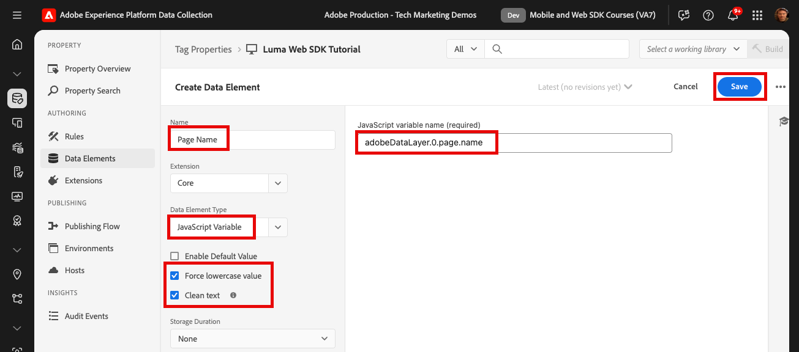
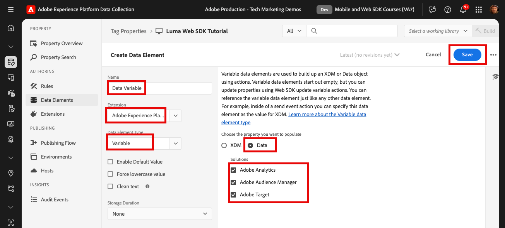

# 建立資料元素

瞭解如何在[Luma示範網站](https://newluma.enablementadobe.com)的內容、商務和身分資料的標籤中建立資料元素。 然後以Adobe Experience Platform Web SDK擴充功能變數資料元素型別填入XDM結構描述中的欄位。


## 學習目標

在本課程結束時，您能夠：

* 瞭解將資料層對應至XDM的不同方法
* 建立資料元素以擷取資料
* 將資料元素對應至XDM物件


## 先決條件

您已瞭解什麼是資料層，並已完成本教學課程中的先前課程：

* [設定XDM結構描述](configure-schemas.md)
* [設定身分名稱空間](configure-identities.md)
* [設定資料流](configure-datastream.md)
* [安裝在標籤屬性中的Web SDK擴充功能](install-web-sdk.md)


>[!IMPORTANT]
>
>此課程的資料來自Luma網站上的`[!UICONTROL adobeDataLayer]`資料層。 若要檢視資料層，請開啟您的開發人員主控台，並輸入`[!UICONTROL adobeDataLayer]`以檢視可用的完整資料層。


## 資料層方法

有多種方式可使用Adobe Experience Platform的標籤功能，將資料從資料層對應至XDM。 以下是三種不同方法的一些優點和缺點。 如有需要，可以合併方法：

1. 在資料層中實作XDM
1. 在標籤中對應到XDM
1. 在資料流中對應到XDM

>[!NOTE]
>
>本教學課程中的範例會依照標籤中的「對應至XDM」方法進行。


### 在資料層中實作XDM

此方法涉及使用完整定義的XDM物件作為資料層的結構。 然後將整個資料層對應到標籤中的XDM物件資料元素。 如果您的實作未使用標籤管理程式，此方法可能是最理想的方法，因為您可以使用[XDM sendEvent命令](https://experienceleague.adobe.com/en/docs/experience-platform/edge/fundamentals/tracking-events#sending-xdm-data)，直接從您的應用程式傳送資料至XDM。 如果您確實使用標籤，您可以建立自訂程式碼資料元素，將擷取整個資料層作為傳遞JSON物件至XDM。 然後，您將傳遞JSON對應到「傳送事件動作」中的XDM物件欄位。

以下是資料層使用Adobe使用者端資料層格式的範例：

+++資料層中的XDM範例

```JSON
window.adobeDataLayer.push({
"eventType": "web.webPageDetails.pageViews",
"web":{
         "webInteraction":{
            "linkClicks":{
               "id":"",
               "value":""
            },
            "URL":"",
            "name":"",
            "region":"",
            "type":""
         },
         "webPageDetails":{
            "pageViews":{
               "id":"",
               "value":"1"
            },
            "URL":"https://newluma.enablementadobe.com/",
            "isErrorPage":"",
            "isHomePage":"",
            "name":"luma:home",
            "server":"enablementadobe.com",
            "siteSection":"home",
            "viewName":""
         },
         "webReferrer":{
            "URL":"",
            "type":""
         }
      }
});
```

+++

優點

* 消除重新對應至XDM資料層變數的額外步驟
* 如果您的Web開發團隊也擁有標籤數位行為，部署可能會更快一些

缺點

* 完全依賴開發團隊和開發週期來更新要傳送到XDM的資料
* XDM從資料層接收確切的裝載，因此彈性有限
* 無法使用內建標籤功能，例如刮取、持續性、快速部署功能
* 資料圖層較難用於協力廠商畫素(但您可能想要將這些畫素移至[事件轉送](setup-event-forwarding.md)！
* 無法在資料層和XDM之間轉換資料

### 在標籤中對應資料層

此方法包括將個別資料層變數或資料層物件對應至標籤中的資料元素，並最終對應至XDM。 這是使用標籤管理系統實作的傳統方法。

#### 優點

* 最靈活的方法，因為您可以在資料進入XDM之前控制個別變數並轉換資料
* 可使用Adobe標籤觸發器和刮取功能將資料傳遞至XDM
* 可以將資料元素對應至第三方畫素使用者端

#### 缺點

* 將資料層重新建構為資料元素需要時間


>[!TIP]
>
> Google資料層
> 
> 如果您的組織已使用Google Analytics，且您的網站上具有傳統Google資料層物件，您可以在標籤中使用[Google資料層擴充功能](https://experienceleague.adobe.com/en/docs/experience-platform/tags/extensions/client/google-data-layer/overview)。 這可讓您更快速地部署Adobe技術，而不需要向IT團隊請求支援。 將Google資料層對應至XDM會遵循上述相同步驟。

### 在資料流中對應到XDM

此方法使用內建在資料流設定中的功能，稱為[資料收集的資料準備](https://experienceleague.adobe.com/en/docs/experience-platform/datastreams/data-prep)，並略過將資料層變數對應到標籤中的XDM。

#### 優點

* 靈活地對應個別變數至XDM
* 可在資料層移至XDM之前[計算新值](https://experienceleague.adobe.com/en/docs/experience-platform/data-prep/functions)或[轉換資料型別](https://experienceleague.adobe.com/en/docs/experience-platform/data-prep/data-handling)
* 運用[對應UI](https://experienceleague.adobe.com/en/docs/experience-platform/datastreams/data-prep#create-mapping)，使用點選式UI將來源資料中的欄位對應到XDM

#### 缺點

* 資料層變數無法當作使用者端協力廠商畫素的資料元素使用，但可用於事件轉送
* 無法使用Adobe Experience Platform標籤功能的刮擦功能
* 如果將資料層對應到標籤和資料流中，維護複雜性就會增加


>[!IMPORTANT]
>
>如先前所述，本教學課程中的範例依照標籤中的「對應至XDM」方法進行。

## 建立資料元素以擷取資料層

建立XDM物件之前，請先為[Luma示範網站](https://newluma.enablementadobe.com){target="_blank"}資料層建立下列資料元素集：

1. 移至&#x200B;**[!UICONTROL 資料元素]**&#x200B;並選取&#x200B;**[!UICONTROL 新增資料元素]** (或&#x200B;**[!UICONTROL 建立新資料元素]** （如果標籤屬性中沒有現有的資料元素）

   

1. 將資料元素命名為 `Page Name`
1. 使用&#x200B;**[!UICONTROL JavaScript變數]** **[!UICONTROL 資料元素型別]**&#x200B;指向Luma資料層中的值： `adobeDataLayer.0.page.name`

1. 勾選&#x200B;**[!UICONTROL 強制小寫值]**&#x200B;和&#x200B;**[!UICONTROL 清除文字]**&#x200B;方塊，以標準化大小寫格式並移除多餘的空格

1. 保留`None`為&#x200B;**[!UICONTROL 儲存期間]**&#x200B;設定，因為此值在每個頁面上都不相同

1. 選取&#x200B;**[!UICONTROL 儲存]**

   

請依照相同的步驟建立這些額外的資料元素：

* **`User Id`**&#x200B;對應至
  `adobeDataLayer.0.user.id`

* **`User Logged In`**&#x200B;對應至
  `adobeDataLayer.0.user.loggedIn`

* **`Ecommerce Product Id`**&#x200B;對應至`adobeDataLayer.0.ecommerce.detail.products.0.id`
* **`Ecommerce Product Name`**&#x200B;對應至`adobeDataLayer.0.ecommerce.detail.products.0.name`
* **`Ecommerce Purchase Id`**&#x200B;對應至`adobeDataLayer.0.ecommerce.purchase.actionField.id`
* 使用&#x200B;**`Ecommerce Product Category`**&#x200B;自訂程式碼&#x200B;**&#x200B;**&#x200B;資料元素型別&#x200B;**[!UICONTROL 和下列自訂程式碼的]**：

  ```javascript
  return adobeDataLayer[0].ecommerce.detail.products[0].category+":"+adobeDataLayer[0].ecommerce.detail.products[0].subcategory;
  ```

* **`Ecommerce Cart Products`**&#x200B;使用以下自訂程式碼：

  ```javascript
  const cartProducts = adobeDataLayer
  .flatMap(evt => Array.isArray(evt?.ecommerce?.cart?.items) ? evt.ecommerce.cart.items : [])
  .filter(item => item && item.id && item.name && item.brand)
  .map(({ id, name, brand }) => ({ id, name, brand }));
  
  return cartProducts;
  ```

* **`Ecommerce Checkout Products`**&#x200B;使用以下自訂程式碼：

  ```javascript
  const checkoutProducts = adobeDataLayer
  .flatMap(evt => Array.isArray(evt?.ecommerce?.checkout?.products) ? evt.ecommerce.checkout.products : [])
  .filter(item => item && item.id && item.name && item.brand)
  .map(({ id, name, brand }) => ({ id, name, brand }));
  
  return checkoutProducts;
  ```


>[!CAUTION]
>
>[!UICONTROL JavaScript變數]資料元素型別會將陣列參照視為點而非括弧，因此將使用者名稱資料元素參照為`adobeDataLayer[0].page.name` **將無法運作**。

## 為XDM和資料物件建立變數資料元素

您剛建立的資料元素將用於建立XDM物件（適用於Platform應用程式）和資料物件(適用於Analytics、Target和Audience Manager)。 這些物件有自己的特殊資料元素，稱為&#x200B;**[!UICONTROL 變數]**&#x200B;資料元素，這些資料元素很容易建立。

若要建立XDM的變數資料元素，請將其連結至您在[設定結構描述](configure-schemas.md)課程中建立的結構描述：

1. 選取&#x200B;**[!UICONTROL 新增資料元素]**
1. 為資料元素命名`XDM Variable`。 建議您為XDM專屬的資料元素加上前置詞「xdm」，以便更妥善地組織標籤屬性
1. 選取&#x200B;**[!UICONTROL Adobe Experience Platform Web SDK]**&#x200B;做為&#x200B;**[!UICONTROL 擴充功能]**
1. 選取&#x200B;**[!UICONTROL 變數]**&#x200B;做為&#x200B;**[!UICONTROL 資料元素型別]**
1. 選取&#x200B;**[!UICONTROL XDM]**&#x200B;做為&#x200B;**[!UICONTROL 屬性]**
1. 選取您建立結構描述的&#x200B;**[!UICONTROL 沙箱]**
1. 選取適當的&#x200B;**[!UICONTROL 結構描述]**，在此案例中為`Luma Web Event Data`
1. 選取&#x200B;**[!UICONTROL 儲存]**

   XDM變數資料元素

接下來，為資料物件建立變數資料元素：

1. 選取&#x200B;**[!UICONTROL 新增資料元素]**
1. 為資料元素命名`Data Variable`。
1. 選取&#x200B;**[!UICONTROL Adobe Experience Platform Web SDK]**&#x200B;做為&#x200B;**[!UICONTROL 擴充功能]**
1. 選取&#x200B;**[!UICONTROL 變數]**&#x200B;做為&#x200B;**[!UICONTROL 資料元素型別]**
1. 選取&#x200B;**[!UICONTROL 資料]**&#x200B;做為&#x200B;**[!UICONTROL 屬性]**
1. 選取您想要實作的Experience Cloud解決方案，作為本教學課程的一部分
1. 選取&#x200B;**[!UICONTROL 儲存]**

   


在這些步驟結束時，您應該建立下列資料元素：

| 核心擴充功能資料元素 | Platform Web SDK擴充功能資料元素 |
-----------------------------|-------------------------------
| `Ecommerce Cart Products` | `Data Variable` |
| `Ecommerce Checkout Products` | `XDM Variable` |
| `Ecommerce Checkout Products` | |
| `Ecommerce Product Category` | |
| `Ecommerce Product Id` | |
| `Ecommerce Product Name` | |
| `Ecommerce Purchase Id` | |
| `Page Name` | |
| `User Id` | |
| `User Logged In` | |

設定好這些資料元素後，您就可以開始使用標籤規則將資料傳送至Platform Edge Network了。 但首先，瞭解如何使用Web SDK收集身分資料。

>[!NOTE]
>
>感謝您花時間學習Adobe Experience Platform Web SDK。 如果您有任何疑問、想分享一般意見或有關於未來內容的建議，請在這篇[Experience League社群討論貼文](https://experienceleaguecommunities.adobe.com/adobe-experience-platform-18/tutorial-discussion-implement-adobe-experience-cloud-with-web-sdk-tutorial-248848)上分享
