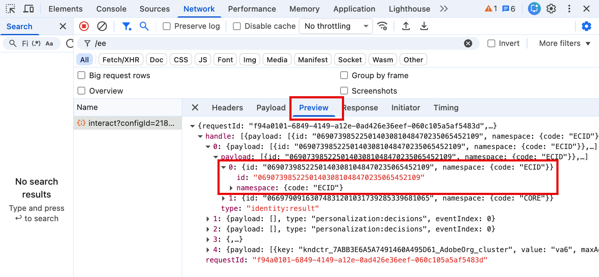
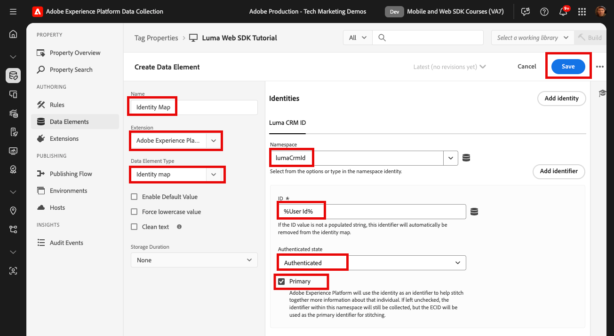

# 建立身分

了解如何使用 Adob&#x200B;&#x200B;e Experience Platform Web SDK 擷取身分識別。擷取[Luma示範網站](https://luma.enablementadobe.com/content/luma/us/en.html)上未驗證和已驗證的身分資料。 瞭解如何使用您先前建立的資料元素，以透過名為「身分對應」的Platform Web SDK資料元素型別收集已驗證的資料。

本課程著重於Adobe Experience Platform Web SDK標籤擴充功能所提供的身分對應資料元素。 您可以將包含已驗證使用者ID和驗證狀態的資料元素對應至XDM。

## 學習目標

在本課程結束時，您能夠：

* 瞭解Experience Cloud ID (ECID)和第一方裝置ID (FPID)之間的關係
* 瞭解未驗證與已驗證ID之間的差異
* 建立身分對應資料元素

## 先決條件

您已瞭解什麼是資料層、熟悉[Luma示範網站](https://luma.enablementadobe.com/content/luma/us/en.html){target="_blank"}資料層，並瞭解如何參考標籤中的資料元素。 您必須完成本教學課程中先前的課程：

* [設定XDM結構描述](configure-schemas.md)
* [設定身分名稱空間](configure-identities.md)
* [設定資料流](configure-datastream.md)
* [安裝在標籤屬性中的Web SDK擴充功能](install-web-sdk.md)
* [建立資料元素](create-data-elements.md)


## Experience Cloud ID

[Experience Cloud ID (ECID)](https://experienceleague.adobe.com/zh-hant/docs/experience-platform/identity/features/ecid)是跨Adobe Experience Platform和Adobe Experience Cloud應用程式使用的共用身分名稱空間。 ECID是客戶身分識別的基礎，也是數位財產的預設身分識別。 ECID永遠存在，因此是追蹤未經驗證使用者行為的理想識別碼。

<!-- FYI I commented this out because it was breaking the build - Jack
>[!TIP]
>
> When you use the Experience Platform Web SDK to set up Adobe applications on your digital properties, the ECID is generated at the Adobe Edge server level. As such, ECID is not viewable on the client-side network request payload. You can view the ECID by seeing the Preview tab of the network request, or by using the [Adobe Experience Platform Debugger Edge Trace](set-up-analytics.md#experience-cloud-id-validation).
>
-->

深入瞭解如何使用Platform Web SDK[追蹤](https://experienceleague.adobe.com/zh-hant/docs/experience-platform/edge/identity/overview)ECID。

ECID是使用第一方Cookie和平台Edge Network的組合來設定。 依預設，第一方身分識別Cookie是由Web SDK在使用者端設定。 若要說明瀏覽器對Cookie有效期的限制，您可以選擇改為在伺服器端設定您自己的第一方身分識別Cookie 。 這些身分識別Cookie稱為第一方裝置ID (FPID)。

>[!IMPORTANT]
>
>實作Adobe Experience Platform Web SDK時不需要[Experience Cloud ID服務擴充功能](https://exchange.adobe.com/apps/ec/100160/adobe-experience-cloud-id-launch-extension)，因為ID服務功能內建於Platform Web SDK中。

## 第一方裝置識別碼(FPID)

FPID是您使用自己的網頁伺服器&#x200B;_設定的第一方Cookie_，Adobe接著會使用這些伺服器來建立ECID，而不是使用網頁SDK設定的第一方Cookie。 雖然瀏覽器支援可能有所不同，但如果由運用DNS A記錄（適用於IPv4）或AAAA記錄（適用於IPv6）的伺服器設定第一方Cookie，相較於由DNS CNAME或JavaScript程式碼設定時，第一方Cookie通常更耐用。

設定FPID Cookie後，系統便會在收集事件資料時擷取其值並傳送至Adobe。 收集的FPID會作為種子，在Platform Edge Network上產生ECID，這繼續是Adobe Experience Cloud應用程式中的預設識別碼。

雖然本教學課程中不使用FPID，但建議您在自己的網頁SDK實作中使用FPID。 深入瞭解Platform Web SDK中的[第一方裝置識別碼](https://experienceleague.adobe.com/zh-hant/docs/experience-platform/edge/identity/first-party-device-ids)

>[!CAUTION]
>
> FPID是使用網頁伺服器設定的Cookie來產生ECID的替代方式。 它不會用於識別已驗證的使用者。

## 已驗證的ID

如上所述，使用Platform Web SDK時，Adobe會為您的數位財產的所有訪客指派ECID。 ECID是追蹤未驗證數位行為的預設身分識別。

您也可以傳送已驗證的使用者ID，讓Platform可以建立[身分圖表](https://experienceleague.adobe.com/zh-hant/docs/platform-learn/tutorials/identities/understanding-identity-and-identity-graphs)，而Target可以設定其[協力廠商ID](https://experienceleague.adobe.com/zh-hant/docs/target/using/audiences/visitor-profiles/3rd-party-id)。 使用[!UICONTROL 身分對應]資料元素型別來設定已驗證的識別碼。

若要建立[!UICONTROL 身分對應]資料元素：

1. 移至&#x200B;**[!UICONTROL 資料元素]**&#x200B;並選取&#x200B;**[!UICONTROL 新增資料元素]**

1. **[!UICONTROL Name]**&#x200B;資料元素`identityMap.loginID`

1. 以&#x200B;**[!UICONTROL 延伸模組]**&#x200B;的形式，選取`Adobe Experience Platform Web SDK`

1. 作為&#x200B;**[!UICONTROL 資料元素型別]**，請選取`Identity map`

1. 這會在&#x200B;**[!UICONTROL 資料收集介面]**&#x200B;的右側提示熒幕區域，供您設定身分：

   

1. 以&#x200B;**[!UICONTROL 名稱空間]**&#x200B;的身分，選取您先前在`lumaCrmId`設定身分[課程中建立的](configure-identities.md)名稱空間。 如果下拉式清單中未顯示該變數，請輸入。

1. 選取&#x200B;**[!UICONTROL 名稱空間]**&#x200B;之後，必須設定識別碼。 選取先前在`user.profile.attributes.username`建立資料元素[課程中建立的](create-data-elements.md#create-data-elements-to-capture-the-data-layer)資料元素，以在使用者登入Luma網站時擷取ID。

   <!--  >[!TIP]
    >
    >You can verify the **[!UICONTROL Luma CRM ID]** is collected in a data element on the web property by going to the [Luma Demo site](https://luma.enablementadobe.com/content/luma/us/en.html), logging in, [switching the tag environment](validate-with-debugger.md#use-the-experience-platform-debugger-to-map-to-your-tag-property) to your own, and typing `_satellite.getVar("user.profile.attributes.username")` in the web browser developer console.
    >
    >   
    -->

1. 作為&#x200B;**[!UICONTROL 已驗證狀態]**，請選取&#x200B;**[!UICONTROL 已驗證]**
1. 選取&#x200B;**[!UICONTROL 主要]**

1. 選取&#x200B;**[!UICONTROL 儲存]**

   

>[!TIP]
>
> Adobe建議將代表個人的身分（例如`Luma CRM Id`）傳送為[!UICONTROL 主要]身分。
>
> 如果身分對應包含人員識別碼（例如，`Luma CRM Id`），則人員識別碼會變成[!UICONTROL 主要]身分。 否則，`ECID`會成為[!UICONTROL 主要]身分。


<!--
1. Once the data element is configured in **[!UICONTROL Data Collection interface]**, it can be tested on the Luma web property like any other Data Element. Enter the following script in the browser developer console
   
   
   ```
   _satellite.getVar('identityMap.loginID')
   ```  

   
   
   >[!NOTE]
   >
   >ECID identifier will NOT populate in the Data Element, as this is configured already with Platform Web SDK.   
-->

在這些步驟結束時，您應該建立下列資料元素：

| 核心擴充功能資料元素 | Platform Web SDK擴充功能資料元素 |
-----------------------------|-------------------------------
| `cart.orderId` | `data.variable` |
| `cart.productInfo` | `identityMap.loginID` |
| `cart.productInfo.purchase` | `xdm.variable.content` |
| `page.pageInfo.hierarchie1` | |
| `page.pageInfo.pageName` | |
| `page.pageInfo.server` | |
| `product.category` | |
| `product.productInfo.sku` | |
| `product.productInfo.title` | |
| `user.profile.attributes.loggedIn` | |
| `user.profile.attributes.username` | |

備妥這些資料元素後，您就可以開始在標籤中建立規則，將資料傳送至Platform Edge Network。

>[!NOTE]
>
>感謝您花時間學習Adobe Experience Platform Web SDK。 如果您有任何疑問、想分享一般意見或有關於未來內容的建議，請在這篇[Experience League社群討論貼文](https://experienceleaguecommunities.adobe.com/t5/adobe-experience-platform-data/tutorial-discussion-implement-adobe-experience-cloud-with-web/td-p/444996?profile.language=zh-Hant)上分享
