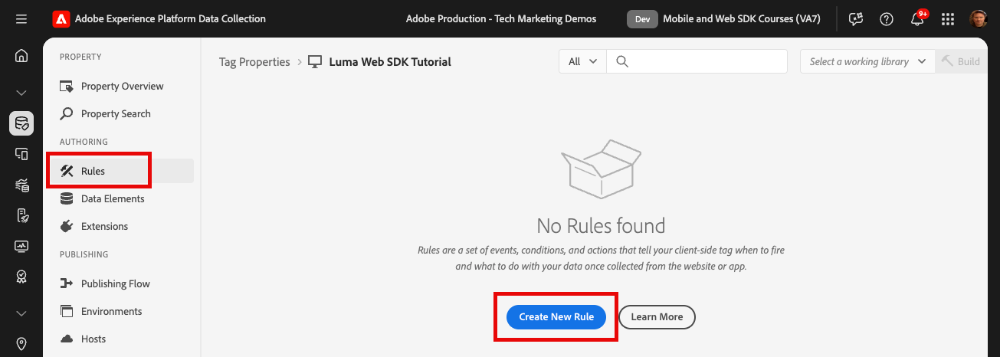
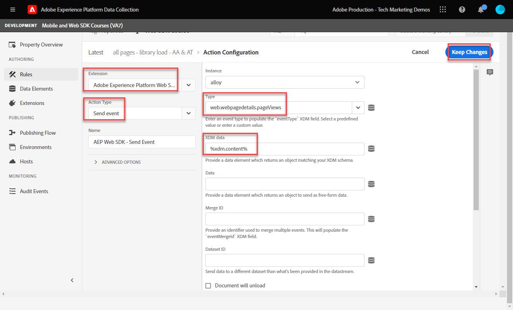
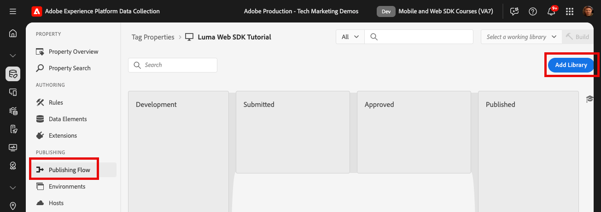

# 建立標籤規則

瞭解如何使用標籤規則，透過XDM物件將事件傳送至Platform Edge Network。 標籤規則是事件、條件和動作的組合，可告知標籤屬性執行動作。

>[!NOTE]
>
> 為了示範，本課程中的練習會以期間使用的範例為基礎進行 [建立資料元素](create-data-elements.md) 步驟；傳送XDM事件動作以從上的使用者擷取內容和身分 [Luma示範網站](https://luma.enablementadobe.com/content/luma/us/en.html).

## 學習目標

在本課程結束時，您將能夠：

* 使用命名慣例來管理標籤內的規則
* 建立標籤規則以傳送XDM事件
* 將標籤規則發佈至開發程式庫

## 先決條件

您熟悉資料收集標籤和 [Luma示範網站](https://luma.enablementadobe.com/content/luma/us/en.html)，而且您必須先完成本教學課程中的下列課程：

* [設定許可權](configure-permissions.md)
* [設定XDM結構描述](configure-schemas.md)
* [設定身分名稱空間](configure-identities.md)
* [設定資料流](configure-datastream.md)
* [安裝在標籤屬性中的Web SDK擴充功能](install-web-sdk.md)
* [建立資料元素](create-data-elements.md)

## 命名慣例

若要更妥善地管理標籤中的規則，建議遵循標準命名慣例。 本教學課程使用三部分命名慣例：

* [位置] - [事件] - [工具]

其中；

1. 位置是規則引發所在網站的一或多個頁面
1. 事件是引發信標的觸發程式
1. tool為該規則之動作步驟中所使用的特定應用程式

## 建立標籤規則

在標籤中，規則是用來在不同的條件下執行動作（引發呼叫）。 您將使用此第一項規則，透過Web SDK的 [!UICONTROL 傳送事件] 動作。 在本教學課程的稍後部分，您將根據訪客所在的頁面型別，傳送不同版本的XDM物件。 因此，您將使用規則條件來排除這些其他型別的頁面。

若要建立標籤規則：

1. 開啟您在本教學課程中使用的標籤屬性
1. 前往 **[!UICONTROL 規則]** 在左側導覽列中
1. 選取 **[!UICONTROL 建立新規則]** 按鈕
   
1. 將規則命名為 `all pages - library load - AA & AT`

   >[!NOTE]
   >
   > Adobe Analytics和Target在未來課程中以特定方式使用此規則，這就是為什麼原因 `AA & AT` 在名稱的結尾使用。

1. 在 **[!UICONTROL 活動]** 區段，選取 **[!UICONTROL 新增]**
   
1. 使用 **[!UICONTROL 核心擴充功能]** 並選取 `Library Loaded (Page Top)` 作為 **[!UICONTROL 事件型別]**.

   此設定表示每當標籤程式庫載入頁面時，規則都會引發。
1. 選取 **[!UICONTROL 保留變更]** 以返回主規則畫面
   
1. 在 **[!UICONTROL 條件]** 區段，選取 **[!UICONTROL 新增]** 按鈕
   
1. 選取 **[!UICONTROL 邏輯型別]** `Exception`， **[!UICONTROL 副檔名]** `Core`、和 **[!UICONTROL 條件型別]** `Path Without Query String`
1. 輸入URL路徑 `/content/luma/us/en/user/cart.html` 在 **[!UICONTROL 路徑等於]** 欄位，和 **[!UICONTROL 名稱]** it `Core - cart page`
1. 選取 **[!UICONTROL 保留變更]**
   
1. 為下列URL路徑新增三個其他例外

   * **`Core - checkout page`** for `/content/luma/us/en/user/checkout.html`
   * **`Core - thank you page`** for `/content/luma/us/en/user/checkout/order/thank-you.html`
   * **`Core - product page`** 的 `/products/` Regex開關開啟時

   

1. 在 **[!UICONTROL 動作]** 區段，選取 **[!UICONTROL 新增]**
1. 選取 **[!UICONTROL Adobe Experience Platform Web SDK]** 作為 **[!UICONTROL 副檔名]**
1. 選取 **[!UICONTROL 傳送事件]** 作為 **[!UICONTROL 動作型別]**
1. 選取 **[!UICONTROL web.webpagedetails.pageViews]** 作為 **[!UICONTROL 型別]**.

   >[!WARNING]
   >
   > 此下拉式清單會填入 **`xdm.eventType`** 變數中識別資料中心。 雖然您也可以在此欄位中輸入任意格式的標籤，強烈建議您這麼做 **不要** 因為它對Platform會有不利的影響。

1. 作為 **[!UICONTROL XDM資料]**，選取 `xdm.content` 在上一課程中建立的資料元素
1. 選取 **[!UICONTROL 保留變更]** 以返回主規則畫面

   
1. 選取 **[!UICONTROL 儲存]** 儲存規則的方式

   

## 在程式庫中發佈規則

接下來，將規則發佈至您的開發環境，以便我們驗證它是否有效。

若要建立程式庫：

1. 前往 **[!UICONTROL 發佈流程]** 在左側導覽列中
1. 選取 **[!UICONTROL 新增程式庫]**

   
1. 對於 **[!UICONTROL 名稱]**，輸入 `Luma Web SDK Tutorial`
1. 對於 **[!UICONTROL 環境]**，選取 `Development`
1. 選取  **[!UICONTROL 新增所有變更的資源]**

   >[!NOTE]
   >
   >    除了Adobe Experience Platform Web SDK擴充功能和 `all pages - library load - AA & AT` 規則中，您會看到先前課程中建立的標籤元件。 核心擴充功能包含所有Web標籤屬性所需的基本JavaScript。

1. 選取 **[!UICONTROL 儲存並為開發環境建置]**

   

程式庫可能需要幾分鐘的時間才能建置，建置完成後，程式庫名稱左側會顯示一個綠色點：

如您所見 [!UICONTROL 發佈流程] 畫面中，發佈程式還有許多不在本教學課程的討論範圍內。 本教學課程僅在您的開發環境中使用單一程式庫。

現在您已準備好使用Adobe Experience Platform Debugger驗證請求中的資料。

[下一個 ](validate-with-debugger.md)

>[!NOTE]
>
>感謝您投入時間學習Adobe Experience Platform Web SDK。 如果您有疑問、想要分享一般意見或有關於未來內容的建議，請在此分享這些內容 [Experience League社群討論貼文](https://experienceleaguecommunities.adobe.com/t5/adobe-experience-platform-launch/tutorial-discussion-implement-adobe-experience-cloud-with-web/td-p/444996)
