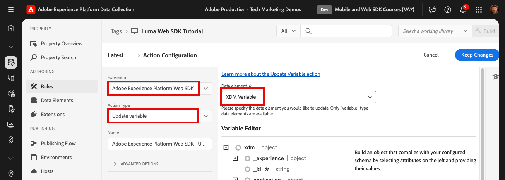

# 建立標籤規則

瞭解如何使用標籤規則將事件傳送至Adobe Experience Platform Edge Network。 標籤規則是事件、條件和動作的組合，可告知標籤屬性執行動作。 透過Platform Web SDK，規則可用來將事件與正確的資料傳送至Platform Edge Network。

## 學習目標

在本課程結束時，您能夠：

* 使用命名慣例來管理標籤內的規則
* 使用更新變數和傳送事件動作來傳送包含XDM欄位的事件
* 跨多個規則棧疊多組XDM欄位
* 將個別或整個陣列資料元素對應至XDM物件
* 將標籤規則發佈至開發程式庫

## 先決條件

您熟悉資料收集標籤和[Luma示範網站](https://luma.enablementadobe.com)，並已完成教學課程中先前的課程：

* [設定XDM結構描述](configure-schemas.md)
* [設定身分名稱空間](configure-identities.md)
* [設定資料流](configure-datastream.md)
* [安裝 Web SDK 擴充功能](install-web-sdk.md)
* [建立資料元素](create-data-elements.md)
* [擷取身分](create-identities.md)

## 命名慣例

若要管理標籤中的規則，建議遵循標準命名慣例。 本教學課程使用四部分命名慣例：

* [**位置**] - [**事件**] - [**用途**] - [**訂單**]

其中；

1. **location**&#x200B;是規則觸發所在網站的一或多個頁面
1. **event**&#x200B;是規則的觸發器
1. **purpose**&#x200B;是規則執行的主要動作
1. **order**&#x200B;是規則在與其他共用相同事件的規則關聯時所應觸發的順序
<!-- minor update -->

## 新增Adobe Client Data Layer擴充功能

Luma網站使用事件導向的資料層，稱為Adobe Client Data Layer (ACDL)。 每當發生資料層事件時，就會將其推送至`adobeDataLayer`陣列。 本教學課程使用名為Adobe Client Data Layer的標籤擴充功能，方便您點選這些事件來建構我們的規則。

若要新增擴充功能：

1. 移至&#x200B;**[!UICONTROL 延伸模組]**
1. 篩選至&#x200B;**[!UICONTROL Adobe使用者端資料層]**
1. 選取&#x200B;**[!UICONTROL 安裝]**

   

1. 保留預設設定
1. 選取&#x200B;**[!UICONTROL 儲存]**

>[!NOTE]
>
> 不需要使用Adobe使用者端資料層來實作Experience Platform Web SDK。 許多其他型別的事件通常用於標籤實作（程式庫已載入、DOM已就緒、視窗已載入等）以觸發規則。

## 建立標籤規則

在標籤中，規則用於執行動作，例如設定變數以及在各種情況下引發網路呼叫。 Experience Platform Web SDK標籤擴充功能包含規則中使用的兩個動作：

* **[!UICONTROL 更新變數]**&#x200B;將資料元素對應至您的XDM或資料變數
* **[!UICONTROL 傳送事件]**&#x200B;進行網路呼叫，以將資料傳送至Experience Platform Edge Network

在本課程的其餘部分中，我們會：

1. 使用&#x200B;**[!UICONTROL 更新變數]**&#x200B;動作來定義XDM欄位的「全域設定」。

1. 再次使用&#x200B;**[!UICONTROL 更新變數]**&#x200B;動作以覆寫我們的「全域設定」，並在特定條件下（例如在產品頁面上新增產品詳細資訊）貢獻其他XDM欄位。

1. 使用&#x200B;**[!UICONTROL 傳送事件]**&#x200B;動作將資料傳送至Adobe Experience Platform Edge Network。

所有這些規則將使用&quot;[!UICONTROL 順序]&quot;選項正確排序。

這部影片會概述此程式：

>[!VIDEO](https://video.tv.adobe.com/v/3427710/?learn=on&enablevpops)

### 全域設定欄位

若要為全域XDM欄位建立標籤規則：

1. 開啟您在本教學課程中使用的標籤屬性

1. 前往左側導覽中的&#x200B;**[!UICONTROL 規則]**

1. 選取&#x200B;**[!UICONTROL 建立新規則]**&#x200B;按鈕

   

1. 將規則命名為 `all pages - adobeDataLayer push - set global variables - 1`

1. 在&#x200B;**[!UICONTROL 事件]**&#x200B;區段中，選取&#x200B;**[!UICONTROL 新增]**

   

1. 使用&#x200B;**[!UICONTROL Adobe Client Data Layer]**&#x200B;擴充功能，並選取&#x200B;**[!UICONTROL 推送的資料]**&#x200B;作為&#x200B;**[!UICONTROL 事件型別]**

1. 選取&#x200B;**[!UICONTROL 進階]**&#x200B;下拉式清單，並輸入`1`作為&#x200B;**[!UICONTROL 訂單]**

   >[!NOTE]
   >
   > 訂單編號越低，執行的時間就越早。 因此，我們提供「全域組態」低訂購數量。

1. 聆聽&#x200B;**[!UICONTROL 所有活動]**
1. 選取&#x200B;**[!UICONTROL 保留變更]**&#x200B;以返回主規則畫面
   

1. 在&#x200B;**[!UICONTROL 動作]**&#x200B;區段中，選取&#x200B;**[!UICONTROL 新增]**

1. 以&#x200B;**[!UICONTROL 延伸模組]**&#x200B;身分，選取&#x200B;**[!UICONTROL Adobe Experience Platform Web SDK]**

1. 作為&#x200B;**[!UICONTROL 動作型別]**，請選取&#x200B;**[!UICONTROL 更新變數]**

1. 以&#x200B;**[!UICONTROL 資料元素]**&#x200B;的身分，選取您在`XDM Variable`建立資料元素[課程中建立的](create-data-elements.md)

   

1. 現在，透過將欄位對應到適當的值來指定XDM欄位：

   | XDM欄位 | 將對應到 |
   |---|---|
   | `eventType` | `Web Webpagedetails Page Views` （開始輸入以檢視建議值） |
   | `identityMap` | `Identity Map`個資料元素 |
   | `web.webPageDetails.name` | `Page Name`個資料元素 |
   | `web.webPageDetails.pageViews.value` | `1` |

   >[!TIP]
   >
   > 如果資料元素為Null，XDM欄位將不會納入網路要求中。 因此，當使用者未驗證，且`Identity Map`資料元素為Null時，將不會傳送`identityMap`物件。 這就是我們可以在「全域設定」中安全地定義它的原因。

   >[!TIP]
   >
   > 設定`web.webPageDetails.pageViews.value`可提供標準方式來指示其他下游應用程式的頁面檢視。 Adobe Analytics不需要將網路呼叫作為頁面檢視來處理。

1. 完成後，您的`XDM Variable`看起來會像這樣。 請注意，已填入和已部分填入的欄位標示為藍色圓圈的方式：
   
1. 選取&#x200B;**[!UICONTROL 保留變更]**，然後&#x200B;**[!UICONTROL 儲存]**&#x200B;規則

### 產品頁面欄位

現在，開始在其他循序規則中使用&#x200B;**[!UICONTROL 更新變數]**&#x200B;以擴充XDM物件，然後再將其傳送到[!UICONTROL 平台Edge Network]。

>[!TIP]
>
>規則順序會決定觸發事件時先執行哪個規則。 如果兩個規則具有相同的事件型別，則順序編號最低的規則會先執行。
> 

首先，請追蹤Luma產品詳細資料頁面上的產品檢視：

1. 選取&#x200B;**[!UICONTROL 新增規則]**
1. 將其命名為[!UICONTROL `product detail pages - adobeDataLayer push - set product details variables - 20`]
1. 選取[事件]下的以新增觸發器
1. 在&#x200B;**[!UICONTROL 擴充功能]**&#x200B;底下，選取&#x200B;**[!UICONTROL Adobe使用者端資料層]**
1. 在&#x200B;**[!UICONTROL 事件型別]**&#x200B;下，選取&#x200B;**[!UICONTROL 已推送的資料]**
1. 選取以開啟&#x200B;**[!UICONTROL 進階選項]**，輸入`20`。 此順序值可確保規則在&#x200B;_全域變數規則之後_&#x200B;執行。
1. 聆聽&#x200B;**[!UICONTROL 特定事件]**
1. 輸入`productView`作為&#x200B;**[!UICONTROL 要註冊的]**&#x200B;事件/金鑰
1. 選取&#x200B;**[!UICONTROL 保留變更]**

   

1. 在&#x200B;**[!UICONTROL 動作]**&#x200B;下，選取&#x200B;**[!UICONTROL 新增]**
1. 選取&#x200B;**[!UICONTROL Adobe Experience Platform Web SDK]**&#x200B;擴充功能
1. 選取&#x200B;**[!UICONTROL 動作型別]**&#x200B;做為&#x200B;**[!UICONTROL 更新變數]**
1. 選取`XDM Variable`做為&#x200B;**[!UICONTROL 資料元素]**
1. 將這些XDM欄位對應到適當的值：

   | XDM欄位 | 將對應到 |
   |---|---|
   | `eventType` | `Commerce Product Views` （開始輸入以檢視建議值） |
   | `commerce.productViews.value` | `1` |
   | `productListItems.name` | `Ecommerce Product Name`資料元素（選取&#x200B;**[!UICONTROL 提供個別專案]**&#x200B;和&#x200B;**[!UICONTROL 先新增專案]**） |
   | `productListItems.sku` | `Ecommerce Product Id`個資料元素 |

1. 選取&#x200B;**[!UICONTROL 保留變更]**

1. 選取&#x200B;**[!UICONTROL 儲存]**&#x200B;以儲存規則

   >[!NOTE]
   >
   >由於此規則的順序較高，因此會覆寫「全域設定」規則中設定的`eventType`。 `eventType`只能包含一個值，建議您以最有價值的事件進行設定。

   >[!TIP]
   >
   >在XDM中設定commerce.productViews.value=1會自動對應至Analytics中的`prodView`事件

### 購物車欄位

您可以將整個陣列對應至XDM物件，前提是陣列符合XDM結構描述的格式。 您先前建立的自訂程式碼資料元素`Ecommerce Cart Products`會透過Luma網站上的`adobeDataLayer.ecommerce.cart.items`資料層物件進行回圈，並將其轉譯為XDM結構描述之`productListItems`物件的必要格式。

如需說明，請參閱Luma網站資料層（左）與轉譯資料元素（右）下方比較：

比較資料元素與`productListItems`結構（提示，它應該相符）。

>[!NOTE]
>
> 在教學課程的這個階段，您將無法執行`_satellite.getVar('Ecommerce Cart Products')`。

>[!IMPORTANT]
>
>將欄位從資料層對應至XDM時，請確定欄位符合XDM欄位的資料型別。 在上述範例中，`quantity`和`priceTotal`必須是整數，否則記錄不會擷取到Platform。
> 

現在，我們將陣列對應至XDM物件：

1. 建立名為`cart page - adobeDataLayer push - set cart variables - 20`的新規則
1. 選取[事件]下的以新增觸發器
1. 在&#x200B;**[!UICONTROL 擴充功能]**&#x200B;底下，選取&#x200B;**[!UICONTROL Adobe使用者端資料層]**
1. 在&#x200B;**[!UICONTROL 事件型別]**&#x200B;下，選取&#x200B;**[!UICONTROL 已推送的資料]**
1. 選取以開啟&#x200B;**[!UICONTROL 進階選項]**，輸入`20`。 此順序值可確保規則在&#x200B;_全域變數規則之後_&#x200B;執行。
1. 聆聽&#x200B;**[!UICONTROL 特定事件]**
1. 輸入`cartView`作為&#x200B;**[!UICONTROL 要註冊的]**&#x200B;事件/金鑰
1. 選取&#x200B;**[!UICONTROL 保留變更]**

   購物車規則的

1. 在&#x200B;**[!UICONTROL 動作]**&#x200B;下，選取&#x200B;**[!UICONTROL 新增]**
1. 選取&#x200B;**[!UICONTROL Adobe Experience Platform Web SDK]**&#x200B;擴充功能
1. 選取&#x200B;**[!UICONTROL 動作型別]**&#x200B;做為&#x200B;**[!UICONTROL 更新變數]**
1. 選取`XDM Variable`做為&#x200B;**[!UICONTROL 資料元素]**
1. 將這些XDM欄位對應到適當的值：

   | XDM欄位 | 將對應到 |
   |---|---|
   | `eventType` | `Commerce Product List (Cart) Views` （開始輸入以檢視建議值） |
   | `commerce.productListViews.value` | `1` |
   | `productListItems` | `Ecommerce Cart Products`資料元素（選取&#x200B;**[!UICONTROL 先提供整個陣列]**） |

   >[!TIP]
   >
   >在XDM中設定commerce.productListViews.value=1會自動對應至Analytics中的`scView`事件

1. 選取&#x200B;**[!UICONTROL 保留變更]**

1. 選取&#x200B;**[!UICONTROL 儲存]**&#x200B;以儲存規則

### 訂單確認欄位

建立另一個購買事件規則：

1. 建立名為`order confirmation - adobeDataLayer push - set purchase variables -  20`的新規則
1. 選取[事件]下的以新增觸發器
1. 在&#x200B;**[!UICONTROL 擴充功能]**&#x200B;底下，選取&#x200B;**[!UICONTROL Adobe使用者端資料層]**
1. 在&#x200B;**[!UICONTROL 事件型別]**&#x200B;下，選取&#x200B;**[!UICONTROL 已推送的資料]**
1. 選取以開啟&#x200B;**[!UICONTROL 進階選項]**，輸入`20`。 此順序值可確保規則在&#x200B;_全域變數規則之後_&#x200B;執行。
1. 聆聽&#x200B;**[!UICONTROL 特定事件]**
1. 輸入`purchase`作為&#x200B;**[!UICONTROL 要註冊的]**&#x200B;事件/金鑰
1. 選取&#x200B;**[!UICONTROL 保留變更]**
1. 在&#x200B;**[!UICONTROL 動作]**&#x200B;下，選取&#x200B;**[!UICONTROL 新增]**
1. 選取&#x200B;**[!UICONTROL Adobe Experience Platform Web SDK]**&#x200B;擴充功能
1. 選取&#x200B;**[!UICONTROL 動作型別]**&#x200B;做為&#x200B;**[!UICONTROL 更新變數]**
1. 選取`XDM Variable`做為&#x200B;**[!UICONTROL 資料元素]**
1. 將這些XDM欄位對應到適當的值：

   | XDM欄位 | 將對應到 |
   |---|---|
   | `eventType` | `Commerce Purchases` （開始輸入以檢視建議值） |
   | `commerce.productListViews.value` | `1` |
   | `commerce.order.purchaseID` | `Ecommerce Purchase Id`個資料元素 |
   | `commerce.order.currencyCode` | `USD` |
   | `productListItems` | `Ecommerce Cart Products`資料元素（選取&#x200B;**[!UICONTROL 先提供整個陣列]**） |

   >[!TIP]
   >
   >將XDM中的`commerce.productListViews.value`設定為`1`、`commerce.order.purchaseID`和`commerce.order.currencyCode`會自動分別對應到Analytics中的`purchase`、`s.purchaseID`和`s.currencyCode`變數。

1. 選取&#x200B;**[!UICONTROL 保留變更]**
1. 選取&#x200B;**[!UICONTROL 儲存]**

### 傳送事件規則

現在您已設定變數，您可以建立規則以使用&#x200B;**[!UICONTROL 傳送事件]**&#x200B;動作將完整的XDM物件傳送至Platform Edge Network。

1. 建立名為`all pages - adobeDataLayer push - send event - 50`的新規則
1. 選取[事件]下的以新增觸發器
1. 在&#x200B;**[!UICONTROL 擴充功能]**&#x200B;底下，選取&#x200B;**[!UICONTROL Adobe使用者端資料層]**
1. 在&#x200B;**[!UICONTROL 事件型別]**&#x200B;下，選取&#x200B;**[!UICONTROL 已推送的資料]**
1. 選取以開啟&#x200B;**[!UICONTROL 進階選項]**，輸入`50` （可能是預設值）。 此順序值可確保規則在&#x200B;_變數設定規則之後_&#x200B;執行。
1. 聆聽&#x200B;**[!UICONTROL 所有活動]**
1. 選取&#x200B;**[!UICONTROL 保留變更]**
1. 在&#x200B;**[!UICONTROL 動作]**&#x200B;下，選取&#x200B;**[!UICONTROL 新增]**
1. 選取&#x200B;**[!UICONTROL Adobe Experience Platform Web SDK]**&#x200B;擴充功能
1. 選取&#x200B;**[!UICONTROL 動作型別]**&#x200B;做為&#x200B;**[!UICONTROL 傳送事件變數]**

1. 作為&#x200B;**[!UICONTROL 動作型別]**，請選取&#x200B;**[!UICONTROL 傳送事件]**

1. 以&#x200B;**[!UICONTROL XDM]**&#x200B;身分，選取在上一堂課中建立的`XDM Variable`資料元素

1. 選取&#x200B;**[!UICONTROL 保留變更]**&#x200B;以返回主規則畫面

   
1. 選取&#x200B;**[!UICONTROL 儲存]**&#x200B;以儲存規則

   

屬性中應有下列規則：

    

## 在程式庫中發佈規則

接下來，將規則發佈至您的開發環境，以便您可以驗證其是否有效。

若要建立程式庫：

1. 前往左側導覽中的&#x200B;**[!UICONTROL 發佈流程]**

1. 選取&#x200B;**[!UICONTROL 新增資料庫]**

   
1. 為&#x200B;**[!UICONTROL 名稱]**&#x200B;輸入`Luma Web SDK Tutorial`
1. 針對&#x200B;**[!UICONTROL 環境]**，選取`Development`
1. 選取&#x200B;**[!UICONTROL 新增所有變更的資源]**

   >[!NOTE]
   >
   >    您應會看見先前課程中建立的所有標籤元件。 核心擴充功能包含所有Web標籤屬性所需的基本JavaScript。

1. 選取&#x200B;**[!UICONTROL 儲存並建置以供開發]**

   

程式庫可能需要幾分鐘的時間才能建置，建置完成後，程式庫名稱左側會顯示一個綠色點：

如您在[!UICONTROL 發佈流程]畫面上所見，發佈程式還有更多內容，這不在本教學課程的討論範圍內。 本教學課程僅在您的開發環境中使用單一程式庫。

現在，您已準備好使用Adobe Experience Platform Debugger驗證請求中的資料。

>[!NOTE]
>
>感謝您花時間學習Adobe Experience Platform Web SDK。 如果您有任何疑問、想分享一般意見或有關於未來內容的建議，請在這篇[Experience League社群討論貼文](https://experienceleaguecommunities.adobe.com/adobe-experience-platform-18/tutorial-discussion-implement-adobe-experience-cloud-with-web-sdk-tutorial-248848?profile.language=zh-Hant)上分享
