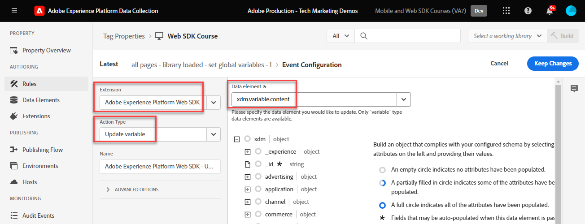

# 建立標籤規則

瞭解如何使用標籤規則，透過XDM物件將事件傳送至Adobe Experience Platform Edge Network。 標籤規則是事件、條件和動作的組合，可告知標籤屬性執行動作。 透過Platform Web SDK，規則可用來將事件與正確的資料傳送至Platform Edge Network。

## 學習目標

在本課程結束時，您能夠：

* 使用命名慣例來管理標籤內的規則
* 使用更新變數和傳送事件動作來傳送包含XDM欄位的事件
* 跨多個規則棧疊多組XDM欄位
* 將個別或整個陣列資料元素對應至XDM物件
* 將標籤規則發佈至開發程式庫

## 先決條件

您熟悉資料收集標籤和[Luma示範網站](https://luma.enablementadobe.com/content/luma/us/en.html)，並已完成教學課程中先前的課程：

* [設定XDM結構描述](configure-schemas.md)
* [設定身分名稱空間](configure-identities.md)
* [設定資料流](configure-datastream.md)
* [安裝 Web SDK 擴充功能](install-web-sdk.md)
* [建立資料元素](create-data-elements.md)
* [建立身分](create-identities.md)

## 命名慣例

若要管理標籤中的規則，建議遵循標準命名慣例。 本教學課程使用五部分命名慣例：

* [**位置**] - [**事件**] - [**用途**] - [**訂單**]

其中；

1. **location**&#x200B;是規則觸發所在網站的一或多個頁面
1. **event**&#x200B;是規則的觸發器
1. **purpose**&#x200B;是規則執行的主要動作
1. **order**&#x200B;是規則與其他規則關聯時應引發的順序
<!-- minor update -->

## 建立標籤規則

在標籤中，規則是用來在不同的條件下執行動作（引發呼叫）。 Platform Web SDK標籤擴充功能包含本課程使用的兩個動作：

* **[!UICONTROL 更新變數]**&#x200B;將資料元素對應到XDM物件中的屬性
* **[!UICONTROL 傳送事件]**&#x200B;將XDM物件傳送至Experience Platform Edge Network

在本課程的其餘部分中，我們會：

1. 使用&#x200B;**[!UICONTROL 更新變數]**&#x200B;動作建立規則，以定義XDM欄位的「全域設定」。

1. 使用&#x200B;**[!UICONTROL 更新變數]**&#x200B;動作建立其他規則，覆寫我們的「全域設定」，並在特定條件下（例如在產品頁面上新增產品詳細資訊）貢獻其他XDM欄位。

1. 使用&#x200B;**[!UICONTROL 傳送事件]**&#x200B;動作建立另一個規則，該動作會將完整的XDM物件傳送至Adobe Experience Platform Edge Network。

所有這些規則將使用&quot;[!UICONTROL 順序]&quot;選項正確排序。

這部影片會概述此程式：

>[!VIDEO](https://video.tv.adobe.com/v/3427710/?learn=on&enablevpops)

### 全域設定欄位

若要為全域XDM欄位建立標籤規則：

1. 開啟您在本教學課程中使用的標籤屬性

1. 前往左側導覽中的&#x200B;**[!UICONTROL 規則]**

1. 選取&#x200B;**[!UICONTROL 建立新規則]**&#x200B;按鈕

   

1. 將規則命名為 `all pages - library loaded - set global variables - 1`

1. 在&#x200B;**[!UICONTROL 事件]**&#x200B;區段中，選取&#x200B;**[!UICONTROL 新增]**

   

1. 使用&#x200B;**[!UICONTROL 核心擴充功能]**&#x200B;並選取&#x200B;**[!UICONTROL 載入的程式庫（頁面頂端）]**&#x200B;作為&#x200B;**[!UICONTROL 事件型別]**

1. 選取&#x200B;**[!UICONTROL 進階]**&#x200B;下拉式清單，並輸入`1`作為&#x200B;**[!UICONTROL 訂單]**

   >[!NOTE]
   >
   > 訂單編號越低，執行的時間就越早。 因此，我們提供「全域組態」低訂購數量。

1. 選取&#x200B;**[!UICONTROL 保留變更]**以返回主規則畫面
   

1. 在&#x200B;**[!UICONTROL 動作]**&#x200B;區段中，選取&#x200B;**[!UICONTROL 新增]**

1. 以&#x200B;**[!UICONTROL 延伸模組]**&#x200B;身分，選取&#x200B;**[!UICONTROL Adobe Experience Platform Web SDK]**

1. 作為&#x200B;**[!UICONTROL 動作型別]**，請選取&#x200B;**[!UICONTROL 更新變數]**

1. 以&#x200B;**[!UICONTROL 資料元素]**&#x200B;的身分，選取您在[建立資料元素](create-data-elements.md)課程中建立的`xdm.variable.content`

   

現在，將您的[!UICONTROL 資料元素]對應到您的XDM物件所使用的[!UICONTROL 結構描述]。 您可以對應至個別屬性或整個物件。 在此範例中，您會對應至個別屬性：

1. 找到eventType欄位並加以選取

1. 輸入值`web.webpagedetails.pageViews`

   >[!TIP]
   >
   > 若要瞭解要填入`eventType`欄位中的值，您必須移至結構描述頁面，並選取`eventType`欄位以檢視右側邊欄上的建議值。 如有需要，您也可以輸入新值。
   > 結構描述頁面](assets/create-tag-rule-eventType.png)上的

   >[!TIP]
   >
   > 如果資料元素為Null，XDM欄位將不會納入網路要求中。 因此，當使用者未驗證，且`identityMap.loginID`資料元素為Null時，將不會傳送`identityMap`物件。 這就是我們可在「全域設定」中加以定義的原因。

1. 向下捲動，直到您達到&#x200B;**`web`**&#x200B;物件為止

1. 選取以開啟

1. 將下列資料元素對應至對應的`web` XDM變數

   * **`web.webPageDetials.name`**&#x200B;至`%page.pageInfo.pageName%`
   * **`web.webPageDetials.server`**&#x200B;至`%page.pageInfo.server%`
   * **`web.webPageDetials.siteSection`**&#x200B;至`%page.pageInfo.hierarchie1%`

1. 將 `web.webPageDetials.pageViews.value` 設為 `1`

   

   >[!TIP]
   >
   > 雖然Adobe Analytics不需要將設為`web.webpagedetails.pageViews`的`eventType`或`web.webPageDetails.pageViews.value`來處理作為頁面檢視的信標，但為其他下游應用程式指出頁面檢視的標準方式會很有用。

1. 選取「**[!UICONTROL 保留變更]**」，然後在下一個畫面中選取「**[!UICONTROL 儲存]**」規則，以完成建立規則

### 產品頁面欄位

現在，開始在其他循序規則中使用&#x200B;**[!UICONTROL 更新變數]**&#x200B;以擴充XDM物件，然後再將其傳送到[!UICONTROL 平台Edge Network]。

>[!TIP]
>
>規則順序會決定觸發事件時先執行哪個規則。 如果兩個規則具有相同的事件型別，數字最低的規則會先執行。
> 

首先，請追蹤Luma產品詳細資料頁面上的產品檢視：

1. 選取&#x200B;**[!UICONTROL 新增規則]**
1. 將其命名為[!UICONTROL `ecommerce - library loaded - set product details variables - 20`]
1. 選取[事件]下的以新增觸發器
1. 在&#x200B;**[!UICONTROL 擴充功能]**&#x200B;下，選取&#x200B;**[!UICONTROL 核心]**
1. 在&#x200B;**[!UICONTROL 事件型別]**&#x200B;下，選取&#x200B;**[!UICONTROL 載入的程式庫（頁面頂端）]**
1. 選取以開啟&#x200B;**[!UICONTROL 進階選項]**，輸入`20`。 此順序值可確保規則在&#x200B;_設定全域設定的`all pages - library loaded - set global variables - 1`之後執行_。
1. 選取&#x200B;**[!UICONTROL 保留變更]**

   

1. 在&#x200B;**[!UICONTROL 條件]**&#x200B;下，選取以&#x200B;**[!UICONTROL 新增]**
1. 保留&#x200B;**[!UICONTROL 邏輯型別]**&#x200B;為&#x200B;**[!UICONTROL 一般]**
1. 保留&#x200B;**[!UICONTROL 延伸模組]**&#x200B;為&#x200B;**[!UICONTROL 核心]**
1. 選取&#x200B;**[!UICONTROL 條件型別]**&#x200B;作為不含查詢字串&#x200B;]**的**[!UICONTROL &#x200B;路徑
1. 在右側，啟用&#x200B;**[!UICONTROL Regex]**&#x200B;切換
1. 在&#x200B;**[!UICONTROL 路徑下，等於]**&#x200B;設定`/products/`。 對於Luma示範網站，這可確保規則僅在產品頁面上觸發
1. 選取&#x200B;**[!UICONTROL 保留變更]**

   

1. 在&#x200B;**[!UICONTROL 動作]**&#x200B;下，選取&#x200B;**[!UICONTROL 新增]**
1. 選取&#x200B;**[!UICONTROL Adobe Experience Platform Web SDK]**&#x200B;擴充功能
1. 選取&#x200B;**[!UICONTROL 動作型別]**&#x200B;做為&#x200B;**[!UICONTROL 更新變數]**
1. 選取`xdm.variable.content`做為&#x200B;**[!UICONTROL 資料元素]**
1. 向下捲動至`commerce`物件
1. 開啟&#x200B;**[!UICONTROL productViews]**&#x200B;物件並將&#x200B;**[!UICONTROL 值]**&#x200B;設定為`1`

   

   >[!TIP]
   >
   >在XDM中設定commerce.productViews.value=1會自動對應至Analytics中的`prodView`事件

1. 向下捲動至`eventType`並將其設定為`commerce.productViews`

   >[!NOTE]
   >
   >由於此規則的順序較高，因此會覆寫「全域設定」規則中設定的`eventType`。 `eventType`只能包含一個值，建議您以最有價值的事件進行設定。

1. 向下捲動至並選取`productListItems`陣列
1. 選取&#x200B;**[!UICONTROL 提供個別專案]**
1. 選取&#x200B;**[!UICONTROL 新增專案]**

   

   >[!CAUTION]
   >
   >**`productListItems`**&#x200B;是`array`資料型別，因此預期資料會以元素集合的形式進入。 由於Luma示範網站的資料層結構，以及由於一次只能在Luma網站上檢視一個產品，因此您可個別新增專案。 在您自己的網站上實作時，根據資料層結構，您或許可以提供整個陣列。

1. 選取以開啟&#x200B;**[!UICONTROL 專案1]**
1. 將&#x200B;**`productListItems.item1.SKU`**&#x200B;對應至`%product.productInfo.sku%`

   

1. 選取&#x200B;**[!UICONTROL 保留變更]**

1. 選取&#x200B;**[!UICONTROL 儲存]**&#x200B;以儲存規則

### 購物車欄位

您可以將整個陣列對應至XDM物件，前提是陣列符合XDM結構描述的格式。 您先前建立的自訂程式碼資料元素`cart.productInfo`會透過Luma上的`digitalData.cart.cartEntries`資料層物件進行回圈，並將其轉譯為XDM結構描述之`productListItems`物件的必要格式。

如需說明，請參閱Luma網站資料層（左）與轉譯資料元素（右）下方比較：

比較資料元素與`productListItems`結構（提示，它應該相符）。

>[!IMPORTANT]
>
>請注意數值變數的轉譯方式，資料層中的字串值（例如`price`和`qty`）會重新格式化為資料元素中的數字。 這些格式需求對於Platform中的資料完整性很重要，並在[設定結構描述](configure-schemas.md)步驟中確定。 在範例中，**[!UICONTROL 數量]**&#x200B;使用&#x200B;**[!UICONTROL 整數]**資料型別。
> 

現在，我們將陣列對應至XDM物件：

1. 建立名為`ecommerce - library loaded - set shopping cart variables - 20`的新規則
1. 選取[事件]下的以新增觸發器
1. 在&#x200B;**[!UICONTROL 擴充功能]**&#x200B;下，選取&#x200B;**[!UICONTROL 核心]**
1. 在&#x200B;**[!UICONTROL 事件型別]**&#x200B;下，選取&#x200B;**[!UICONTROL 載入的程式庫（頁面頂端）]**
1. 選取以開啟&#x200B;**[!UICONTROL 進階選項]**，輸入`20`
1. 選取&#x200B;**[!UICONTROL 保留變更]**

   

1. 在&#x200B;**[!UICONTROL 條件]**&#x200B;下，選取以&#x200B;**[!UICONTROL 新增]**
1. 保留&#x200B;**[!UICONTROL 邏輯型別]**&#x200B;為&#x200B;**[!UICONTROL 一般]**
1. 保留&#x200B;**[!UICONTROL 擴充功能]**&#x200B;為&#x200B;**[!UICONTROL 核心]**
1. 選取&#x200B;**[!UICONTROL 條件型別]**&#x200B;作為不含查詢字串&#x200B;]**的**[!UICONTROL &#x200B;路徑
1. 在右側，**不**&#x200B;啟用&#x200B;**[!UICONTROL Regex]**&#x200B;切換
1. 在&#x200B;**[!UICONTROL 路徑下，等於]**&#x200B;設定`/content/luma/us/en/user/cart.html`。 對於Luma示範網站，這可確保規則僅在購物車頁面上觸發
1. 選取&#x200B;**[!UICONTROL 保留變更]**

   

1. 在&#x200B;**[!UICONTROL 動作]**&#x200B;下，選取&#x200B;**[!UICONTROL 新增]**
1. 選取&#x200B;**[!UICONTROL Adobe Experience Platform Web SDK]**&#x200B;擴充功能
1. 選取&#x200B;**[!UICONTROL 動作型別]**&#x200B;做為&#x200B;**[!UICONTROL 更新變數]**
1. 選取`xdm.variable.content`做為&#x200B;**[!UICONTROL 資料元素]**
1. 向下捲動至`commerce`物件，並選取以開啟它。
1. 開啟&#x200B;**[!UICONTROL productListViews]**&#x200B;物件並將&#x200B;**[!UICONTROL 值]**&#x200B;設定為`1`

   

   >[!TIP]
   >
   >在XDM中設定commerce.productListViews.value=1會自動對應至Analytics中的`scView`事件

1. 選取`eventType`並設為`commerce.productListViews`

1. 向下捲動至並選取&#x200B;**[!UICONTROL productListItems]**&#x200B;陣列

1. 選取&#x200B;**[!UICONTROL 提供整個陣列]**

1. 對應至&#x200B;**`cart.productInfo`**&#x200B;資料元素

1. 選取&#x200B;**[!UICONTROL 保留變更]**

1. 選取&#x200B;**[!UICONTROL 儲存]**&#x200B;以儲存規則

建立兩個其他規則，用於遵循相同模式的結帳和購買，但有下列差異：

**規則名稱**： `ecommerce  - library loaded - set checkout variables - 20`

1. **[!UICONTROL 條件]**： /content/luma/us/en/user/checkout.html
1. 將 `eventType` 設為 `commerce.checkouts`
1. 將 `commerce.checkout.value` 設為 `1`

   >[!TIP]
   >
   >這相當於在Analytics中設定`scCheckout`事件

**規則名稱**： `ecommerce - library loaded - set purchase variables -  20`

1. **[!UICONTROL 條件]**： /content/luma/us/en/user/checkout/order/thank-you.html
1. 將 `eventType` 設為 `commerce.purchases`
1. 將 `commerce.purchases.value` 設為 `1`

   >[!TIP]
   >
   >這相當於在Analytics中設定`purchase`事件

1. 將`commerce.order.purchaseID`設定為`cart.orderId`資料元素
1. 將`commerce.order.currencyCode`設為硬式編碼值`USD`

   

   >[!TIP]
   >
   >這相當於在Analytics中設定`s.purchaseID`和`s.currencyCode`變數

1. 向下捲動至並選取&#x200B;**[!UICONTROL productListItems]**&#x200B;陣列
1. 選取&#x200B;**[!UICONTROL 提供整個陣列]**
1. 對應至&#x200B;**`cart.productInfo.purchase`**&#x200B;資料元素
1. 選取&#x200B;**[!UICONTROL 保留變更]**
1. 選取&#x200B;**[!UICONTROL 儲存]**

完成後，您應該會看到下列已建立的規則。

### 傳送事件規則

現在您已設定變數，您可以建立規則以使用&#x200B;**[!UICONTROL 傳送事件]**&#x200B;動作將完整的XDM物件傳送至Platform Edge Network。

1. 在右側，選取&#x200B;**[!UICONTROL 新增規則]**&#x200B;以建立另一個規則

1. 將規則命名為 `all pages - library loaded - send event - 50`

1. 在&#x200B;**[!UICONTROL 事件]**&#x200B;區段中，選取&#x200B;**[!UICONTROL 新增]**

1. 使用&#x200B;**[!UICONTROL 核心擴充功能]**&#x200B;並選取`Library Loaded (Page Top)`做為&#x200B;**[!UICONTROL 事件型別]**

1. 選取&#x200B;**[!UICONTROL 進階]**&#x200B;下拉式清單，並在&#x200B;**[!UICONTROL 順序]**&#x200B;中輸入`50`。 這將確保此規則在您設定的所有其他規則（以`1`或`20`作為其[!UICONTROL 順序]）之後引發。

1. 選取&#x200B;**[!UICONTROL 保留變更]**以返回主規則畫面
   

1. 在&#x200B;**[!UICONTROL 動作]**&#x200B;區段中，選取&#x200B;**[!UICONTROL 新增]**

1. 以&#x200B;**[!UICONTROL 延伸模組]**&#x200B;身分，選取&#x200B;**[!UICONTROL Adobe Experience Platform Web SDK]**

1. 作為&#x200B;**[!UICONTROL 動作型別]**，請選取&#x200B;**[!UICONTROL 傳送事件]**

1. 以&#x200B;**[!UICONTROL XDM]**&#x200B;身分，選取在上一堂課中建立的`xdm.variable.content`資料元素

1. 選取&#x200B;**[!UICONTROL 保留變更]**&#x200B;以返回主規則畫面

   
1. 選取&#x200B;**[!UICONTROL 儲存]**&#x200B;以儲存規則

   

## 在程式庫中發佈規則

接下來，將規則發佈至您的開發環境，以便您可以驗證其是否有效。

若要建立程式庫：

1. 前往左側導覽中的&#x200B;**[!UICONTROL 發佈流程]**

1. 選取&#x200B;**[!UICONTROL 新增資料庫]**

   
1. 為&#x200B;**[!UICONTROL 名稱]**&#x200B;輸入`Luma Web SDK Tutorial`
1. 針對&#x200B;**[!UICONTROL 環境]**，選取`Development`
1. 選取&#x200B;**[!UICONTROL 新增所有變更的資源]**

   >[!NOTE]
   >
   >    您應會看見先前課程中建立的所有標籤元件。 核心擴充功能包含所有Web標籤屬性所需的基本JavaScript。

1. 選取&#x200B;**[!UICONTROL 儲存並建置以供開發]**

   

程式庫可能需要幾分鐘的時間才能建置，建置完成後，程式庫名稱左側會顯示一個綠色點：

如您在[!UICONTROL 發佈流程]畫面上所見，發佈程式還有更多內容，這不在本教學課程的討論範圍內。 本教學課程僅在您的開發環境中使用單一程式庫。

現在，您已準備好使用Adobe Experience Platform Debugger驗證請求中的資料。

[下一步 ](validate-with-debugger.md)

>[!NOTE]
>
>感謝您花時間學習Adobe Experience Platform Web SDK。 如果您有任何疑問、想分享一般意見或有關於未來內容的建議，請在這篇[Experience League社群討論貼文](https://experienceleaguecommunities.adobe.com/t5/adobe-experience-platform-data/tutorial-discussion-implement-adobe-experience-cloud-with-web/td-p/444996)上分享
