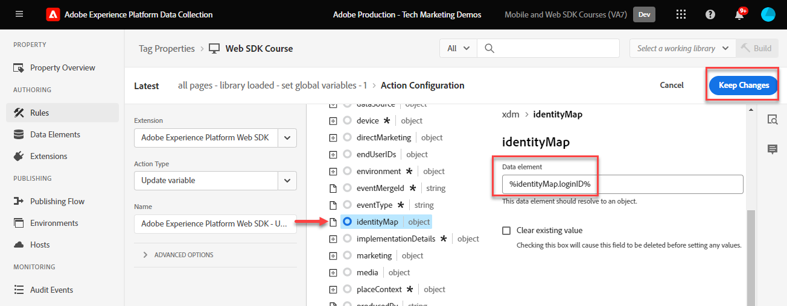

# 建立標籤規則

瞭解如何使用標籤規則，透過XDM物件將事件傳送至PlatformEdge Network。 標籤規則是事件、條件和動作的組合，可告知標籤屬性執行動作。 在Platform Web SDK中，規則是用來將事件傳送至具有正確XDM欄位的PlatformEdge Network。

>[!NOTE]
>
> 為了示範，本課程中的練習會以先前的課程為基礎，從的使用者傳送事件 [Luma示範網站](https://luma.enablementadobe.com/content/luma/us/en.html){target="_blank"}.

## 學習目標

在本課程結束時，您能夠：

* 使用命名慣例來管理標籤內的規則
* 使用更新變數和傳送事件動作來傳送包含XDM欄位的事件
* 跨多個規則棧疊多組XDM欄位
* 將個別或整個陣列資料元素對應至XDM物件
* 將標籤規則發佈至開發程式庫

## 先決條件

您熟悉資料收集標籤和 [Luma示範網站](https://luma.enablementadobe.com/content/luma/us/en.html) 並完成本教學課程中的先前課程：

* [設定XDM結構描述](configure-schemas.md)
* [設定身分名稱空間](configure-identities.md)
* [設定資料流](configure-datastream.md)
* [安裝 Web SDK 擴充功能](install-web-sdk.md)
* [建立資料元素](create-data-elements.md)
* [建立身分](create-identities.md)

## 命名慣例

若要更妥善地管理標籤中的規則，建議遵循標準命名慣例。 本教學課程使用五部分命名慣例：

* [**位置**] - [**事件**] - [**用途**] - [**工具**] - [**訂購**]

其中；

1. **位置** 是規則觸發所在網站的一或多個頁面
1. **事件** 是規則的觸發器
1. **用途** 是規則執行的主要動作
1. **工具** 是用於該規則之動作步驟中的特定應用程式或應用程式，Web SDK很少使用這種方法
1. **序列** 是規則相對於其他規則所應引發的順序
<!-- minor update -->

## 建立標籤規則

在標籤中，規則是用來在不同的條件下執行動作（引發呼叫）。 Platform Web SDK標籤擴充功能包含本課程將使用的兩個動作：

* **[!UICONTROL 更新變數]** 將資料元素對應至XDM欄位
* **[!UICONTROL 傳送事件]** 傳送XDM物件至Experience PlatformEdge Network

在本課程的其餘部分中，我們會：

1. 建立規則以定義XDM欄位的「全域設定」(使用 [!UICONTROL 更新變數] ，我們想在網站的每個頁面上（例如頁面名稱）使用 **[!UICONTROL 更新變數]** 動作。

1. 建立覆寫我們「全域設定」或貢獻其他XDM欄位的其他規則(使用 [!UICONTROL 更新變數] 同樣地)，這些只與特定條件相關（例如，在產品頁面上新增產品詳細資訊）。

1. 使用建立另一個規則 **[!UICONTROL 傳送事件]** 此動作會將完整的XDM物件傳送至Adobe Experience Platform Edge Network。

所有這些規則將使用&quot;[!UICONTROL 訂購]」選項。

這部影片會概述此程式：

>[!VIDEO](https://video.tv.adobe.com/v/3427710/?learn=on)

### 更新變數規則

#### 全域設定

若要為全域XDM欄位建立標籤規則：

1. 開啟您在本教學課程中使用的標籤屬性

1. 前往 **[!UICONTROL 規則]** 在左側導覽列中

1. 選取 **[!UICONTROL 建立新規則]** 按鈕

   

1. 將規則命名為 `all pages - library loaded - set global variables - 1`

1. 在 **[!UICONTROL 活動]** 區段，選取 **[!UICONTROL 新增]**

   

1. 使用 **[!UICONTROL 核心擴充功能]** 並選取 **[!UICONTROL 程式庫已載入（頁面頂端）]** 作為 **[!UICONTROL 事件型別]**

1. 選取 **[!UICONTROL 進階]** 下拉式清單並輸入 `1` 作為 **[!UICONTROL 訂購]**

   >[!NOTE]
   >
   > 訂單編號越低，執行的時間就越早。 因此，我們提供「全域組態」低訂購數量。

1. 選取 **[!UICONTROL 保留變更]** 以返回主規則畫面
   

1. 在 **[!UICONTROL 動作]** 區段，選取 **[!UICONTROL 新增]**

1. 作為 **[!UICONTROL 副檔名]**，選取 **[!UICONTROL Adobe Experience Platform Web SDK]**

1. 作為 **[!UICONTROL 動作型別]**，選取 **[!UICONTROL 更新變數]**

1. 作為 **[!UICONTROL 資料元素]**，選取 `xdm.variable.content` 您已在以下位置建立： [建立資料元素](create-data-elements.md) 課程

   

現在對應您的 [!UICONTROL 資料元素] 至 [!UICONTROL 綱要] 由您的XDM物件使用。

>[!NOTE]
> 
> 您可以對應至個別屬性或整個物件。 在此範例中，您會對應至個別屬性。

1. 找到eventType欄位並加以選取

1. 輸入值 `web.webpagedetails.pageViews`

   >[!TIP]
   >
   > 若要瞭解要填入 `eventType` 欄位，您必須移至「綱要」頁面並選取 `eventType` 欄位以檢視右側邊欄上的建議值。 如有需要，您也可以輸入新值。
   > 

1. 接下來，尋找 `identityMap` 物件並選取它

1. 將對應至 `identityMap.loginID` 資料元素

   

   >[!TIP]
   >
   > 如果資料元素為Null，XDM欄位將不會納入網路要求中。 因此，當使用者未驗證時，以及 `identityMap.loginID` 資料元素為空， `identityMap` 將不會傳送物件。 這就是我們可在「全域設定」中加以定義的原因。

1. 向下捲動，直到達到 **`web`** 物件

1. 選取以開啟

1. 將下列資料元素對應至對應的 `web` XDM變數

   * **`web.webPageDetials.name`** 至 `%page.pageInfo.pageName%`
   * **`web.webPageDetials.server`** 至 `%page.pageInfo.server%`
   * **`web.webPageDetials.siteSection`** 至 `%page.pageInfo.hierarchie1%`

1. 將 `web.webPageDetials.pageViews.value` 設為 `1`

   

   >[!TIP]
   >
   > 兩者皆非 `eventType` 設為 `web.webpagedetails.pageViews` 也不 `web.webPageDetials.pageViews.value` 是Adobe Analytics將信標設為頁面檢視加以處理的必要專案，如果有標準方式來指定其他下游應用程式的頁面檢視，就十分實用。

1. 選取 **[!UICONTROL 保留變更]** 然後 **[!UICONTROL 儲存]** 下一個畫面中要完成規則建立的規則

#### 產品頁面欄位

現在，開始使用 **[!UICONTROL 更新變數]** 此外，排序規則會先擴充XDM物件，再傳送至 [!UICONTROL 平台Edge Network].

>[!TIP]
>
>規則順序會決定觸發事件時先執行哪個規則。 如果兩個規則具有相同的事件型別，數字最低的規則會先執行。
> 
>

首先，請追蹤Luma產品詳細資料頁面上的產品檢視：

1. 選取 **[!UICONTROL 新增規則]**
1. 將其命名  [!UICONTROL `ecommerce - library loaded - set product details variables - 20`]
1. 選取  在「事件」底下以新增觸發器
1. 在 **[!UICONTROL 副檔名]**，選取 **[!UICONTROL 核心]**
1. 在 **[!UICONTROL 事件型別]**，選取 **[!UICONTROL 程式庫已載入（頁面頂端）]**
1. 選取以開啟 **[!UICONTROL 進階選項]**，輸入 `20`. 這可確保規則在 `all pages - library loaded - set global variables - 1` 會設定全域組態。

   

1. 在 **[!UICONTROL 條件]**，選取 **[!UICONTROL 新增]**
1. 離開 **[!UICONTROL 邏輯型別]** 作為 **[!UICONTROL 一般]**
1. 離開 **[!UICONTROL 副檔名]** 作為 **[!UICONTROL 核心]**
1. 選取 **[!UICONTROL 條件型別]** 作為 **[!UICONTROL 不含查詢字串的路徑]**
1. 在右側，啟用 **[!UICONTROL 規則運算式]** 切換
1. 在 **[!UICONTROL 路徑等於]** 設定 `/products/`. 對於Luma示範網站，這可確保規則僅在產品頁面上觸發
1. 選取 **[!UICONTROL 保留變更]**

   

1. 在 **[!UICONTROL 動作]** 選取 **[!UICONTROL 新增]**
1. 選取 **[!UICONTROL Adobe Experience Platform Web SDK]** 副檔名
1. 選取 **[!UICONTROL 動作型別]** 作為 **[!UICONTROL 更新變數]**
1. 向下捲動至 `commerce` 物件
1. 開啟 **[!UICONTROL 產品檢視]** 物件與集合 **[!UICONTROL 值]** 至 `1`

   

   >[!TIP]
   >
   >在XDM中設定commerce.productViews.value=1會自動對應至 `prodView` Analytics中的事件

1. 向下捲動至 `eventType` 並將其設為 `commerce.productViews`

   >[!NOTE]
   >
   >由於此規則的順序較高，因此會覆寫 `eventType` 在「全域設定」規則中設定。 `eventType` 只能包含一個值，建議您使用最大值事件加以設定。

1. 向下捲動至並選取 `productListItems` 陣列
1. 選取 **[!UICONTROL 提供個別專案]**
1. 選取 **[!UICONTROL 新增專案]**

   

   >[!CAUTION]
   >
   >此 **`productListItems`** 是 `array` 資料型別，因此預期資料會以元素集合的形式輸入。 由於Luma示範網站的資料層結構，以及由於一次只能在Luma網站上檢視一個產品，因此您可個別新增專案。 在您自己的網站上實作時，根據資料層結構，您或許可以提供整個陣列。

1. 選取以開啟 **[!UICONTROL 專案1]**
1. 將 **`productListItems.item1.SKU`** 對應到 `%product.productInfo.sku%`

   

1. 選取 **[!UICONTROL 保留變更]**

1. 選取 **[!UICONTROL 儲存]** 儲存規則的方式

#### 購物車欄位

您可以將整個陣列對應至XDM物件，前提是陣列符合XDM結構描述的格式。 自訂程式碼資料元素 `cart.productInfo` 您透過建立較早的回圈 `digitalData.cart.cartEntries` Luma上的資料層物件，並將其轉譯為 `productListItems` XDM結構描述的物件。

如需說明，請參閱Luma網站資料層（左）與轉譯資料元素（右）下方比較：

比較資料元素與 `productListItems` 結構（提示，它應該相符）。

>[!IMPORTANT]
>
>請注意數值變數的轉譯方式，以及資料層中的字串值，例如 `price` 和 `qty` 重新格式化為資料元素中的數字。 這些格式需求對於Platform中的資料完整性十分重要，並在以下期間決定： [設定方案](configure-schemas.md) 步驟。 在此範例中， **[!UICONTROL 數量]** 使用 **[!UICONTROL 整數]** 資料型別。
> 

現在，我們將陣列對應至XDM物件：

1. 建立名為的新規則 `ecommerce - library loaded - set shopping cart variables - 20`
1. 選取  在「事件」底下以新增觸發器
1. 在 **[!UICONTROL 副檔名]**，選取 **[!UICONTROL 核心]**
1. 在 **[!UICONTROL 事件型別]**，選取 **[!UICONTROL 程式庫已載入（頁面頂端）]**
1. 選取以開啟 **[!UICONTROL 進階選項]**，輸入 `20`
1. 選取 **[!UICONTROL 保留變更]**

   

1. 在 **[!UICONTROL 條件]**，選取 **[!UICONTROL 新增]**
1. 離開 **[!UICONTROL 邏輯型別]** 作為 **[!UICONTROL 一般]**
1. 離開 **[!UICONTROL 擴充功能]** 作為 **[!UICONTROL 核心]**
1. 選取 **[!UICONTROL 條件型別]** 作為 **[!UICONTROL 不含查詢字串的路徑]**
1. 在右邊， **不要** 啟用 **[!UICONTROL 規則運算式]** 切換
1. 在 **[!UICONTROL 路徑等於]** 設定 `/content/luma/us/en/user/cart.html`. 對於Luma示範網站，這可確保規則僅在購物車頁面上觸發
1. 選取 **[!UICONTROL 保留變更]**

   

1. 在 **[!UICONTROL 動作]** 選取 **[!UICONTROL 新增]**
1. 選取 **[!UICONTROL Adobe Experience Platform Web SDK]** 副檔名
1. 選取 **[!UICONTROL 動作型別]** 作為 **[!UICONTROL 更新變數]**
1. 向下捲動至 `commerce` 物件並選取「 」以開啟它。
1. 開啟 **[!UICONTROL productListView]** 物件與集合 **[!UICONTROL 值]** 至 `1`

   

   >[!TIP]
   >
   >在XDM中設定commerce.productListViews.value=1會自動對應至 `scView` Analytics中的事件

1. 選取 `eventType` 並將設為 `commerce.productListViews`

1. 向下捲動至並選取 **[!UICONTROL productListItems]** 陣列

1. 選取 **[!UICONTROL 提供整個陣列]**

1. 將對應到 **`cart.productInfo`** 資料元素

1. 選取 **[!UICONTROL 保留變更]**

1. 選取 **[!UICONTROL 儲存]** 儲存規則的方式

建立兩個其他規則，用於遵循相同模式的結帳和購買，但有下列差異：

**規則名稱**： `ecommerce  - library loaded - set checkout variables - 20`

1. **[!UICONTROL 條件]**： /content/luma/us/en/user/checkout.html
1. 將 `eventType` 設為 `commerce.checkouts`
1. 將 `commerce.checkout.value` 設為 `1`

   >[!TIP]
   >
   >這等於設定 `scCheckout` Analytics中的事件

**規則名稱**： `ecommerce - library loaded - set purchase variables -  20`

1. **[!UICONTROL 條件]**： /content/luma/us/en/user/checkout/order/thank-you.html
1. 將 `eventType` 設為 `commerce.purchases`
1. 將 `commerce.purchases.value` 設為 `1`

   >[!TIP]
   >
   >這等於設定 `purchase` Analytics中的事件

1. 設定 `commerce.order.purchaseID` 至 `cart.orderId` 資料元素
1. 設定 `commerce.order.currencyCode` 至硬式編碼值 `USD`

   

   >[!TIP]
   >
   >這等於設定 `s.purchaseID` 和 `s.currencyCode` Analytics中的變數

1. 向下捲動至並選取 **[!UICONTROL productListItems]** 陣列
1. 選取 **[!UICONTROL 提供整個陣列]**
1. 將對應到 **`cart.productInfo.purchase`** 資料元素
1. 選取 **[!UICONTROL 儲存]**

完成後，您應該會看到下列已建立的規則。

### 傳送事件規則

現在您已設定變數，您可以建立規則，以使用將完整XDM物件傳送至PlatformEdge Network **[!UICONTROL 傳送事件]** 動作。

1. 在右側，選取 **[!UICONTROL 新增規則]** 以建立其他規則

1. 將規則命名為 `all pages - library loaded - send event - 50`

1. 在 **[!UICONTROL 活動]** 區段，選取 **[!UICONTROL 新增]**

1. 使用 **[!UICONTROL 核心擴充功能]** 並選取 `Library Loaded (Page Top)` 作為 **[!UICONTROL 事件型別]**

1. 選取 **[!UICONTROL 進階]** 下拉式清單並輸入 `50` 在 **[!UICONTROL 訂購]**. 這將確保第二個規則會在您設定為觸發的第一個規則之後觸發 `1`.

1. 選取 **[!UICONTROL 保留變更]** 以返回主規則畫面
   

1. 在 **[!UICONTROL 動作]** 區段，選取 **[!UICONTROL 新增]**

1. 作為 **[!UICONTROL 副檔名]**，選取  **[!UICONTROL Adobe Experience Platform Web SDK]**

1. 作為  **[!UICONTROL 動作型別]**，選取  **[!UICONTROL 傳送事件]**

1. 作為 **[!UICONTROL XDM]**，選取 `xdm.variable.content` 在上一課程中建立的資料元素

1. 選取 **[!UICONTROL 保留變更]** 以返回主規則畫面

   
1. 選取 **[!UICONTROL 儲存]** 儲存規則的方式

   

## 在程式庫中發佈規則

接下來，將規則發佈至您的開發環境，以便您可以驗證其是否有效。

若要建立程式庫：

1. 前往 **[!UICONTROL 發佈流程]** 在左側導覽列中

1. 選取 **[!UICONTROL 新增程式庫]**

   
1. 對於 **[!UICONTROL 名稱]**，輸入 `Luma Web SDK Tutorial`
1. 對於 **[!UICONTROL 環境]**，選取 `Development`
1. 選取  **[!UICONTROL 新增所有變更的資源]**

   >[!NOTE]
   >
   >    您應會看見先前課程中建立的所有標籤元件。 核心擴充功能包含所有Web標籤屬性所需的基本JavaScript。

1. 選取 **[!UICONTROL 儲存並為開發環境建置]**

   

程式庫可能需要幾分鐘的時間才能建置，建置完成後，程式庫名稱左側會顯示一個綠色點：

如您所見 [!UICONTROL 發佈流程] 畫面中，發佈程式還有許多不在本教學課程的討論範圍內。 本教學課程僅在您的開發環境中使用單一程式庫。

現在您已準備好使用Adobe Experience Platform Debugger驗證請求中的資料。

[下一個 ](validate-with-debugger.md)

>[!NOTE]
>
>感謝您投入時間學習Adobe Experience Platform Web SDK。 如果您有疑問、想分享一般意見或有關於未來內容的建議，請分享這些內容 [Experience League社群討論貼文](https://experienceleaguecommunities.adobe.com/t5/adobe-experience-platform-launch/tutorial-discussion-implement-adobe-experience-cloud-with-web/td-p/444996)
