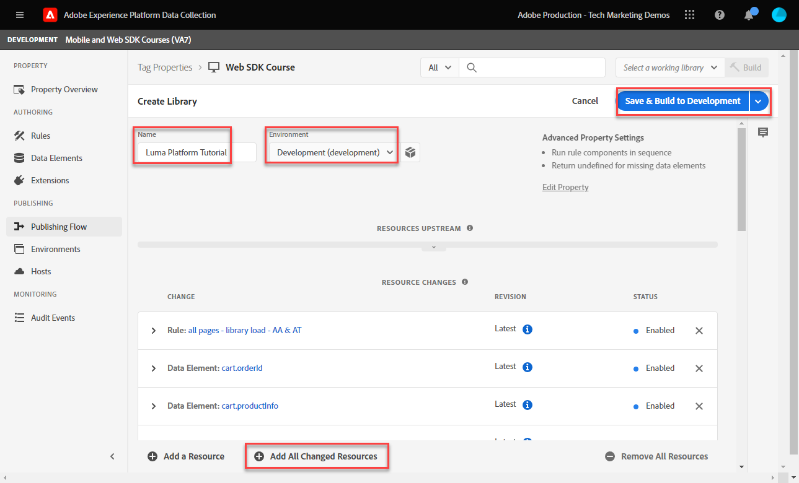

# 建立標籤規則

了解如何使用標籤規則，將事件與XDM物件傳送至Platform Edge Network。 標籤規則是事件、條件和動作的組合，可告訴標籤屬性執行某項動作。

>[!NOTE]
>
> 為了示範，本課程中的練習以 [建立資料元素](create-data-elements.md) 步驟；傳送XDM事件動作，以從 [Luma示範網站](https://luma.enablementadobe.com/content/luma/us/en.html).

## 學習目標

在本課程結束時，您將能夠：

* 使用命名慣例來管理標籤內的規則
* 建立標籤規則以傳送XDM事件
* 將標籤規則發佈至開發程式庫

## 先決條件

您熟悉資料收集標籤，以及 [Luma示範網站](https://luma.enablementadobe.com/content/luma/us/en.html)，且您必須完成本教學課程中的下列先前課程：

* [設定權限](configure-permissions.md)
* [設定XDM結構](configure-schemas.md)
* [設定身分命名空間](configure-identities.md)
* [設定資料流](configure-datastream.md)
* [Web SDK擴充功能已安裝在標籤屬性中](install-web-sdk.md)
* [建立資料元素](create-data-elements.md)

## 命名慣例

為了更妥善地管理標籤中的規則，建議您遵循標準命名慣例。 本教學課程使用三個部分的命名慣例：

* [位置] - [事件] - [工具]

地點；

1. 位置是網站上規則引發的頁面
1. 事件是觸發信標的觸發器
1. 工具是該規則動作步驟中使用的特定應用程式或應用程式

## 建立標籤規則

若要建立標籤規則：

1. 開啟您用於本教學課程的標籤屬性
1. 前往 **[!UICONTROL 規則]** 在左側導覽列中
1. 選取 **[!UICONTROL 建立新規則]** 按鈕
   
1. 將規則命名為 `all pages - library load - AA & AT`

   >[!NOTE]
   >
   > Adobe Analytics和Target會在未來的課程中以特定方式使用此規則，這就是為什麼 `AA & AT` 會用於名稱的結尾。

1. 在 **[!UICONTROL 事件]** 部分，選擇 **[!UICONTROL 新增]**

   
1. 使用 **[!UICONTROL 核心擴充功能]** 選取 `Library Loaded (Page Top)` 作為 **[!UICONTROL 事件類型]**.

   此設定表示當標籤程式庫載入頁面時，規則就會觸發。
1. 選擇 **[!UICONTROL 保留變更]** 返回主規則畫面
   
1. 在 **[!UICONTROL 條件]** 區段，選取 **[!UICONTROL 新增]** 按鈕
   
1. 選擇 **[!UICONTROL 邏輯類型]** `Exception`, **[!UICONTROL 擴充功能]** `Core`，和 **[!UICONTROL 條件類型]** `Path Without Query String`
1. 輸入URL路徑 `/content/luma/us/en/user/cart.html` 在 **[!UICONTROL 路徑等於]** 欄位和 **[!UICONTROL 名稱]** it `Core - cart page`
1. 選擇 **[!UICONTROL 保留變更]**

   
1. 為下列URL路徑新增三個例外

   * **`Core - checkout page`** for `/content/luma/us/en/user/checkout.html`
   * **`Core - thank you page`** for `/content/luma/us/en/user/checkout/order/thank-you.html`
   * **`Core - product page`** for `/products/` 開啟Regex開關時

   

1. 在 **[!UICONTROL 動作]** 部分，選擇 **[!UICONTROL 新增]**
1. 選擇 **[!UICONTROL Adobe Experience Platform Web SDK]** 作為 **[!UICONTROL 擴充功能]**
1. 選擇 **[!UICONTROL 傳送事件]** 作為 **[!UICONTROL 動作類型]**
1. 選擇 **[!UICONTROL web.webpagedetails.pageViews]** 作為 **[!UICONTROL 類型]**.

   >[!WARNING]
   >
   > 此下拉式清單會填入 **`xdm.eventType`** 變數。 雖然您也可以在此欄位中輸入自由格式標籤，但強烈建議您 **不** 因為Platform會產生厭惡效應。

1. 作為 **[!UICONTROL XDM資料]**，請選取 `xdm.content` 上一課中建立的資料元素
1. 選擇 **[!UICONTROL 保留變更]** 返回主規則畫面

   
1. 選擇 **[!UICONTROL 儲存]** 儲存規則

   

## 在程式庫中發佈規則

接下來，將規則發佈至您的開發環境，以便我們驗證其是否有效。

若要建立程式庫：

1. 前往 **[!UICONTROL 發佈流程]** 在左側導覽列中
1. 選擇 **[!UICONTROL 新增程式庫]**

   
1. 若 **[!UICONTROL 名稱]**，輸入 `Luma Web SDK Tutorial`
1. 若 **[!UICONTROL 環境]**，選取 `Development`
1. 選擇  **[!UICONTROL 新增所有已變更的資源]**

   >[!NOTE]
   >
   >    除了Adobe Experience Platform Web SDK擴充功能和 `all pages - library load - AA & AT` 規則中，您會看到先前課程中建立的標籤元件。 核心擴充功能包含所有Web標籤屬性所需的基本JavaScript。

1. 選擇 **[!UICONTROL 儲存並建置以供開發]**

   

程式庫可能需要幾分鐘的時間才能建置，當它完成時，程式庫名稱左側會顯示一個綠色圓點：

如您在 [!UICONTROL 發佈流程] 螢幕上，發佈程式的功能會比較多，這不在本教學課程的討論範圍內。 本教學課程僅在您的開發環境中使用單一程式庫。

現在您已準備好使用Adobe Experience Platform Debugger驗證請求中的資料。

[下一個 ](validate-with-debugger.md)

>[!NOTE]
>
>感謝您花時間學習Adobe Experience Platform Web SDK。 如果您有任何疑問、想要分享一般意見，或對未來內容有任何建議，請就此分享 [Experience League社群討論貼文](https://experienceleaguecommunities.adobe.com/t5/adobe-experience-platform-launch/tutorial-discussion-implement-adobe-experience-cloud-with-web/td-p/444996)
