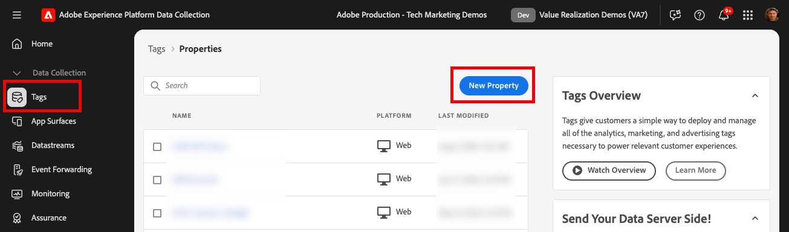
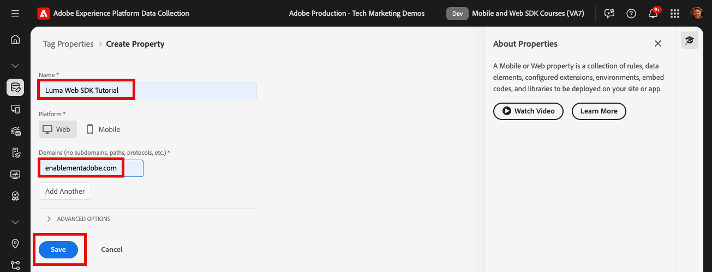
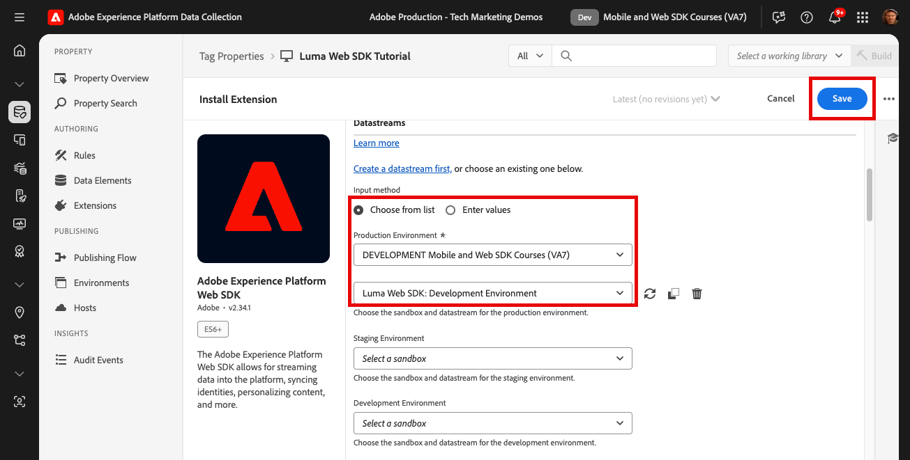

# 安裝Adobe Experience Platform Web SDK標籤擴充功能

>[!CAUTION]
>
>我們預計於2024年4月23日星期二發佈本教學課程的重大變更。 在那之後，許多練習將會變更，您可能需要從頭開始重新啟動教學課程，才能完成所有課程。

瞭解如何在資料收集介面中安裝和設定Platform Web SDK標籤擴充功能。 此標籤擴充功能為 _僅限標籤副檔名_ 必須將資料傳送至 _所有Adobe Experience Cloud應用程式_，包括 [Analytics](setup-analytics.md)， [Target](setup-target.md)， [Audience Manager](setup-audience-manager.md)、Real-time Customer Data Platform和Journey Optimizer！

## 學習目標

在本課程結束時，您將能夠：

* 在資料收集介面中建立標籤屬性
* 安裝Platform Web SDK標籤擴充功能
* 將您先前建立的資料流對應至擴充功能

## 先決條件

您必須完成本教學課程中先前的課程：

* [設定許可權](configure-permissions.md)
* [設定XDM結構描述](configure-schemas.md)
* [設定身分名稱空間](configure-identities.md)
* [設定資料流](configure-datastream.md)

## 安裝Experience Platform Web SDK擴充功能

### 新增屬性

首先，您必須要有標籤屬性。 屬性是一個容器，內含從網頁收集詳細資訊並傳送至不同位置所需的所有JavaScript、規則和其他功能。

為教學課程建立新的標籤屬性：

1. 開啟 [資料收集介面](https://launch.adobe.com/tw/){target="_blank"}
1. 選取 **[!UICONTROL 標籤]** 在左側導覽列中
1. 選取 **[!UICONTROL 新增屬性]** 按鈕
   
1. 作為 **[!UICONTROL 名稱]**，輸入 `Web SDK Course` （如果貴公司的多人參加本教學課程，請在結尾加上您的姓名）
1. 作為 **[!UICONTROL 網域]**，輸入 `enablementadobe.com` （稍後說明）
1. 選取 **[!UICONTROL 儲存]**
   

## 新增Web SDK擴充功能

現在已建立XDM結構、資料流和標籤屬性，您可以安裝Platform Web SDK擴充功能：

1. 開啟您的新標籤屬性
1. 前往 **[!UICONTROL 擴充功能]** > **[!UICONTROL 目錄]**
1. 搜尋 `Adobe Experience Platform Web SDK`
1. 選取 **[!UICONTROL 安裝]**

   

## 將Platform Web SDK連結至您的資料流

保留大部分的預設設定，並稍後視需要更新。 您現在唯一必須做的就是將擴充功能連結至資料流：

1. 在 **[!UICONTROL 資料串流]**，選取 **[!UICONTROL 從清單選擇]** 輸入法
1. 選取您先前建立的資料流， `Luma Web SDK`
1. 選取 **[!UICONTROL 儲存]**
   >[!NOTE]
   >
   > 如果找不到您的資料流，請前往 [設定資料串流](configure-datastream.md) 上課並依照步驟建立一個

   

現在您已安裝Platform Web SDK並將其關聯至資料流，您已準備好開始使用您建立的方案將資料元素對應至XDM物件。

>[!NOTE]
>
>在本教學課程中，您只會設定一個資料流，並將其與所有標籤環境（開發、預備和生產）建立關聯。 在您自己的網站上實作Platform Web SDK時，您應該為每個環境設定個別的資料流，並使用將它們對應至您的標籤環境。 **[!UICONTROL 輸入法]** > **[!UICONTROL 輸入值]**
>
>

>[!NOTE]
>
>雖然您並未在中設定CNAME [!UICONTROL 邊緣網域] 在本課程設定中，Adobe建議您在自己的網站上實作Platform Web SDK時使用CNAME。 雖然 CNAME 實施無法在 Cookie 生命週期方面提供任何優勢，但它還是有一些其他的優點。這些優點包括廣告攔截程式和不太常見的瀏覽器，防止將資料傳送到遭其歸類為追蹤程式的網域。在這些情況下，使用 CNAME 可防止這些工具使用者的資料彙集中斷問題。

如需擴充功能各個區段的詳細資訊，請參閱 [設定Adobe Experience Platform Web SDK擴充功能](https://experienceleague.adobe.com/docs/experience-platform/edge/extension/web-sdk-extension-configuration.html?lang=zh-Hant)

[下一步： ](create-data-elements.md)

>[!NOTE]
>
>感謝您投入時間學習Adobe Experience Platform Web SDK。 如果您有疑問、想要分享一般意見或有關於未來內容的建議，請在此分享這些內容 [Experience League社群討論貼文](https://experienceleaguecommunities.adobe.com/t5/adobe-experience-platform-launch/tutorial-discussion-implement-adobe-experience-cloud-with-web/td-p/444996)
