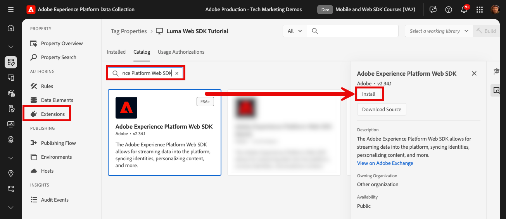

# 安裝Adobe Experience Platform Web SDK標籤擴充功能

瞭解如何安裝和設定Adobe Experience Platform Web SDK標籤擴充功能。 實作Web SDK最簡單的方法是使用Adobe的標籤管理員，即tags （先前稱為Launch）。 Platform Web SDK標籤擴充功能是&#x200B;_僅有的標籤擴充功能_，必須將資料傳送至&#x200B;_所有Adobe Experience Cloud應用程式_，包括[Analytics](setup-analytics.md)、[Target](setup-target.md)、[Audience Manager](setup-audience-manager.md)、Real-time Customer Data Platform和[Journey Optimizer](setup-web-channel.md)！

## 學習目標

在本課程結束時，您將能夠：

* 在資料收集介面中建立標籤屬性
* 安裝Platform Web SDK標籤擴充功能
* 將您先前建立的資料流對應至擴充功能

## 先決條件

您必須完成本教學課程中先前的課程：

* [設定資料流](configure-datastream.md)

### 新增標籤屬性

首先，您必須要有標籤屬性。 屬性是一個容器，內含所有JavaScript、規則，以及從網頁收集詳細資訊並傳送至不同位置所需的其他功能。

為教學課程建立新的標籤屬性：

1. 開啟[資料收集介面](https://launch.adobe.com/tw/){target="_blank"}
1. 在左側導覽中選取&#x200B;**[!UICONTROL 標籤]**
1. 選取&#x200B;**[!UICONTROL 新屬性]**按鈕
   
1. 以&#x200B;**[!UICONTROL Name]**&#x200B;的身分，輸入`Web SDK Course` （如果貴公司的多人參加此教學課程，請在結尾加上您的姓名）
1. 作為&#x200B;**[!UICONTROL 網域]**，請輸入`enablementadobe.com` （稍後說明）
1. 選取&#x200B;**[!UICONTROL 儲存]**
   

## 新增Web SDK擴充功能

現在已建立XDM結構、資料流和標籤屬性，您可以安裝Platform Web SDK擴充功能：

1. 開啟您的新標籤屬性
1. 移至&#x200B;**[!UICONTROL 擴充功能]** > **[!UICONTROL 目錄]**
1. 搜尋`Adobe Experience Platform Web SDK`
1. 選取&#x200B;**[!UICONTROL 安裝]**

   

## 將擴充功能連結至資料流

保留大部分的預設設定，並稍後視需要更新。 您現在唯一必須做的就是將擴充功能連結至資料流：

1. 在&#x200B;**[!UICONTROL 資料串流]**&#x200B;底下，選取&#x200B;**[!UICONTROL 從清單選擇]**&#x200B;輸入法
1. 選取您建立結構、身分名稱空間和資料流的沙箱
1. 選取您先前建立的資料流，`Luma Web SDK`
1. 選取&#x200B;**[!UICONTROL 儲存]**

   >[!NOTE]
   >
   > 如果找不到您的資料流，請移至[設定資料流](configure-datastream.md)課程，然後依照步驟建立資料流

   

如需擴充功能每個區段的詳細資訊，請參閱[設定Adobe Experience Platform Web SDK擴充功能](https://experienceleague.adobe.com/en/docs/experience-platform/tags/extensions/client/web-sdk/web-sdk-extension-configuration)。

>[!NOTE]
>
>雖然您在本課程的[!UICONTROL Edge網域]設定中並未設定CNAME，但Adobe建議您在自己的網站上實作Platform Web SDK時使用CNAME。 雖然 CNAME 實施無法在 Cookie 生命週期方面提供任何優勢，但它還是有一些其他的優點。這些優點包括廣告封鎖程式和不太常見的瀏覽器，防止將資料傳送至這些瀏覽器分類為追蹤程式的網域。 在這些情況下，使用 CNAME 可防止這些工具使用者的資料彙集中斷問題。

>[!NOTE]
>
>在本教學課程中，您只會設定一個資料流，並將其與所有標籤環境（開發、預備和生產）建立關聯。 在您自己的網站上實作Platform Web SDK時，您應該為每個環境設定個別的資料流，並在擴充功能設定中據以對應它們。

現在您已安裝Platform Web SDK並將其與資料流相關聯，您可以開始收集資料了。

[下一步： ](create-data-elements.md)

>[!NOTE]
>
>感謝您投入時間學習Adobe Experience Platform Web SDK。 如果您有任何疑問、想分享一般意見或有關於未來內容的建議，請在這篇[Experience League社群討論貼文](https://experienceleaguecommunities.adobe.com/t5/adobe-experience-platform-data/tutorial-discussion-implement-adobe-experience-cloud-with-web/td-p/444996)上分享
