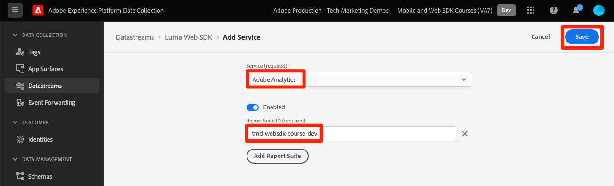
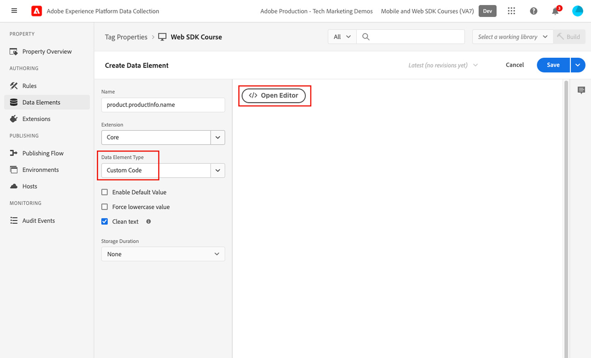

# 使用Platform Web SDK設定Adobe Analytics


>[!CAUTION]
>
>我們預計於2024年3月15日星期五發佈本教學課程的重大變更。 在那之後，許多練習將會變更，您可能需要從頭開始重新啟動教學課程，才能完成所有課程。

瞭解如何使用設定Adobe Analytics [Experience PlatformWeb SDK](https://experienceleague.adobe.com/docs/platform-learn/data-collection/web-sdk/overview.html)，建立標籤規則以將資料傳送至Adobe Analytics，並驗證Analytics是否如預期擷取資料。

[Adobe Analytics](https://experienceleague.adobe.com/docs/analytics.html?lang=zh-Hant) 是領先業界的應用程式，能夠讓您從使用者觀點瞭解客戶，並掌握客戶情報來為您的企業指引方向。

## 學習目標

在本課程結束時，您將能夠：

* 為Adobe Analytics設定XDM結構描述，並瞭解為Analytics自動對應和手動對應之XDM變數之間的差異
* 設定資料流以啟用Adobe Analytics
* 將個別或整個陣列資料元素對應至XDM物件
* 使用XDM物件在Adobe Analytics中擷取頁面檢視
* 使用Adobe Analytics產品字串的XDM物件擷取電子商務資料
* 驗證Adobe Analytics變數是使用Experience Platform偵錯工具透過XDM物件設定的
* 使用Adobe Analytics處理規則來設定自訂變數
* 驗證Adobe Analytics是否使用即時報表擷取資料

## 先決條件

您熟悉標籤、Adobe Analytics以及 [Luma示範網站](https://luma.enablementadobe.com/content/luma/us/en.html){target="_blank"} 登入和購物功能。

您至少需要一個測試/開發報表套裝ID。 如果您沒有任何可用於本教學課程的測試/開發報表套裝， [請建立一個](https://experienceleague.adobe.com/docs/analytics/admin/manage-report-suites/new-report-suite/t-create-a-report-suite.html).

您必須完成教學課程前幾節的所有步驟：

* 初始設定
   * [設定許可權](configure-permissions.md)
   * [設定XDM結構描述](configure-schemas.md)
   * [設定身分名稱空間](configure-identities.md)
   * [設定資料流](configure-datastream.md)
* 標籤設定
   * [安裝 Web SDK 擴充功能](install-web-sdk.md)
   * [建立資料元素](create-data-elements.md)
   * [建立標籤規則](create-tag-rule.md)
   * [使用Adobe Experience Platform Debugger進行驗證](validate-with-debugger.md)

## XDM結構描述和Analytics的變數

恭喜！您已在「 」中設定與Adobe Analytics相容的結構描述 [設定結構描述](configure-schemas.md) 課程！

實作Platform Web SDK時應儘可能與產品無關。 對於Adobe Analytics，在架構建立期間或標籤規則設定期間，不會像以往一樣對應eVar、prop和事件。 相反地，每個XDM索引鍵值配對都會變成內容資料變數，而此變數會以下列兩種方式之一對應至Analytics變數：

1. 使用保留的XDM欄位自動對應變數
1. 使用Analytics處理規則手動對應變數

若要瞭解哪些XDM變數會自動對應至Adobe Analytics，請參閱 [Analytics中自動對應的變數](https://experienceleague.adobe.com/docs/experience-platform/edge/data-collection/adobe-analytics/automatically-mapped-vars.html?lang=en). 任何非自動對應的變數都必須手動對應。

在中建立的綱要 [設定結構描述](configure-schemas.md) 課程包含一些自動對應至Analytics變數的專案，如下表所述：

| XDM至Analytics自動對應的變數 | Adobe Analytics變數 |
|-------|---------|
| `identitymap.ecid.[0].id` | mid |
| `web.webPageDetails.pageViews.value` | 頁面檢視s.t()呼叫 |
| `web.webPageDetails.name` | s.pageName |
| `web.webPageDetails.server` | s.server |
| `web.webPageDetails.siteSection` | s.channel |
| `commerce.productViews.value` | prodView |
| `commerce.productListViews.value` | scView |
| `commerce.checkouts.value` | scCheckout |
| `commerce.purchases.value` | 購買 |
| `commerce.order.currencyCode` | s.currencyCode |
| `commerce.order.purchaseID` | s.purchaseID |
| `productListItems[].SKU` | s.products=；product name；；；；； (primary - see note below) |
| `productListItems[].name` | s.products=；product name；；；；； （備援 — 請參閱下方的注意事項） |
| `productListItems[].quantity` | s.products=；；product quantity；；； |
| `productListItems[].priceTotal` | s.product=；；；product price； |

>[!NOTE]
>
>Analytics產品字串的個別區段是透過下的不同XDM變數設定的。 `productListItems` 物件。
>自2022年8月18日起， `productListItems[].SKU` 優先將對應至s.products變數中的產品名稱。
>設定為的值 `productListItems[].name` 只有在下列情況下，才會對應至產品名稱 `productListItems[].SKU` 不存在。 否則，它將會取消對應，並可在內容資料中使用。
>請勿將空字串或Null設為  `productListItems[].SKU`. 這會產生不想要的效果，讓對應至s.products變數中的產品名稱。


## 設定資料串流

Platform Web SDK會將資料從您的網站傳送至Platform Edge Network。 您的資料流接著會告訴Platform Edge Network該將資料轉送至何處，在此情況下，就是要轉送哪個Adobe Analytics報表套裝。

1. 前往 [資料彙集](https://experience.adobe.com/#/data-collection){target="blank"} 介面
1. 在左側導覽中選取 **[!UICONTROL 資料串流]**
1. 選取先前建立的 `Luma Web SDK` 資料流

   

1. 選取 **[!UICONTROL 新增服務]**
   
1. 選取 **[!UICONTROL Adobe Analytics]** 作為 **[!UICONTROL 服務]**
1. 輸入  **[!UICONTROL 報告套裝ID]** 開發報表套裝的
1. 選取 **[!UICONTROL 儲存]**

   

   >[!TIP]
   >
   >選取「 」以新增更多報表套裝 **[!UICONTROL 新增報表套裝]** 等於多套裝標籤。

>[!WARNING]
>
>在本教學課程中，您只會設定開發Adobe Analytics報表套裝。 當您為自己的網站建立資料串流時，您會為中繼和生產環境建立其他資料串流和報表套裝。


## 建立其他資料元素

接著，從Luma資料層擷取其他資料，並傳送至Platform Edge Network。 雖然本課程著重於常見的Adobe Analytics需求，但根據您的資料流設定，所有擷取的資料都可以輕鬆傳送至其他目的地。 例如，如果您已完成Adobe Experience Platform課程，您在本課程中擷取的其他資料也會傳送至Platform。

### 建立電子商務資料元素

在建立資料元素課程中，您 [已建立的JavaScript資料元素](create-data-elements.md#create-data-elements-to-capture-the-data-layer) 擷取的內容和身分詳細資訊。 現在將建立其他資料元素以擷取電子商務資料。 因為 [Luma示範網站](https://luma.enablementadobe.com/content/luma/us/en.html){target="_blank"} 針對產品詳細資料頁面和購物車中的產品使用不同的資料層結構，您必須為每個案例建立資料元素。 您必須建立一些自訂程式碼資料元素，以從Luma資料層擷取您需要的內容，在您自己的網站上實作時，這可能不一定需要。 在這種情況下，您需要重複執行一系列購物車專案，以擷取每個產品的特定詳細資料。 使用以下提供的程式碼片段：

1. 開啟您在本教學課程中使用的標籤屬性
1. 前往 **[!UICONTROL 資料元素]**
1. 選取 **[!UICONTROL 新增資料元素]**
1. 將其命名 **`product.productInfo.sku`**
1. 使用 **[!UICONTROL 自訂程式碼]** **[!UICONTROL 資料元素型別]**
1. 保留核取方塊 **[!UICONTROL 強制小寫值]** 和 **[!UICONTROL 清除文字]** 未勾選
1. 離開 `None` 作為 **[!UICONTROL 儲存期間]** 設定，因為每個頁面上的這個值都不相同
1. 選取 **[!UICONTROL 開啟編輯器]**

   

1. 複製並貼上下列程式碼

   ```javascript
   var cart = digitalData.product;
   var cartItem;
   cart.forEach(function(item){
   cartItem = item.productInfo.sku;
   });
   return cartItem;
   ```

1. 選取 **[!UICONTROL 儲存]** 儲存自訂程式碼的方式

   

1. 選取 **[!UICONTROL 儲存]** 儲存資料元素的方式

請依照相同的步驟建立這些其他資料元素：

* **`product.productInfo.title`**

  ```javascript
  var cart = digitalData.product;
  var cartItem;
  cart.forEach(function(item){
  cartItem = item.productInfo.title;
  });
  return cartItem;
  ```

* **`cart.productInfo`**

  ```javascript
  var cart = digitalData.cart.cartEntries;
  var cartItem = [];
  cart.forEach(function(item, index, array){
  var qty = parseInt(item.qty);
  var price = parseInt(item.price);
  cartItem.push({
  "SKU": item.sku,
  "name":item.title,
  "quantity":qty,
  "priceTotal":price
  });
  });
  return cartItem;
  ```

新增這些資料元素並在中建立先前的資料元素後 [建立資料元素](create-data-elements.md) 課程，您應具備下列資料元素：

| 資料元素 |
-----------------------------|
| `cart.orderId` |
| `cart.productInfo` |
| `identityMap.loginID` |
| `page.pageInfo.hierarchie1` |
| `page.pageInfo.pageName` |
| `page.pageInfo.server` |
| `product.productInfo.sku` |
| `product.productInfo.title` |
| `user.profile.attributes.loggedIn` |
| `user.profile.attributes.username` |
| `xdm.content` |

>[!IMPORTANT]
>
>在本教學課程中，您將為每個事件建立不同的XDM物件。 這表示您必須重新對應在每次點選時視為「全域」可用的變數，例如頁面名稱和identityMap。 不過，您可以 [合併物件](https://experienceleague.adobe.com/docs/experience-platform/tags/extensions/adobe/core/overview.html#merged-objects) 或使用 [對應表格](https://exchange.adobe.com/experiencecloud.details.103136.mapping-table.html) 在真實情境中更有效率地管理您的XDM物件。 在本課程中，全域變數會視為：
>
>* **[!UICONTROL identityMap]** 擷取已驗證的ID，依據 [建立身分對應資料元素](create-data-elements.md#create-identity-map-data-element) 中的練習 [建立資料元素](create-data-elements.md) 課程。
>* **[!UICONTROL 網頁]** 要擷取內容的物件，依據 [內容XDM物件](create-data-elements.md#map-content-data-elements-to-XDM-Schema-individually) 中的練習 [建立資料元素](create-data-elements.md) 上列每個資料元素的課程。

### 增加頁面檢視

在建立資料元素課程中，您 [已建立 `xdm.content` 資料元素](create-data-elements.md#map-content-data-elements-to-xdm-schema-individually) 以擷取內容維度。 由於您正在將資料傳送至Adobe Analytics，因此也必須對應額外的XDM欄位，以指出信標應作為Analytics的頁面檢視來處理。

1. 開啟您的 `xdm.content` 資料元素
1. 向下捲動並選取以開啟，直到 `web.webPageDetails`
1. 選取以開啟 **[!UICONTROL pageViews]** 物件
1. 設定 **[!UICONTROL 值]** 至 `1`
1. 選取 [!UICONTROL **儲存**]

   

>[!TIP]
>
>此欄位等同於傳送 **`s.t()`** Analytics的頁面檢視信標，使用 `AppMeasurement.js`. 若為連結點選信標，請設定 `webInteraction.linkClicks.value` 至 `1`


### 設定產品字串

在對應至產品字串之前，請務必瞭解XDM結構描述中有兩個主要物件，用於擷取與Adobe Analytics有特殊關係的電子商務資料：

1. 此 `commerce` 物件會設定Analytics事件，例如 `prodView`， `scView`、和 `purchase`
1. 此 `productListItems` 物件會設定Analytics維度，例如 `productID`.

另請參閱 [收集商務和產品資料](https://experienceleague.adobe.com/docs/experience-platform/edge/data-collection/collect-commerce-data.html?lang=en) 以取得更多詳細資料。

另外，請務必瞭解您可以 **[!UICONTROL 提供個別屬性]** 至個別XDM欄位或 **[!UICONTROL 提供整個陣列]** 到XDM物件。


### 將個別屬性對應至XDM物件

您可以對應至個別變數，以擷取Luma示範網站產品詳細資料頁面上的資料：

1. 建立 **[!UICONTROL xdm物件]** **[!UICONTROL 資料元素型別]** 已命名 **`xdm.commerce.prodView`**
1. 選取先前課程中使用的相同Platform沙箱和XDM結構描述
1. 開啟 **[!UICONTROL 商務]** 物件
1. 開啟 **[!UICONTROL 產品檢視]** 物件與集合 **[!UICONTROL 值]** 至 `1`

   

   >[!TIP]
   >
   >此步驟等於設定 `prodView` Analytics中的事件


1. 向下捲動至並選取 `productListItems` 陣列
1. 選取 **[!UICONTROL 提供個別專案]**
1. 選取 **[!UICONTROL 新增專案]**

   

   >[!CAUTION]
   >
   >此 **`productListItems`** 是 `array` 資料型別，因此預期資料會以元素集合的形式輸入。 由於Luma示範網站的資料層結構，以及由於一次只能在Luma網站上檢視一個產品，因此您將個別新增專案。 在您自己的網站上實作時，根據資料層結構，您或許可以提供整個陣列。

1. 選取以開啟 **[!UICONTROL 專案1]**
1. 將下列XDM變數對應至資料元素

   * **`productListItems.item1.SKU`** 至 `%product.productInfo.sku%`
   * **`productListItems.item1.name`** 至 `%product.productInfo.title%`

   

   >[!IMPORTANT]
   >
   >在儲存此XDM物件之前，請務必設定「全域」變數和頁面檢視增量程式：
   >

1. 選取 **[!UICONTROL 儲存]**

### 將整個陣列對應至XDM物件

如前所述，Luma示範網站對購物車中的產品使用不同的資料層結構。 自訂程式碼資料元素 `cart.productInfo` 您先前建立的資料元素會透過 `digitalData.cart.cartEntries` 資料層物件，並將其轉譯成必要的XDM物件結構描述。 新格式 **必須完全符合** 由定義的綱要 `productListItems` XDM結構描述的物件。

如需說明，請參閱Luma網站資料層（左）與轉譯資料元素（右）下方比較：


比較資料元素與 `productListItems` 結構（提示，它應該相符）。

>[!IMPORTANT]
>
>請注意數值變數的轉譯方式，以及資料層中的字串值，例如 `price` 和 `qty` 重新格式化為資料元素中的數字。 這些格式需求對於Platform中的資料完整性十分重要，並在以下期間決定： [設定方案](configure-schemas.md) 步驟。 在此範例中， **[!UICONTROL 數量]** 使用 **[!UICONTROL 整數]** 資料型別。
> 

現在回到將XDM物件對應至整個陣列。 建立XDM物件資料元素以擷取購物車頁面上的產品：

1. 建立 **[!UICONTROL xdm物件]** **[!UICONTROL 資料元素型別]** 已命名 **`xdm.commerce.cartView`**
1. 選取您在本教學課程中使用的相同Platform沙箱和XDM結構描述
1. 開啟 **[!UICONTROL 商務]** 物件
1. 開啟 **[!UICONTROL productListView]** 物件與集合 `value` 至 `1`

   >[!TIP]
   >
   >此步驟等於設定 `scView` Analytics中的事件

1. 向下捲動至並選取 **[!UICONTROL productListItems]** 陣列
1. 選取 **[!UICONTROL 提供整個陣列]**
1. 將對應到 **`cart.productInfo`** 資料元素

   

   >[!IMPORTANT]
   >
   >在儲存此XDM物件之前，請務必設定「全域」變數和頁面檢視增量程式：
   >

1. 選取 **[!UICONTROL 儲存]**

建立另一個 **[!UICONTROL xdm物件]**  **[!UICONTROL 資料元素型別]** 針對呼叫的結帳 `xdm.commerce.checkout`. 這次設定 **[!UICONTROL commerce.checkouts.value]** 至 `1`，對應 **[!UICONTROL productListItems]** 至 **`cart.productInfo`** 並新增「全域」變數和頁面檢視計數器。

>[!TIP]
>
>此步驟等於設定 `scCheckout` Analytics中的事件


擷取「 」還有其他步驟 `purchase` 事件：

1. 建立另一個  **[!UICONTROL xdm物件]**  **[!UICONTROL 資料元素型別]** 對於呼叫的購買 `xdm.commerce.purchase`
1. 開啟 **[!UICONTROL 商務]** 物件
1. 開啟 **[!UICONTROL 訂購]** 物件
1. 地圖 **[!UICONTROL purchaseID]** 至 `cart.orderId` 資料元素
1. 設定 **[!UICONTROL currencyCode]** 至硬式編碼值 `USD`

   

   >[!TIP]
   >
   >這等於設定 `s.purcahseID` 和 `s.currencyCode` Analytics中的變數

1. 選取以開啟 `purchases` 物件與集合 `value` 至 `1`
   >[!TIP]
   >
   >這等於設定 `purchase` Analytics中的事件

   >[!IMPORTANT]
   >
   >在儲存此XDM物件之前，請務必設定「全域」變數和頁面檢視增量程式：
   >

1. 選取 **[!UICONTROL 儲存]**

在這些步驟結束時，您應該建立以下五個XDM物件資料元素：

| XDM物件資料元素 |
-----------------------------|
| `xdm.commerce.cartView` |
| `xdm.commerce.checkout` |
| `xdm.commerce.prodView` |
| `xdm.commerce.purchase` |
| `xdm.content` |


## 為Platform Web SDK建立其他規則

建立多個XDM物件資料元素後，您就可以使用規則設定信標了。 在本練習中，您需針對每個電子商務事件建立個別規則，並使用條件，讓規則在正確的頁面上引發。 讓我們從「產品檢視」事件開始。

1. 從左側導覽中選取 **[!UICONTROL 規則]** 然後選取 **[!UICONTROL 新增規則]**
1. 將其命名  [!UICONTROL `product view - library load - AA`]
1. 在 **[!UICONTROL 活動]**，選取 **[!UICONTROL 程式庫已載入（頁面頂端）]**
1. 在 **[!UICONTROL 條件]**，選取 **[!UICONTROL 新增]**

   

1. 離開 **[!UICONTROL 邏輯型別]** 作為 **[!UICONTROL 一般]**
1. 離開 **[!UICONTROL 擴充功能]** 作為 **[!UICONTROL 核心]**
1. 選取 **[!UICONTROL 條件型別]** 作為 **[!UICONTROL 不含查詢字串的路徑]**
1. 在右側，啟用 **[!UICONTROL 規則運算式]** 切換
1. 在 **[!UICONTROL 路徑等於]** 設定 `/products/`. 對於Luma示範網站，這可確保規則僅在產品頁面上觸發
1. 選取 **[!UICONTROL 保留變更]**

   

1. 在 **[!UICONTROL 動作]** 選取 **[!UICONTROL 新增]**
1. 選取 **[!UICONTROL Adobe Experience Platform Web SDK]** 副檔名
1. 選取 **[!UICONTROL 動作型別]** 作為 **[!UICONTROL 傳送事件]**
1. 此 **[!UICONTROL 型別]** 欄位有可供選擇的下拉式值清單。 選取 `[!UICONTROL commerce.productViews]`

   >[!TIP]
   >
   >此處選取的值對於資料對應至Analytics的方式沒有影響，但建議您仔細套用此變數，因為此變數用於Adobe Experience Platform的區段產生器介面。 選取的值可用於 `[!UICONTROL c.a.x.eventtype]` 上下文資料變數下游。

1. 在 **[!UICONTROL XDM資料]**，選取 `[!UICONTROL xdm.commerce.prodView]` XDM物件資料元素
1. 選取 **[!UICONTROL 保留變更]**

   

1. 您的規則應該看起來類似下文。 選取 **[!UICONTROL 儲存]**

   


使用下列引數，對所有其他電子商務事件重複相同操作：

**規則名稱**：購物車檢視 — 程式庫載入 — AA

* **[!UICONTROL 事件型別]**：程式庫已載入（頁面頂端）
* **[!UICONTROL 條件]**： /content/luma/us/en/user/cart.html
* **在Web SDK下輸入值 — 傳送動作**： commerce.productListViews
* **Web SDK的XDM資料 — 傳送動作：** `%xdm.commerce.cartView%`

**規則名稱**：簽出 — 程式庫載入 — AA

* **[!UICONTROL 事件型別]**：程式庫已載入（頁面頂端）
* **[!UICONTROL 條件]** /content/luma/us/en/user/checkout.html
* **Web SDK的型別 — 傳送動作**：commerce.checkouts
* **Web SDK的XDM資料 — 傳送動作：** `%xdm.commerce.checkout%`

**規則名稱**：購買 — 程式庫載入 — AA

* **[!UICONTROL 事件型別]**：程式庫已載入（頁面頂端）
* **[!UICONTROL 條件]** /content/luma/us/en/user/checkout/order/thank-you.html
* **Web SDK的型別 — 傳送動作**： commerce.purchases
* **Web SDK的XDM資料 — 傳送動作：** `%xdm.commerce.purchase%`

完成後，您應該會看到下列已建立的規則。


## 建置您的開發環境

將新的資料元素和規則新增至 `Luma Web SDK Tutorial` 標籤程式庫並重新建置開發環境。


## 驗證適用於Platform Web SDK的Adobe Analytics

在 [Debugger](validate-with-debugger.md) 課程，您已瞭解如何使用Platform Debugger和瀏覽器開發人員控制檯檢查使用者端XDM物件信標，其方式與偵錯類似。 `AppMeasurement.js` Analytics實施。 若要驗證Analytics是否可透過Platform Web SDK正確擷取資料，您必須進一步執行下列兩個步驟：

1. 使用Experience Platform Debugger的邊緣追蹤功能，驗證Platform Edge Network上XDM物件處理資料的方式
1. 驗證Analytics使用處理規則和即時報表處理資料的方式。

### 使用邊緣追蹤

瞭解如何使用Experience Platform Debugger的邊緣追蹤功能驗證Adobe Analytics是否正在擷取ECID、頁面檢視、產品字串以及電子商務事件。

### Experience CloudID驗證

1. 前往 [Luma示範網站](https://luma.enablementadobe.com/content/luma/us/en.html){target="_blank"} 並使用Experience Platform偵錯工具 [將網站上的tag屬性切換為您自己的開發屬性](validate-with-debugger.md#use-the-experience-platform-debugger-to-map-to-your-tags-property)

   >[!WARNING]
   >
   >在繼續之前，請確定您已登入Luma網站。  如果您未登入，Luma網站不允許您簽出。
   >
   > 1. 在Luma上，選取右上角的登入按鈕，並使用憑證 **u： test@adobe.com p：測試** 驗證
   >
   > 1. 系統會自動將您重新導向至 [Didi Sport Watch產品頁](https://luma.enablementadobe.com/content/luma/us/en/products/gear/watches/didi-sport-watch.html#24-WG02) 在下一頁載入

1. 若要啟用邊緣追蹤，請前往Experience Platform偵錯工具，在左側導覽中選取 **[!UICONTROL 記錄檔]**，然後選取 **[!UICONTROL Edge]** 標籤，然後選取 **[!UICONTROL 連線]**

   

1. 目前會是空的

   

1. 重新整理 [Didi Sport Watch產品頁](https://luma.enablementadobe.com/content/luma/us/en/products/gear/watches/didi-sport-watch.html#24-WG02) 並再次檢視Experience Platform Debugger，您應該會看到資料已傳入。 開頭為的列 **[!UICONTROL Analytics自動對應RSID]** 是Adobe Analytics信標
1. 選取以同時開啟 `[!UICONTROL mappedQueryParams]` 用於檢視Analytics變數的下拉式清單和第二個下拉式清單

   

   >[!TIP]
   >
   >第二個下拉式清單會對應至您傳送資料的Analytics報表套裝ID。 這應與您自己的報表套裝相符，而非熒幕擷圖中的報表套裝。

1. 向下捲動以尋找 `[!UICONTROL c.a.x.identitymap.ecid.[0].id]`. 這是可擷取ECID的內容資料變數
1. 持續向下捲動，直到看到Analytics為止 `[!UICONTROL mid]` 變數中。 兩個ID都和裝置的Experience CloudID相符。

   

   >[!NOTE]
   >
   >由於您已登入，請花點時間驗證驗證的ID `112ca06ed53d3db37e4cea49cc45b71e` 適用於使用者 **test@adobe.com** 也會擷取至 `[!UICONTROL c.a.x.identitymap.lumacrmid.[0].id]`


### 內容頁面檢視

您可以使用相同的信標來驗證Analytics擷取的內容頁面檢視。

1. 尋找 `[!UICONTROL c.a.x.web.webpagedetails.pageviews.value]=1`. 它會告訴您 `s.t()` 頁面檢視信標正在傳送至Analytics
1. 向下捲動以檢視 `[!UICONTROL gn]` 變數中。 這是Analytics的動態語法 `[!UICONTROL s.pageName]` 變數中。 它會從資料層擷取頁面名稱。

   

### 產品字串和電子商務事件

由於您已在產品頁面上，此練習會繼續使用相同的邊緣追蹤來驗證Analytics所擷取的產品資料。 產品字串和電子商務事件都會自動將XDM變數對應至Analytics。 只要您已對應至適當的 `productListItem` XDM變數，而 [為Adobe Analytics設定XDM結構描述](setup-analytics.md#configure-an-xdm-schema-for-adobe-analytics)，Platform Edge Network會負責將資料對應至適當的分析變數。

1. 首先驗證 `Product String` 已設定
1. 尋找 `[!UICONTROL c.a.x.productlistitems.][0].[!UICONTROL sku]`. 變數會擷取您對應至的資料元素值 `productListItems.item1.sku` 本課程稍早
1. 向下捲動以檢視 `[!UICONTROL pl]` 變數中。 這是Analytics產品字串變數的動態語法
1. 這兩個值都和資料層中可用的產品名稱相符

   

邊緣軌跡處理 `commerce` 事件與略有不同 `productList` 維度。 您不會看到內容資料變數的對應方式，與您看到產品名稱對應的方式相同 `[!UICONTROL c.a.x.productlistitem.[0].name]` 以上。 邊緣追蹤反而會在Analytics中顯示最終事件自動對應 `event` 變數中。 只要您將對應到適當的XDM，Platform Edge Network就會據此對應 `commerce` 變數，而 [為Adobe Analytics設定結構](setup-analytics.md#configure-an-xdm-schema-for-adobe-analytics)；在此案例中 `commerce.productViews.value=1`.

1. 返回Experience PlatformDebugger視窗，向下捲動至 `[!UICONTROL event]` 變數，已設為 `[!UICONTROL prodView]`

   

驗證為Analytics設定的其餘電子商務事件和產品字串。

1. 新增 [滴滴打獵手錶](https://luma.enablementadobe.com/content/luma/us/en/products/gear/watches/didi-sport-watch.html#24-WG02) 至購物車
1. 前往 [購物車頁面](https://luma.enablementadobe.com/content/luma/us/en/user/cart.html)，檢查邊緣追蹤 `[!UICONTROL events: "scView"]` 和產品字串

   

1. 繼續結帳，勾選「邊緣追蹤」 `[!UICONTROL events: "scCheckout"]` 和產品字串

   

1. 只填寫 **名字** 和 **姓氏** 欄位並選取 **繼續**. 在下一頁，選取 **下單**
1. 在確認頁面上，檢查邊緣追蹤

   * 正在設定購買事件 `[!UICONTROL events: "purchase"]`
   * 正在設定的貨幣代碼變數 `[!UICONTROL cc: "USD"]`
   * 在中設定的購買ID `[!UICONTROL pi]`
   * 產品字串 `[!UICONTROL pl]` 設定產品名稱、數量和價格

   

## 處理規則和即時報表

現在您已透過Edge Trace驗證Analytics信標，也可以驗證Analytics已使用即時報表處理資料。 檢查即時報表前，您必須先設定Analytics的處理規則 `props` 視需要。

### 自訂分析對應的處理規則

在本練習中，您會將一個XDM變數對應至一個prop，以便您可以在即時報表中檢視。 請依照這些相同步驟執行任何自訂對應 `eVar`， `prop`， `event`，或可透過處理規則存取的變數。

1. 在Analytics UI中，前往 [!UICONTROL 管理員] > [!UICONTROL 管理工具] > [!UICONTROL 報表套裝]
1. 選取您用於教學課程的開發/測試報表套裝> [!UICONTROL 編輯設定] > [!UICONTROL 一般] > [!UICONTROL 處理規則]

   

1. 建立規則至 **[!UICONTROL 覆寫值]** `[!UICONTROL Product Name (prop1)]` 至 `a.x.productlistitems.0.name`. 請記得新增您建立規則的原因附註，並為規則標題命名。 選取 **[!UICONTROL 儲存]**

   

   >[!IMPORTANT]
   >
   >第一次對應到處理規則時，UI不會顯示XDM物件的內容資料變數。 若要修正選取的任何值，請儲存並返回編輯。 所有XDM變數現在都會顯示。

1. 前往 [!UICONTROL 編輯設定] >  [!UICONTROL 即時]. 使用下列引數設定這三個專案，以便您驗證內容頁面檢視、產品檢視和購買

   

1. 重複驗證步驟，您應該會看到即時報表據此填入資料。

   **頁面瀏覽數**
   

   **產品檢視**
   

   **購買**
   

1. 在工作區UI中，建立表格以檢視您所購買產品的完整電子商務流程

   

若要進一步瞭解如何將XDM欄位對應至Analytics變數，請參閱影片 [將Web SDK變數對應至Adobe Analytics](https://experienceleague.adobe.com/docs/analytics-learn/tutorials/analysis-use-cases/internal-site-search/map-web-sdk-variables-into-adobe-analytics.html).

恭喜！本課程已結束，現在您已準備好透過Platform Web SDK為您自己的網站實施Adobe Analytics。

[下一步： ](setup-audience-manager.md)

>[!NOTE]
>
>感謝您投入時間學習Adobe Experience Platform Web SDK。 如果您有疑問、想要分享一般意見或有關於未來內容的建議，請在此分享這些內容 [Experience League社群討論貼文](https://experienceleaguecommunities.adobe.com/t5/adobe-experience-platform-launch/tutorial-discussion-implement-adobe-experience-cloud-with-web/td-p/444996)
