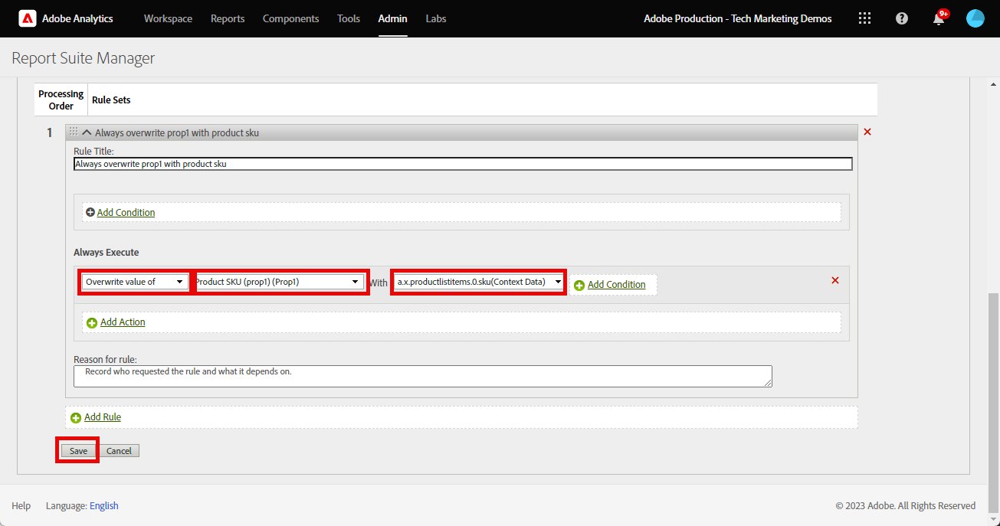
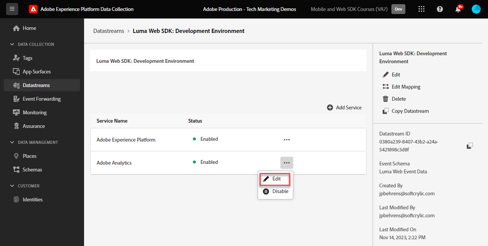

# 使用Adobe Experience Platform Web SDK設定Adobe Analytics

瞭解如何使用設定Adobe Analytics [Adobe Experience Platform Web SDK](https://experienceleague.adobe.com/en/docs/platform-learn/data-collection/web-sdk/overview)，建立標籤規則以將資料傳送至Adobe Analytics，並驗證Analytics是否如預期擷取資料。

[Adobe Analytics](https://experienceleague.adobe.com/zh-hant/docs/analytics) 是領先業界的應用程式，能夠讓您從使用者觀點瞭解客戶，並掌握客戶情報來為您的企業指引方向。

## 學習目標

在本課程結束時，您將能夠：

* 設定資料流以啟用Adobe Analytics
* 瞭解哪些標準XDM欄位會自動對應至Analytics變數
* 在資料物件中設定Analytics變數
* 覆寫資料流，將資料傳送至其他報表套裝
* 使用Debugger和保證驗證Adobe Analytics變數

## 先決條件

若要完成本課程，您必須先：

* 熟悉並存取Adobe Analytics。

* 至少要有一個測試/開發報表套裝ID。 如果您沒有任何可用於本教學課程的測試/開發報表套裝， [請建立一個](https://experienceleague.adobe.com/en/docs/analytics/admin/admin-tools/manage-report-suites/c-new-report-suite/t-create-a-report-suite).

* 完成本教學課程之初始設定和標籤設定區段中先前的課程。

## 設定資料串流

Platform Web SDK會將資料從您的網站傳送至PlatformEdge Network。 您的資料流接著會告訴PlatformEdge Network，您的資料應該傳送到哪個Adobe Analytics報表套裝。

1. 前往 [資料彙集](https://experience.adobe.com/#/data-collection){target="blank"} 介面
1. 在左側導覽中選取 **[!UICONTROL 資料串流]**
1. 選取先前建立的 `Luma Web SDK: Development Environment` 資料流

   

1. 選取 **[!UICONTROL 新增服務]**
   
1. 選取 **[!UICONTROL Adobe Analytics]** 作為 **[!UICONTROL 服務]**
1. 輸入 **[!UICONTROL 報告套裝ID]** 開發報表套裝的
1. 選取 **[!UICONTROL 儲存]**

   

   >[!TIP]
   >
   >選取「 」以新增更多報表套裝 **[!UICONTROL 新增報表套裝]** 等於多套裝標籤。

>[!WARNING]
>
>在本教學課程中，您只會針對開發環境設定Adobe Analytics報表套裝。 當您為自己的網站建立資料串流時，應該為測試和生產環境建立其他資料串流和報表套裝。

## 設定Analytics變數

有數種方式可以在Web SDK實作中設定Analytics變數：

1. 將XDM欄位自動對應到Analytics變數（自動）。
1. 在中設定欄位 `data` 物件（建議使用）。
1. 將XDM欄位對應至Analytics處理規則中的Analytics變數（不再建議使用）。
1. 直接在XDM結構描述中對應至Analytics變數（不再建議使用）。

自2024年5月起，您不再需要建立XDM結構描述來使用Platform Web SDK實作Adobe Analytics。 此 `data` 物件(以及 `data.variable` 您在本教學課程中建立的資料元素)可用來設定所有自訂Analytics變數。 在資料物件中設定這些變數，會讓現有的Analytics客戶熟悉，比使用處理規則介面更有效率，並防止不必要的資料佔用即時客戶設定檔中的空間(如果您有Real-time Customer Data Platform或Journey Optimizer，這很重要)。

### 自動對應的欄位

許多XDM欄位會自動對應至Analytics變數。 如需最新的對應清單，請參閱 [Adobe Experience Edge中的Analytics變數對應](https://experienceleague.adobe.com/en/docs/experience-platform/edge/data-collection/adobe-analytics/automatically-mapped-vars).

這種情況發生於 _即使您尚未定義自訂結構描述_. Experience Platform Web SDK會自動收集一些資料，並將它們以XDM欄位的形式傳送至PlatformEdge Network。 例如，Web SDK會讀取目前頁面URL並將其傳送為 `web.webPageDetails.URL`. 此欄位會轉送至Adobe Analytics，並自動填入Adobe Analytics中的頁面URL報表。

當您實作適用於Analytics和平台型應用程式的Web SDK時，將會建立自訂XDM結構描述，如同您在本教學課程中的 [設定結構描述](configure-schemas.md) 課程。 您已經實作自動對應至Analytics變數的部分XDM欄位，如下表所述：

| XDM至Analytics自動對應的變數 | Adobe Analytics變數 |
|-------|---------|
| `identitymap.ecid.[0].id` | mid |
| `web.webPageDetails.name` | s.pageName |
| `web.webPageDetails.server` | s.server |
| `web.webPageDetails.siteSection` | s.channel |
| `commerce.productViews.value` | prodView |
| `commerce.productListViews.value` | scView |
| `commerce.checkouts.value` | scCheckout |
| `commerce.purchases.value` | 購買 |
| `commerce.order.currencyCode` | s.currencyCode |
| `commerce.order.purchaseID` | s.purchaseID |
| `productListItems[].SKU` | s.products=；product name；；；；； (primary - see note below) |
| `productListItems[].name` | s.products=；product name；；；；； （備援 — 請參閱下方的注意事項） |
| `productListItems[].quantity` | s.products=；；product quantity；；； |
| `productListItems[].priceTotal` | s.product=；；；product price； |

Analytics產品字串的個別區段是透過下的不同XDM變數設定的。 `productListItems` 物件。

>自2022年8月18日起， `productListItems[].SKU` 優先將對應至s.products變數中的產品名稱。
>設定為的值 `productListItems[].name` 只有在下列情況下，才會對應至產品名稱 `productListItems[].SKU` 不存在。 否則，它將會取消對應，並可在內容資料中使用。
>請勿將空字串或Null設為 `productListItems[].SKU`. 這會產生不想要的效果，讓對應至s.products變數中的產品名稱。

### 在資料物件中設定變數

在中設定變數 `data` 物件是使用Web SDK設定Analytics變數的建議方式。 在資料物件中設定變數也可覆寫任何自動對應的變數。

首先，什麼是 `data` 物件？ 在任何Web SDK事件中，您都可以傳送包含自訂資料的兩個物件， `data` 物件與 `xdm` 物件。 兩者都會傳送至PlatformEdge Network，但僅限 `xdm` 物件會傳送至Experience Platform資料集。 中的屬性 `data` 物件可在Edge上對應至 `xdm` 使用「資料收集的資料準備」功能的欄位，否則不會傳送給Experience Platform。 這使其成為將資料傳送至Analytics等應用程式(非原生建立在Experience Platform上)的理想方式。

以下是一般Web SDK呼叫中的兩個物件：

Adobe Analytics已設定為尋找 `data.__adobe.analytics` 物件，並用於Analytics變數。

現在開始吧。

我們使用 `data.variable` 資料元素t

<!--

### Map to Analytics variables with processing rules

All fields in the XDM schema become available to Adobe Analytics as Context Data Variables with the following prefix `a.x.`. For example, `a.x.web.webinteraction.region`

In this exercise, you map one XDM variable to a prop. Follow these same steps for any custom mapping that you must do for any `eVar`, `prop`, `event`, or variable accessible via Processing Rules.

1. Go to the Analytics interface
1. Go to [!UICONTROL Admin] > [!UICONTROL Admin Tools] > [!UICONTROL Report Suites ]
1. Select the dev/test report suite that you are using for the tutorial > [!UICONTROL Edit Settings] > [!UICONTROL General] > [!UICONTROL Processing Rules]

       

1. Create a rule to **[!UICONTROL Overwrite value of]** `[!UICONTROL Product SKU (prop1)]` to `a.x.productlistitems.0.sku`. Remember to add a note about why you are creating the rule and name your rule title. Select **[!UICONTROL Save]**

       

    >[!IMPORTANT]
    >
    >The first time you map to a processing rule, the UI does not show you the context data variables from the XDM object. To fix that select any value, Save, and come back to edit. All XDM variables should now appear.

### Map to Analytics variables using the Adobe Analytics field group

An alternative to processing rules is to map to Analytics variables in the XDM schema using the `Adobe Analytics ExperienceEvent Template` field group. This approach has gained popularity because many users find it simpler than configuring processing rules, however, by increasing the size of the XDM payload it could in turn increase the profile size in other applications like Real-Time CDP.

To add the `Adobe Analytics ExperienceEvent Template` field group to your schema:

1. Open the [Data Collection](https://experience.adobe.com/#/data-collection){target="blank"} interface
1. Select **[!UICONTROL Schemas]** from the left navigation
1. Make sure you are in the sandbox you are using from the tutorial
1. Open your `Luma Web Event Data` schema
1. In the **[!UICONTROL Field Groups]** section, select **[!UICONTROL Add]**
1. Find the `Adobe Analytics ExperienceEvent Template` field group and add it to your schema

Now, set a merchandising eVar in the product string. With the `Adobe Analytics ExperienceEvent Template` field group, you are able to map variables to merchandising eVars or events within the product string. This is also known as setting **Product Syntax Merchandising**. 

1. Go back to your tag property

1. Open the rule `ecommerce - library loaded - set product details variables - 20`

1. Open the **[!UICONTROL Set Variable]** action

1. Select to open `_experience > analytics > customDimensions > eVars > eVar1`

1. Set the **[!UICONTROL Value]** to `%product.productInfo.title%`

1. Select **[!UICONTROL Keep Changes]**

    

1. Select **[!UICONTROL Save]** to save the rule

As you just saw, basically all of the Analytics variables can be set in the `Adobe Analytics ExperienceEvent Template` field group.

>[!NOTE]
>
> Notice the `_experience` object under `productListItems` > `Item 1`. Setting any variable under this [!UICONTROL object] sets Product Syntax eVars or Events.

-->

## 傳送資料至不同的報表套裝

訪客位於特定頁面時，您可能會想要變更要傳送至哪個Adobe Analytics報表套裝資料。 這需要在資料串流和規則中進行設定。

### 設定報表套裝覆寫的資料流

若要在資料流中設定Adobe Analytics報表套裝覆寫設定：

1. 開啟您的資料串流
1. 編輯 **[!UICONTROL Adobe Analytics]** 透過開啟  功能表，然後選取 **[!UICONTROL 編輯]**

   

1. 選取 **[!UICONTROL 進階選項]** 以開啟 **[!UICONTROL 報表套裝覆寫]**

1. 選取您要覆寫的報告套裝。 在這種情況下， `Web SDK Course Dev` 和 `Web SDK Course Stg`

1. 選取 **[!UICONTROL 儲存]**

   

### 設定報表套裝覆寫規則

讓我們建立規則，將額外的頁面檢視呼叫傳送至不同的報表套裝。 使用資料流覆寫功能來變更頁面的報告套裝，使用 **[!UICONTROL 傳送事件]** 動作。

1. 建立新規則，將其命名 `homepage - library loaded - AA report suite override - 51`

1. 選取下方的加號 **[!UICONTROL 事件]** 新增觸發器的方式

1. 在 **[!UICONTROL 副檔名]**，選取 **[!UICONTROL 核心]**

1. 在 **[!UICONTROL 事件型別]**，選取 **[!UICONTROL 程式庫已載入]**

1. 選取以開啟 **[!UICONTROL 進階選項]**，輸入 `51`. 這可確保規則在 `all pages - library loaded - send event - 50` 使用設定基線XDM **[!UICONTROL 更新變數]** 動作型別。

   

1. 在 **[!UICONTROL 條件]**，選取 **[!UICONTROL 新增]**

1. 離開 **[!UICONTROL 邏輯型別]** 作為 **[!UICONTROL 一般]**

1. 離開 **[!UICONTROL 擴充功能]** 作為 **[!UICONTROL 核心]**

1. 選取 **[!UICONTROL 條件型別]** 作為 **[!UICONTROL 不含查詢字串的路徑]**

1. 在右側，離開 **[!UICONTROL 規則運算式]** 切換已停用

1. 在 **[!UICONTROL 路徑等於]** 設定 `/content/luma/us/en.html`. 對於Luma示範網站，這可確保規則只在首頁上觸發

1. 選取 **[!UICONTROL 保留變更]**

   

1. 在 **[!UICONTROL 動作]** 選取 **[!UICONTROL 新增]**

1. 作為 **[!UICONTROL 副檔名]**，選取 **[!UICONTROL Adobe Experience Platform Web SDK]**

1. 作為 **[!UICONTROL 動作型別]**，選取 **[!UICONTROL 傳送事件]**

1. 作為 **[!UICONTROL 型別]**，選取 `web.webpagedetails.pageViews`

1. 作為 **[!UICONTROL XDM資料]**，選取 `xdm.variable.content` 您在中建立的資料元素 [建立資料元素](create-data-elements.md) 課程

   

1. 向下捲動至 **[!UICONTROL 資料流設定覆寫]** 區段

1. 離開 **[!UICONTROL 開發]** 標籤已選取。

   >[!TIP]
   >
   >    此索引標籤會決定要在哪個標籤環境中發生覆寫。 對於此體驗，您只需指定開發環境，但當您將此部署至生產環境時，請記得也在 **[!UICONTROL 生產]** 環境。

1. 選取 **[!UICONTROL 資料流]**，在本例中 `Luma Web SDK: Development Environment`

1. 在 **[!UICONTROL 報表套裝]**，選取您要用來覆寫的報告網站。 在這種情況下， `tmd-websdk-course-stg`.

1. 選取 **[!UICONTROL 保留變更]**

1. 與 **[!UICONTROL 儲存]** 您的規則

   

## 建置您的開發環境

將新的資料元素和規則新增至 `Luma Web SDK Tutorial` 標籤程式庫並重新建置開發環境。

恭喜！下一步是透過Experience Platform Web SDK驗證您的Adobe Analytics實作。

## 使用Debugger驗證Adobe Analytics

瞭解如何使用Experience Platform Debugger的邊緣追蹤功能驗證Adobe Analytics是否正在擷取ECID、頁面檢視、產品字串以及電子商務事件。

在 [Debugger](validate-with-debugger.md) 您已經瞭解如何使用Platform Debugger和瀏覽器開發人員控制檯檢查使用者端XDM請求，其方式與偵錯類似。 `AppMeasurement.js` Analytics實施。 您也瞭解如何驗證傳送至Adobe應用程式的PlatformEdge Network伺服器端要求，以及如何使用Assurance檢視完全處理的裝載。

Experience Platform若要驗證Analytics是否透過Analytics Web SDK正確擷取資料，您必須進一步執行下列兩個步驟：

1. 使用Experience PlatformDebugger的邊緣追蹤功能，驗證平台Edge Network上XDM物件處理資料的方式
1. 使用Adobe Experience Platform保證驗證Analytics完全處理資料的方式

### Experience CloudID驗證

1. 前往 [Luma示範網站](https://luma.enablementadobe.com/content/luma/us/en.html){target="_blank"}
1. 選取右上方的登入按鈕，並使用認證u： test@adobe.com p：測試進行驗證
1. 開啟Experience Platform Debugger並 [將網站上的tag屬性切換為您自己的開發屬性](validate-with-debugger.md#use-the-experience-platform-debugger-to-map-to-your-tags-property)

1. 若要啟用邊緣追蹤，請前往Experience Platform偵錯工具，在左側導覽中選取 **[!UICONTROL 記錄檔]**，然後選取 **[!UICONTROL Edge]** 標籤，然後選取 **[!UICONTROL 連線]**

   

1. 目前會是空的

   

1. 重新整理Luma頁面並再次檢查Experience Platform Debugger，您應該會看到資料傳入。 開頭為的列 **[!UICONTROL Analytics自動對應]** 是Adobe Analytics信標
1. 選取以同時開啟 `[!UICONTROL mappedQueryParams]` 用於檢視Analytics變數的下拉式清單和第二個下拉式清單

   

   >[!TIP]
   >
   >第二個下拉式清單會對應至您傳送資料的Analytics報表套裝ID。 這應與您自己的報表套裝相符，而非熒幕擷圖中的報表套裝。

1. 向下捲動以尋找 `[!UICONTROL c.a.x.identitymap.ecid.[0].id]`. 這是可擷取ECID的內容資料變數
1. 持續向下捲動，直到看到Analytics為止 `[!UICONTROL mid]` 變數中。 兩個ID都和裝置的Experience CloudID相符。
1. 在Luma網站上，

   

   >[!NOTE]
   >
   >由於您已登入，請花點時間驗證驗證的ID `112ca06ed53d3db37e4cea49cc45b71e` 適用於使用者 **`test@adobe.com`** 也會擷取至 `[!UICONTROL c.a.x.identitymap.lumacrmid.[0].id]`

### 報表套裝覆寫驗證

在您上方設定的「 」資料流覆寫 [Luma首頁](https://luma.enablementadobe.com/content/luma/us/en.html).  驗證此設定的方式

1. 尋找含有以下專案的列： **[!UICONTROL 套用覆寫後的資料流設定]**. 您可在這裡找到針對報表套裝覆寫設定的主要報表套裝和其他報表套裝。

   

1. 向下捲動至一列，開頭為 **[!UICONTROL Analytics自動對應]**  並確認 `[!UICONTROL reportSuiteIds]` 顯示您在覆寫設定中指定的報表套裝

   

### 內容頁面檢視驗證

前往產品頁面，例如 [Didi Sport Watch產品頁](https://luma.enablementadobe.com/content/luma/us/en/products/gear/watches/didi-sport-watch.html#24-WG02).  驗證Analytics是否擷取內容頁面檢視。

1. 尋找 `[!UICONTROL c.a.x.web.webpagedetails.pageviews.value]=1`.
1. 向下捲動以檢視 `[!UICONTROL gn]` 變數中。 這是Analytics的動態語法 `[!UICONTROL s.pageName]` 變數中。 它會從資料層擷取頁面名稱。

   

### 產品字串和電子商務事件驗證

由於您已在產品頁面上，此練習會繼續使用相同的邊緣追蹤來驗證Analytics所擷取的產品資料。 產品字串和電子商務事件都會自動將XDM變數對應至Analytics。 只要您已對應至適當的 `productListItem` XDM變數，而 [為Adobe Analytics設定XDM結構描述](setup-analytics.md#configure-an-xdm-schema-for-adobe-analytics)，平台Edge Network會負責將資料對應至適當的分析變數。

**首先驗證 `Product String` 已設定**

1. 尋找 `[!UICONTROL c.a.x.productlistitems.][0].[!UICONTROL sku]`. 變數會擷取您對應至的資料元素值 `productListItems.item1.sku` 本課程稍早
1. 同時尋找 `[!UICONTROL c.a.x.productlistitems.][0].[!UICONTROL _experience.analytics.customdimensions.evars.evar1]`. 變數會擷取您對應至的資料元素值 `productListItems.item1._experience.analytics.customdimensions.evars.evar1`
1. 向下捲動以檢視 `[!UICONTROL pl]` 變數中。 這是Analytics產品字串變數的動態語法
1. 請注意，資料層的產品名稱會同時對應至 `[!UICONTROL c.a.x.productlistitems.][0].[!UICONTROL sku]` 和 `[!UICONTROL product]` 產品字串的引數。  此外，資料層的產品標題會對應至產品字串中的銷售evar1。

   

   邊緣軌跡處理 `commerce` 事件與略有不同 `productList` 維度。 您不會看到內容資料變數的對應方式，與您看到產品名稱對應的方式相同 `[!UICONTROL c.a.x.productlistitem.[0].name]` 以上。 邊緣追蹤反而會在Analytics中顯示最終事件自動對應 `event` 變數中。 只要您將對應到適當的XDM，平台Edge Network就會據此對應 `commerce` 變數，而 [為Adobe Analytics設定結構](setup-analytics.md#configure-an-xdm-schema-for-adobe-analytics)；在此案例中 `commerce.productViews.value=1`.

1. 返回Experience PlatformDebugger視窗，向下捲動至 `[!UICONTROL events]` 變數，已設為 `[!UICONTROL prodView]`

1. 另請注意 `[!UICONTROL c.a.x.eventType]` 設為 `commerce.productViews` 因為您位於產品頁面。

   >[!TIP]
   >
   > 此 `ecommerce - pdp library loaded - AA (order 20)` 規則正在覆寫的值 `eventType` 由 `all pages global content variables - library loaded - AA (order 1)` 規則，因為已設定為稍後在順序中觸發

   

**驗證為Analytics設定的其餘電子商務事件和產品字串**

1. 新增 [滴滴打獵手錶](https://luma.enablementadobe.com/content/luma/us/en/products/gear/watches/didi-sport-watch.html#24-WG02) 至購物車
1. 前往 [購物車頁面](https://luma.enablementadobe.com/content/luma/us/en/user/cart.html)，檢查邊緣追蹤

   * `eventType` 設為 `commerce.productListViews`
   * `[!UICONTROL events: "scView"]`、和
   * 產品字串已設定

   

1. 繼續結帳，勾選「邊緣追蹤」

   * `eventType` 設為 `commerce.checkouts`
   * `[!UICONTROL events: "scCheckout"]`、和
   * 產品字串已設定

   

1. 只填寫 **名字** 和 **姓氏** 欄位並選取 **繼續**. 在下一頁，選取 **下單**
1. 在確認頁面上，檢查邊緣追蹤

   * `eventType` 設為 `commerce.purchases`
   * 正在設定購買事件 `[!UICONTROL events: "purchase"]`
   * 正在設定的貨幣代碼變數 `[!UICONTROL cc: "USD"]`
   * 在中設定的購買ID `[!UICONTROL pi]`
   * 產品字串 `[!UICONTROL pl]` 設定產品名稱、數量和價格

   

## 使用Assurance驗證Adobe Analytics

Adobe Experience Platform保證可協助您檢查、證明、模擬及驗證您如何收集資料或透過您的網站和行動應用程式提供體驗。

在上一個練習中，您已驗證Adobe Analytics是否使用Experience PlatformDebugger的邊緣追蹤功能來擷取ECID、頁面檢視、產品字串以及電子商務事件。  接下來，您可以使用Adobe Experience Platform保證來驗證這些相同事件，這是在Edge Trace中存取相同資料的替代介面。

如您所知， [保證](validate-with-assurance.md) 課程，有數種方式可啟動保證工作階段。 由於您已經透過上次練習起始的邊緣追蹤工作階段開啟Adobe Experience Platform Debugger，因此建議您透過Debugger存取Assurance：

在 **[!UICONTROL 「Web SDK教學課程3」]** 輸入保證工作階段 **[!UICONTROL &quot;hitdebugger&quot;]** 並放入事件搜尋列，將結果篩選為Adobe Analytics處理後資料。

### Experience CloudID驗證

若要驗證Adobe Analytics是否正在擷取ECID，請選取信標並開啟裝載。  此信標的廠商應為 **[!UICONTROL com.adobe.analytics.hitdebugger]**

然後向下捲動至 **[!UICONTROL mcvisId]** 驗證ECID是否正確擷取

### 內容頁面檢視驗證

使用相同的信標，驗證內容頁面檢視是否已對應至正確的Adobe Analytics變數。
向下捲動至 **[!UICONTROL pageName]** 驗證 `Page Name` 已正確擷取

### 產品字串和電子商務事件驗證

依照使用上述Experience Platform Debugger進行驗證時所使用的相同驗證使用案例，繼續使用相同的信標來驗證 `Ecommerce Events` 和 `Product String`.

1. 尋找裝載，其中 **[!UICONTROL 事件]** contain `prodView`
   
1. 向下捲動至 **[!UICONTROL product-string]** 驗證 `Product String`.
   * 請注意 `Product SKU` 和 `Merchandizing eVar1`.
1. 進一步向下捲動並驗證 `prop1`，您已使用上一節中的處理規則加以設定，包含 `Product SKU`\
   

檢閱購物車、結帳和購買事件，繼續驗證實施。

1. 尋找裝載，其中 **[!UICONTROL 事件]** contain `scView` 並驗證產品字串。
   
1. 尋找裝載，其中 **[!UICONTROL 事件]** contain `scCheckout` 並驗證產品字串。
   
1. 尋找裝載，其中 **[!UICONTROL 事件]** contain `purchase`
   
1. 驗證 `purchase` 事件，請注意 `Product String` 應包含 `Product SKU`， `Product Quantity` 、和 `Product Total Price`.
1. 此外，對於 `purchase` 驗證 `purchase-id` 和/或 `purchaseId` 已設定

恭喜！您成功了！ 本課程已結束，現在您已準備好透過Platform Web SDK為您自己的網站實施Adobe Analytics。

[下一步： ](setup-audience-manager.md)

>[!NOTE]
>
>感謝您投入時間學習Adobe Experience Platform Web SDK。 如果您有疑問、想分享一般意見或有關於未來內容的建議，請分享這些內容 [Experience League社群討論貼文](https://experienceleaguecommunities.adobe.com/t5/adobe-experience-platform-data/tutorial-discussion-implement-adobe-experience-cloud-with-web/td-p/444996)
