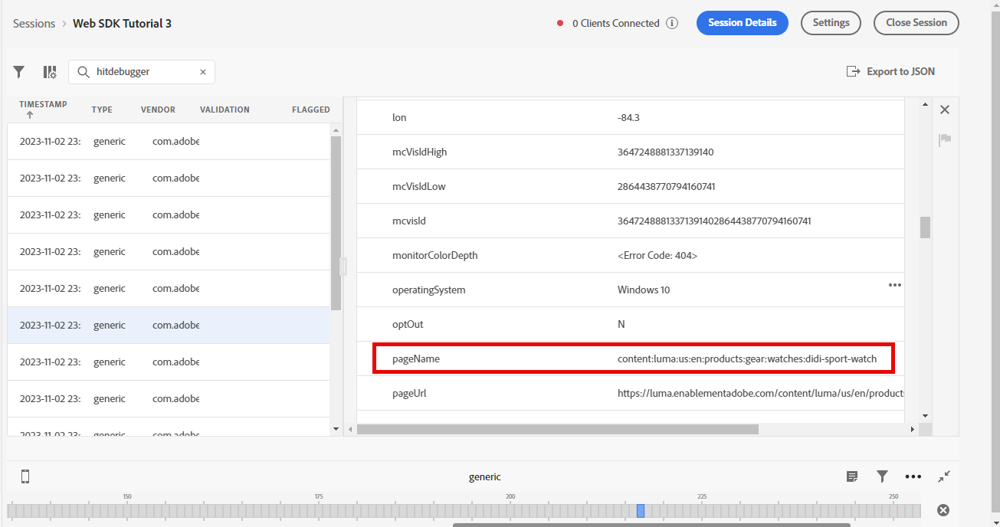

# 使用Adobe Experience Platform Web SDK設定Adobe Analytics

瞭解如何使用[Adobe Experience Platform Web SDK](https://experienceleague.adobe.com/en/docs/platform-learn/data-collection/web-sdk/overview)設定Adobe Analytics、建立標籤規則以將資料傳送至Adobe Analytics，以及驗證Analytics是否如預期擷取資料。

[Adobe Analytics](https://experienceleague.adobe.com/zh-hant/docs/analytics)是領先業界的應用程式，能夠讓您從使用者觀點瞭解客戶，並掌握客戶情報來為您的企業指引方向。

## 學習目標

在本課程結束時，您將能夠：

* 設定資料流以啟用Adobe Analytics
* 瞭解哪些標準XDM欄位會自動對應至Analytics變數
* 在資料物件中設定Analytics變數
* 覆寫資料流，將資料傳送至其他報表套裝
* 使用Debugger和Assurance驗證Adobe Analytics變數

## 先決條件

若要完成本課程，您必須先：

* 熟悉並存取Adobe Analytics。

* 至少要有一個測試/開發報表套裝ID。 如果您沒有可用於本教學課程的測試/開發報表套裝，[請建立一個](https://experienceleague.adobe.com/en/docs/analytics/admin/admin-tools/manage-report-suites/c-new-report-suite/t-create-a-report-suite)。

* 完成本教學課程之初始設定和標籤設定區段中先前的課程。

## 設定資料串流

Platform Web SDK會將資料從您的網站傳送至Platform Edge Network。 您的資料流接著會告訴Platform Edge Network要將您的資料傳送至哪個Adobe Analytics報表套裝。

1. 移至[資料彙集](https://experience.adobe.com/#/data-collection){target="blank"}介面
1. 在左側導覽中，選取&#x200B;**[!UICONTROL 資料串流]**
1. 選取先前建立的`Luma Web SDK: Development Environment`資料流

   

1. 選取&#x200B;**[!UICONTROL 新增服務]**
   
1. 選取&#x200B;**[!UICONTROL Adobe Analytics]**&#x200B;做為&#x200B;**[!UICONTROL 服務]**
1. 輸入開發報表套裝的&#x200B;**[!UICONTROL 報表套裝ID]**
1. 選取&#x200B;**[!UICONTROL 儲存]**

   

   >[!TIP]
   >
   >選取&#x200B;**[!UICONTROL 新增報表套裝]**&#x200B;以新增更多報表套裝等於多套裝標籤。

>[!WARNING]
>
>在本教學課程中，您只會針對開發環境設定Adobe Analytics報表套裝。 當您為自己的網站建立資料串流時，應該為測試和生產環境建立其他資料串流和報表套裝。

## 設定Analytics變數

有數種方式可在網頁SDK實作中設定Analytics變數：

1. 將XDM欄位自動對應到Analytics變數（自動）。
1. 在`data`物件中設定欄位（建議）。
1. 將XDM欄位對應至Analytics處理規則中的Analytics變數（不再建議使用）。
1. 直接在XDM結構描述中對應至Analytics變數（不再建議使用）。

自2024年5月起，您不再需要建立XDM結構描述來使用Platform Web SDK實作Adobe Analytics。 `data`物件（以及您在`data.variable`建立資料元素[課程中建立的](create-data-elements.md)資料元素）可用來設定所有自訂Analytics變數。 在資料物件中設定這些變數，會讓現有的Analytics客戶熟悉，比使用處理規則介面更有效率，並防止不必要的資料佔用即時客戶設定檔中的空間(如果您有Real-Time Customer Data Platform或Journey Optimizer，這很重要)。

### 自動對應的欄位

許多XDM欄位會自動對應至Analytics變數。 如需最新的對應清單，請參閱Adobe Experience Edge中的[Analytics變數對應](https://experienceleague.adobe.com/en/docs/experience-platform/edge/data-collection/adobe-analytics/automatically-mapped-vars)。

如果&#x200B;_即使您尚未定義自訂結構描述_，也會發生這種情況。 Experience Platform Web SDK會自動收集一些資料，並將其以XDM欄位的形式傳送到Platform Edge Network。 例如，Web SDK會讀取目前頁面URL並以XDM欄位`web.webPageDetails.URL`形式傳送。 此欄位會轉送至Adobe Analytics，並自動填入Adobe Analytics中的頁面URL報表。

如果您使用XDM結構描述實作適用於Adobe Analytics的Web SDK （如本教學課程中所述），則有些您自訂實作並自動對應至Analytics變數的XDM欄位，如下表所述：

| XDM至Analytics自動對應的變數 | Adobe Analytics變數 |
|-------|---------|
| `identitymap.ecid.[0].id` | mid |
| `web.webPageDetails.name` | s.pageName |
| `web.webPageDetails.server` | s.server |
| `web.webPageDetails.siteSection` | s.channel |
| `commerce.productViews.value` | prodView |
| `commerce.productListViews.value` | scView |
| `commerce.checkouts.value` | scCheckout |
| `commerce.purchases.value` | 購買 |
| `commerce.order.currencyCode` | s.currencyCode |
| `commerce.order.purchaseID` | s.purchaseID |
| `productListItems[].SKU` | s.products=；product name；；；；； (primary - see note below) |
| `productListItems[].name` | s.products=；product name；；；；； （備援 — 請參閱下方的注意事項） |
| `productListItems[].quantity` | s.products=；；product quantity；；； |
| `productListItems[].priceTotal` | s.product=；；；product price； |

Analytics產品字串的個別區段是透過`productListItems`物件下的不同XDM變數設定的。

>[!NOTE]
>
>自2022年8月18日起，`productListItems[].SKU`優先對應至s.products變數中的產品名稱。
>>只有在`productListItems[].name`不存在時，設定為`productListItems[].SKU`的值才會對應至產品名稱。 否則，它將會取消對應，並可在內容資料中使用。
>>請勿將空字串或Null設定為`productListItems[].SKU`。 這會產生不想要的效果，讓對應至s.products變數中的產品名稱。

### 在資料物件中設定變數

但evar、prop和事件呢？ 在`data`物件中設定變數，是使用Web SDK設定這些Analytics變數的建議方式。 在資料物件中設定變數也可覆寫任何自動對應的變數。

首先，`data`物件是什麼？ 在任何Web SDK事件中，您都可以傳送包含自訂資料的兩個物件： `xdm`物件和`data`物件。 兩者都會傳送至Platform Edge Network，但只有`xdm`物件會傳送至Experience Platform資料集。 可以使用「資料收集的資料準備」功能，將`data`物件中的屬性在Edge上對應至`xdm`欄位，否則不會傳送至Experience Platform。 這使其成為將資料傳送至Analytics等應用程式(並非原生建置在Experience Platform上)的理想方式。

以下是通用Web SDK呼叫中的兩個物件：

Adobe Analytics已設定為在`data.__adobe.analytics`物件中尋找任何屬性，並將這些屬性用於Analytics變數。

現在來看看這是如何運作的。 讓我們以頁面名稱設定`eVar1`和`prop1`，看看如何覆寫XDM對應的值

1. 開啟標籤規則`all pages - library loaded - set global variables - 1`
1. 新增新的&#x200B;**[!UICONTROL 動作]**
1. 選取&#x200B;**[!UICONTROL Adobe Experience Platform Web SDK]**&#x200B;擴充功能
1. 選取&#x200B;**[!UICONTROL 動作型別]**&#x200B;做為&#x200B;**[!UICONTROL 更新變數]**
1. 選取`data.variable`做為&#x200B;**[!UICONTROL 資料元素]**
1. 選取&#x200B;**[!UICONTROL 分析]**&#x200B;物件
1. 將`eVar1`設為`page.pageInfo.pageName`資料元素
1. 設定`prop1`以複製`eVar1`的值
1. 若要測試XDM對應值的覆寫，請在&#x200B;**[!UICONTROL 其他屬性]**&#x200B;區段中，將頁面名稱設為靜態值`test`
1. 儲存規則

現在，我們需要在傳送事件規則中包含資料物件。

1. 開啟標籤規則`all pages - library loaded - send event - 50`
1. 開啟&#x200B;**[!UICONTROL 傳送事件]**&#x200B;動作
1. 選取`data.variable`作為&#x200B;**[!UICONTROL 資料]**
1. 選取&#x200B;**[!UICONTROL 保留變更]**
1. 選取&#x200B;**[!UICONTROL 儲存]**

<!--

### Map to Analytics variables with processing rules

All fields in the XDM schema become available to Adobe Analytics as Context Data Variables with the following prefix `a.x.`. For example, `a.x.web.webinteraction.region`

In this exercise, you map one XDM variable to a prop. Follow these same steps for any custom mapping that you must do for any `eVar`, `prop`, `event`, or variable accessible via Processing Rules.

1. Go to the Analytics interface
1. Go to [!UICONTROL Admin] > [!UICONTROL Admin Tools] > [!UICONTROL Report Suites ]
1. Select the dev/test report suite that you are using for the tutorial > [!UICONTROL Edit Settings] > [!UICONTROL General] > [!UICONTROL Processing Rules]

       

1. Create a rule to **[!UICONTROL Overwrite value of]** `[!UICONTROL Product SKU (prop1)]` to `a.x.productlistitems.0.sku`. Remember to add a note about why you are creating the rule and name your rule title. Select **[!UICONTROL Save]**

       

    >[!IMPORTANT]
    >
    >The first time you map to a processing rule, the UI does not show you the context data variables from the XDM object. To fix that select any value, Save, and come back to edit. All XDM variables should now appear.

### Map to Analytics variables using the Adobe Analytics field group

An alternative to processing rules is to map to Analytics variables in the XDM schema using the `Adobe Analytics ExperienceEvent Template` field group. This approach has gained popularity because many users find it simpler than configuring processing rules, however, by increasing the size of the XDM payload it could in turn increase the profile size in other applications like Real-Time CDP.

To add the `Adobe Analytics ExperienceEvent Template` field group to your schema:

1. Open the [Data Collection](https://experience.adobe.com/#/data-collection){target="blank"} interface
1. Select **[!UICONTROL Schemas]** from the left navigation
1. Make sure you are in the sandbox you are using from the tutorial
1. Open your `Luma Web Event Data` schema
1. In the **[!UICONTROL Field Groups]** section, select **[!UICONTROL Add]**
1. Find the `Adobe Analytics ExperienceEvent Template` field group and add it to your schema

Now, set a merchandising eVar in the product string. With the `Adobe Analytics ExperienceEvent Template` field group, you are able to map variables to merchandising eVars or events within the product string. This is also known as setting **Product Syntax Merchandising**. 

1. Go back to your tag property

1. Open the rule `ecommerce - library loaded - set product details variables - 20`

1. Open the **[!UICONTROL Set Variable]** action

1. Select to open `_experience > analytics > customDimensions > eVars > eVar1`

1. Set the **[!UICONTROL Value]** to `%product.productInfo.title%`

1. Select **[!UICONTROL Keep Changes]**

    

1. Select **[!UICONTROL Save]** to save the rule

As you just saw, basically all of the Analytics variables can be set in the `Adobe Analytics ExperienceEvent Template` field group.

>[!NOTE]
>
> Notice the `_experience` object under `productListItems` > `Item 1`. Setting any variable under this [!UICONTROL object] sets Product Syntax eVars or Events.

-->

## 傳送資料至不同的報表套裝

訪客位於特定頁面時，您可能會想要變更要傳送至哪個Adobe Analytics報表套裝資料。 這需要在資料串流和規則中進行設定。

### 設定報表套裝覆寫的資料流

若要在資料流中設定Adobe Analytics報表套裝覆寫設定：

1. 開啟您的資料串流
1. 編輯&#x200B;**[!UICONTROL Adobe Analytics]**&#x200B;設定，方法是開啟功能表，然後選取&#x200B;**[!UICONTROL 編輯]**

   

1. 選取&#x200B;**[!UICONTROL 進階選項]**&#x200B;以開啟&#x200B;**[!UICONTROL 報表套裝覆寫]**

1. 選取您要覆寫的報告套裝。 在這種情況下，`Web SDK Course Dev`和`Web SDK Course Stg`

1. 選取&#x200B;**[!UICONTROL 儲存]**

   

### 設定報表套裝覆寫規則

讓我們建立規則，將額外的頁面檢視呼叫傳送至不同的報表套裝。 使用資料流覆寫功能，透過&#x200B;**[!UICONTROL 傳送事件]**&#x200B;動作變更頁面的報表套裝。

1. 建立新規則，將其命名為`homepage - library loaded - AA report suite override - 51`

1. 選取&#x200B;**[!UICONTROL 事件]**&#x200B;下的加號以新增觸發器

1. 在&#x200B;**[!UICONTROL 擴充功能]**&#x200B;下，選取&#x200B;**[!UICONTROL 核心]**

1. 在&#x200B;**[!UICONTROL 事件型別]**&#x200B;下，選取&#x200B;**[!UICONTROL 載入的程式庫（頁面頂端）]**

1. 選取以開啟&#x200B;**[!UICONTROL 進階選項]**，輸入`51`。 這可確保規則在設定基準線XDM為`all pages - library loaded - send event - 50`更新變數&#x200B;**[!UICONTROL 動作型別的]**&#x200B;之後執行。
1. 選取&#x200B;**[!UICONTROL 保留變更]**

   

1. 在&#x200B;**[!UICONTROL 條件]**&#x200B;下，選取以&#x200B;**[!UICONTROL 新增]**

1. 保留&#x200B;**[!UICONTROL 邏輯型別]**&#x200B;為&#x200B;**[!UICONTROL 一般]**

1. 保留&#x200B;**[!UICONTROL 擴充功能]**&#x200B;為&#x200B;**[!UICONTROL 核心]**

1. 選取&#x200B;**[!UICONTROL 條件型別]**&#x200B;作為不含查詢字串&#x200B;**[!UICONTROL 的]**&#x200B;路徑

1. 在右側，保留&#x200B;**[!UICONTROL Regex]**&#x200B;切換功能為停用

1. 在&#x200B;**[!UICONTROL 路徑下，等於]**&#x200B;設定`/content/luma/us/en.html`。 對於Luma示範網站，這可確保規則只在首頁上觸發

1. 選取&#x200B;**[!UICONTROL 保留變更]**

   

1. 在&#x200B;**[!UICONTROL 動作]**&#x200B;下，選取&#x200B;**[!UICONTROL 新增]**

1. 以&#x200B;**[!UICONTROL 延伸模組]**&#x200B;身分，選取&#x200B;**[!UICONTROL Adobe Experience Platform Web SDK]**

1. 作為&#x200B;**[!UICONTROL 動作型別]**，請選取&#x200B;**[!UICONTROL 傳送事件]**

1. 以&#x200B;**[!UICONTROL XDM資料]**&#x200B;身分，選取您在`xdm.variable.content`建立資料元素[課程中建立的](create-data-elements.md)資料元素

1. 以&#x200B;**[!UICONTROL 資料]**&#x200B;的身分，選取您在`data.variable`建立資料元素[課程中建立的](create-data-elements.md)資料元素

   

1. 向下捲動至&#x200B;**[!UICONTROL 資料流設定覆寫]**&#x200B;區段

1. 保留&#x200B;**[!UICONTROL 開發]**&#x200B;索引標籤處於選取狀態。

   >[!TIP]
   >
   >    此索引標籤會決定要在哪個標籤環境中發生覆寫。 對於此練習，您僅指定開發環境，但當您將此部署到生產環境時，請記得也在&#x200B;**[!UICONTROL 生產]**&#x200B;環境中這樣做。

1. 選取您用於教學課程的&#x200B;**[!UICONTROL 沙箱]**
1. 選取&#x200B;**[!UICONTROL 資料流]**，在此案例中為`Luma Web SDK: Development Environment`

1. 在&#x200B;**[!UICONTROL 報告套裝]**&#x200B;底下，選取您要覆寫的報告網站。 在這種情況下，`tmd-websdk-course-stg`。

1. 選取&#x200B;**[!UICONTROL 保留變更]**

1. 並&#x200B;**[!UICONTROL 儲存]**&#x200B;您的規則

   

## 建置您的開發環境

將更新的規則新增至`Luma Web SDK Tutorial`標籤程式庫，並重新建置開發環境。

恭喜！下一步是透過Experience Platform Web SDK驗證您的Adobe Analytics實作。

## 使用Debugger驗證Adobe Analytics

瞭解如何使用Adobe Analytics Debugger的Edge追蹤功能來驗證Experience Platform是否擷取ECID、頁面檢視、產品字串以及電子商務事件。

在[Debugger](validate-with-debugger.md)課程中，您已瞭解如何使用Platform Debugger和瀏覽器開發人員控制檯來檢查使用者端XDM請求，其方式與為`AppMeasurement.js` Analytics實作除錯類似。 您也瞭解如何驗證傳送至Adobe應用程式的Platform Edge Network伺服器端請求，以及如何使用Assurance檢視完全處理的裝載。

若要驗證Analytics是否可透過Experience Platform Web SDK正確擷取資料，您必須進一步執行下列兩個步驟：

1. 使用Experience Platform Debugger的Edge追蹤功能，驗證XDM物件在Edge Network上處理資料的方式
1. 驗證Analytics使用Adobe Experience Platform Assurance完整處理資料的方式

### Experience Cloud ID驗證

1. 前往[Luma示範網站](https://luma.enablementadobe.com/content/luma/us/en.html){target="_blank"}
1. 選取右上方的登入按鈕，並使用認證u： test@test.com p：測試進行驗證
1. 開啟Experience Platform Debugger並[將網站上的標籤屬性切換為您自己的開發屬性](validate-with-debugger.md#use-the-experience-platform-debugger-to-map-to-your-tags-property)

1. 若要啟用Edge追蹤，請前往Experience Platform Debugger，在左側導覽中選取「**[!UICONTROL 記錄檔]**」，然後選取「**[!UICONTROL Edge]**」標籤，再選取「**[!UICONTROL 連線]**」

   

1. 目前會是空的

   

1. 重新整理Luma頁面並再次檢查Experience Platform Debugger，您應該會看到資料顯示。 以&#x200B;**[!UICONTROL Analytics自動對應]**&#x200B;開頭的列是Adobe Analytics信標
1. 選取以開啟`[!UICONTROL mappedQueryParams]`下拉式清單和第二個下拉式清單，檢視Analytics變數

   

   >[!TIP]
   >
   >第二個下拉式清單會對應至您傳送資料的Analytics報表套裝ID。 這應與您自己的報表套裝相符，而非熒幕擷圖中的報表套裝。

1. 向下捲動以尋找`[!UICONTROL c.a.x.identitymap.ecid.[0].id]`。 這是可擷取ECID的內容資料變數
1. 持續向下捲動，直到看到Analytics `[!UICONTROL mid]`變數為止。 這兩個ID都和您裝置的Experience Cloud ID相符。
1. 在Luma網站上：

   

   >[!NOTE]
   >
   >由於您已登入，請花點時間驗證使用者`b642b4217b34b1e8d3bd915fc65c4452`的驗證ID **`test@test.com`**，此驗證識別碼也已在`[!UICONTROL c.a.x.identitymap.lumacrmid.[0].id]`中擷取

### 報表套裝覆寫驗證

您在上方設定了[Luma首頁](https://luma.enablementadobe.com/content/luma/us/en.html)的資料流覆寫。  驗證此設定的方式

1. 在套用覆寫之後尋找具有&#x200B;**[!UICONTROL 資料流設定的資料列]**。 您可在這裡找到針對報表套裝覆寫設定的主要報表套裝和其他報表套裝。

   

1. 向下捲動至以&#x200B;**[!UICONTROL Analytics自動對應]**&#x200B;開頭的列，並驗證`[!UICONTROL reportSuiteIds]`是否顯示您在覆寫設定中指定的報表套裝

   

### 內容頁面檢視驗證

移至[Didi Sport Watch產品頁面](https://luma.enablementadobe.com/content/luma/us/en/products/gear/watches/didi-sport-watch.html#24-WG02)之類的產品頁面。  驗證Analytics是否擷取內容頁面檢視。

1. 尋找`[!UICONTROL c.a.x.web.webpagedetails.pageviews.value]=1`。
1. 向下捲動以檢視`[!UICONTROL gn]`變數。 這是`[!UICONTROL s.pageName]`變數的Analytics動態語法。 它會從資料層擷取頁面名稱。

   >[!NOTE]
   >
   > 如果您在先前的練習中使用`gn`物件覆寫`test`物件，`xdm`值可能是`data`。

   

### 產品字串和電子商務事件驗證

由於您已在產品頁面上，此練習會繼續使用相同的Edge追蹤來驗證Analytics所擷取的產品資料。 產品字串和電子商務事件都會自動將XDM變數對應至Analytics。 在`productListItem`為Adobe Analytics[設定XDM結構描述時，只要您已對應至適當的](setup-analytics.md#configure-an-xdm-schema-for-adobe-analytics) XDM變數，Platform Edge Network就會負責將資料對應至適當的分析變數。

**首先驗證`Product String`是否已設定**

1. 尋找`[!UICONTROL c.a.x.productlistitems.][0].[!UICONTROL sku]`。 變數會擷取您在本課程中先前對應至`productListItems.item1.sku`的資料元素值
1. 也尋找`[!UICONTROL c.a.x.productlistitems.][0].[!UICONTROL _experience.analytics.customdimensions.evars.evar1]`。 變數會擷取您對應至`productListItems.item1._experience.analytics.customdimensions.evars.evar1`的資料元素值
1. 向下捲動以檢視`[!UICONTROL pl]`變數。 這是Analytics產品字串變數的動態語法
1. 請注意，資料層的產品名稱會對應至產品字串的`[!UICONTROL c.a.x.productlistitems.][0].[!UICONTROL sku]`和`[!UICONTROL product]`引數。  此外，資料層的產品標題會對應至產品字串中的銷售evar1。

   

   Edge追蹤處理`commerce`個事件的方式與`productList`個維度略有不同。 您不會看到內容資料變數的對應方式，與看到產品名稱對應至上述`[!UICONTROL c.a.x.productlistitem.[0].name]`的方式相同。 Edge追蹤反而會在Analytics `event`變數中顯示最終事件自動對應。 只要您在`commerce`設定Adobe Analytics的結構描述[時對應到適當的XDM ](setup-analytics.md#configure-an-xdm-schema-for-adobe-analytics)變數，Platform Edge Network就會相應地對應它；在此例中是`commerce.productViews.value=1`。

1. 返回Experience Platform Debugger視窗，向下捲動至`[!UICONTROL events]`變數，變數設為`[!UICONTROL prodView]`

1. 另請注意`[!UICONTROL c.a.x.eventType]`已設為`commerce.productViews`，因為您位於產品頁面。

   >[!TIP]
   >
   > `ecommerce - library loaded - set product details variables - 20`規則正在覆寫`eventType`規則設定的`all pages - library loaded - set global variables - 1`的值，因為它設定為稍後在順序中觸發

   

**驗證為Analytics設定的其餘電子商務事件和產品字串**

1. 將[Didi Sport Watch](https://luma.enablementadobe.com/content/luma/us/en/products/gear/watches/didi-sport-watch.html#24-WG02)加入購物車
1. 前往[購物車頁面](https://luma.enablementadobe.com/content/luma/us/en/user/cart.html)，檢查Edge追蹤

   * `eventType`已設定為`commerce.productListViews`
   * `[!UICONTROL events: "scView"]`，和
   * 產品字串已設定

   

1. 繼續結帳，檢查Edge追蹤

   * `eventType`已設定為`commerce.checkouts`
   * `[!UICONTROL events: "scCheckout"]`，和
   * 產品字串已設定

   

1. 填寫送貨表單上的&#x200B;**名字**&#x200B;和&#x200B;**姓氏**&#x200B;欄位，然後選取&#x200B;**繼續**。 在下一頁，選取&#x200B;**下訂單**
1. 在確認頁面上，檢查Edge追蹤

   * `eventType`已設定為`commerce.purchases`
   * 正在設定的購買事件`[!UICONTROL events: "purchase"]`
   * 正在設定的貨幣代碼變數`[!UICONTROL cc: "USD"]`
   * 已在`[!UICONTROL pi]`中設定購買識別碼
   * 設定產品名稱、數量和價格的產品字串`[!UICONTROL pl]`

   

## 使用Assurance驗證Adobe Analytics

Adobe Experience Platform Assurance可協助您檢查、證明、模擬及驗證您如何收集資料，或如何透過您的網站和行動應用程式提供體驗。

在上一個練習中，您已驗證Adobe Analytics是否使用Experience Platform Debugger的Edge追蹤功能來擷取ECID、頁面檢視、產品字串以及電子商務事件。  接下來，您可以使用Adobe Experience Platform Assurance驗證這些相同事件，這是在Edge追蹤中存取相同資料的替代介面。

如您在[Assurance](validate-with-assurance.md)課程中所瞭解，有數種方式可啟動Assurance工作階段。 由於您已經以Edge追蹤工作階段開啟了Adobe Experience Platform Debugger （從上次練習開始），因此建議您透過Debugger存取Assurance：
透過Adobe Experience Platform資料彙集

在&#x200B;**[!UICONTROL 「網頁SDK教學課程3」]** Assurance工作階段中，在事件搜尋列中輸入&#x200B;**[!UICONTROL 「hitdebugger」]**，將結果篩選為Adobe Analytics後續處理資料。

### Experience Cloud ID驗證

若要驗證Adobe Analytics是否正在擷取ECID，請選取信標並開啟裝載。  此信標的廠商應為&#x200B;**[!UICONTROL com.adobe.analytics.hitdebugger]**
使用Assurance進行

然後向下捲動至&#x200B;**[!UICONTROL mcvisId]**，驗證是否已正確擷取ECID
使用Assurance進行

### 內容頁面檢視驗證

使用相同的信標，驗證內容頁面檢視是否已對應至正確的Adobe Analytics變數。
向下捲動至**[!UICONTROL pageName]**&#x200B;以驗證`Page Name`是否已正確擷取：

    >[！NOTE]
    >
    >如果您在先前的練習中使用&#39;data&#39;物件覆寫&#39;xdm&#39;物件，則&#39;pageName&#39;值可能是&#39;test&#39;。
    
    

### 產品字串和電子商務事件驗證

依照使用上述Experience Platform Debugger進行驗證時所使用的相同驗證使用案例，繼續使用相同的指標來驗證`Ecommerce Events`和`Product String`。

1. 尋找&#x200B;**[!UICONTROL 事件]**&#x200B;包含`prodView`的承載
   使用Assurance進行
1. 向下捲動至&#x200B;**[!UICONTROL product-string]**&#x200B;以驗證`Product String`。
   * 記下`Product SKU`和`Merchandizing eVar1`。
1. 進一步向下捲動，驗證您使用上一節中的處理規則設定的`prop1`是否包含`Product SKU`\
   

檢閱購物車、結帳和購買事件，繼續驗證實施。

1. 尋找&#x200B;**[!UICONTROL 事件]**&#x200B;包含`scView`的裝載，並驗證產品字串。
   使用Assurance進行
1. 尋找&#x200B;**[!UICONTROL 事件]**&#x200B;包含`scCheckout`的裝載，並驗證產品字串。
   使用Assurance進行
1. 尋找&#x200B;**[!UICONTROL 事件]**&#x200B;包含`purchase`的承載
   使用Assurance進行
1. 驗證`purchase`事件時，請注意`Product String`應該包含`Product SKU`、`Product Quantity`和`Product Total Price`。
1. 此外，針對`purchase`，請驗證`purchase-id`及/或`purchaseId`是否已設定

恭喜！您成功了！ 本課程已結束，現在您已準備好透過Platform Web SDK為您自己的網站實施Adobe Analytics。

>[!NOTE]
>
>感謝您花時間學習Adobe Experience Platform Web SDK。 如果您有任何疑問、想分享一般意見或有關於未來內容的建議，請在這篇[Experience League社群討論貼文](https://experienceleaguecommunities.adobe.com/t5/adobe-experience-platform-data/tutorial-discussion-implement-adobe-experience-cloud-with-web/td-p/444996)上分享
