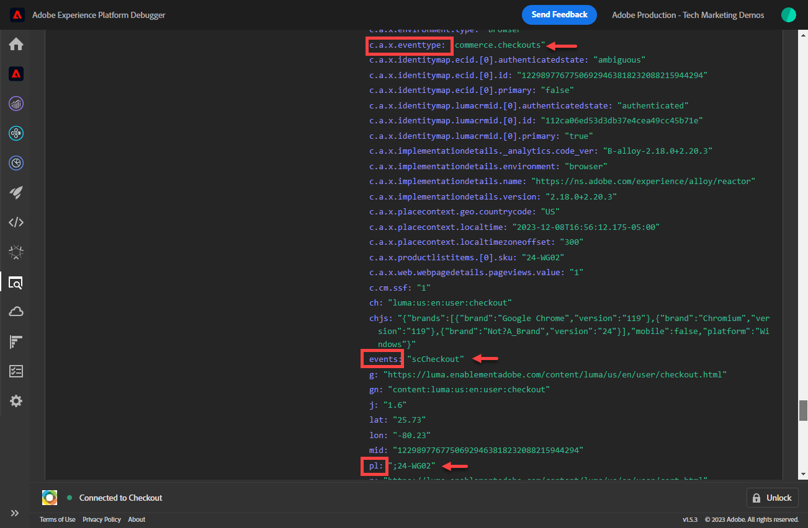

# 使用Platform Web SDK設定Adobe Analytics

了解如何使用 [Experience PlatformWeb SDK](https://experienceleague.adobe.com/docs/platform-learn/data-collection/web-sdk/overview.html)、建立標籤規則以將資料傳送至Adobe Analytics，並驗證Analytics是否如預期擷取資料。

[Adobe Analytics](https://experienceleague.adobe.com/docs/analytics.html) 是領先業界的應用程式，能夠讓您從使用者觀點了解客戶，並掌握客戶情報來為您的企業指引方向。

## 學習目標

在本課程結束時，您將能夠：

* 為Adobe Analytics設定XDM結構，並了解針對Analytics自動對應和手動對應的XDM變數之間的差異
* 設定資料流以啟用Adobe Analytics
* 將個別或整個陣列資料元素對應至XDM物件
* 使用XDM物件在Adobe Analytics中擷取頁面檢視
* 使用Adobe Analytics產品字串的XDM物件擷取電子商務資料
* 使用Adobe Analytics偵錯工具驗證XDM物件已設定Experience Platform變數
* 使用Adobe Analytics處理規則來設定自訂變數
* 驗證Adobe Analytics是否使用即時報表擷取資料

## 先決條件

您熟悉標籤、Adobe Analytics和 [Luma示範網站](https://luma.enablementadobe.com/content/luma/us/en.html){target=&quot;_blank&quot;}登入和購物功能。

您至少需要一個測試/開發報表套裝ID。 如果您沒有可用於本教學課程的測試/開發報表套裝， [請建立一個](https://experienceleague.adobe.com/docs/analytics/admin/manage-report-suites/new-report-suite/t-create-a-report-suite.html).

您必須已完成本教學課程中前幾節的所有步驟：

* 初始配置
   * [設定權限](configure-permissions.md)
   * [設定XDM結構](configure-schemas.md)
   * [設定身分命名空間](configure-identities.md)
   * [設定資料流](configure-datastream.md)
* 標籤設定
   * [安裝Web SDK擴充功能](install-web-sdk.md)
   * [建立資料元素](create-data-elements.md)
   * [建立標籤規則](create-tag-rule.md)
   * [使用Adobe Experience Platform Debugger驗證](validate-with-debugger.md)

## XDM結構與Analytics的變數

恭喜！您已設定與Adobe Analytics相容的結構，位於 [設定結構](configure-schemas.md) 課！

實作Platform Web SDK應盡可能不受產品限制。 針對Adobe Analytics，在結構建立期間或標籤規則設定期間不會發生對應eVar、prop和事件，傳統方式已如此。 相反地，每個XDM索引鍵值組都會變成內容資料變數，以兩種方式之一對應至Analytics變數：

1. 使用保留的XDM欄位自動對應變數
1. 使用Analytics處理規則手動對應變數

若要了解哪些XDM變數會自動對應至Adobe Analytics，請參閱 [在Analytics中自動對應的變數](https://experienceleague.adobe.com/docs/experience-platform/edge/data-collection/adobe-analytics/automatically-mapped-vars.html?lang=en). 任何未自動對應的變數都必須手動對應。

在 [設定結構](configure-schemas.md) 本課程包含一些自動對應至Analytics變數的項目，如下表所列：

| XDM到Analytics的自動對應變數 | Adobe Analytics變數 |
|-------|---------|
| `identitymap.ecid.[0].id` | mid |
| `web.webPageDetails.pageViews.value` | 頁面檢視s.t()呼叫 |
| `web.webPageDetails.name` | s.pageName |
| `web.webPageDetails.server` | s.server |
| `web.webPageDetails.siteSection` | s.channel |
| `commerce.productViews.value` | prodView |
| `commerce.productListViews.value` | scView |
| `commerce.checkouts.value` | scCheckout |
| `commerce.purchases.value` | 購買 |
| `commerce.order.currencyCode` | s.currencyCode |
| `commerce.order.purchaseID` | s.purchaseID |
| `productListItems[].SKU` | s.products=；產品名稱；;;（主要 — 請參閱下方附註） |
| `productListItems[].name` | s.products=；產品名稱；;;（備援 — 請參閱下方附註） |
| `productListItems[].quantity` | s.products=;；產品數量； |
| `productListItems[].priceTotal` | s.product=;;；產品價格； |

>[!NOTE]
>
>Analytics產品字串的個別區段會透過 `productListItems` 物件。
>截至2022年8月18日， `productListItems[].SKU` 在s.products變數中，優先對應至產品名稱。
>設為的值 `productListItems[].name` 只有在 `productListItems[].SKU` 不存在。 否則，它會取消對應，且可用於內容資料。
>請勿將空字串或null設為  `productListItems[].SKU`. 這不會造成對應至s.products變數中的產品名稱的效果。


## 設定資料流

Platform Web SDK會從您的網站將資料傳送至Platform Edge Network。 然後，您的資料流會告訴Platform Edge Network該將該資料轉送至何處（在此例中是哪個），以及您的Adobe Analytics報表套裝。

1. 前往 [資料收集](https://experience.adobe.com/#/data-collection){target=&quot;blank&quot;}介面
1. 在左側導覽列中，選取 **[!UICONTROL 資料流]**
1. 選取先前建立的 `Luma Web SDK` 資料流

   

1. 選擇 **[!UICONTROL 添加服務]**

   
1. 選擇 **[!UICONTROL Adobe Analytics]** 作為 **[!UICONTROL 服務]**
1. 輸入  **[!UICONTROL 報表套裝ID]** 開發報表套裝
1. 選擇 **[!UICONTROL 儲存]**

   

   >[!TIP]
   >
   >透過選取 **[!UICONTROL 新增報表套裝]** 等同於多套裝標籤。

>[!WARNING]
>
>在本教學課程中，您只需設定開發Adobe Analytics報表套裝。 當您為自己的網站建立資料流時，會為您的測試和生產環境建立其他資料流和報表套裝。


## 建立其他資料元素

接著，從Luma資料層擷取其他資料，並傳送至Platform Edge Network。 雖然本課程著重於Adobe Analytics的常見需求，但根據您的資料流組態，所有擷取的資料都可輕鬆傳送至其他目的地。 例如，如果您已完成Adobe Experience Platform課程，您在本課程中擷取的其他資料也會傳送至Platform。

### 建立電子商務資料元素

在建立資料元素課程中，您 [建立JavaScript資料元素](create-data-elements.md#create-data-elements-to-capture-the-data-layer) 擷取內容和身分詳細資訊。 現在，您將建立其他資料元素來擷取電子商務資料。 因為 [Luma示範網站](https://luma.enablementadobe.com/content/luma/us/en.html){target=&quot;_blank&quot;}針對購物車中的產品詳細資料頁面和產品使用不同的資料層結構，您必須為每個案例建立資料元素。 您必須建立一些自訂程式碼資料元素，才能從Luma資料層抓取所需內容，這在您自己的網站上實作時可能是必要（或不是必要）。 在此情況下，您需要循環瀏覽一系列購物車項目，以取得每項產品的特定詳細資訊。 請使用以下提供的程式碼片段：

1. 開啟您用於教學課程的標籤屬性
1. 前往 **[!UICONTROL 資料元素]**
1. 選擇 **[!UICONTROL 新增資料元素]**
1. 為其命名 **`product.productInfo.sku`**
1. 使用 **[!UICONTROL 自訂程式碼]** **[!UICONTROL 資料元素類型]**
1. 請保留 **[!UICONTROL 強制小寫值]** 和 **[!UICONTROL 清除文字]** 未勾選
1. 離開 `None` 作為 **[!UICONTROL 儲存期間]** 設定，因為此值在每個頁面上都不同
1. 選擇 **[!UICONTROL 開啟編輯器]**

   

1. 複製並貼上下列程式碼

   ```javascript
   var cart = digitalData.product;
   var cartItem;
   cart.forEach(function(item){
   cartItem = item.productInfo.sku;
   });
   return cartItem;
   ```

1. 選擇 **[!UICONTROL 儲存]** 儲存自訂程式碼

   

1. 選擇 **[!UICONTROL 儲存]** 儲存資料元素的方式

請依照相同的步驟建立這些其他資料元素：

* **`product.productInfo.title`**

   ```javascript
   var cart = digitalData.product;
   var cartItem;
   cart.forEach(function(item){
   cartItem = item.productInfo.title;
   });
   return cartItem;
   ```

* **`cart.productInfo`**

   ```javascript
   var cart = digitalData.cart.cartEntries;
   var cartItem = [];
   cart.forEach(function(item, index, array){
   var qty = parseInt(item.qty);
   var price = parseInt(item.price);
   cartItem.push({
   "SKU": item.sku,
   "name":item.title,
   "quantity":qty,
   "priceTotal":price
   });
   });
   return cartItem;
   ```

新增這些資料元素，並在 [建立資料元素](create-data-elements.md) 課程中，您應有下列資料元素：

| 資料元素 |
-----------------------------|
| `cart.orderId` |
| `cart.productInfo` |
| `identityMap.loginID` |
| `page.pageInfo.hierarchie1` |
| `page.pageInfo.pageName` |
| `page.pageInfo.server` |
| `product.productInfo.sku` |
| `product.productInfo.title` |
| `user.profile.attributes.loggedIn` |
| `user.profile.attributes.username` |
| `xdm.content` |

>[!IMPORTANT]
>
>在本教學課程中，您將為每個事件建立不同的XDM物件。 這表示您必須重新對應每次點擊（例如頁面名稱和identityMap）上都可視為「全域」的變數。 不過，您可以 [合併對象](https://experienceleague.adobe.com/docs/experience-platform/tags/extensions/adobe/core/overview.html#merged-objects) 或使用 [映射表](https://exchange.adobe.com/experiencecloud.details.103136.mapping-table.html) 以在真實情況下更高效地管理XDM對象。 在本課程中，全域變數視為：
>
>* **[!UICONTROL identityMap]** 擷取已驗證的ID，如 [建立Identity Map資料元素](create-data-elements.md#create-identity-map-data-element) 在 [建立資料元素](create-data-elements.md) 教訓。
>* **[!UICONTROL web]** 物件，依照 [內容XDM物件](create-data-elements.md#map-content-data-elements-to-XDM-Schema-individually) 在 [建立資料元素](create-data-elements.md) 上方每個資料元素的課程。


### 遞增頁面檢視

在建立資料元素課程中，您 [建立 `xdm.content` 資料元素](create-data-elements.md#map-content-data-elements-to-xdm-schema-individually) 來擷取內容維度。 由於您現在要將資料傳送至Adobe Analytics，因此您也必須對應額外的XDM欄位，以指出應將信標處理為Analytics的頁面檢視。

1. 開啟 `xdm.content` 資料元素
1. 向下捲動並選取以開啟，直到 `web.webPageDetails`
1. 選取以開啟 **[!UICONTROL pageViews]** 物件
1. 設定 **[!UICONTROL value]** to `1`
1. 選擇 [!UICONTROL **儲存**]

   

>[!TIP]
>
>此欄位等同於傳送 **`s.t()`** 使用的Analytics頁面檢視信標 `AppMeasurement.js`. 若為連結點擊信標，請設定 `webInteraction.linkClicks.value` to `1`


### 設定產品字串

在對應至產品字串之前，請務必了解XDM架構中有兩個主要物件，用於擷取與Adobe Analytics有特殊關係的電子商務資料：

1. 此 `commerce` 物件集Analytics事件，例如 `prodView`, `scView`，和 `purchase`
1. 此 `productListItems` 物件集Analytics維度，例如 `productID`.

請參閱 [收集商務和產品資料](https://experienceleague.adobe.com/docs/experience-platform/edge/data-collection/collect-commerce-data.html?lang=en) 以取得更多詳細資訊。

您也必須了解，您可以 **[!UICONTROL 提供個別屬性]** 至個別XDM欄位或 **[!UICONTROL 提供整個陣列]** 至XDM物件。


### 將個別屬性對應至XDM物件

您可以對應至個別變數，以擷取Luma示範網站產品詳細資訊頁面上的資料：

1. 建立 **[!UICONTROL XDM物件]** **[!UICONTROL 資料元素類型]** 已命名 **`xdm.commerce.prodView`**
1. 選取先前課程中使用的相同Platform沙箱和XDM結構
1. 開啟 **[!UICONTROL 商務]** 物件
1. 開啟 **[!UICONTROL productViews]** 物件與設定 **[!UICONTROL value]** to `1`

   

   >[!TIP]
   >
   >此步驟等同於設定 `prodView` Analytics中的事件


1. 向下捲動至並選取 `productListItems` 陣列
1. 選擇 **[!UICONTROL 提供個別項目]**
1. 選擇 **[!UICONTROL 新增項目]**

   

   >[!CAUTION]
   >
   >此 **`productListItems`** 是 `array` 資料類型，因此預期資料會以元素集合的形式傳入。 由於Luma示範網站的資料層結構，以及由於您一次只能在Luma網站上檢視一個產品，因此您將個別新增項目。 根據您的資料層結構，在您自己的網站上實作時，您可能可以提供整個陣列。

1. 選擇以開啟 **[!UICONTROL 項目1]**
1. 將下列XDM變數對應至資料元素

   * **`productListItems.item1.SKU`** 到 `%product.productInfo.sku%`
   * **`productListItems.item1.name`** 到 `%product.productInfo.title%`

   

   >[!IMPORTANT]
   >
   >儲存此XDM物件之前，請務必先設定「全域」變數和頁面檢視增量器：
   >

1. 選擇 **[!UICONTROL 儲存]**

### 將整個陣列對應至XDM物件

如前所述，Luma示範網站對購物車中的產品使用不同的資料層結構。 自訂程式碼資料元素 `cart.productInfo` 您先前建立的資料元素會透過 `digitalData.cart.cartEntries` 資料層物件，並將其轉譯為所需的XDM物件架構。 新格式 **完全匹配** 由 `productListItems` XDM架構的物件。

若要說明，請參閱Luma網站資料層下方的比較（左）與轉譯的資料元素（右）:


比較資料元素與 `productListItems` 結構（提示，它應符合）。

>[!IMPORTANT]
>
>請注意數值變數的轉譯方式，並在資料層中加上字串值，例如 `price` 和 `qty` 重新格式化為資料元素中的數字。 這些格式需求對Platform中的資料完整性而言十分重要，且會在 [配置結構](configure-schemas.md) 步驟。 在範例中， **[!UICONTROL 數量]** 使用 **[!UICONTROL 整數]** 資料類型。
> 

現在，將XDM物件對應至整個陣列。 建立XDM物件資料元素以擷取購物車頁面上的產品：

1. 建立 **[!UICONTROL XDM物件]** **[!UICONTROL 資料元素類型]** 已命名 **`xdm.commerce.cartView`**
1. 選取您用於本教學課程的相同平台沙箱和XDM結構
1. 開啟 **[!UICONTROL 商務]** 物件
1. 開啟 **[!UICONTROL productListViews]** 物件與設定 `value` to `1`

   >[!TIP]
   >
   >此步驟等同於設定 `scView` Analytics中的事件

1. 向下捲動至並選取 **[!UICONTROL productListItems]** 陣列
1. 選擇 **[!UICONTROL 提供整個陣列]**
1. 對應至 **`cart.productInfo`** 資料元素

   

   >[!IMPORTANT]
   >
   >儲存此XDM物件之前，請務必先設定「全域」變數和頁面檢視增量器：
   >

1. 選擇 **[!UICONTROL 儲存]**

建立其他 **[!UICONTROL XDM物件]**  **[!UICONTROL 資料元素類型]** 已呼叫結帳 `xdm.commerce.checkout`. 此次會將 **[!UICONTROL commerce.checkouts.value]** to `1`，地圖 **[!UICONTROL productListItems]** to **`cart.productInfo`** 就像您剛才一樣，並新增「全域」變數和頁面檢視計數器。

>[!TIP]
>
>此步驟等同於設定 `scCheckout` Analytics中的事件


擷取 `purchase` 事件：

1. 建立其他  **[!UICONTROL XDM物件]**  **[!UICONTROL 資料元素類型]** 已呼叫的購買 `xdm.commerce.purchase`
1. 開啟 **[!UICONTROL 商務]** 物件
1. 開啟 **[!UICONTROL 訂購]** 物件
1. 地圖 **[!UICONTROL purchaseID]** 到 `cart.orderId` 資料元素
1. 設定 **[!UICONTROL currencyCode]** 寫入硬式編碼值 `USD`

   

   >[!TIP]
   >
   >這等同於設定 `s.purcahseID` 和 `s.currencyCode` Analytics中的變數

1. 選取以開啟 `purchases` 物件與設定 `value` to `1`
   >[!TIP]
   >
   >這等同於設定 `purchase` Analytics中的事件

   >[!IMPORTANT]
   >
   >儲存此XDM物件之前，請務必先設定「全域」變數和頁面檢視增量器：
   >

1. 選擇 **[!UICONTROL 儲存]**

在這些步驟結束時，您應已建立下列五個XDM物件資料元素：

| XDM物件資料元素 |
-----------------------------|
| `xdm.commerce.cartView` |
| `xdm.commerce.checkout` |
| `xdm.commerce.prodView` |
| `xdm.commerce.purchase` |
| `xdm.content` |


## 建立Platform Web SDK的其他規則

建立多個XDM物件資料元素後，您就可以使用規則設定信標。 在本練習中，您會針對每個電子商務事件建立個別規則，並使用條件，讓規則在正確的頁面上引發。 讓我們從產品檢視事件開始。

1. 從左側導覽中，選取 **[!UICONTROL 規則]** 然後選取 **[!UICONTROL 新增規則]**
1. 為其命名  [!UICONTROL `product view - library load - AA`]
1. 在 **[!UICONTROL 事件]**，選取 **[!UICONTROL 程式庫已載入（頁面頂端）]**
1. 在 **[!UICONTROL 條件]**，選擇 **[!UICONTROL 新增]**

   

1. 離開 **[!UICONTROL 邏輯類型]** as **[!UICONTROL 一般]**
1. 離開 **[!UICONTROL 擴充功能]** as **[!UICONTROL 核心]**
1. 選擇 **[!UICONTROL 條件類型]** as **[!UICONTROL 不含查詢字串的路徑]**
1. 在右側，啟用 **[!UICONTROL Regex]** 切換
1. 在 **[!UICONTROL 路徑等於]** set `/products/`. 針對Luma示範網站，可確保規則只會在產品頁面上觸發
1. 選擇 **[!UICONTROL 保留變更]**

   

1. 在 **[!UICONTROL 動作]** 選取 **[!UICONTROL 新增]**
1. 選擇 **[!UICONTROL Adobe Experience Platform Web SDK]** 擴充功能
1. 選擇 **[!UICONTROL 動作類型]** as **[!UICONTROL 傳送事件]**
1. 此 **[!UICONTROL 類型]** 欄位有一個值的下拉式清單可供選擇。 選擇 `[!UICONTROL commerce.productViews]`

   >[!TIP]
   >
   >此處選取的值不會影響資料對應至Analytics的方式，但建議您仔細套用此變數，因為此變數用於Adobe Experience Platform的區段產生器介面。 選取的值可用於 `[!UICONTROL c.a.x.eventtype]` 下游內容資料變數。

1. 在 **[!UICONTROL XDM資料]**，請選取 `[!UICONTROL xdm.commerce.prodView]` XDM物件資料元素
1. 選擇 **[!UICONTROL 保留變更]**

   

1. 您的規則應如下所示。 選擇 **[!UICONTROL 儲存]**

   


使用下列參數，對所有其他電子商務事件重複相同的步驟：

**規則名稱**:購物車檢視 — 程式庫載入 — AA

* **[!UICONTROL 事件類型]**:程式庫已載入（頁面頂端）
* **[!UICONTROL 條件]**:/content/luma/us/en/user/cart.html
* **在「Web SDK — 傳送動作」底下輸入值**:commerce.productListViews
* **適用於Web SDK的XDM資料 — 傳送動作：** `%xdm.commerce.cartView%`

**規則名稱**:checkout — 程式庫載入 — AA

* **[!UICONTROL 事件類型]**:程式庫已載入（頁面頂端）
* **[!UICONTROL 條件]** /content/luma/us/en/user/checkout.html
* **Web SDK的類型 — 傳送動作**:commerce.checkouts
* **適用於Web SDK的XDM資料 — 傳送動作：** `%xdm.commerce.checkout%`

**規則名稱**:購買 — 程式庫載入 — AA

* **[!UICONTROL 事件類型]**:程式庫已載入（頁面頂端）
* **[!UICONTROL 條件]** /content/luma/us/en/user/checkout/order/thank-you.html
* **Web SDK的類型 — 傳送動作**:commerce.purchases
* **適用於Web SDK的XDM資料 — 傳送動作：** `%xdm.commerce.purchase%`

完成後，您應會看到已建立的下列規則。


## 建立您的開發環境

新增資料元素和規則至 `Luma Web SDK Tutorial` 標籤程式庫並重建開發環境。


## 驗證Platform Web SDK的Adobe Analytics

在 [除錯工具](validate-with-debugger.md) 課程中，您已了解如何使用Platform Debugger和瀏覽器開發人員主控台來檢查用戶端XDM物件信標，這類似於您偵錯 `AppMeasurement.js` Analytics實施。 若要驗證Analytics是否正確透過Platform Web SDK擷取資料，您必須進一步執行兩個步驟：

1. 使用Experience Platform偵錯工具的Edge Trace功能，驗證XDM物件在Platform Edge Network上處理資料的方式
1. 驗證Analytics如何使用處理規則和即時報表來處理資料。

### 使用邊跡

了解如何使用Debugger的「邊緣追蹤」功能驗證Adobe Analytics是否擷取了ECID、頁面檢視、產品字串和電子商務事件。

### Experience CloudID驗證

1. 前往 [Luma示範網站](https://luma.enablementadobe.com/content/luma/us/en.html){target=&quot;_blank&quot;}，並使用Experience Platform偵錯器 [將網站上的標籤屬性切換至您自己的開發屬性](validate-with-debugger.md#use-the-experience-platform-debugger-to-map-to-your-tags-property)

   >[!WARNING]
   >
   >繼續前，請確定您已登入Luma網站。  如果您未登入，Luma網站不允許您結帳。
   >
   > 1. 在Luma上，選取右上角的登入按鈕，然後使用憑證 **u:test@adobe.com p:測試** 驗證
   >
   > 1. 系統會自動將您重新導向至 [滴滴體育觀看產品頁面](https://luma.enablementadobe.com/content/luma/us/en/products/gear/watches/didi-sport-watch.html#24-WG02) 在下一個頁面載入時


1. 若要啟用Edge追蹤，請前往Experience Platform偵錯器，在左側導覽中選取 **[!UICONTROL 記錄檔]**，然後選取 **[!UICONTROL Edge]** ，然後選取 **[!UICONTROL Connect]**

   

1. 目前為空

   

1. 重新整理 [滴滴體育觀看產品頁面](https://luma.enablementadobe.com/content/luma/us/en/products/gear/watches/didi-sport-watch.html#24-WG02) 再次檢查Experience Platform偵錯工具，您應該會看到資料傳入。 以開頭的列 **[!UICONTROL Analytics自動對應RSID]** 是Adobe Analytics信標
1. 選取以開啟 `[!UICONTROL mappedQueryParams]` 下拉式清單和第二個下拉式清單，以檢視Analytics變數

   

   >[!TIP]
   >
   >第二個下拉式清單對應至您傳送資料的目的地Analytics報表套裝ID。 它應符合您自己的報表套裝，而非螢幕擷取中的套裝。

1. 向下捲動以尋找 `[!UICONTROL c.a.x.identitymap.ecid.[0].id]`. 這是擷取ECID的內容資料變數
1. 向下捲動，直到看到Analytics為止 `[!UICONTROL mid]` 變數。 兩個ID都符合您裝置的Experience CloudID。

   

   >[!NOTE]
   >
   >由於您已登入，請花點時間驗證已驗證的ID `112ca06ed53d3db37e4cea49cc45b71e` 使用者 **test@adobe.com** 也會在 `[!UICONTROL c.a.x.identitymap.lumacrmid.[0].id]`


### 內容頁面檢視

您可使用相同的信標來驗證Analytics擷取的內容頁面檢視。

1. 尋找 `[!UICONTROL c.a.x.web.webpagedetails.pageviews.value]=1`. 它告訴你 `s.t()` 頁面檢視信標正在傳送至Analytics
1. 向下捲動以查看 `[!UICONTROL gn]` 變數。 這是 `[!UICONTROL s.pageName]` 變數。 它會從資料層擷取頁面名稱。

   

### 產品字串和電子商務事件

由於您已在產品頁面上，本練習會繼續使用相同的邊緣追蹤來驗證Analytics已擷取的產品資料。 產品字串和電子商務事件都會自動將XDM變數對應至Analytics。 只要您已對應至適當 `productListItem` XDM變數，若 [為Adobe Analytics設定XDM結構](setup-analytics.md#configure-an-xdm-schema-for-adobe-analytics),Platform邊緣網路會將資料對應至正確的分析變數。

1. 首先驗證 `Product String` 已設定
1. 尋找 `[!UICONTROL c.a.x.productlistitems.][0].[!UICONTROL sku]`. 變數會擷取您對應至的資料元素值 `productListItems.item1.sku` 本課的前面
1. 向下捲動以查看 `[!UICONTROL pl]` 變數。 此為Analytics產品字串變數的動態語法
1. 這兩個值都符合資料層中可用的產品名稱

   

邊跡處理 `commerce` 事件與 `productList` 維度。 您沒有看到對應上下文資料變數的方式，與查看對應至的產品名稱的方式相同 `[!UICONTROL c.a.x.productlistitem.[0].name]` 上。 邊緣追蹤會改為顯示Analytics中的最終事件自動對應 `event` 變數。 只要您對應至正確的XDM,Platform Edge Network就會對應 `commerce` 變數 [設定Adobe Analytics的結構](setup-analytics.md#configure-an-xdm-schema-for-adobe-analytics);在本例中， `commerce.productViews.value=1`.

1. 返回Experience Platform偵錯器視窗，向下捲動至 `[!UICONTROL event]` 變數，則會設為 `[!UICONTROL prodView]`

   

驗證為Analytics設定的其餘電子商務事件和產品字串。

1. 新增 [滴滴體育觀察](https://luma.enablementadobe.com/content/luma/us/en/products/gear/watches/didi-sport-watch.html#24-WG02) 購物車
1. 前往 [購物車頁面](https://luma.enablementadobe.com/content/luma/us/en/user/cart.html)，檢查邊跡 `[!UICONTROL events: "scView"]` 和產品字串

   

1. 繼續結帳，檢查Edge Trace以取得 `[!UICONTROL events: "scCheckout"]` 和產品字串

   

1. 填 **名字** 和 **姓氏** 「發運」表單上的欄位，然後選擇 **繼續**. 在下一頁，選取 **下單**
1. 在確認頁面上，檢查邊緣追蹤以取得

   * 正在設定購買事件 `[!UICONTROL events: "purchase"]`
   * 要設定的貨幣代碼變數 `[!UICONTROL cc: "USD"]`
   * 購買ID設定於 `[!UICONTROL pi]`
   * 產品字串 `[!UICONTROL pl]` 設定產品名稱、數量和價格

   

## 處理規則和即時報表

現在您已使用Edge Trace驗證Analytics信標，您也可以使用即時報表驗證Analytics處理的資料。 檢查即時報表之前，您必須設定Analytics的處理規則 `props` 視需要。

### 自訂Analytics對應的處理規則

在本練習中，您可將一個XDM變數對應至prop，以便在即時報表中檢視。 請依照下列步驟，執行您必須針對任何 `eVar`, `prop`, `event`，或可透過處理規則存取的變數。

1. 在Analytics UI中，前往 [!UICONTROL 管理] > [!UICONTROL 管理工具] > [!UICONTROL 報表套裝 ]
1. 選取您用於教學課程的開發/測試報表套裝> [!UICONTROL 編輯設定] > [!UICONTROL 一般] > [!UICONTROL 處理規則]

   

1. 建立規則以 **[!UICONTROL 覆寫]** `[!UICONTROL Product Name (prop1)]` to `a.x.productlistitems.0.name`. 請記得新增備注來說明建立規則的原因，並為規則標題命名。 選擇 **[!UICONTROL 儲存]**

   

   >[!IMPORTANT]
   >
   >第一次對應至處理規則時，UI不會顯示XDM物件的內容資料變數。 若要修正選取任何值的問題，請儲存，然後返回編輯。 所有XDM變數現在應會顯示。

1. 前往 [!UICONTROL 編輯設定] >  [!UICONTROL 即時]. 使用下列參數設定這三者，以便您驗證內容頁面檢視、產品檢視和購買

   

1. 重複驗證步驟，您應該會看到即時報表據此填入資料。

   **頁面檢視**
   

   **產品檢視**
   

   **購買**
   

1. 在工作區UI中，建立表格以檢視您購買產品的完整電子商務流程

   

若要進一步了解如何將XDM欄位對應至Analytics變數，請參閱影片 [將Web SDK變數對應至Adobe Analytics](https://experienceleague.adobe.com/docs/analytics-learn/tutorials/analysis-use-cases/internal-site-search/map-web-sdk-variables-into-adobe-analytics.html).

恭喜！本課程已結束，現在您已準備好為自己的網站使用Platform Web SDK實作Adobe Analytics。

[下一個： ](setup-audience-manager.md)

>[!NOTE]
>
>感謝您花時間學習Adobe Experience Platform Web SDK。 如果您有任何疑問、想要分享一般意見，或對未來內容有任何建議，請就此分享 [Experience League社群討論貼文](https://experienceleaguecommunities.adobe.com/t5/adobe-experience-platform-launch/tutorial-discussion-implement-adobe-experience-cloud-with-web/td-p/444996)
