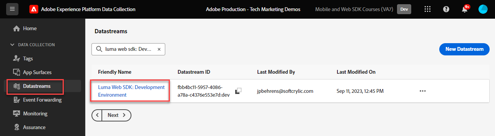

# 使用Platform Web SDK設定Audience Manager

了解如何使用 Adob&#x200B;&#x200B;e Experience Platform Web SDK 設定 Adob&#x200B;&#x200B;e Audience Manager ，並使用 cookie 目標驗證實施。

[Adobe Audience Manager](https://experienceleague.adobe.com/en/docs/audience-manager)為Adobe Experience Cloud解決方案，提供收集網站訪客之商業相關資訊、建立可行銷區段，以及將目標定位廣告和內容提供給適當對象所需的一切。

## 學習目標

在本課程結束時，您將能夠：

* 設定資料流以啟用Audience Manager
* 在Audience Manager中啟用Cookie目的地
* 透過確認具有Adobe Experience Platform Debugger的對象資格來驗證Audience Manager實施

## 先決條件

若要完成本課程，您必須先：

* 完成本教學課程之初始設定和標籤設定區段中先前的課程。
* 擁有Adobe Audience Manager的存取權，以及建立、讀取和寫入特徵、區段和目的地的適當許可權。 如需詳細資訊，請檢閱[Audience Manager的角色型存取控制](https://experienceleague.adobe.com/en/docs/audience-manager-learn/tutorials/setup-and-admin/user-management/setting-permissions-with-role-based-access-control)。

## 設定資料串流

使用Platform Web SDK的Audience Manager實作與使用[伺服器端轉送(SSF)](https://experienceleague.adobe.com/en/docs/analytics/admin/admin-tools/manage-report-suites/edit-report-suite/report-suite-general/server-side-forwarding/ssf)的實作不同。 伺服器端轉送會將Adobe Analytics請求資料傳遞給Audience Manager。 Platform Web SDK實作會將傳送至PlatformEdge Network的XDM資料傳遞給Audience Manager。 已在資料流中啟用Audience Manager：

1. 移至[資料彙集](https://experience.adobe.com/#/data-collection){target="blank"}介面
1. 在左側導覽中，選取&#x200B;**[!UICONTROL 資料串流]**
1. 選取先前建立的`Luma Web SDK: Development Environment`資料流

   

1. 選取&#x200B;**[!UICONTROL 新增服務]**
   
1. 選取&#x200B;**[!UICONTROL Adobe Audience Manager]**&#x200B;做為&#x200B;**[!UICONTROL 服務]**
1. 確認選取了&#x200B;**[!UICONTROL 已啟用Cookie目的地]**&#x200B;和&#x200B;**[!UICONTROL 已啟用URL目的地]**
1. 選取&#x200B;**[!UICONTROL 儲存]**
   

## 建立資料來源

接下來，建立[資料Source](https://experienceleague.adobe.com/en/docs/audience-manager/user-guide/features/data-sources/datasources-list-and-settings)，這是在Audience Manager中組織資料的基本工具：

1. 移至[Audience Manager](https://experience.adobe.com/#/audience-manager/)介面
1. 從頂端導覽中選取&#x200B;**[!UICONTROL 對象資料]**
1. 從下拉式功能表中選取&#x200B;**[!UICONTROL 資料來源]**
1. 從「資料來源」頁面頂端選取&#x200B;**[!UICONTROL 新增]**&#x200B;按鈕

   

1. 為資料Source提供易記名稱和說明。 對於初始設定，您可以為此`Platform Web SDK tutorial`命名。
1. 將&#x200B;**[!UICONTROL ID型別]**&#x200B;設定為&#x200B;**[!UICONTROL Cookie]**
1. 在&#x200B;**[!UICONTROL 資料匯出控制]**&#x200B;區段中，選取&#x200B;**[!UICONTROL 無限制]**

   

1. **[!UICONTROL 儲存]**&#x200B;資料Source

## 建立特徵

儲存資料Source後，請設定[特徵](https://experienceleague.adobe.com/en/docs/audience-manager/user-guide/features/traits/traits-overview)。 特徵是Audience Manager中一或多個訊號的組合。 為首頁訪客建立特徵。

>[!NOTE]
>
>所有XDM資料都會傳送至Audience Manager （如果在資料流中啟用），不過資料可能需要24小時才能在「未使用的訊號」報表中使用。 為您要立即在Audience Manager中使用的XDM資料建立明確的特徵，如本練習所述。

1. 選取&#x200B;**[!UICONTROL 對象資料]** > **[!UICONTROL 特徵]**
1. 選取&#x200B;**[!UICONTROL 新增]** > **[!UICONTROL 規則型]**&#x200B;特徵

   

1. 為您的特徵提供易記的名稱和說明，`Luma homepage view`
1. 選取您在上一節建立的&#x200B;**[!UICONTROL 資料Source]**。
1. **[!UICONTROL 選取資料夾]**，以便在右側的窗格中儲存您的特徵。 您可以選取現有父資料夾旁的+圖示&#x200B;**&#x200B;**&#x200B;來建立資料夾。 您可以命名這個新資料夾`Platform Web SDK tutorial`。
1. 展開&#x200B;**[!UICONTROL 特徵運算式]**&#x200B;插入號並選取&#x200B;**[!UICONTROL 運算式產生器]**&#x200B;您必須提供表示首頁造訪的索引鍵值配對。
1. 開啟[Luma首頁](https://luma.enablementadobe.com/content/luma/us/en.html) （對應至您的標籤屬性）和&#x200B;**Adobe Experience Platform Debugger**，然後重新整理頁面。
1. 檢視Platform Web SDK的網路要求和事件詳細資訊，以尋找首頁的索引鍵和名稱值。
   
1. 返回Audience ManagerUI中的運算式產生器，並輸入索引鍵為&#x200B;**`web.webPageDetails.name`**&#x200B;和&#x200B;**`content:luma:us:en`**&#x200B;的值。 此步驟可確保您每次載入首頁時都會引發特徵。
1. **[!UICONTROL 儲存]**&#x200B;特徵。

## 建立區段

接下來的步驟是建立&#x200B;**區段**&#x200B;並將您新定義的特徵指派給此區段。

1. 在頂端導覽中選取&#x200B;**[!UICONTROL 對象資料]**，然後選取&#x200B;**[!UICONTROL 區段]**
1. 在頁面左上方選取「**[!UICONTROL 新增]**」以開啟區段產生器
1. 為您的區段提供易記的名稱和說明，例如`Platform Web SDK - Homepage visitors`
1. **[!UICONTROL 選取您的區段儲存在右窗格中的資料夾]**。 您可以選取現有父資料夾旁的+圖示&#x200B;**&#x200B;**&#x200B;來建立資料夾。 您可以命名這個新資料夾`Platform Web SDK tutorial`。
1. 新增整合程式碼，在此例中是隨機數字集。
1. 在&#x200B;**[!UICONTROL 資料Source]**&#x200B;區段中，選取&#x200B;**[!UICONTROL Audience Manager]**&#x200B;以及您先前建立的資料來源
1. 展開&#x200B;**[!UICONTROL 特徵]**&#x200B;區段並搜尋您建立的特徵
1. 選取&#x200B;**[!UICONTROL 新增特徵]**。
1. 選取頁面底部的&#x200B;**[!UICONTROL 儲存]**

   

   

## 建立目的地

接下來，使用&#x200B;**目的地產生器**&#x200B;建立&#x200B;**Cookie型目的地**。 目的地產生器可讓您建立和管理Cookie、URL和伺服器對伺服器目的地。

1. 在頂端導覽的&#x200B;**對象資料**&#x200B;功能表中選取&#x200B;**[!UICONTROL 目的地]**，以開啟「目的地產生器」
1. 選取&#x200B;**[!UICONTROL 建立目的地]**
1. 輸入名稱和描述，`Platform Web SDK tutorial`
1. 作為&#x200B;**[!UICONTROL 類別]**，請選取&#x200B;**[!UICONTROL 自訂]**
1. 以&#x200B;**[!UICONTROL Type]**&#x200B;形式選取&#x200B;**[!UICONTROL Cookie]**

   

1. 開啟&#x200B;**[!UICONTROL 設定]**&#x200B;區段以輸入有關您的Cookie目的地的詳細資料
1. 為您的Cookie提供易記名稱`platform_web_sdk_tutorial`
1. 作為&#x200B;**[!UICONTROL Cookie網域]**，新增您計畫整合之網站的網域，在教學課程中輸入Luma網域`luma.enablementadobe.com`
1. 作為&#x200B;**[!UICONTROL Publish資料至]**&#x200B;選項，請選取&#x200B;**[!UICONTROL 僅選取選取的網域]**
1. 選取您的網域（如果尚未新增）
1. 以&#x200B;**[!UICONTROL 資料格式]**&#x200B;形式選取&#x200B;**[!UICONTROL 單一金鑰]**，並為您的Cookie指定一個金鑰。 在本教學課程中，請使用`segment`作為索引鍵值。
1. 最後，選取&#x200B;**[!UICONTROL 儲存]**&#x200B;以儲存目的地組態詳細資料。

   

<!--
   

   
-->

1. 在&#x200B;**[!UICONTROL 區段對應]**&#x200B;區段中，使用&#x200B;**[!UICONTROL 搜尋並新增區段]**&#x200B;功能來搜尋您先前建立的`Platform Web SDK - Homepage visitors`，並選取&#x200B;**[!UICONTROL 新增]**。

1. 新增區段後，快顯視窗隨即開啟，您必須提供Cookie的預期值。 對於此練習，請輸入「hpvisitor」值。

1. 選取&#x200B;**[!UICONTROL 儲存]**

1. 選取&#x200B;**[!UICONTROL 完成]**
   

區段對應期間需要數小時才能啟用。 完成後，您可以重新整理Audience Manager介面，並看到&#x200B;**對應的區段**&#x200B;清單已更新。

## 驗證區段

在最初建立區段數小時後，您可以驗證其是否正常運作。

首先，確認您符合區段的資格

1. 開啟[Luma示範網站首頁](https://luma.enablementadobe.com/content/luma/us/en.html)，並使其對應至您的標籤屬性，以符合您新建立區段的資格。
1. 開啟瀏覽器的&#x200B;**開發人員工具** > **網路**&#x200B;標籤
1. 使用`interact`做為文字篩選條件來篩選至Platform Web SDK請求
1. 選取通話並開啟&#x200B;**預覽**&#x200B;標籤以檢視回應詳細資料
1. 展開&#x200B;**裝載**&#x200B;以檢視預期的Cookie詳細資料(如先前在Audience Manager中所設定)。 在此範例中，您會看到預期的Cookie名稱`platform_web_sdk_tutorial`。

   

1. 開啟&#x200B;**應用程式**&#x200B;標籤，然後從&#x200B;**儲存空間**&#x200B;功能表開啟&#x200B;**Cookie**。
1. 選取&#x200B;**`https://luma.enablementadobe.com`**&#x200B;網域，並確認您的Cookie已正確寫入清單中

   

最後，您應該在Audience Manager介面中開啟區段，並確定&#x200B;**區段母體**&#x200B;已增加：

現在您已完成本課程，應該能夠瞭解Platform Web SDK如何將資料傳遞至Audience Manager，以及如何透過Cookie目的地設定區段特定的第一方Cookie。

[下一步： ](setup-target.md)

>[!NOTE]
>
>感謝您投入時間學習Adobe Experience Platform Web SDK。 如果您有任何疑問、想分享一般意見或有關於未來內容的建議，請在這篇[Experience League社群討論貼文](https://experienceleaguecommunities.adobe.com/t5/adobe-experience-platform-data/tutorial-discussion-implement-adobe-experience-cloud-with-web/td-p/444996)上分享
