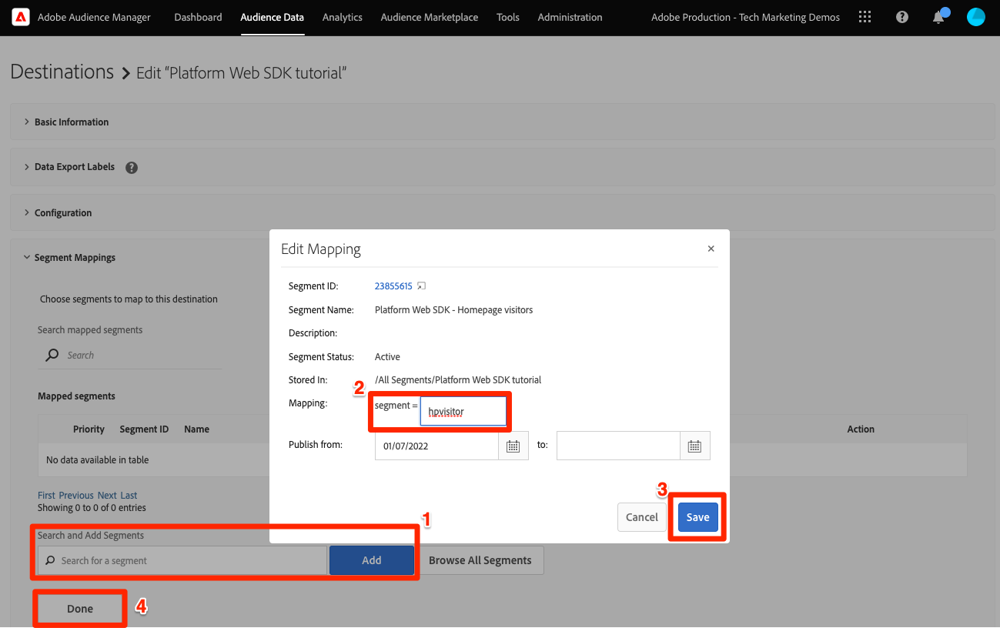

# 使用Platform Web SDK設定Audience Manager

了解如何使用Platform Web SDK設定Adobe Audience Manager，以及使用Cookie目的地驗證實作。

[Adobe Audience Manager](https://experienceleague.adobe.com/docs/audience-manager.html) 是Adobe Experience Cloud解決方案，提供收集網站訪客之商業相關資訊、建立可行銷區段，以及將目標廣告和內容提供給適當對象所需的一切。

## 學習目標

在本課程結束時，您將能夠：

* 設定資料流以啟用Audience Manager
* 啟用Audience Manager中的Cookie目的地
* 使用Adobe Experience Platform Debugger確認對象資格以驗證Audience Manager實作

## 先決條件

若要完成本課程，您必須先：

* 完成本教學課程的「初始設定」和「標籤設定」章節中的先前課程。
* 擁有Adobe Audience Manager的存取權，以及建立、讀取和寫入特徵、區段和目的地的適當權限。 欲知更多資訊，請查閱 [Audience Manager的基於角色的訪問控制](https://experienceleague.adobe.com/docs/audience-manager-learn/tutorials/setup-and-admin/user-management/setting-permissions-with-role-based-access-control.html?lang=en).

## 設定資料流

使用Platform Web SDK的Audience Manager實作與使用的實作不同 [伺服器端轉送(SSF)](https://experienceleague.adobe.com/docs/analytics/admin/admin-tools/server-side-forwarding/ssf.html?lang=zh-Hant). 伺服器端轉送會將Adobe Analytics要求資料傳遞至Audience Manager。 Platform Web SDK實作會將傳送至Platform Edge Network的XDM資料傳遞至Audience Manager。 Audience Manager在資料流中啟用：

1. 前往 [資料收集](https://experience.adobe.com/#/data-collection){target=&quot;blank&quot;}介面
1. 在左側導覽列中，選取 **[!UICONTROL 資料流]**
1. 選取先前建立的 `Luma Web SDK` 資料流

   

1. 選擇 **[!UICONTROL 添加服務]**

   
1. 選擇 **[!UICONTROL Adobe Audience Manager]** 作為 **[!UICONTROL 服務]**
1. 確認 **[!UICONTROL Cookie目的地已啟用]** 和 **[!UICONTROL 已啟用URL目的地]** 已選取
1. 選擇 **[!UICONTROL 儲存]**

   

## 建立資料來源

接下來，建立 [資料來源](https://experienceleague.adobe.com/docs/audience-manager/user-guide/features/data-sources/datasources-list-and-settings.html?lang=en)，此為在Audience Manager內組織資料的基本工具：

1. 前往 [Audience Manager](https://experience.adobe.com/#/audience-manager/) 介面
1. 選擇 **[!UICONTROL 對象資料]** 從頂端導覽列
1. 選取 **[!UICONTROL 資料來源]** 從下拉式功能表
1. 選取 **[!UICONTROL 新增]** 按鈕（位於「資料來源」頁面頂端）

   

1. 為資料來源提供好記的名稱和說明。 對於初始設定，您可以為此命名`Platform Web SDK tutorial`.
1. 設定 **[!UICONTROL ID類型]** to **[!UICONTROL Cookie]**
1. 在 **[!UICONTROL 資料匯出控制]** 部分，選擇 **[!UICONTROL 無限制]**

   

1. **[!UICONTROL 儲存]** 資料來源

## 建立特徵

儲存資料來源後，請設定 [特徵](https://experienceleague.adobe.com/docs/audience-manager/user-guide/features/traits/traits-overview.html?lang=en). 特徵是Audience Manager中一或多個訊號的組合。 為首頁訪客建立特徵。

>[!NOTE]
>
>如果資料流中已啟用，所有XDM資料都會傳送至Audience Manager，但資料可能需要24小時，直到「未使用的訊號」報表中有可用為止。 針對您要立即在Audience Manager中使用的XDM資料，建立明確特徵（如本練習所述）。

1. 選擇 **[!UICONTROL 對象資料]** >  **[!UICONTROL 特徵]**
1. 選擇 **[!UICONTROL 新增]** >  **[!UICONTROL 規則型]** 特徵

   

1. 為您的特徵命名好記，並提供說明， `Luma homepage view`
1. 選取 **[!UICONTROL 資料來源]** 您在上一節中建立。
1. **[!UICONTROL 選擇資料夾]** 在右窗格中儲存特徵。 建立資料夾的方法 **選取+圖示** 在現有父資料夾旁邊。 您可以為此新資料夾命名 `Platform Web SDK tutorial`.
1. 展開 **[!UICONTROL 特徵運算式]** 脫字元號與選取 **[!UICONTROL 運算式產生器]** 您必須提供表示首頁造訪的索引鍵值組。
1. 開啟 [Luma首頁](https://luma.enablementadobe.com/content/luma/us/en.html) （對應至您的標籤屬性）和 **Platform Web SDK除錯程式** 並重新整理頁面。
1. 查看Platform Web SDK的網路請求和事件詳細資訊，以尋找首頁的索引鍵和名稱值。
   
1. 返回Audience ManagerUI中的運算式產生器，並輸入索引鍵為 **`web.webPageDetails.name`** 和 **`content:luma:us:en`**. 此步驟可確保您在每次載入首頁時都觸發特徵。
1. **[!UICONTROL 儲存]** 特徵。

## 建立區段

下一步是建立 **區段**，並將您新定義的特徵指派給此區段。

1. 選擇 **[!UICONTROL 對象資料]** 在頂端導覽列中選取 **[!UICONTROL 區段]**
1. 選擇 **[!UICONTROL 新增]** 在頁面左上角以開啟區段產生器
1. 為您的區段提供好記的名稱和說明，例如 `Platform Web SDK - Homepage visitors`
1. **[!UICONTROL 選擇資料夾]** 區段會儲存在右側窗格中。 建立資料夾的方法 **選取+圖示** 在現有父資料夾旁邊。 您可以為此新資料夾命名 `Platform Web SDK tutorial`.
1. 新增整合代碼，此例中為隨機數字集。 1.在 **[!UICONTROL 資料來源]** 部分，選擇 **[!UICONTROL Audience Manager]** 和您先前建立的資料來源
1. 展開 **[!UICONTROL 特徵]** 區段，並搜尋您建立的特徵
1. 選擇 **[!UICONTROL 新增特徵]**.
1. 選擇 **[!UICONTROL 儲存]** 在頁面底部

   

   

## 建立目的地

接下來，建立 **Cookie型目的地** 使用 **目的地產生器**. 目的地產生器可讓您建立和管理Cookie、URL及伺服器對伺服器目的地。

1. 開啟「目的地產生器」，方法是選取 **[!UICONTROL 目的地]** 在 **對象資料** 功能表
1. 選擇 **[!UICONTROL 建立目的地]**
1. 輸入名稱和說明， `Platform Web SDK tutorial`
1. 作為 **[!UICONTROL 類別]**，選取 **[!UICONTROL 自訂]**
1. 作為 **[!UICONTROL 類型]**，選取 **[!UICONTROL Cookie]**

   

1. 開啟 **[!UICONTROL 設定]** 區段，輸入cookie目的地的詳細資訊
1. 為Cookie命名好記， `platform_web_sdk_tutorial`
1. 作為 **[!UICONTROL Cookie網域]**，新增您計畫進行整合之網站的網域，以供教學課程輸入Luma網域時使用， `luma.enablementadobe.com`
1. 作為 **[!UICONTROL 將資料發佈至]** 選項，選擇 **[!UICONTROL 僅選定域]**
1. 若尚未新增，請選取您的網域
1. 作為 **[!UICONTROL 資料格式]**，選取 **[!UICONTROL 單鍵]** 並給Cookie一個金鑰。 本教學課程使用 `segment` 作為鍵值。
1. 最後，選取 **[!UICONTROL 儲存]** 儲存目標配置詳細資訊。

   

<!--
   

   
-->

1. 在 **[!UICONTROL 區段對應]** 區段，請使用 **[!UICONTROL 搜尋和新增區段]** 功能來搜尋您先前建立的 `Platform Web SDK - Homepage visitors` 選取 **[!UICONTROL 新增]**.

1. 新增區段後，快顯視窗隨即開啟，您必須為Cookie提供預期值。 在本練習中，輸入「hpvisitor」值。

1. 選擇 **[!UICONTROL 儲存]**

1. 選擇 **[!UICONTROL 完成]**

   

區段對應期間需要數小時才能啟動。 完成後，您可以重新整理Audience Manager介面，並查看 **對應的區段** 清單已更新。

## 驗證區段

初次建立區段後幾小時，您可以驗證其是否正常運作。

首先，確認您可以符合區段資格

1. 開啟 [Luma示範網站首頁](https://luma.enablementadobe.com/content/luma/us/en.html) 並對應至您的標籤屬性，以符合新建立區段的資格。
1. 開啟瀏覽器 **開發人員工具**  > **網路** 標籤
1. 使用篩選至Platform Web SDK請求 `interact` 作為文本篩選器
1. 選取呼叫並開啟 **預覽** 索引標籤來檢視回應詳細資訊
1. 展開 **裝載** 檢視預期的cookie詳細資料，如先前在Audience Manager中設定。 在此範例中，您會看到預期的Cookie名稱 `platform_web_sdk_tutorial`.

   

1. 開啟 **應用程式** 標籤，然後開啟 **Cookie** 從 **儲存** 功能表。
1. 選取 **`https://luma.enablementadobe.com`** 網域，並確認清單中已適當寫入您的cookie

   

最後，您應在Audience Manager介面中開啟區段，並確定 **區段母體** 已增加：

完成本課程後，您應該就能了解Platform Web SDK如何將資料傳遞至Audience Manager，並可以透過Cookie目的地設定區段專用的第一方Cookie。

[下一個： ](setup-target.md)

>[!NOTE]
>
>感謝您花時間學習Adobe Experience Platform Web SDK。 如果您有任何疑問、想要分享一般意見，或對未來內容有任何建議，請就此分享 [Experience League社群討論貼文](https://experienceleaguecommunities.adobe.com/t5/adobe-experience-platform-launch/tutorial-discussion-implement-adobe-experience-cloud-with-web/td-p/444996)
