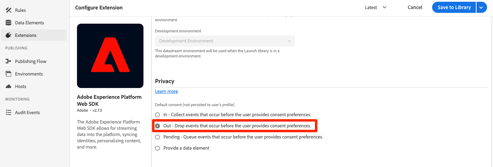

# 使用Platform Web SDK設定同意

了解如何配置Experience PlatformWeb SDK標籤擴充功能的隱私權設定。 根據訪客與來自同意管理平台(CMP)橫幅的互動來設定同意。

>[!NOTE]
> 
>為了示範，本教學課程使用 [克拉羅](https://heyklaro.com/) 作為CMP。 歡迎您繼續使用Klaro或您與網站搭配使用的CMP。


## 學習目標

在本課程結束時，您可以：

* 使用標籤載入CMP
* 在Experience PlatformWeb SDK標籤擴充功能中設定隱私權設定
* 根據訪客的動作設定Experience PlatformWeb SDK的同意

## 先決條件

您應熟悉標籤，以及使用Experience Platform偵錯工具建立規則、資料元素、建置程式庫至環境，以及切換標籤程式庫的步驟。

開始設定隱私權設定及建立同意設定規則之前，請確定您已將同意管理平台指令碼插入網站且運作正常。 CMP可在網站開發人員的協助下直接載入原始碼中，或透過標籤本身載入。 這一教訓證明了後一種方法。
>[!NOTE]
> 
>1. 組織可使用同意管理平台（或CMP），在從網站和應用程式等線上來源收集、共用或銷售訪客資料前，依法記錄及管理訪客的同意選擇。
>
>2. 建議的CMP插入方法是直接在標籤管理程式指令碼之前透過原始碼。


### 配置Klaro

在跳入標籤設定之前，請先深入了解本教學課程Klaro中使用的同意管理平台。

1. 瀏覽 [克拉羅](https://heyklaro.com/) 並設定帳戶。
1. 前往 **隱私權管理員** 並根據指示建立例項。
1. 使用 **整合代碼** 將Klaro插入您的標籤屬性（下個練習會提供相關指示）。
1. 略過 **掃描** 區段，因為它會偵測Luma示範網站上以硬式編碼撰寫的標籤屬性，而非您為本教學課程建立的屬性。
1. 新增服務，稱為 `aep web sdk` 並開啟 **服務預設狀態**. 開啟後，預設同意值為 `true`，否則 `false`. 當您想要決定網路應用程式的預設同意狀態（在訪客同意前）時，此設定很實用。 例如：
   * 若為CCPA，預設同意通常設為 `true`. 您將參考此案例為 **隱含的選擇加入** 本教學課程整整本
   * 對於GDPR，預設同意通常設為 `false`. 您將參考此案例為 **隱含的選擇退出** 在本教學課程中。

<!--
    This consent value can be verified by returning the JavaScript object ```klaro.getManager().consents``` in the browser's developer console.
-->
    >[!NOTE]
    >
    >通常，上述步驟由負責處理CMP的團隊或個人完成並處理，如OneTrust或TrustArc。

## 插入CMP

>[!WARNING]
>
>實作同意管理平台的最佳實務通常是載入CMP _befor_ 載入您的標籤管理程式。 為方便閱讀本教學課程，您將載入CMP _with_ 標籤管理程式。 本課程旨在說明如何使用Platform Web SDK中的同意功能，且不應作為指南，以正確設定Klaro或任何其他CMP。


現在，完成Klaro的設定後，請使用下列設定建立標籤規則：

* [!UICONTROL 名稱]: `all pages - library load - Klaro`
* [!UICONTROL 事件]: [!UICONTROL 程式庫已載入（頁面頂端）] with [!UICONTROL 進階選項] > [!UICONTROL 順序] 設為1
* [!UICONTROL 動作]: [!UICONTROL 自訂程式碼], [!UICONTROL 語言]:HTML載入CMP指令碼。


自訂程式碼區塊看起來應類似下列：


現在，將此規則儲存並建置至您的開發程式庫，將標籤程式庫從Luma網站切換至您自己的網站，以驗證是否顯示同意橫幅。 您應該會在網站上看到CMP橫幅，如下所示。 若要檢查目前訪客的同意權限，您可以在瀏覽器主控台上使用下列程式碼片段。

```javascript
    klaro.getManager().consents 
```


若要進入除錯模式，請在Adobe Experience Platform偵錯工具中使用下列核取方塊。


此外，您在進行本教學課程時，可能必須多次清除Cookie和本機儲存，因為訪客的同意值會儲存在該處。 您只需依下列方式執行：


## 同意案例

GDPR、CCPA等隱私權行為，在您架構同意實作的方式中，起著至關重要的作用。 在本課程中，您將探討訪客如何根據兩項最突出的隱私權法案與同意橫幅互動。


### 方案1:隱含選擇加入

隱含的選擇加入表示企業在收集資料前不需要取得訪客的同意（或「選擇加入」），因此，依預設，網站的所有訪客都會被視為選擇加入。 不過，訪客可以透過同意橫幅拒絕Cookie來選擇退出。 此使用案例類似CCPA。

現在，您將針對此情境設定及實施同意：

1. 在 **[!UICONTROL 隱私權]** Experience PlatformWeb SDK標籤擴充功能的區段，請確定  **[!UICONTROL 預設同意]** 設為 **[!UICONTROL 在]** :


   

   >[!NOTE]
   > 
   >對於動態解決方案，選取「提供資料元素」選項，然後傳遞傳回值為 ```klaro.getManager().consents```
   >
   >如果將CMP插入原始碼中，則會使用此選項 *befor* 標籤內嵌程式碼，以便在Experience PlatformWeb SDK擴充功能開始載入前取得預設同意。 在我們的範例中，無法使用此選項，因為CMP載入了標籤，而非在標籤之前。


2. 儲存此變更並建置至您的標籤程式庫
3. 在Luma示範網站上載入您的標籤程式庫
4. 在Luma網站上啟用標籤除錯並重新載入頁面。 在瀏覽器的開發人員主控台中，您應該會看到defaultConsent等於 **[!UICONTROL 在]**
5. 透過此設定，Experience PlatformWeb SDK擴充功能會繼續提出網路要求，除非訪客決定拒絕Cookie並選擇退出：

   


如果訪客決定退出（拒絕追蹤Cookie），您必須將同意變更為 **[!UICONTROL 退出]**. 請依照下列步驟變更同意設定：

<!--
1. Create a data element to store the consent value of the visitor. Let's call it `klaro consent value`. Use the code snippet to create a custom code type data element:
    
    ```javascript
    return klaro.getManager().consents["aep web sdk"]
    ```

    


1. Create another custom code data element, `consent confirmed`, with the following snippet which returns ```true``` only after a visitor confirms consent:

    
    ```javascript
    return klaro.getManager().confirmed
    ```

    
-->

1. 建立當訪客點按時觸發的規則 **我拒絕了**.  將此規則命名為： `all pages - click consent banner - set consent "out"`

1. 作為 **[!UICONTROL 事件]**，使用 **[!UICONTROL 按一下]** on **[!UICONTROL 符合CSS選取器的元素]** `#klaro .cn-decline`

   

1. 現在，使用Experience PlatformWeb SDK, [!UICONTROL 設定同意] [!UICONTROL 動作類型] 將同意設為「out」：

   

1. 選擇 **[!UICONTROL 儲存至程式庫並建置]**:

   

現在，當訪客選擇退出時，以上方式設定的規則會引發，並將Web SDK同意設為 **[!UICONTROL 退出]**.

前往Luma示範網站，拒絕Cookie，並確認選擇退出後沒有觸發任何Web SDK請求，以驗證。

### 方案2:隱含的選擇退出


隱含的選擇退出表示依預設應將訪客視為選擇退出，且不應設定Cookie。 除非訪客決定透過同意橫幅接受Cookie以手動選擇加入，否則不應引發Web SDK請求。 您可能必須在GDPR適用的歐盟地區處理此類使用案例。

以下是如何設定隱含選擇退出案例的設定：

1. 在Klaro中，關閉 **服務預設狀態** 在 `aep web sdk` 服務並儲存更新的設定。

1. 在 **[!UICONTROL 隱私權]** Experience PlatformWeb SDK擴充功能的區段，將預設同意設定為 **[!UICONTROL 退出]** 或 **[!UICONTROL 待定]** 視需要。

   

1. **儲存** 標籤程式庫的更新設定並加以重建。

   透過此設定，Experience PlatformWeb SDK可確保除非同意權限變更為 **[!UICONTROL 在]**. 若訪客選擇加入，手動接受Cookie，便可能導致此情況發生。

1. 在Debugger中，確認Luma網站已對應至您的標籤屬性，且已開啟標籤主控台記錄功能。
1. 使用瀏覽器的開發人員控制台 **清除網站資料** in **應用程式** > **儲存**

1. 重新載入Luma網站，您應該會看到 `defaultConsent` 設為 **[!UICONTROL 退出]** 且未提出任何Web SDK請求

   

如果訪客決定選擇加入（接受追蹤Cookie），您必須變更同意，並將其設為 **[!UICONTROL 在]**. 以下是如何對規則執行此動作：

1. 建立當訪客點按時觸發的規則 **沒關係**.  將此規則命名為： `all pages - click consent banner - set consent "in"`

1. 作為 **[!UICONTROL 事件]**，使用 **[!UICONTROL 按一下]** on **[!UICONTROL 符合CSS選取器的元素]** `#klaro .cm-btn-success`

   

1. 使用Experience PlatformWeb SDK新增動作 [!UICONTROL 擴充功能], **[!UICONTROL 動作類型]** of **[!UICONTROL 設定同意]**, **[!UICONTROL 一般同意]** as **[!UICONTROL 在]**.

   

   有一點需要注意 [!UICONTROL 設定同意] 動作會是發出並建立身分的第一個要求。 因此，在第一個要求本身上同步身分可能很重要。 身分對應可新增至 [!UICONTROL 設定同意] 動作，透過傳遞身分類型資料元素。

1. 選擇 **[!UICONTROL 儲存至程式庫並建置]**:

   

1. **[!UICONTROL 儲存]** 規則並重建。

設定此規則後，事件收集應在訪客選擇加入時開始。


如需Web SDK中同意的詳細資訊，請參閱 [支援客戶同意偏好設定](https://experienceleague.adobe.com/docs/experience-platform/edge/consent/supporting-consent.html?lang=en).


如需 [!UICONTROL 設定同意] 動作，請參閱 [設定同意](https://experienceleague.adobe.com/docs/experience-platform/edge/extension/action-types.html?lang=en#set-consent).

[下一個： ](setup-event-forwarding.md)

>[!NOTE]
>
>感謝您花時間學習Adobe Experience Platform Web SDK。 如果您有任何疑問、想要分享一般意見，或對未來內容有任何建議，請就此分享 [Experience League社群討論貼文](https://experienceleaguecommunities.adobe.com/t5/adobe-experience-platform-launch/tutorial-discussion-implement-adobe-experience-cloud-with-web/td-p/444996)
