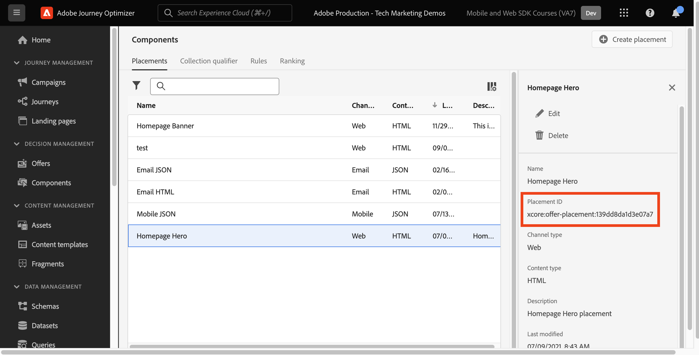

# 使用Platform Web SDK設定決定管理

瞭解如何使用Platform Web SDK實施Adobe Journey Optimizer的決策管理功能。 本指南說明基本的決策管理先決條件、設定的詳細步驟，並深入探討以忠誠度狀態為中心的使用案例。

依照本教學課程指示，Journey Optimizer使用者已整備使用決策管理功能，加強其客戶互動的個人化與關聯性。


## 學習目標

在本課程結束時，您能夠：

* 掌握Adobe Journey Optimizer中決策管理的核心概念，及其與Adobe Experience Platform Web SDK的整合。

* 瞭解為Offer Decisioning設定網頁SDK的逐步程式，以確保與Journey Optimizer緊密整合。

* 探索以忠誠度狀態優惠為中心的詳細使用案例，深入瞭解如何有效建立和管理優惠、決定和位置。

* 了解決策管理框架中的基本術語及其影響。

* 了解決定規則、集合限定詞和遞補優惠方案在向正確使用者提供正確優惠方案中的重要性。

* 深入探討進階主題，例如模擬和自訂事件資料收集，讓您能夠測試、驗證及增強優惠方案傳送機制。

## 先決條件

若要完成本節中的課程，您必須先：

* 確保您的組織可以存取Adobe Journey Optimizer Ultimate (Journey Optimizer和Offer Decisioning)或Adobe Experience Platform和Offer Decisioning附加元件。

* 完成所有Platform Web SDK初始設定的課程。

* 為貴組織啟用Edge Decisioning。

* 瞭解如何設定刊登版位，以及在決策範圍JSON中例項化刊登版位和活動ID。

## 限制

Adobe Journey Optimizer目前不支援事件型選件。 如果您根據事件建立決定規則，則無法在優惠中套用它。

## 授予決策管理的存取權限

若要授與決策管理功能的存取權，您必須建立&#x200B;**產品設定檔**，並將對應許可權指派給使用者。 [在本節](https://experienceleague.adobe.com/en/docs/journey-optimizer/using/access-control/privacy/high-low-permissions#decisions-permissions)中進一步瞭解管理Journey Optimizer使用者和許可權。

## 設定資料串流

必須先在&#x200B;**資料流**&#x200B;設定中啟用Offer Decisioning，Platform Web SDK才能傳遞任何決定管理活動。

若要在資料流中設定Offer Decisioning：

1. 移至[資料彙集](https://experience.adobe.com/#/data-collection)介面。

1. 在左側導覽中，選取&#x200B;**資料串流**。

1. 選取先前建立的Luma Web SDK資料流。

   

1. 選取&#x200B;**Adobe Experience Platform服務**&#x200B;中的&#x200B;**編輯**。

   

1. 勾選&#x200B;**Offer Decisioning**&#x200B;方塊。

   

1. 選取「**儲存**」。

這可確保&#x200B;**Adobe Experience Platform Edge**&#x200B;正確處理Journey Optimizer的傳入事件。

## 設定SDK以進行決定管理

視您的Web SDK實作型別而定，決策管理需要其他SDK步驟。 有兩個可用選項可設定SDK以用於決策管理。

* SDK獨立安裝
   1. 使用您的`sendEvent`設定`decisionScopes`動作。

      ```javascript
      alloy("sendEvent", {
         ...
         "decisionScopes": [
            "[DECISION SCOPE 1]",
            "[DECISION SCOPE 2]"
         ]
      })
      ```

* SDK標籤安裝
   1. 前往資料收集介面。

   1. 在左側導覽中，選取&#x200B;**標籤**。

      

   1. 選取&#x200B;**標籤屬性**。

   1. 建立您的&#x200B;**規則**。
      * 新增Platform Web SDK **傳送事件動作**，並將相關的`decisionScopes`新增到該動作的設定。

   1. 建立並發佈包含所有已設定之相關&#x200B;**規則**、**資料元素**&#x200B;和&#x200B;**擴充功能**&#x200B;的&#x200B;**資料庫**。

## 術語

首先，您應該了解決定管理介面中使用的術語。

* **上限**：指定選件出現頻率的限制。 兩種型別：
   * 上限：選件可在目標對象中顯示的最大次數。
   * 設定檔上限：可向特定使用者顯示選件的次數。
* **集合**：依行銷人員設定之特定條件分組的優惠方案子集，例如，優惠方案類別。
* **決定**：指定優惠選擇的邏輯。
* **決定規則**：優惠的限制，可找出使用者的資格。
* **合格優惠方案**：符合預先設定條件約束且可向使用者顯示的優惠方案。
* **決定管理**：使用商業邏輯和決定規則來製作及分配個人化優惠的系統。
* **遞補優惠**：當使用者不符合集合中任何優惠的資格時，便會顯示預設優惠。
* **選件**：行銷訊息，具有決定其檢視者的潛在適用性規則。
* **優惠資料庫**：管理優惠、決定和相關規則的中央存放庫。
* **個人化優惠方案**：根據資格限制量身打造的自訂行銷訊息。
* **位置**：向使用者顯示優惠方案的設定或情境。
* **優先順序**：優惠方案的排名量度，會考量資格和上限等各種限制。
* **代表**：頻道特定資訊，例如，指導優惠方案顯示的位置或語言。

## 使用案例概述 — 忠誠度獎勵

在本課程中，您將實作一個熟客獎勵使用案例範例，使用網頁SDK了解決策管理。

此使用案例可讓您更瞭解Journey Optimizer如何運用集中式優惠資料庫和決定管理決策引擎，為客戶提供最佳優惠。

>[!NOTE]
>
> 由於本教學課程的目標是實施者，因此請注意，本課程涉及Journey Optimizer的大量介面工作。 雖然這類介面任務通常由行銷人員處理，但對於實作者而言，將insight帶入流程可能有所助益，即使他們從長遠而言並不負責決策管理行銷活動的建立。

## 元件

在開始建立優惠方案之前，您必須定義數個必要元件。

### 建立熟客方案位置

**位置**&#x200B;是用來展示優惠方案的容器。 在此範例中，您會在Luma網站頂端建立版位。

可在&#x200B;**元件**&#x200B;功能表中存取位置清單。 篩選器可協助您根據特定頻道或內容擷取版位。


若要建立位置，請執行下列步驟：

1. 按一下&#x200B;**建立位置**。

   

1. 定義位置的屬性：
   * **名稱**：位置名稱。 呼叫範例位置&#x200B;*&#39;首頁橫幅&#39;*。
   * **頻道型別**：使用位置的頻道。 讓我們使用&#x200B;*&#39;Web&#39;*，因為優惠方案顯示在Luma網站上。
   * **內容型別**：允許刊登版位顯示的內容型別：文字、HTML、影像連結或JSON。 您可以將&#x200B;*&#39;HTML&#39;*&#x200B;用於選件。
   * **描述**：位置的描述（選擇性）。

   

1. 按一下&#x200B;**儲存**。
1. 位置建立後，會顯示在「位置」清單中。
1. 選取包含新版位的列，並記下版位ID，因為這在您的決定範圍內進行設定可能是必要的。

   

### 熟客狀態的決定規則

**決定規則**&#x200B;指定提供優惠的條件。 在此範例中，您會建立決定規則，以根據使用者的忠誠度狀態提供不同的優惠方案。

決定規則清單可在&#x200B;**元件**&#x200B;功能表中存取。

若要建立決定規則，請遵循下列步驟：

1. 瀏覽至&#x200B;**規則**&#x200B;標籤，然後按一下&#x200B;**建立規則**。

   

1. 讓我們命名第一個規則&#39;*金會員狀態規則*&#39;。 您可以使用XDM欄位來定義規則。 Adobe Experience Platform **區段產生器**&#x200B;是直覺式介面，可用來建立規則條件。

   

1. 按一下&#x200B;**儲存**&#x200B;以確認規則條件。
1. 新儲存的&#39;*金會員狀態規則*&#39;將顯示在&#x200B;**規則清單**&#x200B;中。 選取它以顯示其屬性。

   

1. 現在建立使用案例的剩餘熟客方案規則條件。


### 集合限定詞

**集合限定詞**&#x200B;可讓您在優惠資料庫中輕鬆組織和搜尋優惠。 在此範例中，您可將集合限定詞新增至「忠誠度獎勵」優惠方案，以改善優惠方案組織。

可在&#x200B;**元件**&#x200B;功能表中存取集合限定詞清單。

若要建立「熟客獎勵」收集限定詞，請遵循下列步驟：

1. 導覽至&#x200B;**集合限定詞**&#x200B;標籤，然後按一下&#x200B;**建立集合限定詞**。

   

1. 讓我們命名集合限定詞&#39;*忠誠度獎勵*&#39;

   

1. 新的集合限定詞現在應顯示在&#x200B;**集合限定詞**&#x200B;索引標籤中

## 產品建議

現在該建立忠誠獎勵優惠方案了。

可在&#x200B;**優惠方案**&#x200B;功能表中存取優惠方案清單。


### 建立不同忠誠度層級的優惠方案

首先建立不同Luma忠誠度等級的個人化優惠方案。

若要建立第一個&#x200B;**選件**，請遵循下列步驟：

1. 按一下&#x200B;**建立優惠**，然後選取&#x200B;**個人化優惠**。

1. 讓我們命名第一個優惠方案&#39;*Luma忠誠度等級 — 金級*&#39;。 您必須指定此優惠方案的開始/結束日期和時間。 您也應該將&#x200B;**集合限定詞** &#39;*忠誠度獎勵*&#39;與優惠方案建立關聯，好讓您在&#x200B;**優惠方案庫**&#x200B;內更好地組織組織。 之後，按一下&#x200B;**下一步**。

   

1. 現在您必須新增&#x200B;**代表**，以定義優惠方案的顯示位置。 讓我們選擇&#x200B;**網路頻道**。 讓我們也選擇您先前設定的&#39;*首頁橫幅*&#39; **位置**。 選取的&#x200B;**位置**&#x200B;為HTML型別，因此您可以使用&#x200B;**自訂**&#x200B;選項按鈕直接將HTML、JSON或TEXT內容新增到編輯器以建立選件。

   

1. 直接使用&#x200B;**運算式編輯器**&#x200B;編輯選件內容。 請記住，您可以新增HTML、JSON或TEXT內容至此版位。 請確定您根據內容型別，在編輯器底部選取正確的&#x200B;**模式**。 您也可以點選&#x200B;**驗證**&#x200B;以確保沒有錯誤。

   

1. 您也可以使用運算式編輯器來擷取儲存在Adobe Experience Platform中的屬性。 讓我們將設定檔的名字新增至優惠內容，以便更妥善地為1:1層級的忠誠會員進行個人化。

   

1. 新增條件約束，以僅顯示符合&#39;*金會員狀態規則*&#39;之設定檔的優惠。

   

1. 檢閱完您的優惠方案後，請按一下[完成]。**&#x200B;** 選取&#x200B;**儲存並核准**。

現在為各種Luma忠誠度層級建立其餘的優惠方案

### 遞補優惠

您仍想要為Luma網站的非Luma忠誠度訪客提供優惠方案。 若要這麼做，您可以為行銷活動設定&#x200B;**遞補優惠**。

若要建立遞補優惠，請依照下列步驟進行：

1. 按一下&#x200B;**建立選件**，然後選取&#x200B;**遞補選件**。
   <!--
      
   -->
1. 讓我們命名遞補優惠&#39;*非Luma忠誠度*&#39;。 您也可以將先前建立的&#x200B;**集合辨識符號**、&#39;*忠誠度獎勵*&#39;與遞補優惠建立關聯，以方便優惠方案組織。
   <!--
      
   -->
1. 將遞補選件內容新增至&#x200B;**運算式編輯器**。 請記住，您可以新增HTML、JSON或TEXT內容至此版位。 請確定您根據內容型別，在編輯器底部選取正確的&#x200B;**模式**。 您也可以點選&#x200B;**驗證**&#x200B;以確保沒有錯誤。
   <!--
      
   -->
1. 如果所有專案皆已正確設定，請按&#x200B;**完成**，然後按&#x200B;**儲存並核准**。
<!--
   
-->

## 決策

**決定**&#x200B;是優惠的容器，可依據目標挑選最適合客戶的優惠。

決定清單可在&#x200B;**優惠**&#x200B;功能表的&#x200B;**決定**&#x200B;標籤中使用。
<!--
   
-->

### 建立忠誠度優惠的決定

讓我們為Luma忠誠度獎勵使用案例建立決定。

若要建立決定，請遵循下列步驟：

1. 按一下&#x200B;**建立決定**。
   <!--
      
   -->
1. 讓我們呼叫決定&#39;*12月Luma熟客方案*&#39;。 選件應持續1個月，所以我們在這裡指定。
   <!--
      
   -->
1. 現在，您必須定義&#x200B;**決定範圍**。 首先，選取位置。 您可以使用先前建立的&#39;*首頁橫幅*&#39;。
   <!--
      
   -->
1. 接下來，您必須為決定範圍新增&#x200B;**評估准則**。 按一下&#x200B;**新增**，然後選擇先前建立的&#39;*忠誠度獎勵*&#39;**集合，其中包含所有要考量的忠誠度優惠。
   <!--
      
   -->
1. 在&#39;*忠誠度獎勵*&#39;集合中，您可以使用資格欄位，將優惠傳遞限製為Luma訪客的子集。 不過，針對此使用案例，您希望每位訪客都能收到其中一個選件。 請記住，您已為所有不忠誠的訪客設定&#x200B;**遞補優惠**。 將資格設為「無」。
   <!--
      
   -->
1. 此外，如果有多個優惠方案符合使用者/位置組合的資格，您可使用&#x200B;**排名方法**&#x200B;欄位來選取適用於每個Luma訪客的最佳優惠方案。 針對此使用案例，您可以使用&#x200B;**優惠方案優先順序**&#x200B;方法，此方法會使用優惠方案中定義的值來提供最佳優惠方案。
   <!--
      
   -->
1. 現在將&#x200B;**遞補優惠**&#x200B;新增至決定。 提醒，如果Luma訪客未歸入任何Luma忠誠度受眾，則遞補優惠是顯示給Luma訪客的預設優惠。 從&#39;*首頁橫幅*&#39;位置的可用遞補優惠清單中選取&#39;*非Luma忠誠度*&#39;。
   <!--
      
   -->
1. 在啟用決定之前，請先檢閱決定範圍、遞補優惠、預覽可用優惠，以及估計合格的設定檔。 一旦一切看起來正常，您可以按一下&#x200B;**完成**&#x200B;和&#x200B;**儲存並啟動**。
<!--
   
-->

## 模擬

最佳實務是驗證Luma忠誠度決策邏輯，確保將正確的優惠方案傳遞至正確的忠誠度對象。 您可以使用&#x200B;**測試設定檔**&#x200B;來執行此驗證。 同時，也建議您先透過測試設定檔來測試優惠方案的變更，然後再將新優惠方案版本推送至生產環境。

若要開始測試，請從&#x200B;**選件**&#x200B;功能表選取&#x200B;**模擬**&#x200B;標籤。

### 測試忠誠度優惠

1. 選取要用於模擬的測試設定檔。 按一下&#x200B;**管理設定檔**。 [若要建立或指定新的測試設定檔以進行優惠方案測試，請遵循本指南](https://experienceleague.adobe.com/en/docs/journeys/using/building-journeys/about-journey-building/creating-test-profiles#create-test-profiles-csv)。
   <!--
      
   -->
1. 將一個或多個測試設定檔新增到模擬中，並儲存您的選擇。 在使用案例測試中，您應該確保已為每個Luma忠誠度獎勵對象設定了測試設定檔。
   <!--
      
   -->
1. 選取要測試的決定範圍。 選取&#x200B;**新增決定範圍**。
   <!--
      
   -->
1. 選取先前建立的&#39;*首頁橫幅*&#39;位置。
   <!--
      
   -->
1. 會顯示可用的決定，選取先前建立的&#39;*12月Luma熟客方案*&#39;決定，然後按一下&#x200B;**新增**。
   <!--
      
   -->
1. 選取測試設定檔後，按一下&#x200B;**檢視結果**。 針對&#39;*12月Luma忠誠度優惠*&#39;決定，向選取的測試設定檔顯示最佳可用優惠。
   <!--
      
   -->
1. 選取不同的測試設定檔，然後按一下&#x200B;**檢視結果**。 理想情況下，您應該看到不同的模擬優惠方案，與測試設定檔的忠誠度等級相對應。

## 使用Adobe Experience Platform Debugger的決策管理驗證

適用於Chrome和Firefox的&#x200B;**Adobe Experience Platform Debugger**&#x200B;擴充功能會分析您的網頁，以識別Adobe Experience Cloud解決方案實作中的問題。

您可以在Luma網站上使用除錯工具，驗證生產環境中的決策邏輯。 忠誠獎勵使用案例啟動並執行後，此驗證是很好的做法，可確保所有專案皆已正確設定。

[在此使用指南瞭解如何在瀏覽器中設定除錯工具](https://experienceleague.adobe.com/en/docs/platform-learn/data-collection/debugger/overview)。

若要使用除錯工具開始驗證：

1. 導覽至包含優惠方案版位的Luma網頁。
   <!--
      
   -->
1. 在網頁上時，開啟&#x200B;**Adobe Experience Platform Debugger**。
   <!--
      
   -->
1. 瀏覽至&#x200B;**摘要**。 確認&#x200B;**資料串流識別碼**&#x200B;與您啟用Offer Decisioning的&#x200B;**Adobe資料彙集**&#x200B;中的&#x200B;**資料串流**&#x200B;相符。
   <!--
      
   -->
1. 在「**解決方案**」下，導覽至&#x200B;**Experience Platform Web SDK**。
   <!--
      
   -->
1. 在&#x200B;**組態**&#x200B;標籤中，開啟&#x200B;**啟用偵錯**。 這會啟用&#x200B;**Adobe Experience Platform Assurance**&#x200B;工作階段中工作階段的記錄功能。
   <!--
      
   -->
1. 接著，您可以使用各種Luma忠誠度帳戶登入網站，並使用除錯工具驗證傳送至&#x200B;**Adobe Experience Platform Edge網路**&#x200B;的請求。 應該在&#x200B;**Assurance**&#x200B;中擷取所有這些要求，以進行記錄檔追蹤。
<!--
   
-->

>[!NOTE]
>
>感謝您花時間學習Adobe Experience Platform Web SDK。 如果您有任何疑問、想分享一般意見或有關於未來內容的建議，請在這篇[Experience League社群討論貼文](https://experienceleaguecommunities.adobe.com/t5/adobe-experience-platform-data/tutorial-discussion-implement-adobe-experience-cloud-with-web/td-p/444996)上分享
