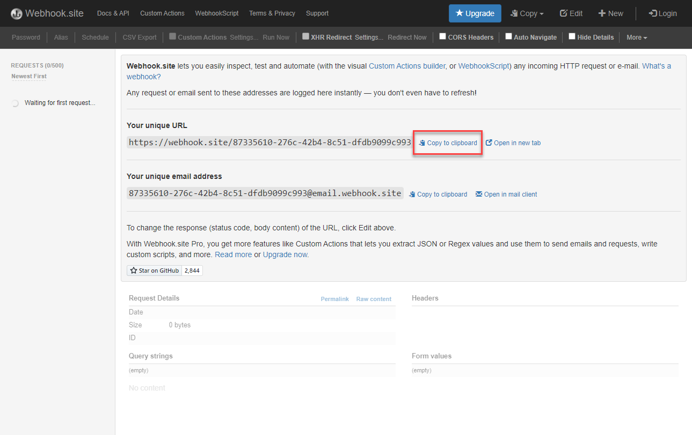

# 設定事件轉送屬性

了解如何使用Experience PlatformWeb SDK資料來使用事件轉送屬性。

事件轉送是「資料收集」中可用的新屬性類型。 事件轉送功能可讓您直接從Adobe Experience Platform邊緣網路（而非傳統的用戶端瀏覽器），將資料傳送給協力廠商、非Adobe廠商。 在 [事件轉送概觀](https://experienceleague.adobe.com/docs/experience-platform/tags/event-forwarding/overview.html?lang=en).

若要在Adobe Experience Platform中使用事件轉送，必須先使用下列三個選項中的一或多個，將資料傳送至Adobe Experience Platform邊緣網路：

* [Adobe Experience Platform Web SDK](overview.md)
* [Adobe Experience Platform Mobile SDK](https://aep-sdks.gitbook.io/docs/)
<!--* [Server-to-Server API](https://experienceleague.adobe.com/docs/audience-manager/user-guide/api-and-sdk-code/dcs/dcs-apis/dcs-s2s.html?lang=en)-->

>[!NOTE]
>Platform Web SDK和Platform Mobile SDK不需要透過標籤進行部署，但建議使用標籤來部署這些SDK。

完成本教學課程中的先前課程後，您應使用Web SDK將資料傳送至Platform Edge Network。 資料進入Platform Edge Network後，您就可以啟用事件轉送，並使用事件轉送屬性將資料傳送至非Adobe解決方案。

## 學習目標

在本課程結束時，您將能夠：

* 建立事件轉送屬性
* 將事件轉送屬性連結至Platform Web SDK資料流
* 了解標籤屬性資料元素和規則以及事件轉送屬性資料元素和規則之間的差異
* 建立事件轉送資料元素
* 設定事件轉送規則
* 驗證事件轉送屬性是否成功傳送資料

## 先決條件

* 包括事件轉發的軟體許可證。 事件轉送是資料收集的付費功能。 如需詳細資訊，請連絡您的Adobe帳戶團隊。
* 在您的Experience Cloud組織中啟用事件轉送。
* 事件轉送的使用者權限。 (輸入 [Admin Console](https://adminconsole.adobe.com/)，在Adobe Experience Platform Launch產品下方，[!UICONTROL 平台] > [!UICONTROL Edge] 全部 [!UICONTROL 屬性權利])。 一旦獲得授權，您應該會看到 [!UICONTROL 事件轉送] 在資料收集介面的左側導覽器中：
   

* Adobe Experience Platform Web或Mobile SDK，設定為傳送資料至邊緣網路。 您必須完成本教學課程的下列課程：

   * 初始配置

      * [設定權限](configure-permissions.md)
      * [設定XDM結構](configure-schemas.md)
      * [設定身分命名空間](configure-identities.md)
      * [設定資料流](configure-datastream.md)
   * 標籤設定

      * [安裝Web SDK擴充功能](install-web-sdk.md)
      * [建立資料元素](create-data-elements.md)
      * [建立標籤規則](create-tag-rule.md)
      * [使用Adobe Experience Platform Debugger驗證](validate-with-debugger.md)

## 建立事件轉送屬性

首先，請建立事件轉送屬性：

1. 開啟 [資料收集介面](https://experience.adobe.com/#/data-collection)
1. 選擇 **[!UICONTROL 事件轉送]** 從左側導覽
1. 選擇 **[!UICONTROL 新屬性]**.
   

1. 為屬性命名。在這種情況下 `Server-Side - Web SDK Course`

1. 選取「**[!UICONTROL 儲存]**」。
   

## 設定資料流

若要讓事件轉送使用您傳送至Edge網路的資料，您必須將新建立的事件轉送屬性連結至用於傳送資料至Adobe解決方案的相同資料流。

若要在資料流中設定Target:

1. 前往 [資料收集](https://experience.adobe.com/#/data-collection){target=&quot;blank&quot;}介面
1. 在左側導覽列中，選取 **[!UICONTROL 資料流]**
1. 選取先前建立的 `Luma Web SDK` 資料流

   

1. 選擇 **[!UICONTROL 添加服務]**

   
1. 選擇 **[!UICONTROL 事件轉送]** 作為 **[!UICONTROL 服務]**

1. 在 **[!UICONTROL 屬性ID]** 下拉式清單中，選取您為事件轉送屬性指定的名稱，在此案例中為 `Server-Side - Web SDK Course`

1. 在 **[!UICONTROL 環境ID]** 下拉式清單中，選取您要連結事件轉送環境至的標籤環境（在此例中為） `Development`

   >[!TIP]
   >
   >    若要將資料傳送至Adobe組織以外的事件轉送環境，請選取 **[!UICONTROL 手動輸入ID]** 並貼入ID。 建立事件轉送屬性時，會提供ID。

1. 選取「**[!UICONTROL 儲存]**」。

   

當您準備好透過發佈流程促銷您的變更時，請對測試和生產資料流重複這些步驟。

## 將資料從Platform Edge Network轉發到非Adobe解決方案

在本練習中，您將學習如何設定事件轉送資料元素、設定事件轉送規則，以及使用名為的第三方工具進行驗證 [Webhook.site](https://webhook.site/).

>[!NOTE]
>
>Webhook是一種半即時整合不同系統的方法。 [Webhook.site](https://webhook.site/) 是協力廠商工具，可讓您輕鬆檢查、測試和自動化（透過視覺化的自訂動作產生器或WebhookScript）任何傳入的HTTP要求或電子郵件。

>[!IMPORTANT]
>
>您必須已建立資料元素並將其對應至XDM物件，以及已設定的標籤規則，且已在程式庫內建置這些變更至標籤環境，以便進一步處理。 若尚未，請參閱 **標籤設定** 步驟 [必要條件](setup-event-forwarding.md#prerequisites) 區段。 這些步驟可確保將資料傳送至平台邊緣網路，您可從該處設定事件轉送屬性，將資料轉送至非Adobe解決方案。

### 建立事件轉送資料元素

您先前使用Platform Web SDK標籤擴充功能設定的XDM物件會成為事件轉送屬性中資料元素的資料來源。 您使用的資料與您在標籤屬性中已設定的資料相同，是事件轉送的資料來源。

>[!IMPORTANT]
>
>在事件轉送中參考XDM欄位與其他內容時，有一個主要語法差異。 若要參考事件轉送屬性中的資料，資料元素路徑必須包含 `arc.event` 前置詞：
>
> * 其中 `arc` 代表 Adobe Response Context。
> * 例如︰`arc.event.xdm.web.webPageDetails.URL`
>
>如果此路徑指定不正確，則不會收集資料。

在本練習中，您會將瀏覽器檢視區高度和Experience CloudID從XDM物件轉送至Webhook。 XDM欄位路徑由 [設定XDM結構](configure-schemas.md) 教訓。

>[!TIP]
>
>您也可以使用網頁瀏覽器網路工具、篩選 `/ee` 請求，開啟信標 [!UICONTROL **裝載**] 並向下切入您要尋找的變數。 然後，用滑鼠按一下滑鼠右鍵，然後選取「複製屬性路徑」。 以下是「瀏覽器檢視區高度」的範例：
> 

1. 前往 **[!UICONTROL 事件轉送]** 您最近建立的屬性

1. 在左側導覽列中，選取 **[!UICONTROL 資料元素]**

1. 選擇 **[!UICONTROL 建立新資料元素]**

   

1. ****&#x200B;將資料元素命名為 `environment.browserDetails.viewportHeight`

1. 在 **[!UICONTROL 擴充功能]**，離開 `CORE`

1. 在 **[!UICONTROL 資料元素類型]**，選取 `Path`

1. 輸入包含瀏覽器檢視區高度的XDM物件路徑 `arc.event.xdm.environment.browserDetails.viewportHeight`

1. 選擇 **[!UICONTROL 儲存]**

   

1. 建立其他資料元素

1. **[!UICONTROL 名稱]** it `ecid`

1. 在 **[!UICONTROL 擴充功能]**，離開 `CORE`

1. 在 **[!UICONTROL 資料元素類型]**，選取 `Path`

1. 輸入包含Experience CloudID的XDM物件路徑 `arc.event.xdm.identityMap.ECID.0.id`

1. 選擇 **[!UICONTROL 儲存]**

   

   >[!CAUTION]
   >
   > 請務必將 `arc.event.` 前置詞。 此外，請務必遵循XDM物件欄位名稱的確切大小寫，ECID命名空間必須以全大寫表示。

   >[!TIP]
   使用您自己的網站時，您可以使用網頁瀏覽器網路工具找到XDM物件路徑，並篩選 `/ee` 請求，開啟信標 [!UICONTROL **裝載**] 並向下切入您要尋找的變數。 然後，用滑鼠按一下滑鼠右鍵，然後選取「複製屬性路徑」。 以下是「瀏覽器檢視區高度」的範例：
   

### 安裝Adobe雲端連接器擴充功能

若要將資料傳送至協力廠商位置，請先安裝 [!UICONTROL Adobe雲端連接器] 擴充功能。

1. 選擇 **[!UICONTROL 擴充功能]** 在左側導覽列上

1. 選取 **[!UICONTROL 目錄]** 標籤

1. 搜尋 **[!UICONTROL Adobe雲端連接器]**，選取 **[!UICONTROL 安裝]**

   

不需要擴充功能設定。 透過此擴充功能，您現在可以將資料轉送至非Adobe解決方案！

### 建立事件轉送規則

在標籤屬性中設定規則與在事件轉送屬性中設定規則之間有一些主要差異：

* **[!UICONTROL 事件] &amp; [!UICONTROL 條件]**:

   * **標籤**:所有規則皆由必須在規則中指定的事件觸發，例如 `Library Loaded - Page Top`. 條件為選用。
   * **事件轉送**:假設傳送至Platform Edge Network的每個事件都是轉送資料的觸發器。 因此， [!UICONTROL 事件] 事件轉送規則中必須選取的項目。 若要管理哪些事件會觸發事件轉送規則，您必須設定條件。

* **資料元素代碼化**:

   * **標籤**:資料元素名稱會以 `%` 在規則中使用時，會顯示在資料元素名稱的開頭和結尾。 例如 `%viewportHeight%`。

   * **事件轉送**:資料元素名稱會以標籤 `{{` 在開頭和 `}}` 在規則中使用時，會顯示在資料元素名稱的結尾。 例如 `{{viewportHeight}}`。

* **規則動作順序**:

   * 事件轉送規則的「動作」區段一律會依序執行。 儲存規則時，請確認動作順序正確。此執行序列無法像使用標籤一樣非同步執行。

<!--
  * **Tags**: Rule actions can easily be reordered using drag-and-drop functionality.
  * **Event forwarding**: Rule actions are always executed sequentially. Make sure the order of actions is correct when you save a rule.
-->

若要設定將資料轉送至網頁連結的規則，您必須先取得您的個人網頁連結：

1. 前往 [Webhook.site](https://webhook.site)

1. 查找 **您的唯一URL**，您會將此作為事件轉送規則中的URL要求

1. 選擇 **[!UICONTROL 複製到剪貼簿]**

1. 請保持此視窗開啟，因為您將能夠驗證Webhook即時擷取的事件轉送資料

   

1. 回去 **[!UICONTROL 資料收集]** > **[!UICONTROL 事件轉送]** > **[!UICONTROL 規則]** 從左側導覽

1. 選擇 **[!UICONTROL 建立新規則]**

   

1. 為其命名 `all events - ad cloud connector - webhook`

1. 新增動作

1. 在 **[!UICONTROL 擴充功能]**，選取 **[!UICONTROL Adobe雲端連接器]**

1. 在 **[!UICONTROL 動作類型]**，選取 **[!UICONTROL 進行擷取呼叫]**

1. 將您的網頁連結URL貼入 **[!UICONTROL URL]** 欄位

   

1. 在 **[查詢參數]**，您會新增先前建立的兩個資料元素。

1. 在 **[!UICONTROL 金鑰]** 欄類型 `viewPortHeight`. 在 **[!UICONTROL 值]** 欄，輸入 `{{environment.browserDetails.viewportHeight}}` 資料元素，方法是在中輸入資料元素或從資料元素選取器圖示中選取

1. 選擇 [!UICONTROL **+新增其他**] 添加其他查詢參數

1. 在 **[!UICONTROL 金鑰]** 欄類型 `ecid`. 在值欄中，輸入 `{{ecid}}` 資料元素

1. 選擇 **[!UICONTROL 保留變更]**

   

1. 您的規則應如下所示

1. 選擇 **[!UICONTROL 儲存]**

   

### 建立並建置程式庫

建立程式庫，並如同一般在標籤屬性中操作一樣，建置事件轉送開發環境的所有變更。

>[!NOTE]
如果您尚未將測試和生產事件轉送屬性連結至您的資料流，則會將開發環境視為建置程式庫的唯一選項。

## 驗證事件轉送規則

現在，您可以使用Platform Debugger和Webhook.site驗證事件轉送屬性：

1. 請依照 [切換標籤程式庫](validate-with-debugger.md#use-the-experience-platform-debugger-to-map-to-your-tag-property) 在 [Luma示範網站](https://luma.enablementadobe.com/content/luma/us/en/men.html) 至您對應資料流中事件轉送屬性的Web SDK標籤屬性。

1. 重新載入頁面之前，請開啟Experience Platform偵錯器 **[!UICONTROL 記錄檔]** 從左側導覽

1. 選取 **[!UICONTROL Edge]** ，然後選取 **[!UICONTROL Connect]** 檢視Platform Edge Network請求

   

1. 重新載入頁面

1. 您會看到其他請求，讓您洞察平台邊緣網路傳送至WebHook的伺服器端請求

1. 要求進行重點驗證，是顯示邊緣網路所傳送之完整建構URL的請求

   

1. 記下viewPortHeight和ecid查詢字串參數

   

1. 它們符合XDM物件中顯示的資料

   

1. 最後，在 [Webhook.site](https://webhook.site) 以及查看開啟的Webhook窗口

   

恭喜！您已設定事件轉送！

[下一個： ](conclusion.md)

>[!NOTE]
感謝您花時間學習Adobe Experience Platform Web SDK。 如果您有任何疑問、想要分享一般意見，或對未來內容有任何建議，請就此分享 [Experience League社群討論貼文](https://experienceleaguecommunities.adobe.com/t5/adobe-experience-platform-launch/tutorial-discussion-implement-adobe-experience-cloud-with-web/td-p/444996)