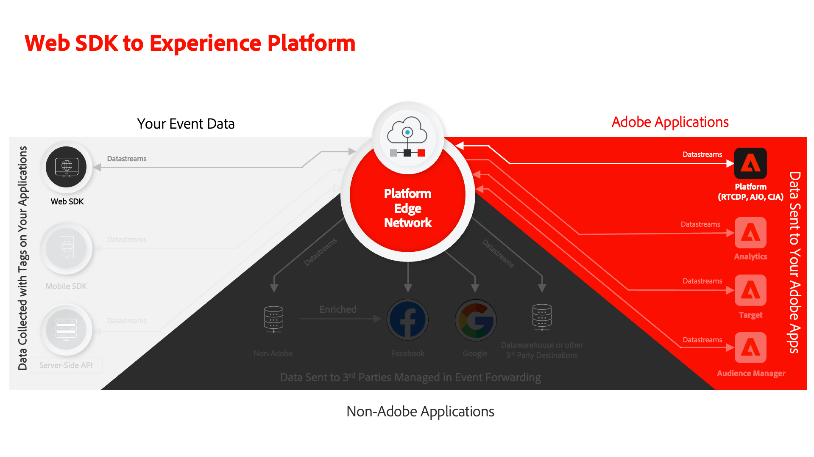

# 使用網頁SDK將資料串流至Experience Platform

了解如何使用 Platform Web SDK 將 Web 資料串流傳輸至 Adob&#x200B;&#x200B;e Experience Platform。

Experience Platform是所有新Experience Cloud應用程式(例如Adobe Real-Time Customer Data Platform、Adobe Customer Journey Analytics和Adobe Journey Optimizer)的骨幹。 這些應用程式的設計是要使用Platform Web SDK作為其最佳的Web資料收集方法。

Experience Platform會使用您先前建立的相同XDM結構描述，從Luma網站擷取事件資料。 當該資料傳送到Platform Edge Network時，資料流設定可以將其轉送到Experience Platform。

## 學習目標

在本課程結束時，您將能夠：

* 在Adobe Experience Platform中建立資料集
* 設定資料流以將網頁SDK資料傳送至Adobe Experience Platform
* 為即時客戶個人檔案啟用串流網頁資料
* 驗證資料已著陸Platform資料集和即時客戶設定檔中
* 將忠誠度計畫資料範例擷取至Platform
* 建立簡單的平台對象

## 先決條件

若要完成本課程，您必須先：

* 擁有Adobe Experience Platform應用程式的存取權，例如Real-Time Customer Data Platform、Journey Optimizer或Customer Journey Analytics
* 完成本教學課程之初始設定和標籤設定區段中先前的課程。

>[!NOTE]
>
>如果您沒有任何Platform應用程式，您可以略過本課程或一起閱讀。

## 建立資料集

所有成功內嵌至Adobe Experience Platform的資料都會以資料集的形式保留在資料湖中。 [資料集](https://experienceleague.adobe.com/en/docs/experience-platform/catalog/datasets/overview)是資料集合的儲存和管理結構，通常是包含結構描述（欄）和欄位（列）的表格。 資料集也包含中繼資料，可說明其儲存資料的各個層面。

讓我們為您的Luma Web事件資料設定資料集：

1. 移至[Experience Platform](https://experience.adobe.com/platform/)或[Journey Optimizer](https://experience.adobe.com/journey-optimizer/)介面
1. 確認您是在本教學課程使用的開發沙箱中
1. 從左側導覽開啟&#x200B;**[!UICONTROL 資料管理>資料集]**
1. 選取&#x200B;**[!UICONTROL 建立資料集]**

   

1. 選取&#x200B;**[!UICONTROL 從結構描述建立資料集]**&#x200B;選項

   

1. 選取在`Luma Web Event Data`先前的課程[中建立的](configure-schemas.md)結構描述，然後選取&#x200B;**[!UICONTROL 下一步]**

   

1. 為資料集提供&#x200B;**[!UICONTROL 名稱]**&#x200B;和選用的&#x200B;**[!UICONTROL 描述]**。 此練習請使用`Luma Web Event Data`，然後選取&#x200B;**[!UICONTROL 完成]**

   

資料集現在已設定為開始從Platform Web SDK實作收集資料。

## 設定資料串流

現在您可以設定您的[!UICONTROL 資料串流]，將資料傳送至[!UICONTROL Adobe Experience Platform]。 資料串流是標籤屬性、Platform Edge Network和Experience Platform資料集之間的連結。

1. 開啟[資料彙集](https://experience.adobe.com/#/data-collection){target="blank"}介面
1. 從左側導覽中選取&#x200B;**[!UICONTROL 資料串流]**
1. 開啟您在[設定資料流](configure-datastream.md)課程`Luma Web SDK: Development Environment`中建立的資料流

   

1. 選取&#x200B;**[!UICONTROL 新增服務]**
   
1. 選取&#x200B;**[!UICONTROL Adobe Experience Platform]**&#x200B;做為&#x200B;**[!UICONTROL 服務]**
1. 選取&#x200B;**[!UICONTROL 已啟用]**
1. 選取`Luma Web Event Data`做為&#x200B;**[!UICONTROL 事件資料集]**

1. 選取&#x200B;**[!UICONTROL 儲存]**

   

當您在[Luma示範網站](https://luma.enablementadobe.com)上產生對應至標籤屬性的流量時，資料會填入Experience Platform中的資料集！

## 驗證資料集

此步驟對於確保資料已抵達資料集至關重要。 有多種方式可驗證傳送至資料集的資料路徑。

* 使用[!UICONTROL Experience Platform Debugger]進行驗證
* 使用[!UICONTROL Experience Platform Assurance]進行驗證
* 使用[!UICONTROL 預覽資料集]進行驗證
* 使用[!UICONTROL 查詢服務]進行驗證

### Debugger

這些步驟與您在[偵錯工具課程](validate-with-debugger.md)中所執行的步驟大致相同。 不過，由於資料只有在資料流中啟用後才會傳送至Platform，因此您必須產生更多範例資料：

1. 開啟[Luma示範網站](https://luma.enablementadobe.com)並選取[!UICONTROL Experience Platform Debugger]擴充功能圖示

1. 設定偵錯工具將標籤屬性對應至&#x200B;*您的*&#x200B;開發環境，如[使用偵錯工具驗證](validate-with-debugger.md)課程中所述

   

1. 瀏覽網站。 檢視一些產品並新增一些到您的購物車

1. 在Debugger中，開啟「事件」列以尋找部分XDM變數

您已驗證資料是否已離開瀏覽器並傳送至資料流！

### Assurance

由於我們已在資料流中啟用服務，因此可在Assurance中看到更多資訊：

1. 開啟您的Assurance工作階段或開始新的工作階段
1. 開啟&#x200B;**[!UICONTROL 資料流]**&#x200B;事件
1. 您可以在此處檢視Platform服務的設定，包括您先前在本課程中建立的資料串流的ID。

   在Assurance中設定平台的

1. 開啟屬於&#x200B;**[!UICONTROL com.adobe.streaming.validation]**&#x200B;廠商的&#x200B;**[!UICONTROL generic]**&#x200B;事件。 這表示請求已連同隨附的XDM資料傳送至資料集

   在Assurance中進行

您已驗證Platform Edge Network已收到請求並轉送至Platform資料集。

### 預覽資料集

現在，讓我們實際檢視資料集！ 快速選項是使用&#x200B;**[!UICONTROL 預覽資料集]**&#x200B;功能。 網頁SDK資料會微批次處理至資料湖，並定期在平台介面中重新整理。 您可能需要10到15分鐘的時間才能看到您產生的資料。

1. 在[Experience Platform](https://experience.adobe.com/platform/)介面中，選取左側導覽中的&#x200B;**[!UICONTROL 資料管理>資料集]**&#x200B;以開啟&#x200B;**[!UICONTROL 資料集]**&#x200B;儀表板。

   控制面板會列出貴組織的所有可用資料集。 系統會顯示每個列出資料集的詳細資訊，包括其名稱、資料集所遵守的結構描述，以及最新擷取執行的狀態。

1. 選取您的`Luma Web Event Data`資料集以開啟其&#x200B;**[!UICONTROL 資料集活動]**&#x200B;畫面。

   

   活動畫麵包含以視覺效果呈現訊息使用率的圖表，以及成功和失敗批次的清單。
1. 由於這是新的資料集，如果您甚至看到一個批次有擷取的記錄，這是一個正號：

1. 從&#x200B;**[!UICONTROL 資料集活動]**&#x200B;畫面中，選取靠近熒幕右上角的&#x200B;**[!UICONTROL 預覽資料集]**，以預覽最多100列的資料。 如果資料集空白，則會停用預覽連結。

   

1. 將會執行查詢，從您的資料集中提取100個最近的資料列。 您可以深入研究個別XDM欄位，例如web.webPageDetails.name：

   

### 查詢資料

您可以對資料執行自訂查詢，以及驗證資料擷取：

1. 在[Experience Platform](https://experience.adobe.com/platform/)介面中，選取左側導覽中的&#x200B;**[!UICONTROL 資料管理>查詢]**&#x200B;以開啟&#x200B;**[!UICONTROL 查詢]**&#x200B;畫面。
1. 選取&#x200B;**[!UICONTROL 建立查詢]**
1. 首先，執行查詢以檢視資料湖中表格的所有名稱。 在查詢編輯器中輸入`SHOW TABLES`，然後按一下播放圖示以執行查詢。
1. 在結果中，請注意資料表名稱是`luma_web_event_data`的方式
1. 現在，使用參考您表格的簡單查詢來查詢表格（請注意，查詢預設將限製為100個結果）： `SELECT * FROM "luma_web_event_data"`
1. 過了一會兒，您應該會看到網頁資料的範例記錄。

   

>[!ERROR]
>
>如果您收到「未布建表格」錯誤，請仔細檢查表格的名稱。 也可能是微批次資料尚未抵達資料湖。 10-15分鐘後再試一次。

>[!INFO]
>
>  查詢服務是資料工程師和分析師的強大工具。 如需Adobe Experience Platform查詢服務的詳細資訊，請參閱Platform教學課程一節中的[探索資料](https://experienceleague.adobe.com/en/docs/platform-learn/tutorials/queries/explore-data)。

>[!NOTE]
>
>感謝您花時間學習Adobe Experience Platform Web SDK。 如果您有任何疑問、想分享一般意見或有關於未來內容的建議，請在這篇[Experience League社群討論貼文](https://experienceleaguecommunities.adobe.com/adobe-experience-platform-18/tutorial-discussion-implement-adobe-experience-cloud-with-web-sdk-tutorial-248848)上分享
