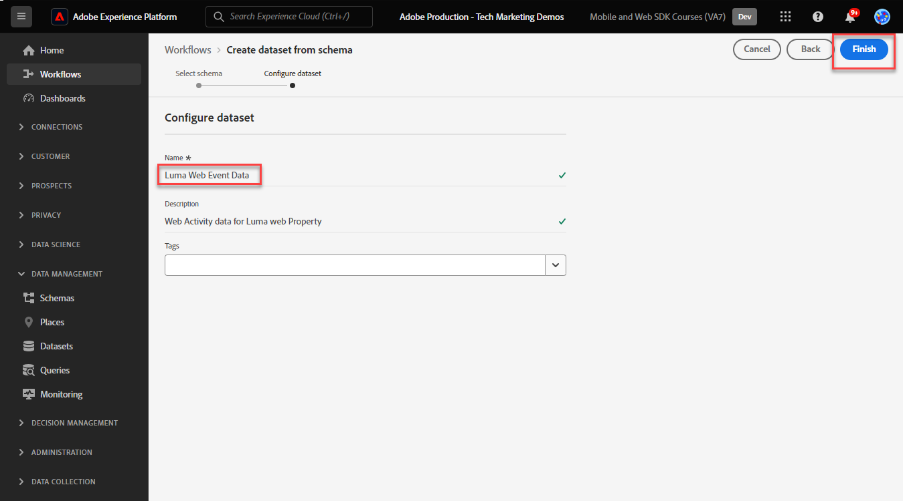

# 使用Web SDK串流資料以Experience Platform

>[!CAUTION]
>
>我們預計於2024年4月23日星期二發佈本教學課程的重大變更。 在那之後，許多練習將會變更，您可能需要從頭開始重新啟動教學課程，才能完成所有課程。

瞭解如何使用Platform Web SDK將網頁資料串流至Adobe Experience Platform。

Experience Platform是所有新Experience Cloud應用程式的骨幹，例如Adobe Real-time Customer Data Platform、Adobe Customer Journey Analytics和Adobe Journey Optimizer。 這些應用程式在設計上使用Platform Web SDK作為收集網頁資料的最佳方法。

Experience Platform會使用您先前建立的相同XDM結構描述，從Luma網站擷取事件資料。 當該資料傳送至PlatformEdge Network時，資料流設定可以將其轉送至Experience Platform。

## 學習目標

在本課程結束時，您將能夠：

* 在Adobe Experience Platform中建立資料集
* 設定資料流以傳送Web SDK資料至Adobe Experience Platform
* 為即時客戶個人檔案啟用串流網頁資料
* 驗證資料已著陸Platform資料集和即時客戶設定檔中

## 先決條件

您應已完成下列課程：

* 此 **初始設定** 課程：
   * [設定許可權](configure-permissions.md)
   * [設定XDM結構描述](configure-schemas.md)
   * [設定資料流](configure-datastream.md)
   * [設定身分名稱空間](configure-identities.md)

* 此 **標籤設定** 課程：
   * [安裝 Web SDK 擴充功能](install-web-sdk.md)
   * [建立資料元素](create-data-elements.md)
   * [建立標籤規則](create-tag-rule.md)

## 建立資料集

所有成功內嵌至Adobe Experience Platform的資料都會以資料集的形式保留在資料湖中。 A [資料集](https://experienceleague.adobe.com/docs/experience-platform/catalog/datasets/overview.html?lang=en) 是用於資料集合的儲存和管理結構，通常是包含結構（欄）和欄位（列）的表格。 資料集也包含中繼資料，可說明其儲存資料的各個層面。

在本練習中，您將建立資料集以追蹤的內容和電子商務詳細資訊， [Luma示範網站](https://luma.enablementadobe.com/content/luma/us/en.html).

>[!WARNING]
>
>您必須已建立 `Luma Web Event Data` 結構描述，如上一課中所述， [設定XDM結構描述](configure-schemas.md).

1. 前往 [Experience Platform介面](https://experience.adobe.com/platform/)
1. 確認您是在本教學課程使用的開發沙箱中
1. 開啟 **[!UICONTROL 資料集]** 從左側導覽
1. 選取 **[!UICONTROL 建立資料集]**

   

1. 選取 **[!UICONTROL 從結構描述建立資料集]** 選項

   

1. 選取 `Luma Web Event Data` 在中建立的綱要 [先前的課程](configure-schemas.md) 然後選取 **[!UICONTROL 下一個]**

   

1. 提供 **[!UICONTROL 名稱]** 和選填 **[!UICONTROL 說明]** 用於資料集。 在本練習中，請使用 `Luma Web Event Data`，然後選取 **[!UICONTROL 完成]**

   

資料集現在已設定為開始從Platform Web SDK實作收集資料。

## 設定資料串流

現在您可以設定 [!UICONTROL 資料流] 以傳送資料至 [!UICONTROL Adobe Experience Platform]. 資料流是標籤屬性、平台Edge Network和Experience Platform資料集之間的連結。

1. 開啟 [資料彙集](https://experience.adobe.com/#/data-collection){target="blank"} 介面
1. 選取 **[!UICONTROL 資料串流]** 從左側導覽
1. 開啟您在中建立的資料流 [設定資料串流](configure-datastream.md) 課程， `Luma Web SDK`

   

1. 選取 **[!UICONTROL 新增服務]**
   
1. 選取 **[!UICONTROL Adobe Experience Platform]** 作為 **[!UICONTROL 服務]**
1. 選取 `Luma Web Event Data` 作為 **[!UICONTROL 事件資料集]**

1. 選取「**[!UICONTROL 儲存]**」。

   

當您在中產生流量 [Luma示範網站](https://luma.enablementadobe.com/content/luma/us/en.html) 對應至您的標籤屬性，資料會以Experience Platform填入資料集！

## 驗證資料集

此步驟對於確保資料已抵達資料集至關重要。 驗證傳送至資料集的資料有兩個方面。

* 使用進行驗證 [!UICONTROL Experience Platform偵錯工具]
* 使用進行驗證 [!UICONTROL 預覽資料集]
* 使用進行驗證 [!UICONTROL 查詢服務]

### Experience Platform Debugger

這些步驟與您在中的操作大致相同 [偵錯工具課程](validate-with-debugger.md). 不過，由於資料只有在資料流中啟用後才會傳送至Platform，因此您必須產生更多範例資料：

1. 開啟 [Luma示範網站](https://luma.enablementadobe.com/content/luma/us/en.html) 並選取 [!UICONTROL Experience Platform偵錯工具] 擴充功能圖示

1. 設定Debugger將標籤屬性對應至 *您的* 開發環境，如 [使用Debugger進行驗證](validate-with-debugger.md) 課程

   

1. 使用 `test@adobe.com`/`test` 憑證登入 Luma 網站

1. 返回 [Luma 首頁](https://luma.enablementadobe.com/content/luma/us/en.html)

1. 在Debugger顯示的Platform Web SDK網路信標中，選取「事件」列以在快顯視窗中展開詳細資料

   

1. 在快顯視窗中搜尋「identityMap」。 您應該會在這裡看到lumaCrmId包含authenticatedState、id和primary的三個索引鍵
   

現在，資料應填入 `Luma Web Event Data` 資料集並準備好進行「預覽資料集」驗證。

### 預覽資料集

若要確認資料已著陸Platform的資料湖，快速選項是使用 **[!UICONTROL 預覽資料集]** 功能。 Web SDK資料會以微批次處理至資料湖，並定期在平台介面中重新整理。 您可能需要10到15分鐘的時間才能看到您產生的資料。

1. 在 [Experience Platform](https://experience.adobe.com/platform/) 介面，選取 **[!UICONTROL 資料集]** 在左側導覽以開啟 **[!UICONTROL 資料集]** 儀表板。

   控制面板會列出貴組織的所有可用資料集。 系統會顯示每個列出資料集的詳細資訊，包括其名稱、資料集所遵守的結構描述，以及最新擷取執行的狀態。

1. 選取您的 `Luma Web Event Data` 資料集，以開啟其 **[!UICONTROL 資料集活動]** 畫面。

   

   活動畫麵包含以視覺效果呈現訊息使用率的圖表，以及成功和失敗批次的清單。

1. 從 **[!UICONTROL 資料集活動]** 熒幕，選取 **[!UICONTROL 預覽資料集]** 靠近熒幕右上角，可預覽最多100列資料。 如果資料集空白，則會停用預覽連結。

   

   在預覽視窗中，資料集的結構描述階層檢視會顯示在右側。

   

>[!INFO]
>
>Adobe Experience Platform的查詢服務是驗證湖中資料的更強大方法，但不在本教學課程的討論範圍內。 如需詳細資訊，請參閱 [探索資料](https://experienceleague.adobe.com/docs/platform-learn/tutorials/queries/explore-data.html?lang=zh-Hant) 位於Platform教學課程區段。

## 為即時客戶個人檔案啟用資料集和結構描述

下一步是為即時客戶個人檔案啟用資料集和結構。 從Web SDK串流的資料會是流入Platform的眾多資料來源之一，而您想要將網頁資料與其他資料來源結合，以建置360度客戶設定檔。 若要深入瞭解即時客戶個人檔案，請觀看此短片：

>[!VIDEO](https://video.tv.adobe.com/v/27251?learn=on&captions=eng)

>[!CAUTION]
>
>使用您自己的網站和資料時，建議在啟用資料以用於即時客戶個人檔案之前，先對資料進行更強大的驗證。

**若要啟用資料集：**

1. 開啟您建立的資料集， `Luma Web Event Data`

1. 選取 **[!UICONTROL 設定檔切換]** 以開啟

   

1. 確認您要 **[!UICONTROL 啟用]** 資料集

   

**啟用綱要：**

1. 開啟您建立的結構描述， `Luma Web Event Data`

1. 選取 **[!UICONTROL 設定檔切換]** 以開啟

   

1. 選取 **[!UICONTROL 此結構描述的資料將在identityMap欄位中包含主要身分。]**

   >[!IMPORTANT]
   >
   >    傳送到Real-Time Customer Profile的每個記錄都需要主要身分。 一般而言，身分欄位會在結構描述中加上標籤。 但是，使用身分對應時，結構描述中不會顯示身分欄位。 此對話方塊是確認您心中有一個主要身分，且您會在傳送資料時，在身分對應中指定該身分。 如您所知，Web SDK使用身分對應，而Experience CloudID (ECID)是預設的主要身分。

1. 選取 **[!UICONTROL 啟用]**

   

1. 選取 **[!UICONTROL 儲存]** 儲存更新的結構描述

現在結構描述也針對設定檔啟用。

>[!IMPORTANT]
>
>    為設定檔啟用結構描述後，就無法停用或刪除它。 此外，此時之後無法從結構描述中移除欄位。 當您在生產環境中使用自己的資料時，請務必牢記這些含意。 在本教學課程中，您應該使用開發沙箱，您可以隨時將其刪除。
>
>   
> 使用您自己的資料時，我們建議您依照下列順序操作：
> 
> * 首先，將一些資料內嵌到資料集中。
> * 解決資料擷取程式期間發生的任何問題（例如資料驗證或對應問題）。
> * 為設定檔啟用資料集和結構描述
> * 重新內嵌資料

### 驗證設定檔

您可以在Platform介面(或Journey Optimizer介面)中查詢客戶設定檔，確認資料已著陸Real-Time Customer Profile。 顧名思義，設定檔會即時填入，因此不會像資料集中的驗證資料一樣延遲。

首先，您必須產生更多範例資料。 重複本課程中先前步驟以在Luma網站對應至您的標籤屬性時登入。 Inspect Platform Web SDK請求以確定其傳送資料時包含 `lumaCRMId`.

1. 在 [Experience Platform](https://experience.adobe.com/platform/) 介面，選取 **[!UICONTROL 設定檔]** 在左側導覽列中

1. 作為 **[!UICONTROL 身分名稱空間]** 使用 `lumaCRMId`
1. 複製並貼上 `lumaCRMId` 傳入您在Experience Platform偵錯工具中檢查的呼叫(可能是 `112ca06ed53d3db37e4cea49cc45b71e`)。

   

1. 如果設定檔中有有效的值， `lumaCRMId`，設定檔ID會填入主控台中：

   

1. 按一下 [!UICONTROL 設定檔ID] 和 [!UICONTROL 客戶設定檔] 控制檯會填入。 在這裡，您可以看到連結至的所有身分識別 `lumaCRMId`，例如 `ECID`：

   

您現已啟用適用於Experience Platform的Platform Web SDK (以及Real-Time CDP！ 和Customer Journey Analytics！ 和Journey Optimizer！)！

[下一步： ](setup-analytics.md)

>[!NOTE]
>
>感謝您投入時間學習Adobe Experience Platform Web SDK。 如果您有疑問、想要分享一般意見或有關於未來內容的建議，請在此分享這些內容 [Experience League社群討論貼文](https://experienceleaguecommunities.adobe.com/t5/adobe-experience-platform-launch/tutorial-discussion-implement-adobe-experience-cloud-with-web/td-p/444996)