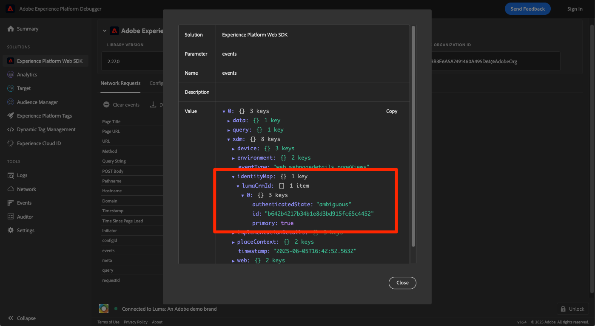

# 使用Web SDK將資料串流至Experience Platform

了解如何使用Platform Web SDK將Web資料串流至Adobe Experience Platform。

Experience Platform是所有新Experience Cloud應用程式(如Adobe Real-time Customer Data Platform、Adobe Customer Journey Analytics和Adobe Journey Optimizer)的骨幹。 這些應用程式的設計目的是使用Platform Web SDK作為其最佳的Web資料收集方法。

Experience Platform使用您先前建立的相同XDM結構，從Luma網站擷取事件資料。 當該資料傳送至Platform Edge Network時，資料流設定可將其轉送至Experience Platform。

## 學習目標

在本課程結束時，您將能夠：

* 在Adobe Experience Platform中建立資料集
* 設定資料流以傳送Web SDK資料至Adobe Experience Platform
* 為即時客戶個人檔案啟用串流Web資料
* 驗證資料是否已登陸Platform資料集和即時客戶個人檔案

## 先決條件

您應已完成下列課程：

* 此 **初始配置** 課程：
   * [設定權限](configure-permissions.md)
   * [設定XDM結構](configure-schemas.md)
   * [設定資料流](configure-datastream.md)
   * [設定身分命名空間](configure-identities.md)

* 此 **標籤設定** 課程：
   * [安裝Web SDK擴充功能](install-web-sdk.md)
   * [建立資料元素](create-data-elements.md)
   * [建立標籤規則](create-tag-rule.md)

## 建立資料集

成功擷取至Adobe Experience Platform的所有資料都會以資料集形式保存在資料湖中。 A [資料集](https://experienceleague.adobe.com/docs/experience-platform/catalog/datasets/overview.html?lang=en) 是資料集合（通常為表格）的儲存和管理結構，其中包含架構（欄）和欄位（列）。 資料集也包含中繼資料，可說明其儲存資料的各個層面。 

在本練習中，您可以建立資料集，以追蹤 [Luma示範網站](https://luma.enablementadobe.com/content/luma/us/en.html).

>[!WARNING]
>
>您必須已建立 `Luma Web Event Data` 方案，如上一課所述， [設定XDM結構](configure-schemas.md).

1. 前往 [Experience Platform介面](https://experience.adobe.com/platform/)
1. 確認您位於本教學課程所使用的開發沙箱中
1. 開啟 **[!UICONTROL 資料集]** 從左側導覽
1. 選擇 **[!UICONTROL 建立資料集]**

   

1. 選取 **[!UICONTROL 從結構建立資料集]** 選項

   

1. 選取 `Luma Web Event Data` 在 [先前的教訓](configure-schemas.md) 然後選取 **[!UICONTROL 下一個]**

   

1. 提供 **[!UICONTROL 名稱]** 和選填 **[!UICONTROL 說明]** 資料集。 在本練習中，請使用 `Luma Web Event Data`，然後選取 **[!UICONTROL 完成]**

   

資料集現在已設定為開始從您的Platform Web SDK實作收集資料。

## 設定資料流

現在，您可以設定 [!UICONTROL 資料流] 將資料傳送至 [!UICONTROL Adobe Experience Platform]. 資料流是標籤屬性、Platform Edge Network和Experience Platform資料集之間的連結。

1. 開啟 [資料收集](https://experience.adobe.com/#/data-collection){target=&quot;blank&quot;}介面
1. 選擇 **[!UICONTROL 資料流]** 從左側導覽
1. 開啟您在 [設定資料流](configure-datastream.md) 課程， `Luma Web SDK`

   

1. 選擇 **[!UICONTROL 添加服務]**

   
1. 選擇 **[!UICONTROL Adobe Experience Platform]** 作為 **[!UICONTROL 服務]**
1. 選擇 `Luma Web Event Data` 作為 **[!UICONTROL 事件資料集]**

1. 選取「**[!UICONTROL 儲存]**」。

   

當您在 [Luma示範網站](https://luma.enablementadobe.com/content/luma/us/en.html) 已對應至您的標籤屬性，資料會以Experience Platform填入資料集！

## 驗證資料集

此步驟非常重要，可確保資料進入資料集。 驗證傳送至資料集的資料有兩個方面。

* 使用進行驗證 [!UICONTROL Experience Platform偵錯器]
* 使用進行驗證 [!UICONTROL 預覽資料集]
* 使用進行驗證 [!UICONTROL 查詢服務]

### Experience Platform Debugger

這些步驟與您在 [除錯工具課程](validate-with-debugger.md). 不過，由於資料只會在您在資料流中啟用後傳送至Platform，因此您必須產生一些更多範例資料：

1. 開啟 [Luma示範網站](https://luma.enablementadobe.com/content/luma/us/en.html) ，然後選取 [!UICONTROL Experience Platform偵錯器] 擴充功能圖示

1. 設定Debugger以將標籤屬性對應至 *您的* 開發環境，如 [使用Debugger驗證](validate-with-debugger.md) 課程

   

1. 使用 `test@adobe.com`/`test` 憑證登入 Luma 網站

1. 返回 [Luma 首頁](https://luma.enablementadobe.com/content/luma/us/en.html)

1. 在除錯工具顯示的Platform Web SDK網路信標中，選取「事件」列，以在快顯視窗中展開詳細資訊

   

1. 在快顯視窗中搜尋「identityMap」。 您應該會在此看到lumaCrmId，其中三個索引鍵為authenticatedState、id和primary
   

現在，資料應填入 `Luma Web Event Data` 資料集，且可進行「預覽資料集」驗證。

### 預覽資料集

若要確認資料已進入Platform的資料湖，快速的選項是使用 **[!UICONTROL 預覽資料集]** 功能。 Web SDK資料會微批處理至資料湖，並定期在Platform介面中重新整理。 您可能需要10到15分鐘的時間，才能查看您產生的資料。

1. 在 [Experience Platform](https://experience.adobe.com/platform/) 介面，選擇 **[!UICONTROL 資料集]** 在左側導覽中開啟 **[!UICONTROL 資料集]** 控制面板。

   控制面板會列出貴組織的所有可用資料集。 系統會顯示每個列出資料集的詳細資訊，包括其名稱、資料集所遵守的結構，以及最新擷取執行的狀態。

1. 選取 `Luma Web Event Data` 資料集以開啟 **[!UICONTROL 資料集活動]** 螢幕。

   

   活動畫麵包含將所使用訊息的速率視覺化的圖形，以及成功和失敗批次的清單。

1. 從 **[!UICONTROL 資料集活動]** 螢幕，選擇 **[!UICONTROL 預覽資料集]** 靠近畫面的右上角，可預覽最多100列資料。 如果資料集空白，則預覽連結會停用。

   

   在預覽視窗中，資料集的架構階層檢視會顯示在右側。

   

>[!INFO]
>
>Adobe Experience Platform的查詢服務是驗證湖中資料的更強大方法，但不在本教學課程的討論範圍內。 如需詳細資訊，請參閱 [探索資料](https://experienceleague.adobe.com/docs/platform-learn/tutorials/queries/explore-data.html?lang=zh-Hant) （位於「平台教學課程」區段中）。

## 啟用即時客戶個人檔案的資料集和結構

下一步是啟用「即時客戶設定檔」的資料集和結構。 從Web SDK串流的資料將是流入Platform的許多資料來源之一，而且您想要將Web資料與其他資料來源連結，以建立360度的客戶設定檔。 若要進一步了解即時客戶個人檔案，請觀看此短片：

>[!VIDEO](https://video.tv.adobe.com/v/27251?quality=12&learn=on&captions=eng)

>[!CAUTION]
>
>使用您自己的網站和資料時，我們建議先對資料進行更健全的驗證，再啟用資料供即時客戶設定檔使用。

**若要啟用資料集：**

1. 開啟您建立的資料集， `Luma Web Event Data`

1. 選取 **[!UICONTROL 設定檔切換]** 開啟

   

1. 確認您想要 **[!UICONTROL 啟用]** 資料集

   

**要啟用架構，請執行以下操作：**

1. 開啟您建立的架構， `Luma Web Event Data`

1. 選取 **[!UICONTROL 設定檔切換]** 開啟

   

1. 選擇 **[!UICONTROL 此結構的資料將在identityMap欄位中包含主要身分。]**

   >[!IMPORTANT]
   >
   >    傳送至即時客戶設定檔的每筆記錄都需要主要身分。 通常，身分欄位會在結構中加上標籤。 但是，使用身分對應時，架構內不會顯示身分欄位。 此對話方塊旨在確認您已備妥主要身分，且會在傳送資料時於身分對應中指定該身分。 如您所知，Web SDK使用身分對應，而Experience CloudID(ECID)為預設主要身分。

1. 選擇 **[!UICONTROL 啟用]**

   

1. 選擇 **[!UICONTROL 儲存]** 要保存更新的架構

現在也會為設定檔啟用結構。

>[!IMPORTANT]
>
>    為設定檔啟用架構後，即無法停用或刪除該架構。 此外，在此時間點後，無法從架構中移除欄位。 在生產環境中處理您自己的資料時，請務必留意以下這些意涵。 您應在本教學課程中使用開發沙箱，可隨時刪除。
>
>   
> 使用您自己的資料時，建議您依下列順序執行作業：
> 
> * 首先，將一些資料內嵌至資料集。
> * 解決資料擷取程式期間產生的任何問題（例如資料驗證或對應問題）。
> * 啟用設定檔的資料集和結構
> * 重新內嵌資料

### 驗證設定檔

您可以在Platform介面(或Journey Optimizer介面)中查詢客戶設定檔，確認資料已進入即時客戶設定檔。 如名稱所示，設定檔會即時填入，因此不會像資料集中有驗證資料一樣延遲。

首先，您必須產生更多範例資料。 重複本課程先前的步驟，在對應至您的標籤屬性時登入Luma網站。 Inspect Platform Web SDK請求，以確認其會以 `lumaCRMId`.

1. 在 [Experience Platform](https://experience.adobe.com/platform/) 介面，選擇 **[!UICONTROL 設定檔]** 在左側導覽中

1. 作為 **[!UICONTROL 身分命名空間]** use `lumaCRMId`
1. 複製並貼上 `lumaCRMId` 傳入您在Experience Platform偵錯器中檢查的呼叫中(可能 `112ca06ed53d3db37e4cea49cc45b71e`)。

   

1. 若的設定檔中有有效值 `lumaCRMId`，設定檔ID會填入主控台：

   

1. 按一下 [!UICONTROL 設定檔ID] 和 [!UICONTROL 客戶設定檔] 主控台會填入。 您可以在此查看連結至 `lumaCRMId`，例如 `ECID`:

   

您現在已啟用適用於Experience Platform的Platform Web SDK(以及Real-Time CDP! 還有Customer Journey Analytics! 還有Journey Optimizer!)

[下一個： ](setup-analytics.md)

>[!NOTE]
>
>感謝您花時間學習Adobe Experience Platform Web SDK。 如果您有任何疑問、想要分享一般意見，或對未來內容有任何建議，請就此分享 [Experience League社群討論貼文](https://experienceleaguecommunities.adobe.com/t5/adobe-experience-platform-launch/tutorial-discussion-implement-adobe-experience-cloud-with-web/td-p/444996)