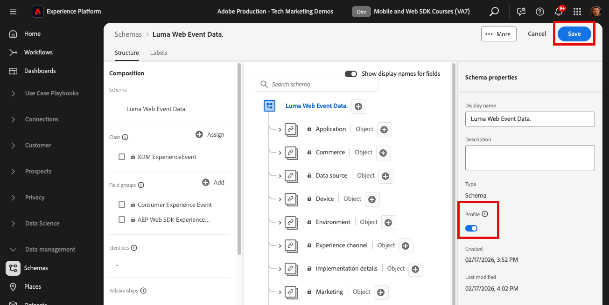
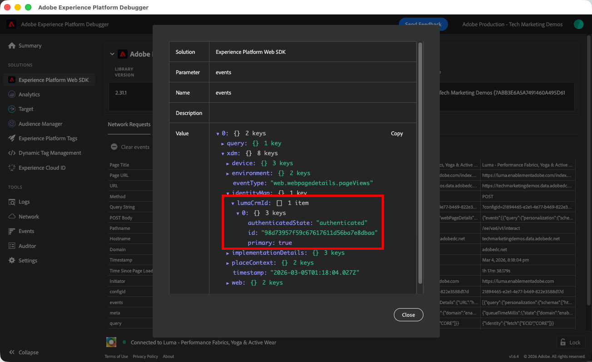
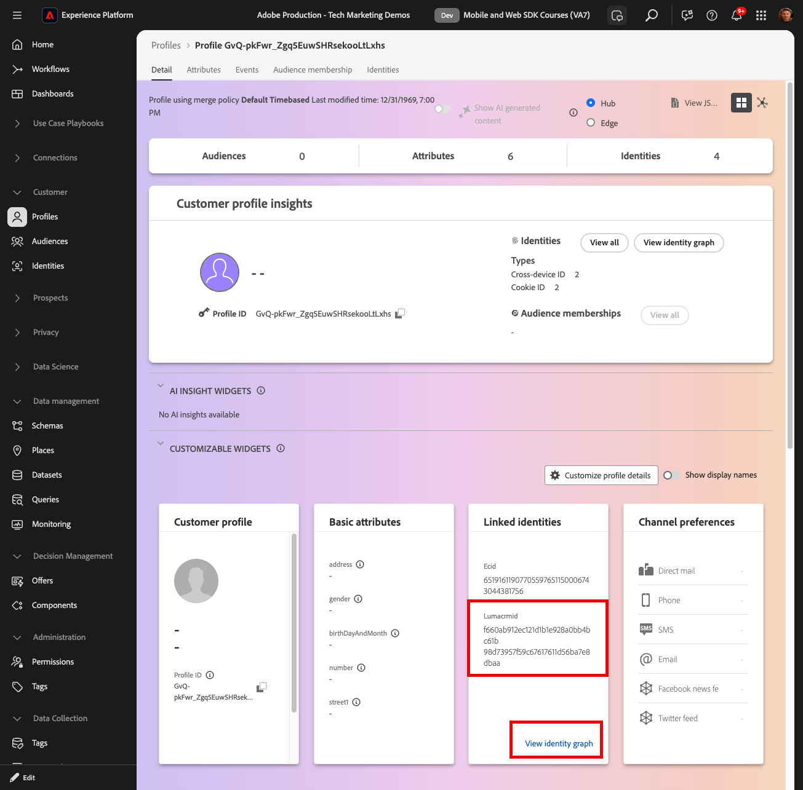

# 即時客戶個人檔案和Edge細分

## 為即時客戶個人檔案啟用資料集和結構描述

對於Real-Time Customer Data Platform和Journey Optimizer的客戶，下一步是啟用即時客戶個人檔案的資料集和結構描述。 從Web SDK串流的資料會是流入Platform的眾多資料來源之一，而您想要將您的Web資料與其他資料來源結合，以建置360度客戶設定檔。 若要深入瞭解即時客戶個人檔案，請觀看此短片：

>[!VIDEO](https://video.tv.adobe.com/v/27251?learn=on&captions=eng)

>[!CAUTION]
>
>使用您自己的網站和資料時，建議在啟用資料以用於即時客戶個人檔案之前，先對資料進行更強大的驗證。

### 啟用結構

為設定檔啟用結構描述：

1. 開啟您建立的結構描述，`Luma Web Event Data`

1. 選取&#x200B;**[!UICONTROL 設定檔切換]**&#x200B;以開啟

   

1. 選取&#x200B;**[!UICONTROL 此結構描述的資料將在identityMap欄位中包含主要身分。]**

1. 選取&#x200B;**[!UICONTROL 啟用]**

   

   >[!IMPORTANT]
   >
   >    傳送到Real-Time Customer Profile的每個記錄都需要主要身分。 每個記錄都會變成「設定檔片段」，而主要身分是查詢這些片段的關鍵。
   > 
   > 對於某些型別的資料，身分欄位在結構描述中會有標籤。 然而，若使用Experience Platform SDK擷取的事件資料，則身分對應是典型行為，而且結構描述中不會顯示身分欄位。
   >
   > 此對話方塊是確認您心中有一個主要身分，且您會在傳送資料時於身分對應中指定該身分，或使用身分圖表連結規則設定該身分對應，或兩者皆指定。 建議您兩者都執行。
   >
   > 如您所知，我們的Luma實作會使用具有已驗證lumaCrmId的身分對應作為主要身分（若可用），否則會預設為Experience Cloud ID (ECID)。

1. 選取&#x200B;**[!UICONTROL 儲存]**&#x200B;以儲存更新的結構描述

現在已為設定檔啟用此結構描述。

### 啟用資料集

若要啟用資料集：

1. 開啟您建立的資料集，`Luma Web Event Data`

1. 選取&#x200B;**[!UICONTROL 設定檔切換]**&#x200B;以開啟

   

1. 確認您要&#x200B;**[!UICONTROL 啟用]**&#x200B;資料集

>[!IMPORTANT]
>
>  為設定檔啟用結構描述並將資料擷取到資料集後，如果不重設或刪除整個沙箱，就無法停用或刪除它。 此外，已收到資料的欄位在此時間點後無法從結構描述中移除。
>
>   
> 使用您自己的資料時，我們建議您依照下列順序操作：
> 
> * 首先，將一些資料內嵌到資料集中。
> * 解決資料擷取程式期間發生的任何問題（例如資料驗證或對應問題）。
> * 為設定檔啟用資料集和結構描述
> * 視需要重新內嵌資料

### 驗證設定檔

您可以在Platform介面(或Journey Optimizer介面)中查詢客戶設定檔，確認資料已著陸Real-Time Customer Profile。 顧名思義，設定檔會即時填入，因此不會像資料集中的驗證資料一樣延遲。

首先，您必須在已啟用設定檔的資料集中產生更多範例資料：

1. 開啟[Luma示範網站](https://luma.enablementadobe.com)並選取[!UICONTROL Experience Platform Debugger]擴充功能圖示

1. 設定偵錯工具將標籤屬性對應至&#x200B;*您的*&#x200B;開發環境，如[使用偵錯工具驗證](validate-with-debugger.md)課程中所述

   

1. 瀏覽網站。 檢視部分產品，並將部分產品新增至您的購物車。

1. 使用認證`test@test.com`/`test`登入Luma網站（如果您收到訊息「無效的電子郵件或密碼」，則使用這些認證建立帳戶）

1. 開啟「事件」列以尋找部分XDM變數
1. 在快顯視窗中搜尋「identityMap」。 您應該會在這裡看到lumaCrmId包含authenticatedState、id和primary的三個索引鍵。 請注意，此登入的lumaCrmId值為`f660ab912ec121d1b1e928a0bb4bc61b`。

   Debugger中的

現在，讓我們在Experience Platform中尋找設定檔：

1. 在[Experience Platform](https://experience.adobe.com/platform/)介面中，選取左側導覽中的&#x200B;**[!UICONTROL 客戶]** > **[!UICONTROL 設定檔]**

1. 作為&#x200B;**[!UICONTROL 身分識別名稱空間]**&#x200B;使用`Luma CRM ID`
1. 複製並貼上您在Experience Platform Debugger中檢查之呼叫中傳遞的`lumaCrmId`值，此案例中為`f660ab912ec121d1b1e928a0bb4bc61b`

1. 如果`lumaCRMId`的設定檔中有有效值，則主控台中會填入設定檔ID

1. 若要檢視完整的&#x200B;**[!UICONTROL 客戶設定檔]**，請選取&#x200B;**[!UICONTROL 檢視]**：

   

1. 首先，您會看到設定檔摘要。 此設定檔中還沒有太多身分，但此處是連結在設定檔中的身分，`lumaCRMId`和`ECID`：

   

1. 此時，大多數可用的設定檔資料都是來自網路活動的事件資料。 選取&#x200B;**[!UICONTROL 事件]**&#x200B;以檢視點按資料流資料：

   

## 避免設定檔摺疊

現在來看看您絕不想在自己的實作中看到的內容 — 圖表收合。

### 瞭解問題

首先，我們將產生更多範例資料，以便檢視問題：

1. 在不刪除任何Cookie或localStorage物件的情況下，開啟[Luma示範網站](https://luma.enablementadobe.com)並選取[!UICONTROL Experience Platform Debugger]擴充功能圖示

1. 設定偵錯工具將標籤屬性對應至&#x200B;*您的*&#x200B;開發環境，如[使用偵錯工具驗證](validate-with-debugger.md)課程中所述

   

1. 希望您仍使用認證`test@test.com`/`test`登入Luma網站。 如果沒有，請重新登入。

1. 瀏覽網站。 檢視部分產品，並將部分產品新增至您的購物車。

1. 現在，登出。

1. 現在再次登入，以其他使用者(`spouse@test.com/test`)身分建立帳戶。 我們嘗試做的是復寫「共用裝置」情境，其中兩位使用者共用相同的網頁瀏覽器、驗證相同的網站，以及共用相同的`ECID`值。
1. 在Debugger中確認您擁有`98d73957f59c67617611d56ba7e8dbaa`的其他lumaCrmId `spouse@test.com/test`。

   

1. 檢視部分其他產品

現在再次檢視設定檔：

1. 再次搜尋`Luma CRM ID`等於`f660ab912ec121d1b1e928a0bb4bc61b`
1. 請注意，設定檔現在已連結至兩個不同的Luma CRM ID

1. 選取&#x200B;**[!UICONTROL 檢視身分圖表]**

   

1. 身分圖表有助於視覺化這個設定檔，其中由於裝置共用，兩個`lumaCrmId`值由通用`ECID`值聯結。

   

這可能會是Experience Platform實作的一大問題。 使用者的事件資料不僅會加入單一設定檔中，而且使用這`lumaCrmId`個值擷取到Platform中的其他型別資料也會合併。

### 使用身分圖表連結規則加以修正

若要搶先解決圖表摺疊問題，請在啟用網頁SDK實作之前，使用Adobe Experience Platform中的身分圖表連結規則功能。

>[!WARNING]
>
> 這些步驟通常由管理整個Platform實施的資料架構師設定。 此功能的功能比這裡顯示的要多很多，而且許多複雜的情境應該先仔細模擬。
>
> 您必須使用專屬的開發沙箱完成本教學課程，才能完成這些步驟，此沙箱可在您完成本教學課程後刪除。 這些對沙箱的變更無法回覆。 請參閱[身分圖表連結規則教學課程](https://experienceleague.adobe.com/zh-hant/docs/platform-learn/tutorials/identities/graph-linking-rules/overview)以深入瞭解。

若要啟用身分圖表連結規則：

1. 從任何「識別碼」畫面中，開啟&#x200B;**[!UICONTROL 設定]**：

   

1. 檢閱強制回應視窗中的警告，並選取&#x200B;**[!UICONTROL 繼續]**
1. 拖曳`Luma CRM ID`，使其成為清單中最高優先順序的名稱空間
1. 檢查&#x200B;**[!UICONTROL 的]**&#x200B;每個圖表唯一`Luma CRM ID`設定
1. 選取&#x200B;**[!UICONTROL 下一步]**
   
1. 檢閱模組並&#x200B;**[!UICONTROL 確認]**
1. 選取&#x200B;**[!UICONTROL 下一步]**&#x200B;以略過模擬步驟

   >[!WARNING]
   >
   > 同樣地，如果您不在自己的專用開發沙箱中工作，請勿完成此工作流程以啟用這些身分設定。

1. 輸入沙箱名稱並選取&#x200B;**[!UICONTROL 確認]**

   

24小時後再返回網站，以`test@test.com`或`spouse@test.com`身分重新登入，並檢視您的設定檔是否已分隔。

## 建立Edge評估的對象

建議使用Real-Time Customer Data Platform和Journey Optimizer的客戶完成此練習。

將Web SDK資料擷取至Adobe Experience Platform時，其他您已擷取至Platform的資料來源可豐富該資料。 例如，當使用者登入Luma網站時，身分圖表會在Experience Platform中建構，而所有其他已啟用設定檔的資料集可能會連結在一起，以建置即時客戶設定檔。 為了實際操作，您將會在Adobe Experience Platform中快速建立另一個資料集，其中包含一些忠誠度資料範例，好讓您可以搭配Real-Time Customer Data Platform和Journey Optimizer使用即時客戶設定檔。 然後，您將根據此資料建置對象。

### 建立忠誠度方案並擷取範例資料

由於您已完成類似的練習，因此會提供簡短的指示。

建立熟客方案：

1. 建立新結構描述
1. 選擇&#x200B;**[!UICONTROL 個別設定檔]**&#x200B;做為[!UICONTROL 基底類別]
1. 命名結構描述`Luma Loyalty Schema`
1. 新增[!UICONTROL 熟客方案詳細資料]欄位群組
1. 新增[!UICONTROL 人口統計詳細資料]欄位群組
1. 選取`Person ID`欄位，並使用身分名稱空間[!UICONTROL 將其標示為]身分`Luma CRM Id`和[!UICONTROL 主要身分]。
1. 為[!UICONTROL 設定檔]啟用結構描述。 如果您找不到設定檔切換，請嘗試按一下左上方的結構描述名稱。
1. 儲存結構描述

   

若要建立資料集並擷取範例資料：

1. 從`Luma Loyalty Schema`建立新的資料集
1. 為資料集命名`Luma Loyalty Dataset`
1. 為[!UICONTROL 設定檔]啟用資料集
1. 下載範例檔案[luma-loyalty-forWeb.json](assets/luma-loyalty-forWeb.json)
1. 將檔案拖放至您的資料集中
1. 確認資料已成功內嵌

   

### 設定Edge上主動的合併原則

所有對象都是使用合併原則建立的。 合併原則會建立設定檔的不同「檢視」、可以包含資料集的子集，並會在不同的資料集貢獻相同的設定檔屬性時指定優先順序。 若要在邊緣進行評估，對象必須使用具有&#x200B;**[!UICONTROL Edge上主動式合併原則]**&#x200B;設定的合併原則。

>[!IMPORTANT]
>
>每個沙箱只能有一個合併原則，**[!UICONTROL Edge上的Active合併原則]**&#x200B;設定

1. 開啟Experience Platform或Journey Optimizer介面，並確定您是在本教學課程使用的開發環境中。
1. 導覽至&#x200B;**[!UICONTROL 客戶]** > **[!UICONTROL 設定檔]** > **[!UICONTROL 合併原則]**&#x200B;頁面
1. 開啟&#x200B;**[!UICONTROL 預設合併原則]** （可能名為`Default Timebased`）
   
1. 啟用&#x200B;**[!UICONTROL Edge上主動式合併原則]**&#x200B;設定
1. 選取&#x200B;**[!UICONTROL 下一步]**

   
1. 繼續選取&#x200B;**[!UICONTROL 下一步]**&#x200B;以繼續完成工作流程的其他步驟，並選取&#x200B;**[!UICONTROL 完成]**以儲存您的設定
   

您現在可以建立對象，以便在Edge上評估。

### 建立客群

對象會根據常見特徵將設定檔分組。 建立可在Real-Time CDP或Journey Optimizer中使用的簡單受眾：

1. 在Experience Platform或Journey Optimizer介面中，前往左側導覽中的&#x200B;**[!UICONTROL 客戶]** > **[!UICONTROL 對象]**
1. 選取&#x200B;**[!UICONTROL 建立對象]**
1. 選取&#x200B;**[!UICONTROL 建置規則]**
1. 選取&#x200B;**[!UICONTROL 建立]**

   

1. 選取&#x200B;**[!UICONTROL 屬性]**
1. 尋找&#x200B;**[!UICONTROL 忠誠度]** > **[!UICONTROL 階層]**&#x200B;欄位，並將其拖曳至&#x200B;**[!UICONTROL 屬性]**&#x200B;區段
1. 將對象定義為`tier`為`gold`的使用者
1. 為對象命名`Luma Loyalty Rewards – Gold Status`
1. 選取&#x200B;**[!UICONTROL Edge]**&#x200B;做為&#x200B;**[!UICONTROL 評估方法]**
1. 選取&#x200B;**[!UICONTROL 儲存]**

   

>[!NOTE]
>
> 由於我們已將預設的合併原則設為&#x200B;**[!UICONTROL Edge上主動式合併原則]**，因此您建立的對象會自動與此合併原則產生關聯。

由於這是非常簡單的對象，因此我們可以使用Edge評估方法。 Edge對象會在邊緣進行評估，因此在網站SDK向Platform Edge Network提出的相同請求中，我們可以評估對象定義，並立即確認使用者是否符合資格。

>[!NOTE]
>
>感謝您花時間學習Adobe Experience Platform Web SDK。 如果您有任何疑問、想分享一般意見或有關於未來內容的建議，請在這篇[Experience League社群討論貼文](https://experienceleaguecommunities.adobe.com/adobe-experience-platform-18/tutorial-discussion-implement-adobe-experience-cloud-with-web-sdk-tutorial-248848)上分享
