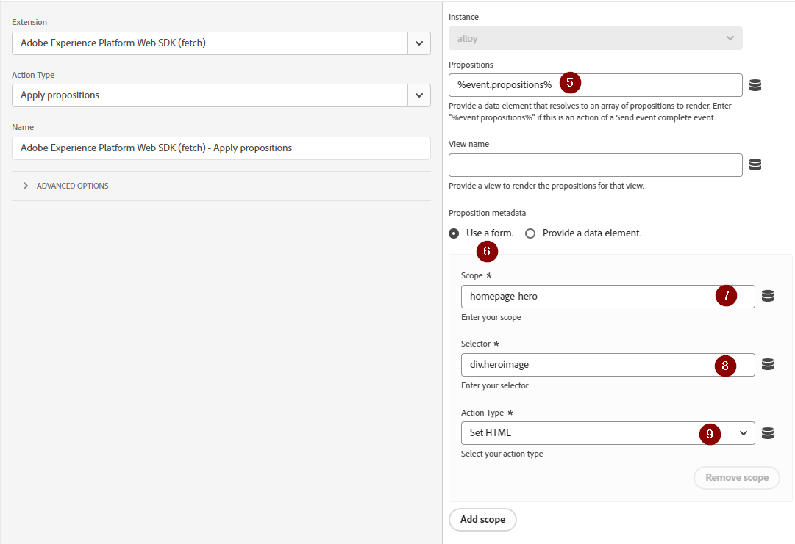

# 使用Platform Web SDK設定Adobe Target

瞭解如何使用 Adobe Experience Platform Web SDK 實施 Adobe Target。了解如何提供體驗以及如何將其他參數傳遞給 Target。

[Adobe Target](https://experienceleague.adobe.com/zh-hant/docs/target/using/target-home)是Adobe Experience Cloud應用程式，提供一切所需工具，讓您量身訂造及個人化您的客戶體驗，藉此為您的網頁以及行動網站、應用程式和其他數位頻道創造最高的收入。


## 學習目標

在本課程結束時，您可以透過Target的Web SDK實作執行以下操作：

* 新增預先隱藏的程式碼片段以防止閃爍
* 設定資料流以啟用Target功能
* 呈現視覺化體驗撰寫器活動
* 呈現表單撰寫器活動
* 傳遞XDM資料至Target並瞭解對應至Target引數
* 將自訂資料傳遞至Target，例如設定檔和實體引數
* 驗證 Target 實施
* 將個人化請求與Analytics請求分開

>[!TIP]
>
>請參閱我們的[將Target從at.js 2.x移轉至Platform Web SDK](/help/tutorial-migrate-target-websdk/introduction.md)教學課程，以取得移轉您現有at.js實作的逐步指南。


## 先決條件

若要完成本節中的課程，您必須先：

* 完成所有Platform Web SDK初始設定的課程，包括設定資料元素和規則。
* 確定您在Adobe Target中有[編輯者或核准者角色](https://experienceleague.adobe.com/zh-hant/docs/target/using/administer/manage-users/enterprise/properties-overview#section_8C425E43E5DD4111BBFC734A2B7ABC80)。
* 如果您使用Google Chrome瀏覽器，請安裝[視覺化體驗撰寫器Helper擴充功能](https://experienceleague.adobe.com/zh-hant/docs/target/using/experiences/vec/troubleshoot-composer/vec-helper-browser-extension)。
* 瞭解如何在Target中設定活動。 如果您需要複習程式，下列教學課程和指南對本課程很有幫助：
   * [使用視覺化體驗撰寫器(VEC) Helper擴充功能](https://experienceleague.adobe.com/zh-hant/docs/target/using/experiences/vec/troubleshoot-composer/vec-helper-browser-extension)
   * [使用 Visual Experience Composer](https://experienceleague.adobe.com/zh-hant/docs/target-learn/tutorials/experiences/use-the-visual-experience-composer)
   * [使用表單式體驗撰寫器](https://experienceleague.adobe.com/zh-hant/docs/target-learn/tutorials/experiences/use-the-form-based-experience-composer)
   * [建立體驗鎖定目標活動](https://experienceleague.adobe.com/zh-hant/docs/target-learn/tutorials/activities/create-experience-targeting-activities)

## 新增閃爍處理

開始之前，請根據標籤程式庫的載入方式，決定是否需要額外的閃爍處理解決方案。

>[!NOTE]
>
>此教學課程使用[Luma網站](https://luma.enablementadobe.com/content/luma/us/en.html){target=_blank}，該網站已採用非同步實作標籤並具備閃爍緩解功能。 本節內容僅供瞭解閃爍緩解如何與Platform Web SDK搭配運作之用。


### 非同步實施

非同步載入標籤庫時，頁面可能會在Target以個人化內容取代預設內容之前完成轉譯。 此行為可能會導致所謂的「閃爍」問題，發生此問題時，會先短暫地顯示預設內容，然後再更換為個人化內容。 若要避免發生這種閃爍問題，Adobe建議在非同步標籤內嵌程式碼的前面加上特殊的預先隱藏程式碼片段。

此程式碼片段已存在於Luma網站上，但讓我們進一步瞭解此程式碼的作用：

```html
<script>
  !function(e,a,n,t){var i=e.head;if(i){
  if (a) return;
  var o=e.createElement("style");
  o.id="alloy-prehiding",o.innerText=n,i.appendChild(o),setTimeout(function(){o.parentNode&&o.parentNode.removeChild(o)},t)}}
  (document, document.location.href.indexOf("adobe_authoring_enabled") !== -1, ".personalization-container { opacity: 0 !important }", 3000);
</script>
```

預先隱藏程式碼片段會使用您選擇的CSS定義，在頁面標題中建立樣式標籤。 在收到來自Target的回應或達到逾時時間時，會移除此樣式標籤。

預先隱藏行為是由程式碼片段尾端的兩項設定所控制。

* `body { opacity: 0 !important }`會指定在Target載入之前，要用於預先隱藏的CSS定義。 依預設，會隱藏整個頁面。 您可以將此定義更新為要預先隱藏的選擇器，以及要如何隱藏它們。 您可以包含多個定義，因為此值只是插入到預先隱藏樣式標籤中的值。 如果您有可輕鬆識別的容器元素，可將內容包裝在導覽下，則可使用此設定將預先隱藏限定為該容器元素。
* `3000`指定預先隱藏的逾時時間（毫秒）。 如果逾時前未收到來自Target的回應，則會移除預先隱藏樣式標籤。 達到此逾時的情況應該很少見。

>[!NOTE]
>
>Platform Web SDK的預先隱藏程式碼片段與Target at.js程式庫所使用的程式碼片段有些不同。 請務必對Platform Web SDK使用正確的程式碼片段，因為它使用不同的樣式識別碼`alloy-prehiding`。 如果使用適用於at.js的預先隱藏程式碼片段，該程式碼片段可能無法正常運作。

標籤中也提供預先隱藏的程式碼片段：

1. 前往標籤的&#x200B;**[!UICONTROL 擴充功能]**&#x200B;區段
1. 選取Adobe Experience Platform Web SDK擴充功能的&#x200B;**[!UICONTROL 設定]**
1. 選取&#x200B;**[!UICONTROL 將預先隱藏的程式碼片段複製到剪貼簿]**&#x200B;按鈕

   

   >[!NOTE]
   >
   >從Platform Web SDK擴充功能複製的預設預先隱藏程式碼片段可能包含您網站上不存在的CSS定義，例如`.personalization-container { opacity: 0 !important }`。 請務必檢查並修改您網站的預先隱藏程式碼片段。

### 同步實施

Adobe建議您非同步實作標籤，如Luma網站所示。 不過，如果同步載入標籤程式庫，則不需要預先隱藏程式碼片段。 而是在Platform Web SDK擴充功能設定中指定預先隱藏樣式。

同步實施的預先隱藏樣式可依照以下方式設定：

1. 前往標籤的&#x200B;**[!UICONTROL 擴充功能]**&#x200B;區段
1. 選取Platform Web SDK擴充功能的&#x200B;**[!UICONTROL 設定]**&#x200B;按鈕
1. 選取&#x200B;**[!UICONTROL 編輯預先隱藏樣式]**&#x200B;按鈕

   

1. 修改CSS以包含您想要使用的選取器和隱藏方法，例如： `body { opacity: 0 !important }` （如果您想要預先隱藏頁面的整個內文）。
1. 儲存變更並建置至程式庫

>[!NOTE]
>
>預先隱藏樣式設定僅適用於同步實施。 如果您使用非同步實作標籤，此樣式應該空白或標籤為註解。

若要進一步瞭解Platform Web SDK如何管理忽隱忽現的情形，請參閱指南章節： [管理個人化體驗忽隱忽現的情形](https://experienceleague.adobe.com/en/docs/experience-platform/edge/personalization/manage-flicker)。


## 設定資料串流

必須先在資料流設定中啟用Target，Platform Web SDK才能傳遞任何Target活動。

若要在資料流中設定Target：

1. 移至[資料彙集](https://experience.adobe.com/#/data-collection){target="blank"}介面
1. 在左側導覽中，選取&#x200B;**[!UICONTROL 資料串流]**
1. 選取先前建立的`Luma Web SDK: Development Environment`資料流

   

1. 選取&#x200B;**[!UICONTROL 新增服務]**
   
1. 選取&#x200B;**[!UICONTROL Adobe Target]**&#x200B;做為&#x200B;**[!UICONTROL 服務]**
1. 如有需要，請依照下列指引，輸入有關Target實作的選擇性詳細資料。
1. 選取&#x200B;**[!UICONTROL 儲存]**

   

### 屬性代號

Target Premium客戶可選擇使用屬性管理使用者許可權。 Target屬性可讓您建立使用者可執行Target活動的邊界。 如需詳細資訊，請參閱Target檔案的[企業許可權](https://experienceleague.adobe.com/zh-hant/docs/target/using/administer/manage-users/enterprise/properties-overview)區段。

若要設定或尋找屬性代號，請瀏覽至&#x200B;**Adobe Target** > **[!UICONTROL 管理]** > **[!UICONTROL 屬性]**。 `</>`圖示會顯示實作程式碼。 `at_property`值是您將在資料流中使用的屬性代號。


<a id="advanced-pto"></a>

每個資料流只能指定一個屬性代號，但屬性代號覆寫可讓您指定替代屬性代號，以取代資料流中定義的主要屬性代號。 還需要更新`sendEvent`動作以覆寫資料流。


### 目標環境ID

Target中的[環境](https://experienceleague.adobe.com/zh-hant/docs/target/using/administer/environments)可協助您在開發的所有階段管理您的實作。 此選擇性設定會指定您要與每個資料流搭配使用的Target環境。

Adobe建議針對每個開發、測試和生產資料流分別以不同方式設定「目標環境ID」，以簡化操作。 或者，您可以使用[主機](https://experienceleague.adobe.com/zh-hant/docs/target/using/administer/hosts)功能，在Target介面中組織環境。

若要設定或尋找環境ID，請瀏覽至&#x200B;**Adobe Target** > **[!UICONTROL 管理]** > **[!UICONTROL 環境]**。


>[!NOTE]
>
>若未指定目標環境ID，則會假設是生產目標環境。

### 目標第三方ID名稱空間

此選擇性設定可讓您指定用於Target第三方ID的身分符號。 Target僅支援在單一身分符號或名稱空間上同步設定檔。 如需詳細資訊，請參閱Target指南的[mbox3rdPartyId](https://experienceleague.adobe.com/zh-hant/docs/target/using/audiences/visitor-profiles/3rd-party-id)即時設定檔同步區段。

身分符號位於&#x200B;**資料彙集** > **[!UICONTROL 客戶]** > **[!UICONTROL 身分]**&#x200B;下的身分清單中。


出於本教學課程使用Luma網站的目的，請使用在`lumaCrmId`身分[課程中設定的身分符號](configure-identities.md)。


## 呈現視覺個人化決定

視覺化個人化決定參考在Adobe Target視覺化體驗撰寫器中建立的體驗。 首先，您應該瞭解Target和標籤介面中使用的術語：

* **活動**：一組以一或多個對象為目標的體驗。 例如，簡單的A/B測試可能是具有兩個體驗的活動。
* **體驗**：一組以一或多個位置或決定範圍為目標的動作。
* **決定範圍**： Target體驗傳遞的位置。 如果您熟悉使用舊版Target，則決定範圍等同於「mbox」。
* **Personalization決定**：伺服器決定應套用的動作。 這些決定可能會根據對象條件和Target活動優先順序。
* **主張**：伺服器所做決策的結果，這些決策會傳遞到Platform Web SDK回應。 例如，交換橫幅影像會是一種主張。

### 更新[!UICONTROL 傳送事件]動作

如果在資料流中啟用了Target，Platform Web SDK則會傳送來自Target的視覺個人化決策。 但是，_它們不會自動呈現_。 您必須更新[!UICONTROL 傳送事件]動作，才能啟用自動轉譯。

1. 在[資料彙集](https://experience.adobe.com/#/data-collection){target="blank"}介面中，開啟您用於本教學課程的標籤屬性
1. 開啟`all pages - library loaded - send event - 50`規則
1. 選取`Adobe Experience Platform Web SDK - Send event`動作
1. 啟用&#x200B;**[!UICONTROL 以核取方塊呈現視覺化個人化決定]**

   

<!--
1. In the **[!UICONTROL Datastream configuration overrides**] the **[!UICONTROL Target Property Token]** can be overridden either as a static value or with a data element. Only property tokens defined in the [**Advanced Property Token Overrides**](#advanced-pto) section in **Datastream Configuration** will return results.
   
   
   -->

1. 儲存您的變更，然後建置到您的程式庫

轉譯器視覺個人化決定設定可讓Platform Web SDK自動套用使用Target視覺化體驗撰寫器或「全域mbox」指定的任何修改。

>[!NOTE]
>
>一般而言，[!UICONTROL 呈現視覺化個人化決定]設定只應該針對每個完整頁面載入的單一「傳送事件」動作啟用。 如果有多個「傳送事件」動作已啟用此設定，則會忽略後續轉譯請求。

如果您偏好使用自訂程式碼對這些決定自行轉譯或執行動作，您可以保留[!UICONTROL 轉譯視覺個人化決定]設定停用。 Platform Web SDK具備彈性，提供這項功能供您完全控制。 您可以參考指南以取得有關[手動呈現個人化內容](https://experienceleague.adobe.com/en/docs/experience-platform/edge/personalization/rendering-personalization-content)的詳細資訊。


### 使用視覺化體驗撰寫器設定Target活動

現在基本實施部分已完成，請在Target中建立Experience Targeting (XT)活動，驗證一切都正常運作。 如需協助，您可以參閱[建立體驗鎖定目標活動](https://experienceleague.adobe.com/zh-hant/docs/target-learn/tutorials/activities/create-experience-targeting-activities)的Target教學課程。

>[!NOTE]
>
>如果您使用Google Chrome作為瀏覽器，需要[視覺化體驗撰寫器(VEC) Helper擴充功能](https://experienceleague.adobe.com/zh-hant/docs/target/using/experiences/vec/troubleshoot-composer/vec-helper-browser-extension)才能正確載入網站，以便在VEC中編輯。

1. 導覽至Adobe Target介面
1. 使用活動URL的Luma首頁建立體驗鎖定目標(XT)活動

   

1. 修改頁面，例如，變更首頁主圖橫幅上的文字。  完成時，請選取&#x200B;**[!UICONTROL 儲存]**&#x200B;然後選取&#x200B;**[!UICONTROL 下一步]**。

   

1. 更新事件名稱，然後選取&#x200B;**[!UICONTROL 下一步]**。

   

1. 選擇Adobe Analytics作為報表來源，搭配適當的報表套裝，並選擇「訂單」量度作為目標

   

   >[!NOTE]
   >
   >如果您未使用Adobe Analytics，請選取Target作為報表來源，然後選擇其他量度，例如&#x200B;**參與>頁面檢視**。 必須有目標量度才能儲存及預覽活動。

1. 儲存活動
1. 如果您熟悉變更，那麼可以啟動活動。 否則，如果您想要預覽體驗而不啟動，可以複製[QA預覽URL](https://experienceleague.adobe.com/zh-hant/docs/target/using/activities/activity-qa/activity-qa)。
1. 載入Luma首頁，應該會看到變更已套用
1. 幾小時後，您應該就能在Adobe Analytics中檢視Target活動資料和轉換。 請參閱Target指南，以取得有關[Analytics for Target (A4T)報告](https://experienceleague.adobe.com/zh-hant/docs/target/using/integrate/a4t/reporting)的詳細資訊。


### 使用除錯工具進行驗證

如果您設定活動，應該會在頁面上看到您的內容已呈現。 但是，即使沒有活動上線，您也可以檢視「傳送事件」網路呼叫，以確認Target已正確設定。

>[!CAUTION]
>
>如果您使用Google Chrome並安裝[Visual Experience Composer (VEC) Helper擴充功能](https://experienceleague.adobe.com/zh-hant/docs/target/using/experiences/vec/troubleshoot-composer/vec-helper-browser-extension)，請確定&#x200B;**插入Target資料庫**&#x200B;設定已停用。 啟用此設定將會產生額外的Target請求。

1. 開啟Adobe Experience Platform Debugger瀏覽器擴充功能
1. 移至[Luma示範網站](https://luma.enablementadobe.com/content/luma/us/en.html)，然後使用偵錯工具來[將網站上的標籤屬性切換為您自己的開發屬性](validate-with-debugger.md#use-the-experience-platform-debugger-to-map-to-your-tags-property)
1. 重新載入頁面
1. 在偵錯工具中選取&#x200B;**[!UICONTROL 網路]**&#x200B;工具
1. 依&#x200B;**[!UICONTROL Experience Platform Web SDK]**&#x200B;篩選
1. 在事件列中選取第一次呼叫的值

   Adobe Experience Platform Debugger中的

1. 請注意，`query` > `personalization`下有索引鍵，`decisionScopes`的值為`__view__`。 此範圍相當於`target-global-mbox`。 此Platform Web SDK呼叫要求Target做出決定。

   

1. 關閉覆蓋圖並選取第二個網路呼叫的事件詳細資料。 只有在Target傳回活動時，此呼叫才會出現。
1. 請注意，有從Target傳回的活動和體驗的詳細資料。 此Platform Web SDK呼叫會傳送通知，指出Target活動已轉譯給使用者並增加曝光次數。

   

## 設定和演算自訂決定範圍

自訂決策範圍（先前稱為「mbox」）可用於透過Target表單式體驗撰寫器，以結構化的方式傳送HTML或JSON內容。 Platform Web SDK不會自動轉譯傳遞到這些自訂範圍之一的內容。 您可以使用Tags中的動作來轉譯。

### 將範圍新增至[!UICONTROL 傳送事件動作]

修改您的頁面載入規則以新增自訂決定範圍：

1. 開啟`all pages - library loaded - send event - 50`規則
1. 選取`Adobe Experience Platform Web SDK - Send Event`動作
1. 新增一或多個要使用的範圍。 在此範例中，使用`homepage-hero`。

   

1. 儲存您的變更並將組建組建至程式庫

>[!TIP]
>
>在本教學課程中，您將使用單一手動定義的範圍來示範。 如果您決定使用專用於特定頁面的數個決定範圍，則應考慮使用資料元素，該元素會根據頁面路徑有條件地傳回範圍陣列。 此方法有助於讓您的實作簡單且可擴充。

### 處理來自Target的回應

現在您已設定Platform Web SDK來要求`homepage-hero`範圍的內容，您必須對回應執行一些動作。 Platform Web SDK標籤擴充功能提供[!UICONTROL 傳送事件完成]事件，可在收到[!UICONTROL 傳送事件]動作的回應時，立即觸發新規則。

1. 建立名為`homepage - send event complete - render homepage-hero`的規則。
1. 將事件新增至規則。 使用&#x200B;**Adobe Experience Platform Web SDK**&#x200B;擴充功能和&#x200B;**[!UICONTROL 傳送事件完成]**&#x200B;事件型別。
1. 新增條件以將規則限制在Luma首頁（不含查詢字串的路徑等於`/content/luma/us/en.html`）。
1. 將動作新增至規則。 使用&#x200B;**Adobe Experience Platform Web SDK**&#x200B;擴充功能和&#x200B;**套用主張**&#x200B;動作型別。

   

   >[!TIP]
   >
   >為規則事件、條件和動作指定描述性名稱，而非使用預設名稱。 健全的規則元件名稱可讓搜尋結果更有用。

1. 在[建議]欄位中輸入`%event.propositions%`，因為我們正在使用[傳送事件完成]事件做為此規則的觸發器。
1. 在「主張中繼資料」區段中，選取&#x200B;**[!UICONTROL 使用表單]**
1. 針對&#x200B;**[!UICONTROL 領域]**&#x200B;欄位輸入`homepage-hero`
1. 針對&#x200B;**[!UICONTROL 選取器]**&#x200B;欄位輸入`div.heroimage`
1. 針對&#x200B;**[!UICONTROL 動作型別]**&#x200B;選取&#x200B;**[!UICONTROL 設定HTML]**
1. 選取&#x200B;**[!UICONTROL 保留變更]**

   

   除了呈現活動之外，您必須額外呼叫Target，指出已呈現表單式活動：

1. 將另一個動作新增至規則。 使用&#x200B;**Core**&#x200B;擴充功能和&#x200B;**[!UICONTROL 自訂程式碼]**&#x200B;動作型別：
1. 貼上下列JavaScript程式碼：

   ```javascript
   var propositions = event.propositions;
   var heroProposition;
   if (propositions) {
      // Find the hero proposition, if it exists.
      for (var i = 0; i < propositions.length; i++) {
         var proposition = propositions[i];
         if (proposition.scope === "homepage-hero") {
            heroProposition = proposition;
            break;
         }
      }
   }
   // Send a "display" event
   if (heroProposition !== undefined){
      alloy("sendEvent", {
         xdm: {
            eventType: "display",
            _experience: {
               decisioning: {
                  propositions: [{
                     id: heroProposition.id,
                     scope: heroProposition.scope,
                     scopeDetails: heroProposition.scopeDetails
                  }]
               }
            }
         }
      });
   }
   ```

   

1. 選取&#x200B;**[!UICONTROL 保留變更]**

1. 儲存您的變更並將組建組建至程式庫
1. 載入Luma首頁幾次，應該足以在Target介面中註冊新的`homepage-hero`決定範圍。


### 使用表單式體驗撰寫器設定Target活動

現在您有了手動呈現自訂決定範圍的規則，可以在Target中建立另一個體驗鎖定目標(XT)活動。 這次請使用表單式體驗撰寫器。

1. 開啟[Adobe Target](https://experience.adobe.com/target)
1. 停用上一個課程使用的活動
1. 使用表單式體驗撰寫器選項建立體驗鎖定目標(XT)活動

   

1. 從位置下拉式清單中選取&#x200B;**`homepage-hero`**&#x200B;位置，並從內容下拉式清單中選取&#x200B;**[!UICONTROL 建立HTML選件]**。 如果該位置無法使用，您可以鍵入該位置。 Target在收到該位置或範圍的請求後，會定期填入新的位置名稱。

   

1. 將下列程式碼貼到內容方塊中。 此程式碼為具有不同背景影像的基本主圖橫幅：

   ```html
   <div class="we-HeroImage jumbotron" style="background-image: url('/content/luma/us/en/women/_jcr_content/root/hero_image.coreimg.jpeg');">
      <div class="container cq-dd-image">
         <div class="we-HeroImage-wrapper">
            <p class="h3">New Luma Yoga Collection</p>
            <strong class="we-HeroImage-title h1">Be active with style&nbsp;</strong>
            <p>
               <a class="btn btn-primary btn-action" href="/content/luma/us/en/products.html" role="button">Shop Now</a>
            </p>
         </div>
      </div>
   </div>
   ```

1. 在[!UICONTROL 目標與設定]步驟中，選擇Adobe Target作為報告來源，並選擇[!UICONTROL 參與] > [!UICONTROL 頁面檢視]作為目標
1. 儲存活動
1. 如果您熟悉變更，那麼可以啟動活動。 否則，如果您想要預覽體驗而不啟動，可以複製[QA預覽URL](https://experienceleague.adobe.com/zh-hant/docs/target/using/activities/activity-qa/activity-qa)。
1. 載入Luma首頁，應該會看到變更已套用

>[!NOTE]
>
>「已點按mbox」轉換目標無法自動運作。 由於Platform Web SDK不會自動轉譯自訂範圍，因此不會追蹤您選擇套用內容之位置的點按。 您可以使用「點選」`eventType`為每個範圍建立自己的點選追蹤，並透過`_experience`動作包含適用的`sendEvent`詳細資料。

### 使用除錯工具進行驗證

如果您啟動活動，應該會在頁面上看到您的內容轉譯。 不過，即使沒有已上線的活動，您也可以檢視[!UICONTROL 傳送事件]網路呼叫，以確認Target正在為您的自訂範圍要求內容。

1. 開啟Adobe Experience Platform Debugger瀏覽器擴充功能
1. 移至[Luma示範網站](https://luma.enablementadobe.com/content/luma/us/en.html)，然後使用偵錯工具來[將網站上的標籤屬性切換為您自己的開發屬性](validate-with-debugger.md#use-the-experience-platform-debugger-to-map-to-your-tags-property)
1. 重新載入頁面
1. 在Debugger中選取&#x200B;**[!UICONTROL 網路]**&#x200B;工具
1. 依&#x200B;**[!UICONTROL Adobe Experience Platform Web SDK]**&#x200B;篩選
1. 在事件列中選取第一次呼叫的值

   Adobe Experience Platform Debugger中的

1. 請注意，`query` > `personalization`底下有一些金鑰，而且`decisionScopes`的值`__view__`跟之前一樣，但現在也加入了`homepage-hero`範圍。 此Platform Web SDK呼叫要求Target針對使用VEC和特定`homepage-hero`位置所做的變更做出決定。

   

1. 關閉覆蓋圖並選取第二個網路呼叫的事件詳細資料。 只有在Target傳回活動時，此呼叫才會出現。
1. 請注意，有從Target傳回的活動和體驗的詳細資料。 此Platform Web SDK呼叫會傳送通知，指出Target活動已轉譯給使用者並增加曝光次數。 這是由您先前新增的自訂程式碼動作起始。

   

## 將引數傳送至Target

在本節中，您將傳遞Target特定資料，並深入瞭解XDM資料對應至Target引數的方式。

### 頁面(mbox)引數和XDM

所有XDM欄位都會以[頁面引數](https://experienceleague.adobe.com/zh-hant/docs/target-dev/developer/implementation/methods/page-parameters)或mbox引數的形式自動傳遞至Target。

其中一些XDM欄位會對應至Target後端的特殊物件。 例如，`web.webPageDetails.URL`將自動可用於建置以URL為基礎的鎖定目標條件，或在建立設定檔指令碼時作為`page.url`物件。

您也可以使用資料物件來新增頁面引數。

### 特殊引數和資料物件

有些資料點未從XDM物件對應，可能對Target有用。 這些特殊的Target引數包括：

* [輪廓屬性](https://experienceleague.adobe.com/zh-hant/docs/target-dev/developer/implementation/methods/in-page-profile-attributes)
* [Recommendations實體屬性](https://experienceleague.adobe.com/zh-hant/docs/target/using/recommendations/entities/entity-attributes)
* [Recommendations保留引數](https://experienceleague.adobe.com/zh-hant/docs/target/using/recommendations/plan-implement#pass-behavioral)
* [類別相關性](https://experienceleague.adobe.com/zh-hant/docs/target/using/audiences/visitor-profiles/category-affinity)的類別值

這些引數必須在`data`物件中傳送，而不是在`xdm`物件中傳送。 此外，頁面（或mbox）引數也可包含在`data`物件中。

若要填入資料物件，請建立下列資料元素，重複使用在[建立資料元素](create-data-elements.md)課程中建立的資料元素：

* **`data.content`**&#x200B;使用以下自訂程式碼：

  ```javascript
  var data = {
     __adobe: {
        target: {
           "entity.id": _satellite.getVar("product.productInfo.sku"),
           "entity.name": _satellite.getVar("product.productInfo.title"),
           "profile.loggedIn": _satellite.getVar("user.profile.attributes.loggedIn"),
           "user.categoryId": _satellite.getVar("product.category")
        }
     }
  }
  return data;
  ```


### 更新頁面載入規則

在XDM物件之外傳遞Target的其他資料需要更新任何適用的規則。 在此範例中，您唯一必須做的修改就是將新的&#x200B;**data.content**&#x200B;資料元素加入一般頁面載入規則和產品頁面檢視規則中。

1. 開啟`all pages - library loaded - send event - 50`規則
1. 選取`Adobe Experience Platform Web SDK - Send event`動作
1. 將`data.content`資料元素新增至資料欄位

   

1. 儲存您的變更並將組建組建至程式庫

>[!NOTE]
>
>上述範例使用未完全填入所有頁面型別的`data`物件。 標籤會適當地處理這種情況，並省略具有未定義值的索引鍵。 例如，`entity.id`和`entity.name`不會在任何頁面上傳遞，除了產品詳細資料之外。


## 分割Personalization和Analytics請求

Luma網站上的資料層完全定義在標籤內嵌程式碼之前。 這可讓我們使用單一呼叫，來擷取個人化內容(例如從Adobe Target)並傳送分析資料(例如傳送到Adobe Analytics)。

不過，在許多網站上，資料層的載入時間不夠早，或速度不夠快，無法同時針對兩個應用程式使用單一呼叫。 在這些情況下，您可以在單一頁面載入上使用兩個[!UICONTROL 傳送事件]動作，並使用第一個進行個人化，第二個進行分析。 以這種方式分組事件可讓個人化事件儘早引發，同時等待資料層完全載入後再傳送Analytics事件。 這類似於許多網頁前SDK實作，其中Adobe Target會在頁面頂端引發`target-global-mbox`，而Adobe Analytics會在頁面底部引發`s.t()`呼叫

若要建立最上方個人化請求：

1. 開啟`all pages - library loaded - send event - 50`規則
1. 開啟&#x200B;**傳送事件**&#x200B;動作
1. 選取&#x200B;**[!UICONTROL 使用引導式事件]**，然後選取&#x200B;**[!UICONTROL 要求個人化]**
1. 這會將&#x200B;**Type**&#x200B;鎖定為&#x200B;**[!UICONTROL 決策主張擷取]**

   

若要建立analytics-on-bottom請求：

1. 建立名為`all pages - page bottom - send event - 50`的新規則
1. 將事件新增至規則。 使用&#x200B;**核心**&#x200B;延伸模組和&#x200B;**[!UICONTROL 頁面底部]**&#x200B;事件型別
1. 將動作新增至規則。 使用&#x200B;**Adobe Experience Platform Web SDK**&#x200B;擴充功能和&#x200B;**傳送事件**&#x200B;動作型別
1. 選取&#x200B;**[!UICONTROL 使用引導式事件]**，然後選取&#x200B;**[!UICONTROL 收集分析]**
1. 這會鎖定已選取的&#x200B;**[!UICONTROL 包含擱置的顯示通知]**&#x200B;核取方塊，以便傳送來自決定要求的佇列顯示通知。


>[!TIP]
>
>如果您擷取決策主張的事件之後沒有Adobe Analytics事件，請使用&#x200B;**引導式事件樣式** **[!UICONTROL 非引導式 — 顯示所有欄位]**。 您必須手動選取所有選項，但是它解除鎖定&#x200B;**[!UICONTROL 自動傳送顯示通知]**&#x200B;與擷取要求的選項。


### 使用除錯工具進行驗證

規則已更新完畢，您可以使用Adobe Debugger驗證資料是否正確傳遞。

1. 導覽至[Luma示範網站](https://luma.enablementadobe.com/content/luma/us/en.html)並使用電子郵件`test@test.com`和密碼`test`登入
1. 導覽至產品詳細資料頁面
1. 開啟Adobe Experience Platform Debugger瀏覽器擴充功能，然後[將標籤屬性切換為您自己的開發屬性](validate-with-debugger.md#use-the-experience-platform-debugger-to-map-to-your-tags-property)
1. 重新載入頁面
1. 在Debugger中選取&#x200B;**網路**&#x200B;工具，並依&#x200B;**Adobe Experience Platform Web SDK**&#x200B;篩選
1. 在事件列中選取第一次呼叫的值
1. 請注意，「`data` > `__adobe` > `target`」底下有一些金鑰，而且這些金鑰已填入產品、類別和登入狀態的相關資訊。

   

### 在Target介面中驗證

接下來，檢視Target介面，確認已收到資料，且資料可用於對象和活動。 XDM資料會自動對應至自訂Target引數。 您可以驗證Target已收到XDM資料，並且可以透過建立受眾來使用。

1. 開啟[Adobe Target](https://experience.adobe.com/target)
1. 導覽至&#x200B;**[!UICONTROL 對象]**&#x200B;區段
1. 建立對象並選擇&#x200B;**[!UICONTROL 自訂]**&#x200B;屬性型別
1. 搜尋&#x200B;**[!UICONTROL 的]**&#x200B;引數`web`欄位。 下拉式功能表應該會填入與網頁詳細資料相關的所有XDM欄位。

   

接下來，驗證已成功傳遞登入狀態設定檔屬性。

1. 選擇&#x200B;**[!UICONTROL 訪客設定檔]**&#x200B;屬性型別
2. 搜尋`loggedIn`。 如果下拉式選單中有屬性，表示該屬性已正確傳遞至Target。 新屬性可能需要幾分鐘的時間才能在Target UI中使用。

   

如果您有Target Premium，也可以驗證實體資料已正確傳遞，且產品資料已寫入Recommendations產品目錄。

1. 瀏覽至&#x200B;**[!UICONTROL 建議]**&#x200B;區段
1. 在左側導覽中選取&#x200B;**[!UICONTROL 目錄搜尋]**
1. 搜尋您先前在Luma網站上造訪的產品SKU或產品名稱。 產品應顯示在產品目錄中。 新產品可能需要幾分鐘的時間才能在Recommendations產品目錄中搜尋。

   

### 使用保證進行驗證

此外，您可以視情況使用Assurance，確認Target決策請求取得正確的資料，且任何伺服器端轉換都正確發生。 您也可以確認Adobe Analytics呼叫中包含促銷活動和體驗資訊，即使Target決策和Adobe Analytics呼叫已分別傳送亦然。

1. 開啟[Assurance](https://experience.adobe.com/assurance)
1. 啟動新的保證工作階段、輸入&#x200B;**[!UICONTROL 工作階段名稱]**&#x200B;並輸入網站或您正在測試的任何其他頁面的&#x200B;**[!UICONTROL 基底URL]**
1. 按一下&#x200B;**[!UICONTROL 下一步]**

   

1. 選取您的連線方法，在此情況下，我們將使用&#x200B;**[!UICONTROL 複製連結]**
1. 複製連結並貼到新的瀏覽器標籤中
1. 按一下&#x200B;**[!UICONTROL 完成]**

   

1. Assurance工作階段啟動後，您會看到事件標籤中填入事件
1. 依「tnta」篩選
1. 選取最近的呼叫並展開訊息，以確定其是否正確填入並記下「tnta」值

   

1. 接著，保留「tnta」篩選，並選取analytics.mapping事件（在我們剛才檢視的目標事件之後發生）。
1. 檢查「context.mappedQueryParams」。\&lt;yourSchemaName\>」值，確認其包含「tnta」屬性，且串連字串符合在先前目標事件中找到的「tnta」值。

   

這可確認當我們進行目標決策呼叫時，在頁面上稍後觸發分析追蹤呼叫時，已佇列以供稍後傳輸的A4T資訊已正確傳送。

現在您已完成本課程，應該已可使用Platform Web SDK有效實施Adobe Target。

>[!NOTE]
>
>感謝您花時間學習Adobe Experience Platform Web SDK。 如果您有任何疑問、想分享一般意見或有關於未來內容的建議，請在這篇[Experience League社群討論貼文](https://experienceleaguecommunities.adobe.com/t5/adobe-experience-platform-data/tutorial-discussion-implement-adobe-experience-cloud-with-web/td-p/444996)上分享
