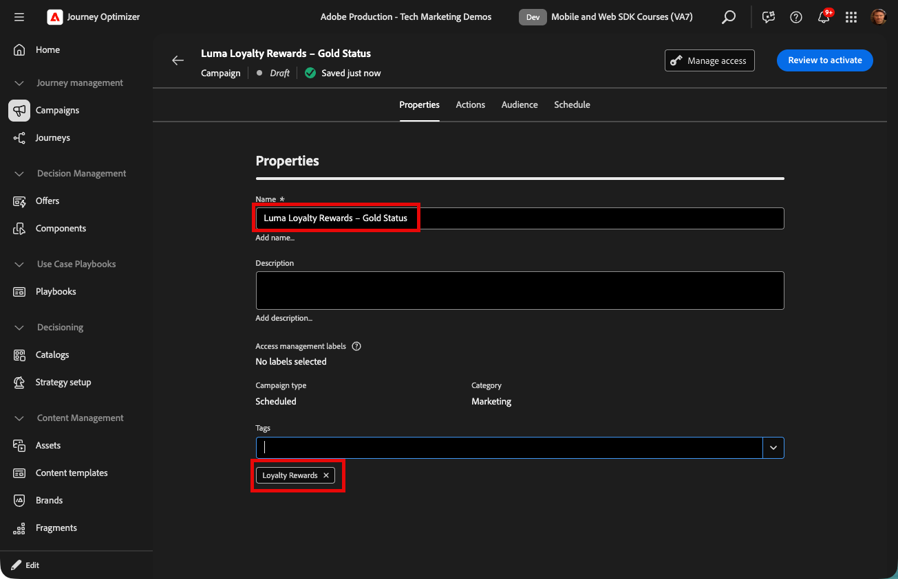
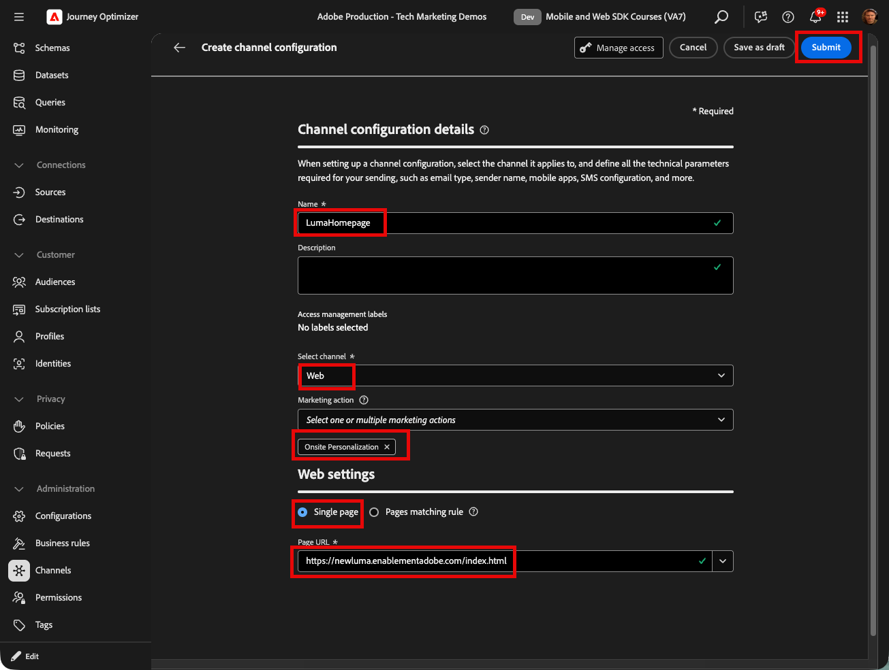
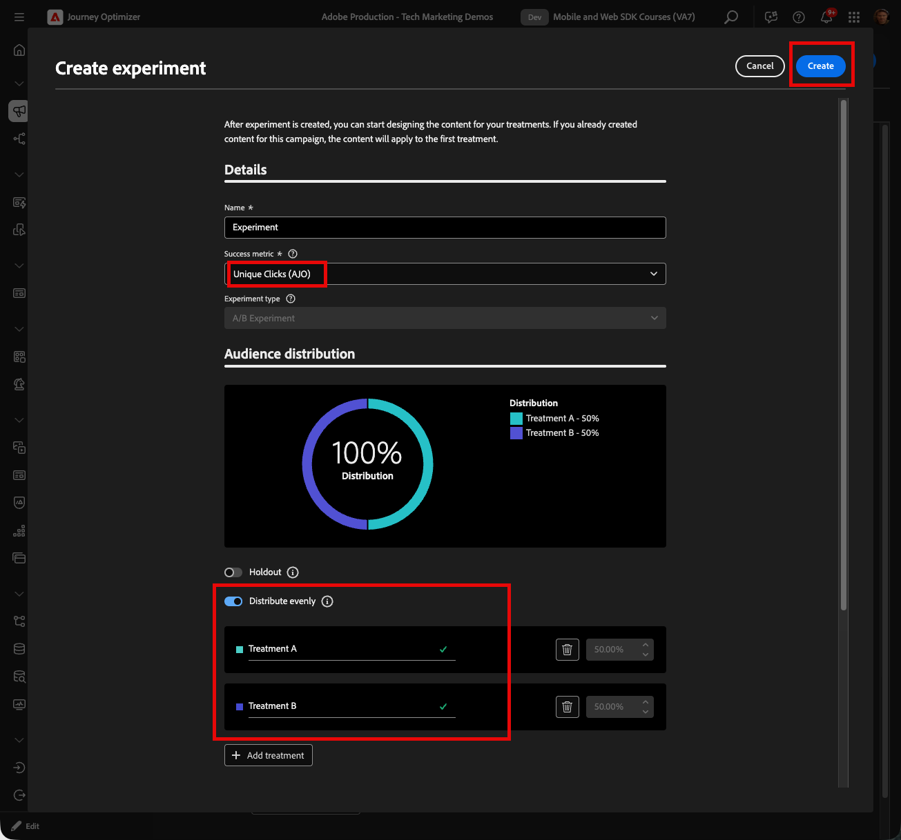
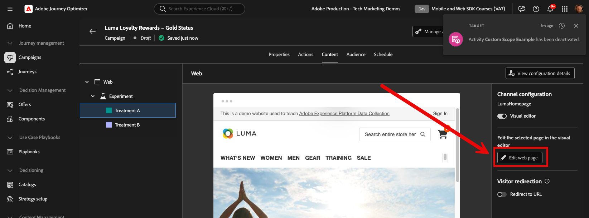
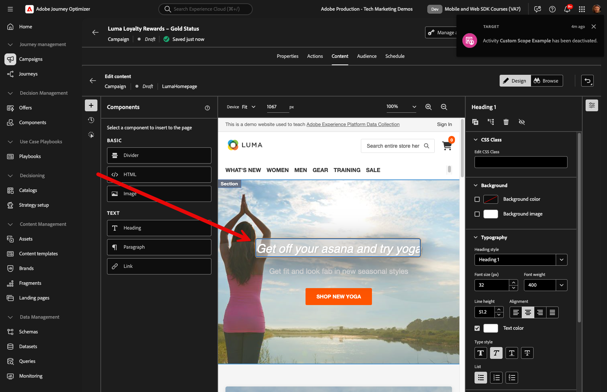
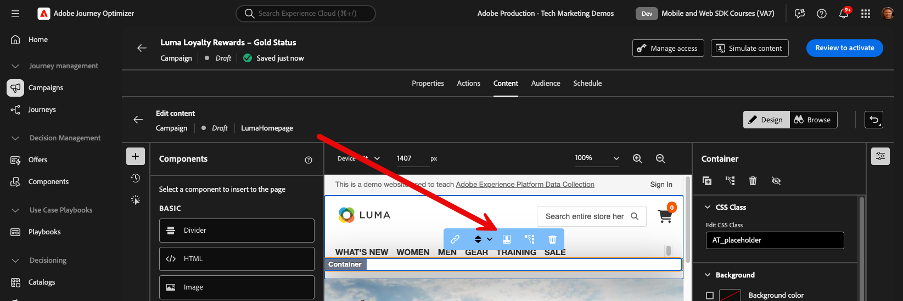
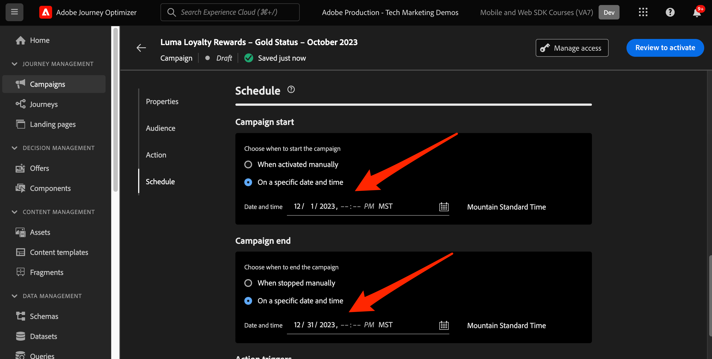
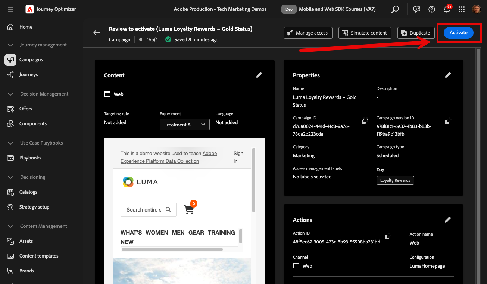

# 使用Web SDK設定Journey Optimizer Web Channel

瞭解如何使用Adobe Experience Platform Web SDK實作Adobe Journey Optimizer [Web channel](https://experienceleague.adobe.com/zh-hant/docs/journey-optimizer/using/web/get-started-web)。 本課程涵蓋基本Web通路先決條件、設定的詳細步驟，並深入探討以忠誠度狀態為中心的使用案例。

依照本課程，Journey Optimizer使用者可以使用Journey Optimizer網頁設計工具，透過網路管道進行進階的線上個人化。

## 學習目標

在本課程結束時，您能夠：

* 瞭解Web SDK在提供網路頻道體驗方面的功能和重要性。
* 利用範例Luma忠誠度獎勵使用案例，從頭到尾瞭解建立網路通路行銷活動的流程。
* 在介面中設定促銷活動屬性、動作和排程。
* 瞭解Adobe Experience Cloud Visual Editing Helper擴充功能的功用和優點。
* 瞭解如何使用網頁設計工具編輯網頁內容，包括影像、標題和其他元素。
* 瞭解如何使用優惠決定元件將優惠插入網頁。
* 請熟悉確保網路頻道行銷活動品質和成功的最佳實務。

## 先決條件

若要完成本節中的課程，您必須先：

* 完成所有Platform Web SDK初始設定的課程，包括設定資料元素和規則。
* 確認您的Adobe Experience Platform Web SDK標籤擴充功能版本為2.16或更高版本。
* 完成「設定Experience Platform」課程，包括建立`Luma Loyalty Rewards – Gold Status`對象的練習。
* 已下載並啟用[Adobe Experience Cloud Visual Editing Helper瀏覽器擴充功能](https://chromewebstore.google.com/detail/adobe-experience-cloud-vi/kgmjjkfjacffaebgpkpcllakjifppnca)。
* 如果您使用Journey Optimizer網頁設計工具來製作您的網路頻道體驗，請務必使用Google Chrome或Microsoft®Edge瀏覽器。
* 確認您的瀏覽器允許第三方Cookie。 可能也需要停用瀏覽器中的任何廣告封鎖程式。

  >[!CAUTION]
  >
  > 在Journey Optimizer網頁設計工具中，由於下列其中一個原因，某些網站可能無法可靠地開啟：
  > 
  > 1. 網站有嚴格的安全政策。
  > 1. 網站內嵌於iframe中。
  > 1. 無法從外部存取客戶的QA或中繼網站（這是內部網站）。

* 建立Web體驗並包含來自Adobe Experience Manager Assets Essentials資料庫的內容時，需要[設定用於發佈此內容的子網域](https://experienceleague.adobe.com/zh-hant/docs/journey-optimizer/using/web/configure-web-channel/web-delegated-subdomains)。
* 如果使用內容實驗功能，請確保您的網路資料集也包含在您的報告設定中。
* 目前，支援兩種型別的實施，以便在Web屬性上製作和傳送Web Channel行銷活動：
   * 僅限使用者端：若要修改您的網站，您必須實作Adobe Experience Platform Web SDK。
   * 混合模式：您可以利用平台Edge Network伺服器API來要求個人化伺服器端。 來自API的回應會提供給Adobe Experience Platform Web SDK，以便在使用者端上轉譯修改。 如需詳細資訊，請參閱Adobe Experience Platform Edge Network伺服器API檔案。 此部落格中提供混合模式的其他詳細資訊和實作範例。

  >[!NOTE]
  >
  >目前不支援僅伺服器端實作。

## 術語

首先，您應該瞭解在網路通路行銷活動中使用的術語。

* **網頁管道**：透過網頁進行通訊或內容傳遞的媒體。 就本指南而言，其內容指Adobe Journey Optimizer中，透過使用Platform Web SDK將個人化內容傳遞至網站訪客的機制。
* **Web表面**：參考由傳送內容的URL所識別的Web屬性。 它可以包含單一或多個網頁。
* **Journey Optimizer網頁設計工具**： Journey Optimizer中的特定工具或介面，使用者可在此設計其Web Channel體驗。
* **Adobe Experience Cloud Visual Editing Helper**：可協助您以視覺化方式編輯及設計網頁頻道體驗的瀏覽器擴充功能。
* **Datastream**： Adobe Experience Platform服務中的組態，可確保Web通路體驗能夠傳遞。
* **合併原則**：確保正確啟用和發佈傳入行銷活動的設定。
* **對象**：符合特定條件的使用者或網站訪客的特定區段。
* **網頁設計工具**：此介面或工具可協助您以視覺化方式編輯及設計網頁體驗，而不需深入探索程式碼。
* **運算式編輯器**：網頁設計工具中的工具，可讓使用者根據資料屬性或其他條件，將個人化加入網頁內容。
* **優惠決定元件**：網頁設計工具中的元件，可協助您根據決定管理，決定最適合向特定訪客顯示的優惠。
* **內容實驗**：測試不同內容變異的方法，以找出哪個在所需量度（例如傳入點按次數）方面表現最佳。
* **處理**：在內容實驗的內容中，處理是指要針對其他內容進行測試的特定內容變化。
* **模擬**：一種預覽機制，可在為即時受眾啟用網路頻道體驗之前，將其視覺化。

## 設定資料串流

您已將Adobe Experience Platform服務新增至資料流。 現在您需要啟用Adobe Journey Optimizer選項，才能傳遞網路頻道體驗。

若要在資料流中設定Adobe Journey Optimizer：

1. 移至[資料彙集](https://experience.adobe.com/#/data-collection){target="blank"}介面。
1. 在左側導覽中，選取&#x200B;**[!UICONTROL 資料串流]**。
1. 選取先前建立的Luma Web SDK資料流。

   

1. 選取Adobe Experience Platform服務中的&#x200B;**[!UICONTROL 編輯]**。

   

1. 勾選&#x200B;**[!UICONTROL Adobe Journey Optimizer]**&#x200B;方塊。

1. **[!UICONTROL 儲存]**&#x200B;更新的設定。

   

這可確保Adobe Experience Platform Edge Network正確處理Journey Optimizer的傳入事件。

## 設定合併原則

確定已在啟用&#x200B;**[!UICONTROL Active-On-Edge合併原則]**&#x200B;選項的情況下定義合併原則。 Journey Optimizer傳入頻道會使用此合併原則選項，以確保在邊緣準確啟用和發佈傳入行銷活動。

若要在合併原則中設定選項：

1. 前往Experience Platform或Journey Optimizer介面中的&#x200B;**[!UICONTROL 客戶]** > **[!UICONTROL 設定檔]**&#x200B;頁面。
1. 確定您位於教學課程所用的沙箱中
1. 選取&#x200B;**[!UICONTROL 合併原則]**&#x200B;索引標籤。
1. 選取您的原則（通常最好使用[!UICONTROL 預設時間型]原則），並在&#x200B;**[!UICONTROL 設定]**&#x200B;步驟中切換&#x200B;**[!UICONTROL Edge上主動合併原則]**&#x200B;選項。

   

## 設定用於內容實驗的網路資料集

若要在Web Channel行銷活動中使用內容實驗，您必須確保使用的網路資料集也包含在您的報告設定中。 Journey Optimizer報表系統以唯讀方式使用資料集來填入現成可用的內容實驗報表。

[新增內容實驗報告的資料集在本節](https://experienceleague.adobe.com/zh-hant/docs/journey-optimizer/using/reporting/channel-report/reporting-configuration#add-datasets)中有詳細說明。

## 使用案例概述 — 忠誠度獎勵

在本課程中，忠誠度獎勵使用案例範例用於詳細說明使用網路SDK的網路通路體驗實作。

此使用案例可讓您更瞭解Journey Optimizer如何運用Journey Optimizer行銷活動和Web設計工具，協助為客戶提供最佳傳入體驗。

由於本教學課程的目標是實施者，因此請注意，本課程涉及Journey Optimizer的大量介面工作。 雖然這類介面任務通常由行銷人員處理，但對於實作者來說，將insight帶入流程可能有所助益，即使他們通常不需要負責建立網路通路行銷活動。

### 建立熟客獎勵行銷活動

現在您已擷取我們的忠誠度資料範例並建立我們的區段，請在Adobe Journey Optimizer中建立忠誠度獎勵網路管道行銷活動。

若要建立範例行銷活動：

1. 開啟[Journey Optimizer](https://experience.adobe.com/journey-optimizer/home){target="_blank"}介面

   >[!NOTE]
   >
   > 結構描述、資料集和對象都是常見的Experience Platform建構，因此也可以在Journey Optimizer介面中建置。

1. 在左側導覽中導覽至&#x200B;**[!UICONTROL 歷程管理]** > **[!UICONTROL 行銷活動]**
1. 按一下右上角的&#x200B;**[!UICONTROL 建立行銷活動]**。
1. 選擇行銷活動的型別。 若為「熟客獎勵」使用案例，請選擇&#x200B;**排程 — 行銷**。

   

1. 新增一些其他詳細資料至新的網路頻道行銷活動。 首先，為行銷活動命名。 呼叫它`Luma Loyalty Rewards – Gold Status`。 您可以選擇新增說明至行銷活動。 同時新增&#x200B;**[!UICONTROL 標籤]**&#x200B;以改進整體行銷活動分類法。

   

1. 前往&#x200B;**[!UICONTROL 動作]**&#x200B;標籤
1. 選擇&#x200B;**[!UICONTROL Web]**&#x200B;作為&#x200B;**[!UICONTROL 動作名稱]**。
1. 選取&#x200B;**[!UICONTROL 建立新組態]**&#x200B;做為&#x200B;**[!UICONTROL Web組態]**。
1. 在「通道組態」詳細資訊中，輸入下列內容：
   1. `LumaHomepage`作為&#x200B;**[!UICONTROL 名稱]**。
   1. **[!UICONTROL 網頁]**&#x200B;做為&#x200B;**[!UICONTROL 頻道]**。
   1. **[!UICONTROL 現場Personalization]**&#x200B;作為&#x200B;**[!UICONTROL 行銷動作]**。
   1. **[!UICONTROL 單一頁面]**&#x200B;作為&#x200B;**[!UICONTROL 網頁設定]**。
   1. `https://luma.enablementadobe.com/index.html`作為&#x200B;**[!UICONTROL 頁面URL]**。
1. **[!UICONTROL 提交]**&#x200B;新頻道設定

   
1. 在含有行銷活動的瀏覽器標籤中，選取新的`LumaHomepage`設定

   >[!TIP]
   >
   > 如果新的設定未出現在下拉式清單中，請移至[!UICONTROL 屬性]標籤，然後返回[!UICONTROL 動作]標籤，並再次檢查下拉式清單。

## 實驗忠誠度獎勵內容

現在您已選取您的[!UICONTROL 網頁組態]，在&#x200B;**[!UICONTROL 動作]**&#x200B;區段中，您可以選擇建立實驗，以測試哪些內容更適合`Luma Loyalty Rewards – Gold Status`對象。 讓我們建立並測試兩個處理作為行銷活動設定的元件。

若要建立內容實驗：

1. 按一下&#x200B;**[!UICONTROL 建立實驗]**。

   

1. 請先選擇&#x200B;**[!UICONTROL 成功量度]**。 這是判斷內容有效性的量度。 選擇&#x200B;**[!UICONTROL 不重複點按]**，以檢視哪些內容處理在網頁體驗CTA上產生更多點按。

1. 您可以選擇指定不接收這兩種處理方式其中之一的&#x200B;**[!UICONTROL 保留]**。 現在不要勾選此方塊。

1. 也可以選擇選擇平均&#x200B;**[!UICONTROL 分配]**。 核取此選項，以確保處理分割始終平均分割。

1. 選取&#x200B;**[!UICONTROL 新增處理]**，讓您在實驗中有兩個處理。

1. 選取「**[!UICONTROL 建立]**」。

   

[進一步瞭解Adobe Journey Optimizer網路頻道](https://experienceleague.adobe.com/zh-hant/docs/journey-optimizer/using/content-management/content-experiment/get-started-experiment)中的內容實驗。

### 使用視覺化協助程式編輯內容

現在，讓我們編寫網頁頻道體驗。 首先，安裝適用於Google Chrome和Microsoft® Edge的[Adobe Experience Cloud Visual Editing Helper](https://chromewebstore.google.com/detail/adobe-experience-cloud-vi/kgmjjkfjacffaebgpkpcllakjifppnca)瀏覽器擴充功能（如果尚未安裝）。 安裝後，請繼續進行Journey Optimizer介面中的步驟：

1. 選取&#x200B;**[!UICONTROL 編輯內容]** （或導覽至行銷活動的「內容」標籤）。 由於您輸入了單一頁面URL作為介面，因此您應該已準備好開始在撰寫器中工作。

   

1. 現在，按一下&#x200B;**[!UICONTROL 編輯網頁]**&#x200B;開始編寫您實驗的處理A。

   

1. 首先，使用網頁撰寫器編輯某些元素。 使用內容功能表來編輯Luma主圖影像標題。 調整右側內容窗格的樣式。

   

1. 同時使用&#x200B;**[!UICONTROL 運算式編輯器]**&#x200B;將個人化新增至容器。

   
   

1. 請確保已正確追蹤點選體驗。 從內容功能表選擇&#x200B;**[!UICONTROL 按一下追蹤元素]**。

   

有許多選項可個人化傳訊。

### HTML設計變更

如果您想要更進階，或對網站進行自訂變更，以作為忠誠獎勵行銷活動的元件，可使用一些方法。 探索處理B中的其中一些。

使用&#x200B;**[!UICONTROL 元件]**&#x200B;窗格將HTML或其他內容直接新增至Luma網站。

在頁面頂端新增新的HTML元件。 再次開啟&#x200B;**[!UICONTROL 運算式編輯器]**&#x200B;以編輯HTML。

或者，從&#x200B;**[!UICONTROL 修改]**&#x200B;窗格新增HTML編輯。 此窗格可讓您在頁面上選取元件，並從設計工具介面編輯元件。

在編輯器中，為`Luma Loyalty Rewards – Gold Status`對象新增HTML。 選取&#x200B;**[!UICONTROL 驗證]**。

現在，請檢閱新的自訂HTML元件，以掌握其使用範圍和操作方式。

### 將行銷活動目標定位至對象

依預設，促銷活動對所有網站訪客都有效。 就此使用案例而言，只有金級狀態獎勵會員應該會看到體驗。 若要將內容鎖定在此對象：

1. 導覽至&#x200B;**[!UICONTROL 對象]**&#x200B;標籤

1. 在&#x200B;**[!UICONTROL 身分識別名稱空間]**&#x200B;欄位中，選取用於識別所選區段內個人的名稱空間。 由於您是在Luma網站上部署行銷活動，因此可以選擇ECID名稱空間。 `Luma Loyalty Rewards – Gold Status`對象內缺少各種身分識別中的ECID名稱空間的設定檔，不會成為Web Channel促銷活動的目標。

1. **[!UICONTROL 選取客群]**

   

1. 選擇您在`Luma Loyalty Rewards - Gold Status`設定Experience Platform[課程中建立的](setup-experience-platform.md)對象。
1. **[!UICONTROL 儲存]**&#x200B;促銷活動的對象

   

<!--
### Simulate Loyalty Rewards Content

Look at a preview of the modified web page before activating the campaign. Keep in mind that you must have test profiles configured to simulate web channel experiences.

To simulate the experience:

1. Select **[!UICONTROL Simulate content]** within the campaign.

    

1. Choose a test profile to receive the simulation. Keep in mind that the test profile should be in the `Luma Loyalty Rewards – Gold Status` audience to receive the proper treatment.

1. The preview is displayed for the test profile.

1. Select the [!UICONTROL Content] tab

1. Choose the **[!UICONTROL Page URL]** web surface option to deploy the experience on one page for this campaign. Enter the URL for the Luma page, `https://luma.enablementadobe.com`

1. Once the web surface is defined, select **[!UICONTROL Create]**.

    
-->

### 安排行銷活動

依預設，當您手動啟動和停用行銷活動時，行銷活動將會開始和停止。 但是您可以選擇將其排程為在特定日期和時間開始和停止。 保留預設設定，並選取&#x200B;**檢閱以啟動**：

>[!NOTE]
>
>請記住，針對網路頻道行銷活動，當訪客開啟頁面時會顯示網路體驗。 因此，與Adobe Journey Optimizer中的其他行銷活動型別不同，**[!UICONTROL 動作觸發器]**&#x200B;區段無法設定。

### 啟用忠誠度獎勵行銷活動

系統會提示您最後一次確認行銷活動詳細資料。 選取&#x200B;**[!UICONTROL 啟動]**。 行銷活動最多可能需要15分鐘的時間在網站上上線。

### 熟客方案獎勵QA

您可使用一些登入來模擬「金級狀態」使用者，並符合您的行銷活動資格。 您必須在[設定Experience Platform](setup-experience-platform.md)中上傳範例資料，並在網站上使用這些認證建立帳戶，這些資料才能運作。

1. `cleavlandeuler@emailsim.io`/`test`
1. `leftybeagen@emailsim.io`/`test`
1. `jenimartinho@emailsim.io`/`test`

最佳實務是在啟動後監視行銷活動總覽畫面上的&#x200B;**[!UICONTROL 網頁]**&#x200B;行銷活動統計資料，或按一下&#x200B;**[!UICONTROL 報表]**&#x200B;以取得更深入的報告：

### 使用Adobe Experience Platform Debugger進行網路通道驗證

適用於Chrome和Firefox的Adobe Experience Platform Debugger擴充功能會分析您的網頁，以識別Adobe Experience Cloud解決方案實作中的問題。

您可以使用Luma網站上的除錯工具，驗證生產環境中的網路通道體驗。 一旦忠誠獎勵使用案例啟動並執行，這是最佳實務，以確保所有專案皆正確設定。

[在此使用指南瞭解如何在瀏覽器中設定除錯工具](https://experienceleague.adobe.com/zh-hant/docs/platform-learn/data-collection/debugger/overview)。

若要使用除錯工具開始驗證：

1. 使用網路頻道體驗導覽至Luma網頁。
   <!--
    
    -->
1. 在網頁上，開啟&#x200B;**[!UICONTROL Adobe Experience Platform Debugger]**。
   <!--
    
    -->
1. 瀏覽至&#x200B;**摘要**。 確認&#x200B;**[!UICONTROL 資料串流識別碼]**&#x200B;與您啟用Adobe Journey Optimizer的&#x200B;**[!UICONTROL Adobe資料彙集]**&#x200B;中的&#x200B;**[!UICONTROL 資料串流]**&#x200B;相符。
   <!--
    
    -->
1. 接著，您可以使用各種Luma忠誠度帳戶登入網站，並使用除錯工具驗證傳送至Adobe Experience Platform Edge Network的請求。
   <!--
    
    -->
1. 在「**[!UICONTROL 解決方案]**」下，導覽至&#x200B;**[!UICONTROL Experience Platform Web SDK]**。
   <!--
    
    -->
1. 在&#x200B;**組態**&#x200B;標籤中，開啟&#x200B;**[!UICONTROL 啟用偵錯]**。 這會啟用&#x200B;**[!UICONTROL Adobe Experience Platform Assurance]**&#x200B;工作階段中工作階段的記錄功能。
   <!--
    
    -->
1. 使用各種Luma忠誠度帳戶登入網站，並使用偵錯工具驗證傳送至&#x200B;**[!UICONTROL Adobe Experience Platform Edge網路]**&#x200B;的請求。 應該在&#x200B;**[!UICONTROL Assurance]**&#x200B;中擷取所有這些要求，以進行記錄檔追蹤。
<!--
   
-->

>[!NOTE]
>
>感謝您花時間學習Adobe Experience Platform Web SDK。 如果您有任何疑問、想分享一般意見或有關於未來內容的建議，請在這篇[Experience League社群討論貼文](https://experienceleaguecommunities.adobe.com/adobe-experience-platform-18/tutorial-discussion-implement-adobe-experience-cloud-with-web-sdk-tutorial-248848?profile.language=zh-Hant)上分享
