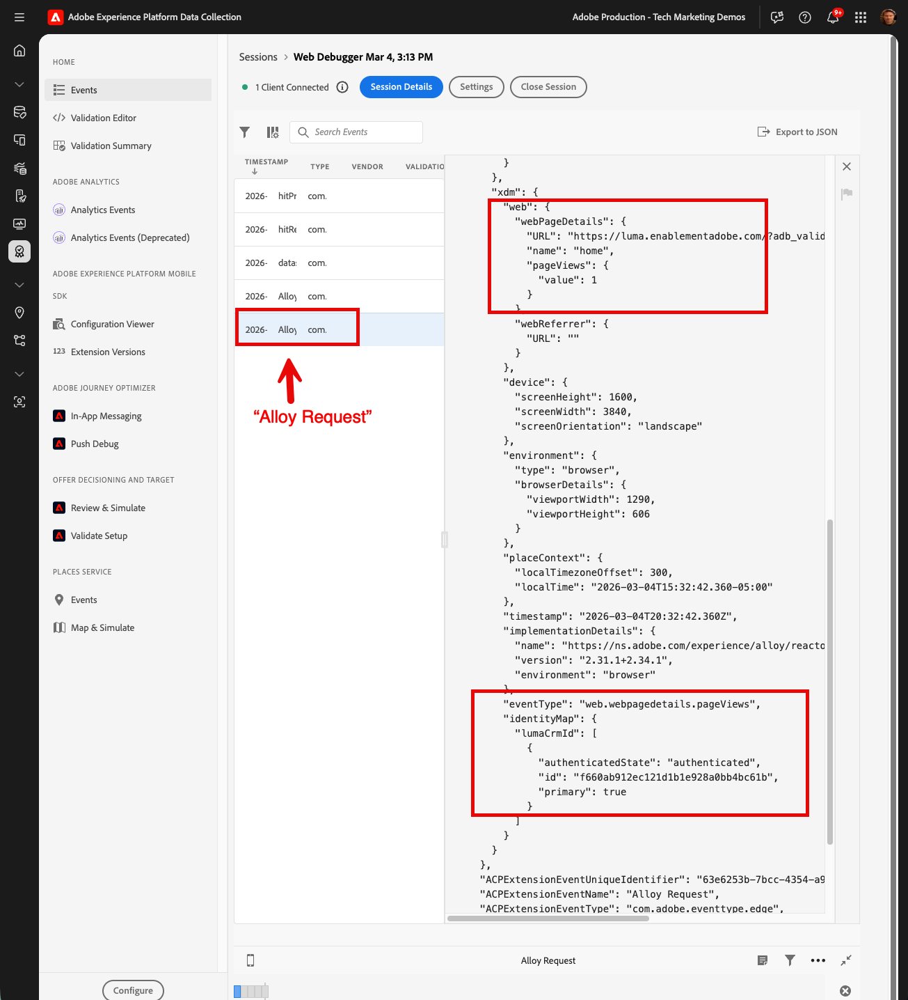

# 使用Experience Platform Assurance驗證Web SDK實作

[Adobe Experience Platform Assurance](https://experienceleague.adobe.com/zh-hant/docs/experience-platform/assurance/home)功能可協助您檢查、校樣、模擬及驗證您收集資料或提供體驗的方式。

如您在[設定資料串流](configure-datastream.md)課程中所學習，Platform Web SDK會先將資料從您的數位屬性傳送至Platform Edge Network。 接著，Platform Edge Network會將資料轉送至資料流中啟用的服務。 您可以使用Assurance驗證從Platform Edge Network傳入和傳出的請求。

## 學習目標

在本課程結束時，您將能夠：

* 開始Assurance工作階段
* 檢視傳送至Platform Edge Network及從Platform傳送的請求

## 先決條件

您熟悉資料收集標籤和[Luma示範網站](https://luma.enablementadobe.com){target="_blank"}，並已完成教學課程中先前的課程：

* [設定XDM結構描述](configure-schemas.md)
* [設定身分名稱空間](configure-identities.md)
* [設定資料流](configure-datastream.md)
* [安裝在標籤屬性中的Web SDK擴充功能](install-web-sdk.md)
* [建立資料元素](create-data-elements.md)
* [擷取身分](create-identities.md)
* [建立標籤規則](create-tag-rule.md)
* [使用Debugger進行驗證](validate-with-debugger.md)

## 開始和檢視Assurance工作階段

有數種方式可開始Assurance工作階段。

### 在Debugger中啟用Edge追蹤

若要啟用Edge追蹤：

1. 移至[Luma示範網站](https://luma.enablementadobe.com)，然後使用偵錯工具來[將網站上的標籤屬性切換為您自己的開發屬性](validate-with-debugger.md#use-the-experience-platform-debugger-to-map-to-your-tags-property)
1. 請確認您已登入Debugger，且顯示您的組織名稱。 如果顯示的是您的使用者名稱，請先登出再嘗試重新登入。
1. 在&#x200B;**[!UICONTROL Experience Platform Debugger]**&#x200B;的左側導覽中，選取&#x200B;**[!UICONTROL 記錄檔]**
1. 選取&#x200B;**[!UICONTROL Edge]**&#x200B;索引標籤，然後選取&#x200B;**[!UICONTROL 連線]**

   

1. 目前為空白

   

1. 重新整理[Luma首頁](https://luma.enablementadobe.com/)並再次檢查&#x200B;**[!UICONTROL Experience Platform Debugger]**，檢視資料進入Platform Edge Network的情況。 在未來的課程中，當您在資料流中啟用服務時，您將能夠看到傳出請求。

   Edge追蹤中的

   每次在Adobe Experience Platform Debugger中啟用Edge追蹤時，Assurance工作階段都會在背景啟動。 雖然您可以在這裡檢閱資訊，但您可能會發現Assurance介面更實用。

1. 啟用Edge追蹤後，您會在頂端看到外寄連結圖示。 選取圖示以開啟Assurance。

   

1. 隨即開啟新的瀏覽器索引標籤，其中包含Assurance介面。

### 從Assurance介面開始Assurance工作階段

1. 開啟[資料收集介面](https://experience.adobe.com/#/data-collection/home){target="_blank"}
1. 在左側導覽中選取Assurance
1. 選取建立工作階段
   
1. 使用&#x200B;**[!UICONTROL 深層連結連線]**&#x200B;選項
1. 選取&#x200B;**[!UICONTROL 開始]**
1. 為工作階段命名，例如`Luma Web SDK validation`
1. 作為&#x200B;**[!UICONTROL 基底URL]**，請輸入`https://luma.enablementadobe.com/`
   
1. 在下一個畫面中，選取&#x200B;**[!UICONTROL 複製連結]**
1. 選取圖示以將連結複製到剪貼簿
1. 在瀏覽器中貼上URL，這會使用特殊的URL引數`adb_validation_sessionid`開啟Luma網站並啟動工作階段
1. 在Assurance介面中，您應該會看到一則訊息，指出已成功連線至工作階段，而且您應該會看到Assurance介面中擷取的事件。
   

## 驗證Web SDK實作的目前狀態

由於我們尚未啟用資料流中的任何服務，因此在此階段的實作中檢視的資訊有限。

### 使用`Alloy Request`檢視來自Web SDK的傳入要求

我們可以檢視來自Web SDK的傳入點選，因為它已被Edge接收：

1. 選取`Alloy Request`列
1. 檢視原始事件（或展開[!UICONTROL 裝載] > `ACPExtensionEventData`中的節點），直到您找到具有熟悉變數的XDM物件為止：

   

### 在`Alloy Response Handle`中檢視回應

如您所知，在Platform Edge Network上產生Experience Cloud ID (ECID)後，Web SDK回應中會顯示該ID 。 在Assurance中檢視的回應中，讓我們來尋找它：

1. 篩選並選取事件名稱為`Alloy Response Handle`的列。
1. 功能表會顯示在右側。 選取`+`旁邊的`[!UICONTROL ACPExtensionEventData]`符號
1. 選取`[!UICONTROL payload > 0 > payload > 0 > namespace]`以深入研究。 最後`0`下方顯示的ID對應至`ECID`。 您知道值顯示在`namespace`下符合`ECID`

   

   >[!CAUTION]
   >
   >由於視窗的寬度，您可能會看到截斷的ECID值。 只要選取介面中的操作框列，然後向左拖曳即可檢視整個ECID。

在未來的課程中，您可以使用Assurance來驗證到達資料流中啟用的Adobe應用程式的完全處理負載。

現在頁面上會引發XDM物件，且您已瞭解如何驗證您的資料收集，您就可以使用Platform Web SDK設定Experience Platform和個別Adobe應用程式了。

>[!NOTE]
>
>感謝您花時間學習Adobe Experience Platform Web SDK。 如果您有任何疑問、想分享一般意見或有關於未來內容的建議，請在這篇[Experience League社群討論貼文](https://experienceleaguecommunities.adobe.com/adobe-experience-platform-18/tutorial-discussion-implement-adobe-experience-cloud-with-web-sdk-tutorial-248848)上分享
