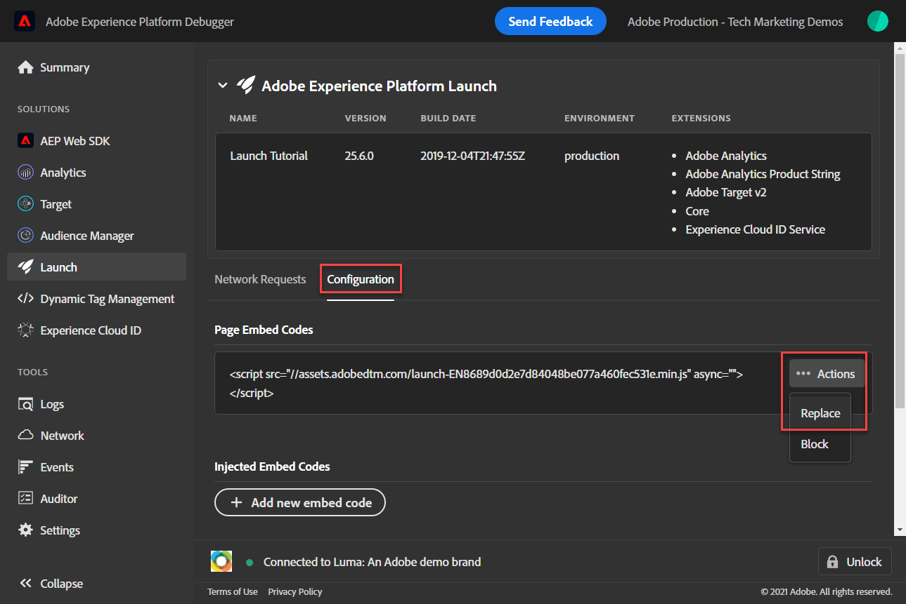
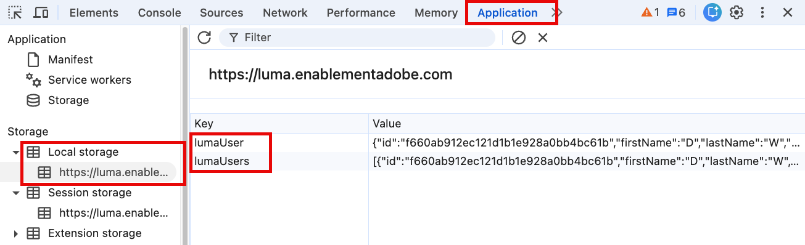

# 使用Experience Platform Debugger驗證Web SDK實作

了解如何使用 Adob&#x200B;&#x200B;e Experience Platform Debugger 驗證您的 Adob&#x200B;&#x200B;e Experience Platform Web SDK 實施。

Experience Platform Debugger是[Chrome擴充功能](https://chromewebstore.google.com/detail/adobe-experience-platform/bfnnokhpnncpkdmbokanobigaccjkpob)，可協助您檢視在網頁中實作的Adobe技術。 Experience Platform Debugger和瀏覽器的開發人員主控台，是驗證和偵錯Web SDK實作瀏覽器端的最佳方式。 下一個課程將涵蓋Adobe Experience Platform Assurance，提供資料進出平台Edge Network時的最佳檢視。

如果您以前從未使用過Debugger，您可以觀看這段5分鐘的概述影片：

>[!VIDEO](https://video.tv.adobe.com/v/32156?learn=on&enablevpops)

在本課程中，您使用[Adobe Experience Platform Debugger擴充功能](https://chromewebstore.google.com/detail/adobe-experience-platform/bfnnokhpnncpkdmbokanobigaccjkpob)，將[Luma示範網站](https://luma.enablementadobe.com)上以硬式編碼撰寫的標籤屬性取代為您自己的屬性。

此技巧稱為環境切換，您日後在自己的網站上使用標籤時，此技巧將有所幫助。 它可讓您在瀏覽器中載入您的生產網站，但搭配您的&#x200B;*開發*&#x200B;標籤程式庫。 此功能可讓您安心地變更及驗證標籤，而不受定期程式碼發行的影響。 畢竟，將行銷標籤發行與定期程式碼發行分開，是客戶使用標籤的主要原因之一！

## 學習目標

在本課程結束時，您將能夠使用除錯工具：

* 載入替代標籤程式庫
* 驗證使用者端XDM事件是否如預期般擷取及傳送資料給Platform Edge Network
* 啟用Edge追蹤以檢視Platform Edge Network傳送的伺服器端請求

## 先決條件

您熟悉資料收集標籤和[Luma示範網站](https://luma.enablementadobe.com/){target="_blank"}，並已完成教學課程中先前的課程：

* [設定XDM結構描述](configure-schemas.md)
* [設定身分名稱空間](configure-identities.md)
* [設定資料流](configure-datastream.md)
* [安裝在標籤屬性中的Web SDK擴充功能](install-web-sdk.md)
* [建立資料元素](create-data-elements.md)
* [擷取身分](create-identities.md)
* [建立標籤規則](create-tag-rule.md)

## 使用Debugger載入替代標籤程式庫

Experience Platform Debugger有一種很酷的功能，可讓您使用其他標籤程式庫取代現有的標籤程式庫。 此技巧對於驗證相當實用，可讓我們略過本教學課程中的許多實作步驟。

1. 確定您已開啟[Luma示範網站](https://luma.enablementadobe.com){target="_blank"}，並選取Experience Platform Debugger擴充功能圖示
1. Debugger將會開啟並顯示硬式編碼實作的一些詳細資料（您可能需要在開啟Debugger後重新載入Luma網站）
1. 確認Debugger為&quot;**[!UICONTROL 已連線至Luma]**&quot; （如下圖所示），然後選取&quot;**[!UICONTROL 鎖定]**&quot;圖示以將Debugger鎖定至Luma網站。
1. 選取&#x200B;**[!UICONTROL 登入]**&#x200B;按鈕，使用您的Adobe ID登入Adobe Experience Cloud，然後選取您的組織。

   >[!TIP]
   >
   > 如果偵錯工具在登入後顯示的是您的使用者名稱，而非您的組織名稱，請登出然後再試一次。

   

1. 現在，前往左側導覽中的&#x200B;**[!UICONTROL Experience Platform標籤]**
1. 選取&#x200B;**[!UICONTROL 組態]**&#x200B;索引標籤
1. 在顯示&#x200B;**[!UICONTROL 頁面內嵌程式碼]**&#x200B;的右側，開啟&#x200B;**[!UICONTROL 動作]**&#x200B;下拉式清單，然後選取&#x200B;**[!UICONTROL 取代]**

   

1. 由於您已通過驗證，Debugger將會提取您可用的標籤屬性和環境。 選取您的屬性
1. 選取您的`Development`環境
   

   >[!TIP]
   >
   > 如果您無法使用下拉式清單選取您的屬性和環境，請改至[!UICONTROL 標籤] > [!UICONTROL 環境] > [!UICONTROL 開發] > [!UICONTROL 安裝]，然後選取圖示以複製內嵌程式碼並將其貼到Debugger中：
   > 

1. 選取&#x200B;**[!UICONTROL 套用]**&#x200B;按鈕

1. Luma網站現在將使用您自己的標籤屬性&#x200B;_重新載入_。

   已取代

繼續進行教學課程的過程中，您會使用此技巧將Luma網站對應至您自己的標籤屬性，以驗證您的Platform Web SDK實施。 在您自己的網站上使用標籤時，您可以使用這種相同的技巧，來驗證生產環境網站上的開發標籤程式庫。

## 使用Debugger進行驗證

### 驗證網路請求和XDM

您可以使用Debugger驗證從您的Platform Web SDK實作觸發的使用者端信標，以檢視傳送至Platform Edge Network的資料：

1. 前往左側導覽中的&#x200B;**[!UICONTROL 摘要]**，檢視標籤屬性的詳細資料

   

1. 現在，前往左側導覽中的&#x200B;**[!UICONTROL Experience Platform Web SDK]**，檢視&#x200B;**[!UICONTROL 網路要求]**
1. 開啟&#x200B;**[!UICONTROL 事件]**&#x200B;列

   

1. 請注意，您如何看到您在`web.webPageDetails.pageView`更新變數[!UICONTROL 動作中指定的]事件型別，以及其他在`AEP Web SDK ExperienceEvent`欄位群組後面的現成可用變數

   

1. 向下捲動至`web`物件，選取以開啟並檢查`webPageDetails.name`。 它們應該符合首頁上對應的`adobeDataLayer`資料層變數

>[!TIP]
>
> 若要檢視和比較首頁上的`adobeDataLayer`資料層：
>
> 1. 在Luma首頁上，開啟瀏覽器開發人員工具。 若是Chrome，請選取鍵盤上的按鈕`F12`
> 1. 選取&#x200B;**[!UICONTROL 主控台]**&#x200B;索引標籤
> 1. 輸入`adobeDataLayer`並在鍵盤上選取`Enter`以開啟資料層值

驗證在產品頁面、購物車頁面及訂單確認頁面上設定的事件和變數。

### 驗證身分對應

您也可以驗證「身分對應」詳細資料：

1. 在&#x200B;**[!DNL Sign In]** Luma網站[上選取](https://luma.enablementadobe.com/){target=_blank}。 選取&#x200B;**[!DNL Create Account]**&#x200B;並使用認證`test@test.com`/`test`建立帳戶

1. 使用Debugger中的&#x200B;**[!UICONTROL 跳至最近的]**&#x200B;捷徑，快速移至最近的Web SDK事件（這是最後一欄）。 選取&#x200B;**[!UICONTROL 事件]**&#x200B;列以開啟詳細資料強制回應視窗。

1. 在模組內搜尋&#x200B;**identityMap**。 您應該會看見具有authenticatedState、id和主要指定之三個金鑰的`lumaCrmId`：
   Debugger中的

## 使用瀏覽器開發人員工具進行驗證

許多網頁開發人員可能偏好在瀏覽器的開發人員工具中檢視實作。 這點尤其重要，因為並非所有瀏覽器都支援Debugger擴充功能。 此外，由於架構靈活，您可以檢查其他實施詳細資訊，例如Cookie和回應詳細資訊。

### 驗證網路要求

Web SDK要求詳細資訊也會顯示在瀏覽器的網頁開發人員工具&#x200B;**網路**&#x200B;標籤中（假設網站正在載入您的標籤庫）。

1. 開啟瀏覽器的Web開發人員工具&#x200B;**網路**&#x200B;標籤，然後重新載入頁面。 篩選具有`/ee`的呼叫，以找出該呼叫、選取它，然後檢視&#x200B;**標題**&#x200B;索引標籤和&#x200B;**承載**&#x200B;索引標籤

   

1. 前往&#x200B;**預覽**&#x200B;標籤，並記下ECID值如何包含在網路回應中。

   

   >[!NOTE]
   >
   > ECID值會顯示在網路回應中。 它不會包含在網路要求的`identityMap`部分中，也不會以此格式儲存在Cookie中。

### Web SDK cookie

進入開發人員工具時，讓我們來看看瀏覽器中的Cookie Web SDK設定。 開啟Application > Cookie > https://luma.enablementadobe.com

您應該會看到由Web SDK設定的數個Cookie：

* kndctr_[IMS_ORGID]_AdobeOrg_identity：這會儲存與ECID相關的資料
* kndctr_[IMS_ORGID]_AdobeOrg_cluster：這會儲存所使用的資料中心位置，以便後續的網路呼叫路由至相同的Edge伺服器
* AMCV_[IMS_ORGID]%40AdobeOrg：這是舊版AMCV Cookie，由SDK Experience Cloud前置程式庫所使用，且已設定，因為我們將預設值&#x200B;**[!UICONTROL 將ECID移轉至VisitorAPI以移轉至Adobe Experience Platform Web SDK標籤擴充功能中選取的Web SDK]**&#x200B;設定保留下來。 此設定很重要，您必須在將頁面從舊版資料庫移轉至Web SDK時啟用此設定，但在移轉所有頁面一段特定時間後，才能停用此設定。

如果您清除這些Cookie並重新載入頁面，您可能會注意到在`.demdex.net`網域上設定了額外的第三方Cookie。 這些設定是因為我們在Adobe Experience Platform Web SDK標籤擴充功能中保留預設的&#x200B;**[!UICONTROL 使用第三方Cookie]**： **[!UICONTROL 已啟用]**&#x200B;設定。 如果您的瀏覽器不允許協力廠商Cookie，當您重新載入頁面時，系統將會移除這些協力廠商Cookie。

### Luma本機儲存體

Luma示範網站僅使用HTML、CSS和JavaScript等使用者端技術。 除了網站預設狀態所使用的Experience Cloud實作之外，沒有任何後端儲存機制。 如使用者名稱詳細資訊等資訊只會使用localStorage儲存在瀏覽器的本機。 因此，如果您刪除此資訊或使用無痕者視窗，您會注意到您可能需要重新建立先前建立的測試使用者帳戶。

接下來，瞭解如何使用Adobe Experience Platform Assurance從Platform Edge Network接收及傳輸這些網路請求時，如何驗證這些網路請求！

>[!NOTE]
>
>感謝您花時間學習Adobe Experience Platform Web SDK。 如果您有任何疑問、想分享一般意見或有關於未來內容的建議，請在這篇[Experience League社群討論貼文](https://experienceleaguecommunities.adobe.com/adobe-experience-platform-18/tutorial-discussion-implement-adobe-experience-cloud-with-web-sdk-tutorial-248848?profile.language=zh-Hant)上分享
