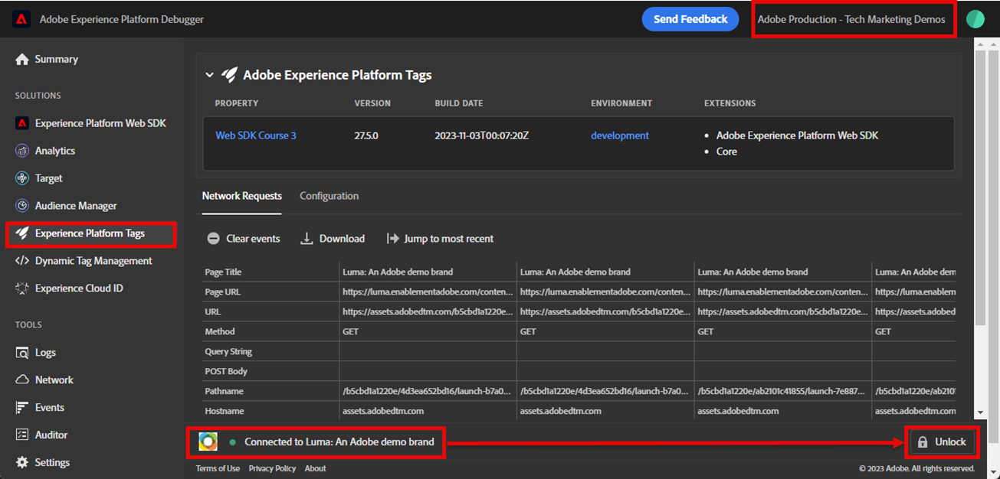
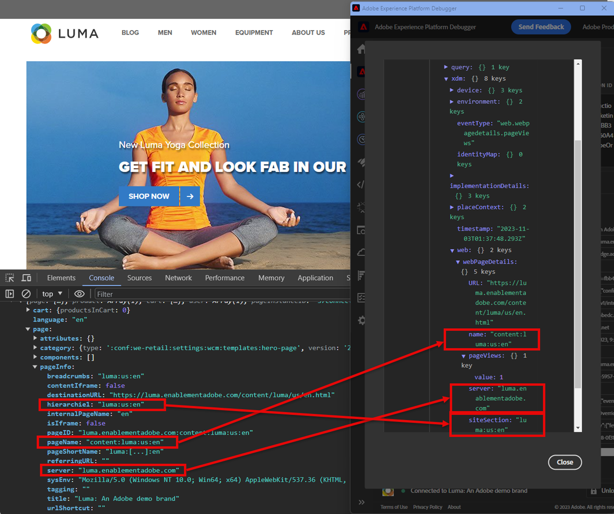

# 使用Experience Platform Debugger驗證Web SDK實作

了解如何使用 Adob&#x200B;&#x200B;e Experience Platform Debugger 驗證您的 Adob&#x200B;&#x200B;e Experience Platform Web SDK 實施。

Experience Platform Debugger是適用於Chrome和Firefox瀏覽器的擴充功能，可協助您檢視在網頁中實作的Adobe技術。 下載您偏好瀏覽器的版本：

* [Firefox擴充功能](https://addons.mozilla.org/zh-TW/firefox/addon/adobe-experience-platform-dbg/)
* [Chrome擴充功能](https://chromewebstore.google.com/detail/adobe-experience-platform/bfnnokhpnncpkdmbokanobigaccjkpob)

如果您以前從未使用過除錯程式，您可以觀看這段5分鐘的概述影片：

>[!VIDEO](https://video.tv.adobe.com/v/32156?learn=on&enablevpops)

在本課程中，您使用[Adobe Experience Platform Debugger擴充功能](https://chromewebstore.google.com/detail/adobe-experience-platform/bfnnokhpnncpkdmbokanobigaccjkpob)，將[Luma示範網站](https://luma.enablementadobe.com/content/luma/us/en.html)上以硬式編碼撰寫的標籤屬性取代為您自己的屬性。

此技巧稱為環境切換，您日後在自己的網站上使用標籤時，此技巧將有所幫助。 它可讓您在瀏覽器中載入您的生產網站，但搭配您的&#x200B;*開發*&#x200B;標籤程式庫。 此功能可讓您安心地變更及驗證標籤，而不受定期程式碼發行的影響。 畢竟，將行銷標籤發行與定期程式碼發行分開，是客戶使用標籤的主要原因之一！

## 學習目標

在本課程結束時，您將能夠使用除錯工具：

* 載入替代標籤程式庫
* 驗證使用者端XDM事件是否如預期般擷取及傳送資料給Platform Edge Network
* 啟用Edge追蹤以檢視Platform Edge Network傳送的伺服器端請求

## 先決條件

您熟悉資料收集標籤和[Luma示範網站](https://luma.enablementadobe.com/content/luma/us/en.html){target="_blank"}，並已完成教學課程中先前的課程：

* [設定XDM結構描述](configure-schemas.md)
* [設定身分名稱空間](configure-identities.md)
* [設定資料流](configure-datastream.md)
* [安裝在標籤屬性中的Web SDK擴充功能](install-web-sdk.md)
* [建立資料元素](create-data-elements.md)
* [建立身分](create-identities.md)
* [建立標籤規則](create-tag-rule.md)

## 使用Debugger載入替代標籤程式庫

Experience Platform Debugger有一種很酷的功能，可讓您使用其他標籤程式庫取代現有的標籤程式庫。 此技巧對於驗證相當實用，可讓我們略過本教學課程中的許多實作步驟。

1. 確定您已開啟[Luma示範網站](https://luma.enablementadobe.com/content/luma/us/en.html){target="_blank"}，並選取Experience Platform Debugger擴充功能圖示
1. Debugger將會開啟並顯示硬式編碼實作的一些詳細資料（您可能需要在開啟Debugger後重新載入Luma網站）
1. 確認Debugger為&quot;**[!UICONTROL 已連線至Luma]**&quot; （如下圖所示），然後選取&quot;**[!UICONTROL 鎖定]**&quot;圖示以將Debugger鎖定至Luma網站。
1. 選取&#x200B;**[!UICONTROL 登入]**&#x200B;按鈕，並使用您的Adobe ID登入Adobe Experience Cloud。
1. 現在，前往左側導覽中的&#x200B;**[!UICONTROL Experience Platform標籤]**

   

1. 選取&#x200B;**[!UICONTROL 組態]**&#x200B;索引標籤
1. 在顯示&#x200B;**[!UICONTROL 頁面內嵌程式碼]**&#x200B;的右側，開啟&#x200B;**[!UICONTROL 動作]**&#x200B;下拉式清單，然後選取&#x200B;**[!UICONTROL 取代]**

   

1. 由於您已通過驗證，Debugger將會提取您可用的標籤屬性和環境。 選取您的屬性
1. 選取您的`Development`環境
1. 選取&#x200B;**[!UICONTROL 套用]**&#x200B;按鈕

   

1. Luma網站現在將使用您自己的標籤屬性&#x200B;_重新載入_。

   已取代

繼續進行教學課程的過程中，您會使用此技巧將Luma網站對應至您自己的標籤屬性，以驗證您的Platform Web SDK實施。 在您自己的網站上使用標籤時，您可以使用這種相同的技巧，來驗證生產環境網站上的開發標籤程式庫。

## 使用Experience Platform Debugger驗證使用者端網路請求

您可以使用Debugger驗證從您的Platform Web SDK實作觸發的使用者端信標，以檢視傳送至Platform Edge Network的資料：

1. 前往左側導覽中的&#x200B;**[!UICONTROL 摘要]**，檢視標籤屬性的詳細資料

   

1. 現在，前往左側導覽中的&#x200B;**[!UICONTROL Experience Platform Web SDK]**，檢視&#x200B;**[!UICONTROL 網路要求]**
1. 開啟&#x200B;**[!UICONTROL 事件]**&#x200B;列

   

1. 請注意，您如何看到您在[!UICONTROL 更新變數]動作中指定的`web.webpagedetails.pageView`事件型別，以及其他在`AEP Web SDK ExperienceEvent`欄位群組後面的現成可用變數

   

1. 向下捲動至`web`物件，選取以開啟並檢查`webPageDetails.name`、`webPageDetails.server`和`webPageDetails.siteSection`。 它們應該符合首頁上對應的`digitalData`資料層變數

>[!TIP]
>
> 若要檢視和比較首頁上的`digitalData`資料層：
>
> 1. 在Luma首頁上，開啟瀏覽器開發人員工具。 若是Chrome，請選取鍵盤上的按鈕`F12`
> 1. 選取&#x200B;**[!UICONTROL 主控台]**&#x200B;索引標籤
> 1. 輸入`digitalData`並在鍵盤上選取`Enter`以開啟資料層值

您也可以驗證「身分對應」詳細資料：

1. 使用認證`test@test.com`/`test`登入Luma網站

1. 返回 [Luma 首頁](https://luma.enablementadobe.com/content/luma/us/en.html)

1. 開啟左側導覽中的&#x200B;**[!UICONTROL Experience Platform Web SDK]**&#x200B;區段

   Debugger中的

1. 選取&#x200B;**[!UICONTROL 事件]**&#x200B;列，在快顯視窗中開啟詳細資料

   Debugger中的

1. 搜尋快顯視窗中的&#x200B;**identityMap**。 在這裡，您應該會看到具有authenticatedState、ID和primary三個金鑰的`lumaCrmId`：
   Debugger中的

### 使用瀏覽器開發工具驗證使用者端請求

這些型別的要求詳細資料也會顯示在瀏覽器的網頁開發人員工具&#x200B;**網路**&#x200B;標籤中（假設網站正在載入您的標籤庫）。

1. 開啟瀏覽器的Web開發人員工具&#x200B;**網路**&#x200B;標籤，然後重新載入頁面。 篩選具有`/ee`的呼叫，以找出該呼叫、選取它，然後檢視&#x200B;**標題**&#x200B;索引標籤和&#x200B;**承載**&#x200B;索引標籤

   

1. 前往&#x200B;**回應**&#x200B;標籤，並記下ECID值包含在回應中的方式。

   

   >[!NOTE]
   >
   > ECID值會顯示在網路回應中。 它不會包含在網路要求的`identityMap`部分中，也不會以此格式儲存在Cookie中。

## 使用Experience Platform Debugger驗證伺服器端網路請求

如您在[設定資料串流](configure-datastream.md)課程中所學習，Platform Web SDK會先將資料從您的數位屬性傳送至Platform Edge Network。 接著，Platform Edge Network會對資料流中啟用的對應服務發出其他伺服器端請求。 您可以在Debugger中使用Edge追蹤來驗證Platform Edge Network發出的伺服器端請求。

<!--Furthermore, you can also validate the fully processed payload after it reaches an Adobe application by using [Adobe Experience Platform Assurance](https://experienceleague.adobe.com/zh-hant/docs/experience-platform/assurance/home). -->

### 啟用Edge追蹤

若要啟用Edge追蹤：

1. 在&#x200B;**[!UICONTROL Experience Platform Debugger]**&#x200B;的左側導覽中，選取&#x200B;**[!UICONTROL 記錄檔]**
1. 選取&#x200B;**[!UICONTROL Edge]**&#x200B;索引標籤，然後選取&#x200B;**[!UICONTROL 連線]**

   

1. 目前為空白

   

1. 重新整理[Luma首頁](https://luma.enablementadobe.com/)並再次檢查&#x200B;**[!UICONTROL Experience Platform Debugger]**，檢視是否有資料傳入。

   

此時，您無法檢視任何前往Adobe應用程式的Platform Edge Network請求，因為您尚未在資料流中啟用任何請求。 在未來的課程中，您將使用Edge Trace來檢視傳送至Adobe應用程式的傳出伺服器端請求和事件轉送。 但首先，您可以瞭解其他驗證Platform Edge Network伺服器端請求的工具 — Adobe Experience Platform Assurance！

[下一步： ](validate-with-assurance.md)

>[!NOTE]
>
>感謝您花時間學習Adobe Experience Platform Web SDK。 如果您有任何疑問、想分享一般意見或有關於未來內容的建議，請在這篇[Experience League社群討論貼文](https://experienceleaguecommunities.adobe.com/t5/adobe-experience-platform-data/tutorial-discussion-implement-adobe-experience-cloud-with-web/td-p/444996)上分享
