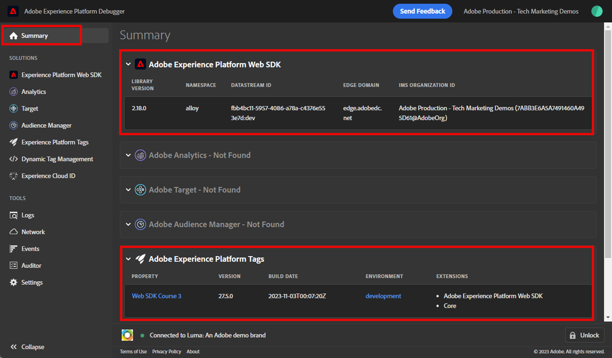

# 使用Experience Platform Debugger驗證Web SDK實作

瞭解如何使用Adobe Experience Platform Debugger驗證您的Platform Web SDK實作。

Experience Platform Debugger是適用於Chrome和Firefox瀏覽器的擴充功能，可協助您檢視在網頁中實作的Adobe技術。 下載您偏好瀏覽器的版本：

* [Firefox擴充功能](https://addons.mozilla.org/zh-TW/firefox/addon/adobe-experience-platform-dbg/)
* [Chrome擴充功能](https://chrome.google.com/webstore/detail/adobe-experience-platform/bfnnokhpnncpkdmbokanobigaccjkpob)

如果您從未使用過此偵錯工具，而且此偵錯工具與舊版的Adobe Experience Cloud Debugger不同，建議您觀看此五分鐘概觀影片：

>[!VIDEO](https://video.tv.adobe.com/v/32156?learn=on)

在本課程中，您將使用 [Adobe Experience Cloud Debugger擴充功能](https://chrome.google.com/webstore/detail/adobe-experience-cloud-de/ocdmogmohccmeicdhlhhgepeaijenapj) 取代 [Luma示範網站](https://luma.enablementadobe.com/content/luma/us/en.html) 擁有您自己的屬性。

此技巧稱為環境切換，您日後在自己的網站上使用標籤時，此技巧將有所幫助。 您可以在瀏覽器中載入您的生產網站，但使用 *開發* 標籤環境。 此功能可讓您安心地變更及驗證標籤，而不受定期程式碼發行的影響。 畢竟，將行銷標籤發行與定期程式碼發行分開，是客戶使用標籤的主要原因之一！

## 學習目標

在本課程結束時，您將能夠使用除錯工具：

* 載入替代標籤程式庫
* 驗證使用者端XDM事件是否如預期擷取及傳送資料給PlatformEdge Network
* 啟用Edge Trace以檢視平台Edge Network傳送的伺服器端請求

## 先決條件

您熟悉資料收集標籤和 [Luma示範網站](https://luma.enablementadobe.com/content/luma/us/en.html){target="_blank"} 並完成本教學課程中的先前課程：

* [設定XDM結構描述](configure-schemas.md)
* [設定身分名稱空間](configure-identities.md)
* [設定資料流](configure-datastream.md)
* [安裝在標籤屬性中的Web SDK擴充功能](install-web-sdk.md)
* [建立資料元素](create-data-elements.md)
* [建立身分](create-identities.md)
* [建立標籤規則](create-tag-rule.md)

## 使用Debugger載入替代標籤程式庫

Experience PlatformDebugger有一種很酷的功能，可讓您使用其他標籤程式庫取代現有的標籤程式庫。 此技巧對於驗證相當實用，可讓我們略過本教學課程中的許多實作步驟。

1. 確定您擁有 [Luma示範網站](https://luma.enablementadobe.com/content/luma/us/en.html){target="_blank"} 開啟並選取Experience Platform Debugger擴充功能圖示
1. Debugger將會開啟並顯示硬式編碼實作的一些詳細資料（您可能需要在開啟Debugger後重新載入Luma網站）
1. 確認Debugger為&quot;**[!UICONTROL 已連線至Luma]**&quot;，如下圖所示，然後選取&quot;**[!UICONTROL 鎖定]**」圖示可將Debugger鎖定至Luma網站。
1. 選取 **[!UICONTROL 登入]** 按鈕並使用您的AdobeID登入Adobe Experience Cloud。
1. 現在移至 **[!UICONTROL Experience Platform標籤]** 在左側導覽列中

   

1. 選取 **[!UICONTROL 設定]** 標籤
1. 在它顯示的右側 **[!UICONTROL 頁面內嵌程式碼]**，開啟 **[!UICONTROL 動作]** 下拉式清單，然後選取 **[!UICONTROL 取代]**

   

1. 由於您已通過驗證，Debugger將會提取您可用的標籤屬性和環境。 選取您的屬性；在此案例中 `Web SDK Course 3`
1. 選取您的 `Development` 環境
1. 選取 **[!UICONTROL 套用]** 按鈕

   

1. Luma網站現在將重新載入 _使用您自己的標籤屬性_.

   

繼續進行教學課程的過程中，您會使用此技巧將Luma網站對應至您自己的標籤屬性，以驗證您的Platform Web SDK實作。 當您開始在生產網站上使用標籤時，您可以在標籤的開發環境中使用相同的技巧來驗證變更。

## 使用Experience Platform偵錯工具驗證使用者端網路請求

您可以使用Debugger驗證從Platform Web SDK實作觸發的使用者端信標，以檢視傳送至PlatformEdge Network的資料：

1. 前往 **[!UICONTROL 摘要]** 在左側導覽中，檢視標籤屬性的詳細資訊

   

1. 現在移至 **[!UICONTROL Experience PlatformWeb SDK]** ，以檢視 **[!UICONTROL 網路要求]**
1. 開啟 **[!UICONTROL 事件]** 列

   

1. 請記下您能如何檢視 `web.webpagedetails.pageView` 您在「 」中指定的事件型別 [!UICONTROL 更新變數] 動作，以及其他附加在上的現成可用變數 `AEP Web SDK ExperienceEvent` 欄位群組

   

1. 向下捲動至 `web` 物件，選取以開啟物件並檢查 `webPageDetails.name`， `webPageDetails.server`、和 `webPageDetails.siteSection`. 它們應該與對應的 `digitalData` 首頁上的資料層變數

>[!TIP]
>
> 若要檢視及比較 `digitalData` 首頁上的資料層：
>
> 1. 在Luma首頁上，開啟瀏覽器開發人員工具。 如果是Chrome，請選取「 」按鈕 `F12` 在您的鍵盤上
> 1. 選取 **[!UICONTROL 主控台]** 標籤
> 1. 輸入 `digitalData` 並選取 `Enter` 在鍵盤上以顯示資料層值

您也可以驗證「身分對應」詳細資料：

1. 使用憑證登入Luma網站 `test@adobe.com`/`test`

1. 返回 [Luma 首頁](https://luma.enablementadobe.com/content/luma/us/en.html)

1. 開啟 **[!UICONTROL Experience PlatformWeb SDK]** 左側導覽中的區段

   

1. 選取 **[!UICONTROL 事件]** 列以在快顯視窗中開啟詳細資訊

   

1. 搜尋 **identityMap** 在快顯視窗中。 您應在此看到 `lumaCrmId` 包含authenticatedState、id和primary的三個金鑰：
   

### 使用瀏覽器開發工具驗證使用者端請求

這些型別的請求詳細資訊也會顯示在瀏覽器的網頁開發人員工具中 **網路** 標籤（假設網站正在載入您的標籤庫）。

1. 開啟瀏覽器的網頁開發人員工具 **網路** 標籤並重新載入頁面。 篩選呼叫，使用 `/ee` 若要尋找呼叫，請選取該呼叫，然後檢視 **標頭** 標籤，和 **裝載** 標籤

   

1. 前往 **回應** 標籤，並記下ECID值如何包含在回應中。 複製此值，因為您將在下一個練習中使用它來驗證設定檔資訊

   

   >[!NOTE]
   >
   > ECID值會顯示在網路回應中。 但不包含在 `identityMap` 網路請求的一部分，也不會以此格式儲存在Cookie中。

## 使用Experience Platform偵錯工具驗證伺服器端網路要求

如您所知， [設定資料串流](configure-datastream.md) 課程，Platform Web SDK會先將您數位財產的資料傳送至PlatformEdge Network。 然後，平台Edge Network會對資料流中啟用的對應服務發出其他伺服器端請求。 您可以在Debugger中使用Edge Trace來驗證PlatformEdge Network所提出的伺服器端請求。

<!--Furthermore, you can also validate the fully processed payload after it reaches an Adobe application by using [Adobe Experience Platform Assurance](https://experienceleague.adobe.com/en/docs/experience-platform/assurance/home). -->

### 啟用邊緣追蹤

若要啟用邊緣追蹤：

1. 在左側導覽列中 **[!UICONTROL Experience Platform偵錯工具]** 選取 **[!UICONTROL 記錄檔]**
1. 選取 **[!UICONTROL Edge]** 標籤，然後選取 **[!UICONTROL 連線]**

   

1. 目前為空白

   

1. 重新整理 [Luma首頁](https://luma.enablementadobe.com/) 並勾選 **[!UICONTROL Experience Platform偵錯工具]** 再次強調，可檢視資料流入。

   

此時，您無法檢視任何傳送至Edge Network應用程式的平台Adobe請求，因為您尚未啟用資料流中的任何請求。 在未來的課程中，您將使用Edge Trace來檢視用於Adobe應用程式和事件轉送的傳出伺服器端請求。 但首先，瞭解另一個用於驗證PlatformEdge Network所提出伺服器端請求的工具 — Adobe Experience Platform Assurance！

[下一步： ](validate-with-assurance.md)

>[!NOTE]
>
>感謝您投入時間學習Adobe Experience Platform Web SDK。 如果您有疑問、想分享一般意見或有關於未來內容的建議，請分享這些內容 [Experience League社群討論貼文](https://experienceleaguecommunities.adobe.com/t5/adobe-experience-platform-launch/tutorial-discussion-implement-adobe-experience-cloud-with-web/td-p/444996)
