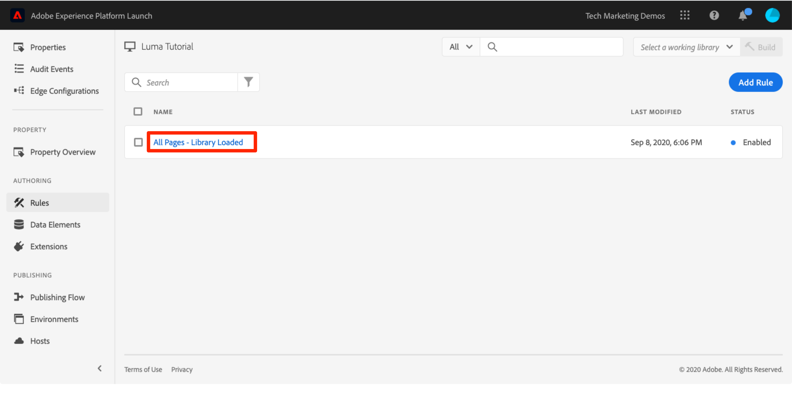
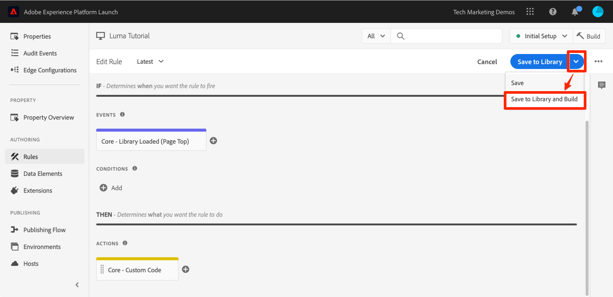

# 新增資料元素、規則和程式庫

在本課程中，您將建立您的第一個資料元素、規則和程式庫。

資料元素和規則是標籤的基本建置組塊。 資料元素會儲存您要傳送至行銷和廣告解決方案的屬性，而規則會在適當的條件下，引發對這些解決方案提出的請求。程式庫為在頁面上載入以完成所有工作的 JavaScript 檔案。在本課程中，您將使用這三種工具來讓範例頁面執行一些作業。

>[!NOTE]
>
>Adobe Experience Platform Launch正在以資料收集技術套裝的形式整合到Adobe Experience Platform中。 此介面已推出幾項術語變更，使用此內容時請務必注意：
>
> * platform launch（使用者端）現在是&#x200B;**[[!DNL tags]](https://experienceleague.adobe.com/docs/experience-platform/tags/home.html)**
> * platform launch伺服器端現在是&#x200B;**[[!DNL event forwarding]](https://experienceleague.adobe.com/docs/experience-platform/tags/event-forwarding/overview.html)**
> * Edge設定現在是&#x200B;**[[!DNL datastreams]](https://experienceleague.adobe.com/docs/experience-platform/edge/fundamentals/datastreams.html)**

## 學習目標

在本課程結束時，您將能夠：

* 建立資料元素
* 建立規則
* 建立程式庫
* 新增變更至程式庫
* 驗證您的程式庫是否載入網頁瀏覽器
* 使用「工作程式庫」功能提高工作效率

## 為 Page Name 建立資料元素

資料元素是標籤版本的資料層。 它們可以儲存來自您的資料層物件、Cookie、本機儲存物件、查詢字串參數、頁面元素、中繼標記等項目的值。在本練習中，您將為 Page Name 建立資料元素，稍後會在 Target 和 Analytics 實施中用到 Page Name。

**建立資料元素的方式**

1. 在左側導覽中，按一下&#x200B;**[!UICONTROL 資料元素]**

1. 因為您尚未在此屬性中建立任何資料元素，所以會出現一段簡短影片，提供有關本主題的其他資訊。如有需要，請觀看此影片。

1. 按一下&#x200B;**[!UICONTROL 建立新資料元素]**&#x200B;按鈕：

   

1. 為資料元素命名，例如 `Page Name`

1. 使用 [!UICONTROL JavaScript 變數]資料元素類型指向範例頁面資料層中的值：`digitalData.page.pageInfo.pageName`。

1. 勾選&#x200B;**[!UICONTROL 強制小寫值]**&#x200B;和&#x200B;**[!UICONTROL 清除文字]**&#x200B;方塊，以標準化大小寫格式並移除多餘的空格

1. 保留&#x200B;**[!UICONTROL 無]**&#x200B;作為&#x200B;**[!UICONTROL 儲存期間]**&#x200B;設定，因為此值通常在每個頁面上都不相同

1. 按一下&#x200B;**[!UICONTROL 儲存]**&#x200B;按鈕以儲存資料元素

   。

>[!NOTE]
>
>資料元素功能&#x200B;_可使用擴充功能_&#x200B;擴充。 例如，ContextHub 擴充功能可讓您使用擴充功能的功能來新增資料元素。

## 建立規則

接下來，您將在一個簡單規則中使用此資料元素。規則是標籤中最強大的功能之一，可讓您指定訪客與網站互動時應該發生的事。 當符合您在規則中所列的準則時，規則會觸發您指定的動作。

您將建立一個規則，此規則會將頁面名稱資料元素值輸出至瀏覽器主控台。

**建立規則的方式**

1. 在左側導覽列中，按一下&#x200B;**[!UICONTROL 規則]**

1. 因為您尚未在此屬性中建立任何規則，所以會出現一段簡短影片，提供有關本主題的其他資訊。如有需要，請觀看此影片。

1. 按一下&#x200B;**[!UICONTROL 建立新規則]**&#x200B;按鈕：

   

1. 將規則命名為 `All Pages - Library Loaded`。此命名慣例會指出規則將在何處及何時引發，可讓您更方便在標籤屬性完善時識別和重複使用。

1. 在「事件」底下，按一下&#x200B;**[!UICONTROL 新增]**。 事件會告知標籤規則應該引發的時機，而且可能是許多專案，包括頁面載入、點選、自訂JavaScript事件等。

   

   1. 以「事件類型」形式選取&#x200B;**[!UICONTROL 「載入的程式庫」(頁面頂端)]**。請注意，當您選取「事件型別」時，標籤會使用您選擇的專案預先填入事件名稱。 另請注意，事件的預設順序為 50。排序是標籤中的一項強大功能，可讓您在同一事件觸發多個規則時，精確控制動作的執行順序。 在稍後的教學課程中，您將會使用此功能。

   1. 按一下&#x200B;**[!UICONTROL 保留變更]**&#x200B;按鈕

   

1. 由於此規則應在所有頁面上引發，請將&#x200B;**[!UICONTROL 條件]**&#x200B;留空。 如果開啟「條件」強制回應，您會看到條件可以根據各種選項新增限制和排除項目，包括 URL、資料元素值、日期範圍等。

1. 在[動作]底下，按一下[新增] **&#x200B;**

1. 選取&#x200B;**[!UICONTROL 動作型別>自訂程式碼]**，此時此為唯一的選項。 在稍後的教學課程中，當您新增擴充功能時，畫面就會顯示更多選項。

1. 選取&#x200B;**[!UICONTROL &lt;/>開啟編輯器]**&#x200B;以開啟程式碼編輯器

   

1. 將下列內容新增至程式碼編輯器中。此程式碼會將 Page Name 資料元素的值輸出至瀏覽器主控台，讓您可確認其運作中：

   ```javascript
   console.log('The page name is '+_satellite.getVar('Page Name'));
   ```

1. 儲存程式碼編輯器

   

1. 在動作設定畫面上，按一下&#x200B;**[!UICONTROL 保留變更]**

1. 按一下&#x200B;**[!UICONTROL 儲存]**&#x200B;儲存規則

在「規則」頁面上，您應該會看到新規則：
上

## 將變更儲存至程式庫

在資料收集介面中設定擴充功能、資料元素和規則的集合後，您需要將這些功能和邏輯封裝為一組JavaScript程式碼，可讓您在網站上部署，以便在訪客造訪網站時引發行銷標籤。 程式庫是執行此動作的 JavaScript 程式碼集。

在之前的課程中，您在範例頁面上實施了開發環境的內程式碼。載入範例頁面時，因為標籤程式庫尚未建立並指派給環境，使得傳回內嵌程式碼URL的404錯誤。 現在您需將新的資料元素和規則放進程式庫中，讓範例頁面能夠執行工作。

**新增及建置程式庫的方式**

1. 在左側導覽中，按一下&#x200B;**[!UICONTROL 發佈流程]**

1. 按一下&#x200B;**[!UICONTROL 新增資料庫]**

   

1. 為資料庫命名，例如`Initial Setup`

1. 選取&#x200B;**[!UICONTROL 環境>開發]**

1. 按一下&#x200B;**[!UICONTROL 新增所有變更的資源]**

   

1. 請注意，按一下&#x200B;**[!UICONTROL 新增所有變更的資源]**&#x200B;標籤後，會摘要您剛才所做的變更。

1. 按一下&#x200B;**[!UICONTROL 儲存並建置以供開發]**

   

幾分鐘後，狀態圓點會變成綠色，表示程式庫已成功建置。


## 驗證您所執行的操作

現在驗證您的規則是否如預期般運作。

重新載入範例頁面。若檢視「開發人員工具 — >網路」標籤，現在應該會看到標籤程式庫的200回應！


若查看「開發人員工具 -> 主控台」，應該會看到「頁面名稱為 home」文字


恭喜，您已建立第一個資料元素和規則，且建立了您的第一個標籤程式庫！

## 使用工作程式庫功能

當您在標籤中進行許多變更時，每一次需要檢視結果時，都必須開啟「發佈」標籤、新增變更並建置程式庫，十足不便。  現在您已建立「Initial Setup」程式庫，即可使用「工作程式庫」功能來快速儲存變更，並在單一步驟中重建程式庫。

小幅變更「所有頁面 - 程式庫已載入」規則。在左側導覽列中，按一下&#x200B;**[!UICONTROL 規則]**，然後按一下`All Pages - Library Loaded`規則以開啟它。


在`Edit Rule`頁面上，按一下&#x200B;***[!UICONTROL 工作程式庫]***&#x200B;下拉式清單，然後選取您的`Initial Setup`程式庫。


選取資料庫之後，您應該會看到&#x200B;**[!UICONTROL 儲存]**&#x200B;按鈕現在預設為&#x200B;**[!UICONTROL 儲存至資料庫]**。 當您在標籤中進行變更時，可以使用此選項以自動將變更直接新增至您的工作程式庫和/或重建它。

實際測試一下。開啟您的「自訂程式碼」動作，並在「The page name is」這段文字之後加上一個冒號，讓整個程式碼區塊如下所示：

```javascript
console.log('The page name is: '+_satellite.getVar('Page Name'));
```

儲存程式碼，保留動作中的變更，現在按一下&#x200B;**[!UICONTROL 儲存至程式庫並建置]**&#x200B;按鈕。



請稍候片刻，直到綠色圓點重新出現在[!UICONTROL 工作程式庫]下拉式清單旁邊。現在，重新載入範例頁面，應該會看到您的變更反映在主控台訊息中 (您可能需要清除瀏覽器快取並重新載入，才能看到頁面的變更)：


這是更快速的工作方式，您將在本教學課程的其餘部分中用到此方法。

[下堂課「使用Experience Cloud Debugger切換環境」>](switch-environments.md)
