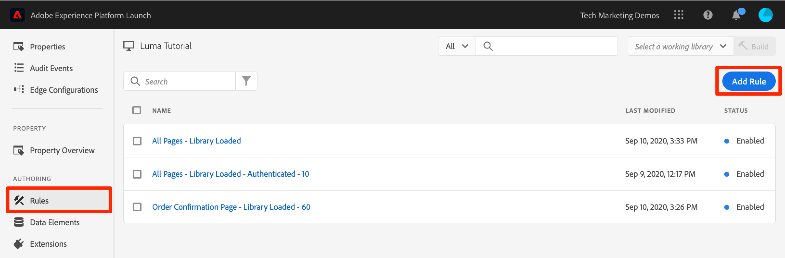
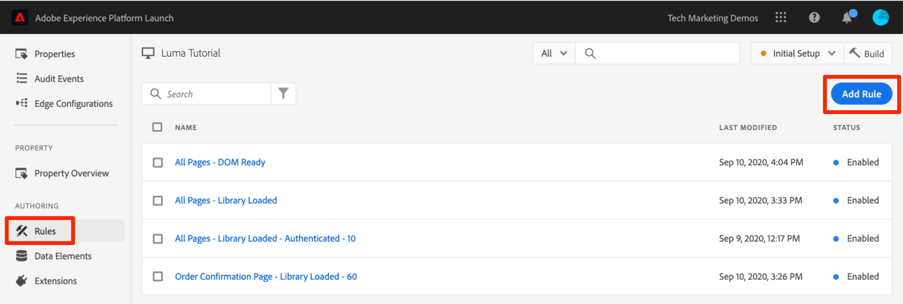
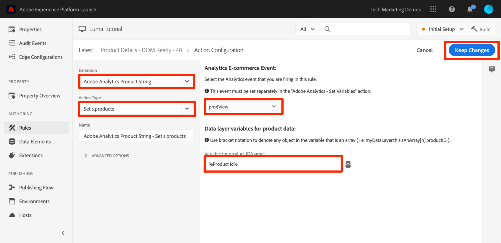
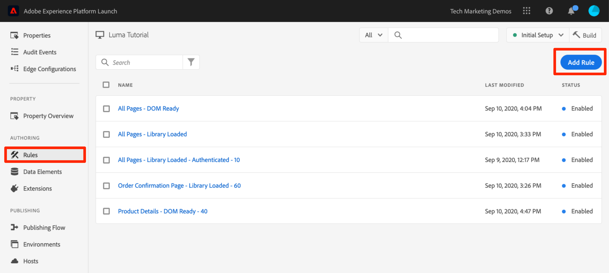
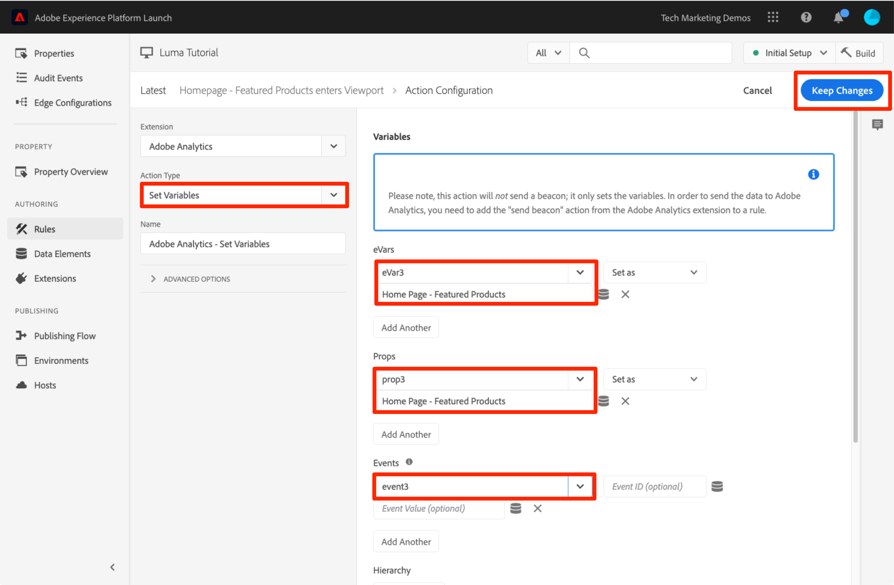

# 新增 Adobe Analytics

在本課程中，您將實施 [Adobe Analytics 擴充功能](https://experienceleague.adobe.com/docs/experience-platform/tags/extensions/adobe/analytics/overview.html)，並建立規則以將資料傳送至 Adobe Analytics。

[Adobe Analytics](https://experienceleague.adobe.com/docs/analytics.html) 是領先業界的解決方案，能夠讓您從使用者觀點瞭解客戶，並掌握客戶情報來為您的企業指引方向。

>[!NOTE]
>
>Adobe Experience Platform Launch已整合至Adobe Experience Platform，為資料收集技術的套件。 介面中已推出數個術語變更，在使用此內容時應注意：
>
> * platform launch（用戶端）現在為 **[[!DNL tags]](https://experienceleague.adobe.com/docs/experience-platform/tags/home.html)**
> * platform launch伺服器端現在是 **[[!DNL event forwarding]](https://experienceleague.adobe.com/docs/experience-platform/tags/event-forwarding/overview.html)**
> * 現在提供邊緣設定 **[[!DNL datastreams]](https://experienceleague.adobe.com/docs/experience-platform/edge/fundamentals/datastreams.html)**


## 學習目標

在本課程結束時，您將能夠：

1. 新增 Adobe Analytics 擴充功能
1. 使用擴充功能設定全域變數
1. 新增頁面檢視信標
1. 使用規則新增其他變數
1. 新增點擊追蹤和其他事件型信標
1. 新增 Analytics 外掛程式

有許多可在標籤中針對Analytics實作的項目。 本課程並非詳盡無遺，但應足以提供在您自己的網站上實施時所需的主要技巧實用概述。

## 必要條件

您應已完成 [設定標籤](create-a-property.md) 和 [新增Identity服務](id-service.md).

此外，您至少需要一個報表套裝 ID 和追蹤伺服器。如果您沒有任何可用於本教學課程的測試/開發報表套裝，請建立一個報表套裝。如果您不確定如何執行此動作，請參閱[文件](https://experienceleague.adobe.com/docs/analytics/admin/manage-report-suites/new-report-suite/new-report-suite.html?lang=zh-Hant)。您可以向目前的實施、Adobe Consultant 或客戶服務代表擷取追蹤伺服器。

## 新增 Analytics 擴充功能

Analytics 擴充功能包含兩個主要部分：

1. 擴充功能設定，可管理核心 AppMeasurement.js 程式庫設定，且可設定全域變數
1. 規則動作，可執行下列操作：
   1. 設定變數
   1. 清除變數
   1. 傳送 Analytics 信標

**新增 Analytics 擴充功能的方式**

1. 前往&#x200B;**[!UICONTROL 擴充功能 > 目錄]**
1. 找到 Adobe Analytics 擴充功能
1. 按一下&#x200B;**[!UICONTROL 安裝]**

   

1. 在 [!UICONTROL 程式庫管理>報表套裝]，輸入您要用於每個標籤環境的報表套裝id。 若您的使用者可存取Adobe Analytics，請注意，當您開始在方塊中輸入內容時，會看到預先填入的所有報表套裝清單。 (在本教學課程中，您可針對所有環境使用同一個報表套裝，但在現實情況中，您需使用個別的報表套裝，如下圖所示)

   

   >[!TIP]
   >
   > 我們建議針對[!UICONTROL 程式庫管理]設定使用[!UICONTROL 為我管理程式庫]選項，因為這可讓 `AppMeasurement.js` 程式庫更容易保持最新狀態。

1. 在 [!UICONTROL 一般>追蹤伺服器]，請輸入您的追蹤伺服器，例如 `tmd.sc.omtrdc.net`. 如果您的網站支援 `https://`，請輸入 SSL 追蹤伺服器

   

1. 在 [!UICONTROL 「全域變數」區段]，在 [!UICONTROL 其他設定]，請設定 [!UICONTROL 頁面名稱] 變數 `Page Name` 資料元素。 按一下  圖示，開啟強制回應視窗並選擇頁面 `Page Name` 資料元素

1. 按一下&#x200B;**[!UICONTROL 儲存至程式庫]**

   

>[!NOTE]
>
> 您可以在擴充功能設定或規則動作中設定全域變數。請注意，在擴充功能設定中設定變數時，必須定義資料層 *befor* 標籤內嵌程式碼。

## 傳送頁面檢視信標

現在將建立規則以引發 Analytics 信標，該信標會傳送在擴充功能設定中設定的 [!UICONTROL Page Name] 變數。

您已在 [新增資料元素、規則和程式庫](add-data-elements-rules.md) 本教學課程，此課程會在標籤程式庫載入時在每個頁面上觸發。 您 *could* 也請使用此規則進行Analytics，不過此設定需要在標籤內嵌程式碼之前定義Analytics信標中使用的所有資料層屬性。 若要讓資料收集有更大的彈性，需建立 DOM 就緒時觸發的全新「所有頁面」規則，以引發 Analytics 信標。

**傳送頁面檢視信標的方式**

1. 前往 **[!UICONTROL 規則]** 區段，然後按一下 **[!UICONTROL 新增規則]**

   

1. 將規則命名為 `All Pages - DOM Ready`
1. 按一下&#x200B;**[!UICONTROL 事件 > 新增]**，開啟 `Event Configuration` 畫面

   

1. 選取&#x200B;**[!UICONTROL 事件類型 > DOM 就緒]** (請注意，規則的順序為「50」)
1. 按一下&#x200B;**[!UICONTROL 保留變更]**
   

1. 在「動作」底下，按一下  以新增動作

   

1. 選取&#x200B;**[!UICONTROL 擴充功能 > Adobe Analytics]**

1. 選取&#x200B;**[!UICONTROL 動作類型 > 傳送信標]**

1. 將 Tracking 保留設為 `s.t()`。請注意，若要在點擊事件規則中發出 `s.tl()` 呼叫，也可以使用「傳送信標」動作執行此操作。

1. 按一下&#x200B;**[!UICONTROL 保留變更]**&#x200B;按鈕

   

1. 按一下&#x200B;**[!UICONTROL 儲存至程式庫並建置]**

   

### 驗證頁面檢視信標

此時您已建立可傳送 Analytics 信標的規則，應該可以在 Experience Cloud Debugger 中看到請求。

1. 在 Chrome 瀏覽器中開啟 [Luma 網站](https://luma.enablementadobe.com/content/luma/us/en.html)
1. 按一下 Debugger 圖示 ，開啟 **[!UICONTROL Adobe Experience Cloud Debugger]**
1. 確認Debugger將標籤屬性對應至 *您的* 開發環境，如 [先前的教訓](switch-environments.md)

   

1. 按一下以開啟 Analytics 標籤
1. 展開您的報表套裝名稱以顯示對其提出的所有請求。
1. 確認已使用 Page Name 變數和值引發請求

   

>[!NOTE]
>
> 如果畫面上未顯示 Page Name，請逐步回到本頁面中的各個步驟，確認您沒有遺失任何項目。

## 使用規則新增變數

若您已設定 Analytics 擴充功能，表示已在擴充功能設定中填入 `pageName` 變數。如果在標籤內嵌程式碼載入前頁面上有可用值，此即為可填入其他全域變數（例如eVar和prop）的精確位置。

在使用 `Set Variables` 動作的規則中設定變數 (以及事件)，可獲得更高的彈性。規則可讓您在不同的條件下，設定不同的 Analytics 變數和事件。例如，您只能在產品詳細資料頁面上設定 `prodView`，而且只能在訂單確認頁面上設定 `purchase` 事件。本節指導您如何使用規則來設定變數。

### 使用案例

產品詳細資料頁面 (PDP) 是零售網站上資料收集的重點。通常，您會想要讓 Analytics 登錄已發生的產品檢視，以及已檢視哪個產品。這有助於瞭解哪些是受客戶歡迎的熱門產品。在媒體網站上，文章或影片頁面可對本節所使用的項目使用類似的追蹤技巧。載入產品詳細資料頁面時，您可能會想要將該值放入「Page Type」`eVar` 中，並且設定一些事件和產品 ID。這能讓我們在分析中查看下列內容：

1. 產品詳細資料頁面已載入幾次
1. 已檢視那些特定產品及其檢視次數
1. 其他因素 (促銷活動、搜尋等) 影響了幾個 PDP 的使用者載入

### 建立 Page Type 的資料元素

首先，您必須識別哪些頁面是產品詳細資料頁面。您可以透過資料元素完成此操作。

**為 Page Type 建立資料元素的方式**

1. 按一下 **[!UICONTROL 資料元素]** 在左側導覽列中
1. 按一下&#x200B;**[!UICONTROL 新增資料元素]**

   

1. 將資料元素命名為 `Page Type`
1. 選取&#x200B;**[!UICONTROL 資料元素類型 > JavaScript 變數]**
1. 使用 `digitalData.page.category.type` 作為 **[!UICONTROL JavaScript變數名稱]**
1. 檢查 **[!UICONTROL 清除文字]** 和 **[!UICONTROL 強制小寫]** 選項
1. 按一下&#x200B;**[!UICONTROL 儲存至程式庫]**

   

### 為 Product ID 建立資料元素

接下來，將使用資料元素收集目前產品詳細資料頁面的產品 ID。

**為 Product ID 建立資料元素的方式**

1. 按一下 **[!UICONTROL 資料元素]** 在左側導覽列中
1. 按一下&#x200B;**[!UICONTROL 新增資料元素]**

   

1. 將資料元素命名為 `Product Id`
1. 選取&#x200B;**[!UICONTROL 資料元素類型 > JavaScript 變數]**
1. 使用 `digitalData.product.0.productInfo.sku` 作為 **[!UICONTROL JavaScript變數名稱]**
1. 檢查 **[!UICONTROL 清除文字]** 和 **[!UICONTROL 強制小寫]** 選項
1. 按一下&#x200B;**[!UICONTROL 儲存至程式庫]**

   

### 新增 Adobe Analytics Product String 擴充功能

如果您已熟悉 Adobe Analytics 實施，那您可能熟悉[產品變數](https://experienceleague.adobe.com/docs/analytics/implementation/vars/page-vars/products.html)。產品變數的語法非常特定，而且會根據內容以稍微不同的方式使用。為協助您更輕鬆地在標籤中填入產品變數，已在標籤擴充功能市集中建立三個額外的擴充功能！ 在本節中，您將新增 Adobe Consulting 建立的擴充功能以用於產品詳細資料頁面上。

**新增 `Adobe Analytics Product String` 擴充功能的方式**

1. 前往[!UICONTROL 擴充功能 > 目錄]頁面
1. 依各個 Adobe Consulting Service 找到 `Adobe Analytics Product String` 擴充功能，然後按一下&#x200B;**[!UICONTROL 安裝]**
   
1. 請花一點時間閱讀指示
1. 按一下&#x200B;**[!UICONTROL 儲存至程式庫]**

   

### 建立產品詳細資料頁面的規則

現在將使用新資料元素和擴充功能，建置您的產品詳細資料頁面規則。針對此功能，將建立另一個由「DOM 就緒」觸發的產品載入規則。但是將會使用條件，使其只在產品詳細資料頁面上引發，並使用順序設定，使其在傳送信標的規則&#x200B;_之前_&#x200B;引發。

**建置產品詳細資料頁面規則的方式**

1. 前往 **[!UICONTROL 規則]** 區段，然後按一下 **[!UICONTROL 新增規則]**

   

1. 將規則命名為 `Product Details - DOM Ready - 40`
1. 按一下&#x200B;**[!UICONTROL 事件 > 新增]**，開啟 `Event Configuration` 畫面

   

1. 選取&#x200B;**[!UICONTROL 事件類型 > DOM 就緒]**
1. 將 **[!UICONTROL Order]** 設為 40，讓該規則在包含「傳送 > 傳送信標」動作的規則&#x200B;*之前*&#x200B;執行。
1. 按一下&#x200B;**[!UICONTROL 保留變更]**

   

1. 在&#x200B;**[!UICONTROL 條件]**&#x200B;底下，按一下  以開啟 `Condition Configuration` 畫面
   

   1. 選取&#x200B;**[!UICONTROL 條件類型 > 值比較]**
   1. 使用資料元素選擇器，在第一個欄位中選擇 `Page Type`
   1. 在比較運算子下拉式清單中選取&#x200B;**[!UICONTROL 包含]**
   1. 在下一個欄位中輸入 `product-page` (這是從 PDP 上的資料層提取的頁面類型值的唯一部分)
   1. 按一下&#x200B;**[!UICONTROL 保留變更]**

      

1. 在「動作」底下，按一下  以新增動作

   

1. 選取&#x200B;**[!UICONTROL 擴充功能 > Adobe Analytics Product String]**
1. 選取&#x200B;**[!UICONTROL 動作類型 > 設定 s.products]**

1. 在 **[!UICONTROL Analytics 電子商務事件]**&#x200B;區段中，選取 **[!UICONTROL prodView]**

1. 在&#x200B;**[!UICONTROL 產品資料的資料層變數]**&#x200B;區段中，使用資料元素選擇器來選擇 `Product Id` 資料元素

1. 按一下&#x200B;**[!UICONTROL 保留變更]**

   


1. 在「動作」底下，按一下  以新增動作

   

1. 選取&#x200B;**[!UICONTROL 擴充功能 > Adobe Analytics]**
1. 選取&#x200B;**[!UICONTROL 動作類型 > 設定變數]**
1. 選取 **[!UICONTROL eVar1 > 設為]**，然後輸入 `product detail page`
1. 設定 **[!UICONTROL event1]**，將選填值保留為空白
1. 在「事件」底下，按一下&#x200B;**[!UICONTROL 新增其他]**&#x200B;按鈕
1. 設定 **[!UICONTROL prodView]** 事件，將選填值保留為空白
1. 按一下&#x200B;**[!UICONTROL 保留變更]**

   

1. 按一下&#x200B;**[!UICONTROL 儲存至程式庫並建置]**

   

### 驗證產品詳細資料頁面的資料

您剛剛已建立在傳送信標之前設定變數的規則。您現在應該能夠看到新資料出現在 Experience Cloud Debugger 的點擊中。

**驗證產品詳細資料頁面資料的方式**

1. 在 Chrome 瀏覽器中開啟 [Luma 網站](https://luma.enablementadobe.com/content/luma/us/en.html)
1. 導覽至任何產品詳細資料頁面
1. 按一下 Debugger 圖示 ，開啟 **[!UICONTROL Adobe Experience Cloud Debugger]**
1. 按一下前往 Analytics 標籤
1. 展開報表套裝
1. 請注意現在位於 Debugger 中的產品詳細資料變數，也就是 `eVar1` 已設為「product detail page」、`Events` 變數已設為「event1」和「prodView」、產品變數已使用您檢視之產品的產品 ID 進行設定，而 Page Name 仍由 Analytics 擴充功能設定

   

## 傳送追蹤連結信標

頁面載入時，您通常會引發 `s.t()` 函數所觸發的頁面載入信標。這會自動遞增列於 `pageName` 變數中的頁面的 `page view` 量度。

不過，有時候您並不想遞增網站上的頁面檢視，因為正在發生的動作「小於」(或可能不同於) 頁面檢視。此情況下需使用 `s.tl()` 函數，這通常稱為「追蹤連結」請求。即使這作為追蹤連結請求參考，但並不必在連結點擊時觸發。可由 *any* 標籤規則產生器中可供您使用的事件，包括您自己的自訂JavaScript。

在本教學課程中，您將使用最酷的 JavaScript 事件 (`Enters Viewport` 事件) 觸發 `s.tl()` 呼叫。

### 使用案例

針對此使用案例，您想知道使用者在Luma首頁上向下捲動的距離，是否足以看到 *精選產品* 區段。 本公司內部對於使用者是否看到該區段存在一些分歧意見，因此您想使用 Analytics 來判斷真相。

### 在標籤中建立規則

1. 前往 **[!UICONTROL 規則]** 區段，然後按一下 **[!UICONTROL 新增規則]**

   
1. 將規則命名為 `Homepage - Featured Products enters Viewport`
1. 按一下&#x200B;**[!UICONTROL 事件 > 新增]**，開啟 `Event Configuration` 畫面

   

1. 選取&#x200B;**[!UICONTROL 事件類型 > 進入檢視區]**。接著會顯示一個欄位，您需要在此輸入 CSS 選取器，用於識別在瀏覽器中進入檢視畫面時，頁面上應觸發規則的項目。
1. 返回Luma的首頁，然後向下捲動至「精選產品」區段。
1. 以滑鼠右鍵按一下本區段中「精選產品」標題與項目之間的空白處，然後選取 `Inspect` 按一下右鍵菜單。 這樣一來便接近你所需的項目。
1. 在該處附近，或許就在所選區段的下方，尋找含有 `class="we-productgrid aem-GridColumn aem-GridColumn--default--12"` 的 div。請找到此元素。
1. 在此元素上按一下滑鼠右鍵，然後選取&#x200B;**[!UICONTROL 複製 > 複製選取器]**

   

1. 返回標籤，將此值從剪貼簿貼到標示為的欄位 `Elements matching the CSS selector`.
   1. 在側邊備註中，您可自行決定如何識別 CSS 選取器。此方法有點脆弱，因為頁面上的某些變更可能會導致此選取器中斷。在標籤中使用任何CSS選取器時，請考量此情況。
1. 按一下&#x200B;**[!UICONTROL 保留變更]**

   

1. 在「條件」底下，按一下  以新增條件
1. 選取&#x200B;**[!UICONTROL 條件類型 > 值比較]**
1. 使用資料元素選擇器，在第一個欄位中選擇 `Page Name`
1. 在比較運算子下拉式清單中選取&#x200B;**[!UICONTROL 等於]**
1. 在下一個欄位中輸入 `content:luma:us:en` (這是從資料層提取之首頁的頁面名稱 - 我們只希望此規則在首頁上執行)
1. 按一下&#x200B;**[!UICONTROL 保留變更]**

   

1. 在「動作」底下，按一下  以新增動作
1. 選取&#x200B;**[!UICONTROL 擴充功能 > Adobe Analytics]**
1. 選取&#x200B;**[!UICONTROL 動作類型 > 設定變數]**
1. 將 `eVar3` 設為 `Home Page - Featured Products`
1. 將 `prop3` 設為 `Home Page - Featured Products`
1. 將 `Events` 變數設為 `event3`
1. 按一下&#x200B;**[!UICONTROL 保留變更]**

   

1. 在「動作」底下，按一下  以新增另一個動作

1. 選取&#x200B;**[!UICONTROL 擴充功能 > Adobe Analytics]**
1. 選取&#x200B;**[!UICONTROL 動作類型 > 傳送信標]**
1. 選擇 **[!UICONTROL `s.tl()`]** 追蹤選項
1. 在&#x200B;**[!UICONTROL 連結名稱]**&#x200B;欄位中輸入 `Scrolled down to Featured Products`。此值將放入 Analytics 的「自訂連結」報表中。
1. 按一下&#x200B;**[!UICONTROL 保留變更]**

   

1. 按一下&#x200B;**[!UICONTROL 儲存至程式庫並建置]**

   

### 驗證追蹤連結信標

現在，您想要確定當向下捲動至我們網站首頁的「精選產品」區段時，此點擊會傳入。 第一次載入首頁時，應該不會提出此請求，但當您向下捲動且此區段進入檢視畫面時，應該會以新的值引發點擊。

1. 在 Chrome 瀏覽器中開啟 [Luma 網站](https://luma.enablementadobe.com/content/luma/us/en.html)，並確定您位於首頁頂端。
1. 按一下 **[!UICONTROL Debugger 圖示]**，開啟 [!UICONTROL Adobe Experience Cloud Debugger]
1. 按一下前往 Analytics 標籤
1. 展開報表套裝的點擊
1. 請留意含有頁面名稱等資料的首頁一般頁面檢視點擊(但 eVar3 或 prop3 中無資料)。

   

1. 在Debugger開啟的狀態下，向下捲動您的網站，直到看到「精選產品」區段為止
1. 再次檢視 Debugger，應該會出現另一個 Analytics 點擊。此點擊應該含有與您所設定 s.tl() 點擊相關聯的參數，也就是：
   1. `LinkType = "link_o"` (這表示點擊是自訂連結點擊，而不是頁面檢視點擊)
   1. `LinkName = "Scrolled down to Featured Products"`
   1. `prop3 = "Home Page - Featured Products"`
   1. `eVar3 = "Home Page - Featured Products"`
   1. `Events = "event3"`

      

## 新增外掛程式

外掛程式是可新增到實施的 JavaScript 程式碼，用來執行產品中尚未建置的特定功能。外掛程式可由您、其他 Adobe 客戶/合作夥伴或 Adobe Consulting 進行建置。

若要實施外掛程式，基本上有三個需要執行的步驟：

1. 包含 doPlugins 函數，此函數將參照外掛程式
1. 新增外掛程式的主要函數程式碼
1. 納入執行呼叫函數並設定變數等操作的程式碼。

### 讓 Analytics 物件可供全域存取

如果您即將新增 doPlugins 函數 (如下) 並使用外掛程式，您必須勾選方塊，讓 Analytics「s」物件可在 Analytics 實施中供全域使用。

1. 前往&#x200B;**[!UICONTROL 擴充功能 > 已安裝]**

1. 在 Adobe Analytics 擴充功能中，按一下&#x200B;**[!UICONTROL 設定]**

   

1. 在&#x200B;**[!UICONTROL 程式庫管理]**&#x200B;底下，選取標示為 `Make tracker globally accessible` 的方塊。如說明泡泡圖示所示，這會使追蹤器變成 window.s 下的全域範圍，當您在客戶 JavaScript 中參照它時，這是很重要的一點。
   

### 納入 doPlugins 函數

若要新增外掛程式，您必須新增 doPlugins 函數。系統預設不新增此函數，但新增後會由 AppMeasurement 程式庫處理，且是點擊傳入 Adobe Analytics 時的最後一個呼叫對象。因此，您可以使用此函數執行一些 JavaScript，設定比較容易用這種方式設定的變數。

1. 維持在 Analytics 擴充功能中，向下捲動並展開 `Configure Tracker Using Custom Code.` 區段
1. 按一下&#x200B;**[!UICONTROL 開啟編輯器]**
1. 將下列程式碼貼到程式碼編輯器中：

   ```javascript
   /* Plugin Config */
   s.usePlugins=true
   s.doPlugins=function(s) {
   /* Add calls to plugins here */
   }
   ```

1. 將此視窗保持開啟以供後續步驟使用

### 為外掛程式新增函數程式碼

您實際上會在此程式碼中呼叫兩個外掛程式，但其中一個內建在 AppMeasurement 程式庫中，因此您不需要針對該外掛程式新增待呼叫的函數。不過您也必須為第二個外掛程式新增函數程式碼。此函數稱為 getValOnce()。

### getValOnce() 外掛程式

此外掛程式的用途是，在訪客重新整理頁面或使用瀏覽器的返回按鈕回到已設定值的頁面時，避免程式碼中的值錯誤地重複。在本課程中，您將使用此外掛程式來防止 `clickthrough` 事件重複。

此外掛程式的程式碼可在 [Analytics 文件](https://experienceleague.adobe.com/docs/analytics/implementation/vars/plugins/getvalonce.html)中取得，也會呈現於此處，以方便您複製貼上。

1. 複製下列程式碼

   ```javascript
   /* Adobe Consulting Plugin: getValOnce v2.01 */
   s.getValOnce=function(vtc,cn,et,ep){if(vtc&&(cn=cn||"s_gvo",et=et||0,ep="m"===ep?6E4:864E5,vtc!==this.c_r(cn))){var e=new Date;e.setTime(e.getTime()+et*ep);this.c_w(cn,vtc,0===et?0:e);return vtc}return""};
   ```

1. 在程式碼視窗中 (如果您還是尚未開啟程式碼視窗，請按照上一個步驟重新開啟)，將它貼入 Analytics 擴充功能中整個 doPlugins 函數的&#x200B;**下方** (不包含在其中)。

   

現在，您可以從 doPlugins 中呼叫此外掛程式。

### 從 doPlugins 中呼叫外掛程式

現在，程式碼已就緒且可供參照，您可以在 doPlugins 函數內呼叫外掛程式。

首先，呼叫已整合至 AppMeasurement 程式庫中的外掛程式 (因此稱為「公用程式」)。它可作為 `s.Util.getQueryParam` 參照，因為它是 s 物件的一部分，也是一個內建公用程式，且將從 URL 中的查詢字串抓取值 (根據參數)。

1. 複製下列程式碼：

   ```javascript
   s.campaign = s.Util.getQueryParam("cid");
   ```

1. 將它貼入 doPlugins 函數中。這會在目前頁面 URL 中尋找 `cid` 參數，並將其放到 s.campaign 變數中。
1. 複製下列程式碼並將其貼到對 getQueryParam 提出的呼叫的正下方，以便呼叫 getValOnce 函數：

   ```javascript
   s.campaign=s.getValOnce(s.campaign,'s_cmp',30);
   ```

   此程式碼將可確保 30 天內不會連續傳送相同值多次 (如需依您的需求自訂此程式碼的方式，請參閱說明文件)。

   

1. 儲存程式碼視窗
1. 按一下&#x200B;**[!UICONTROL 儲存至程式庫並建置]**

   

### 驗證外掛程式

現在，您可以確定外掛程式運作中。

**驗證外掛程式的方式**

1. 在 Chrome 瀏覽器中開啟 [Luma 網站](https://luma.enablementadobe.com/content/luma/us/en.html)
1. 按一下 Debugger 圖示 ，開啟 **[!UICONTROL Adobe Experience Cloud Debugger]**
1. 按一下前往 Analytics 標籤
1. 展開報表套裝
1. 請注意，Analytics 點擊沒有 Campaign 變數
1. 將 Debugger 保持開啟，返回 Luma 網站並將 `?cid=1234` 新增到 URL 中，然後按 Enter 重新整理頁面，並納入該查詢字串

   

1. 檢查 Debugger 並確認是否有將 Campaign 變數設為 `1234` 的第二個 Analytics 請求

   

1. 再次返回 Luma 頁面並重新整理，仍將查詢字串保留在 URL 中
1. 在 Debugger 中檢查下一個點擊，Campaign 變數&#x200B;**不應**&#x200B;存在，因為 getValOnce 外掛程式已確保該變數不會重複，且看起來不會像是另一個人從促銷活動追蹤程式碼進入。

   

1. 額外練習：您可以變更查詢字串中 `cid` 參數的值，不斷地反覆測試。應該只有在您&#x200B;**第一次**&#x200B;使用此值執行頁面時，Campaign 變數才會存在。如果您沒有在 Debugger 中看到 Campaign 值，請變更 URL 的查詢字串中 `cid` 的值，然後按下 Enter，應該就能在 Debugger 中再次看到它。

   >[!NOTE]
   >
   > 您其實可以透過一些不同的方法，從 URL 的查詢字串 (包括 Analytics 擴充功能設定) 中抓取參數。不過，在這些其他非外掛程式選項中，不會提供停止不必要重複的功能，因為您已使用 getValOnce 外掛程式在此完成此操作。這是作者最偏好的方法，但您應判斷哪個方法最適合您使用且最符合您的需求。

做得很好！您已完成 Analytics 課程。當然，您可以執行許多其他操作來增強Analytics實作，但希望這能提供您一些核心技能，以滿足您的其他需求。

[下堂課「新增 Adobe Audience Manager」>](audience-manager.md)
