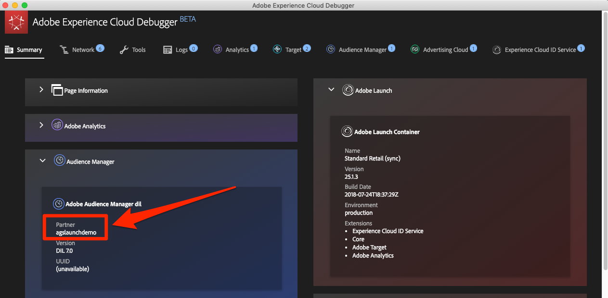
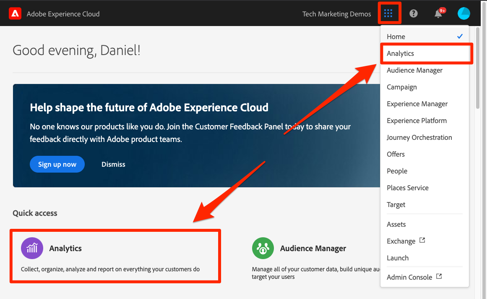
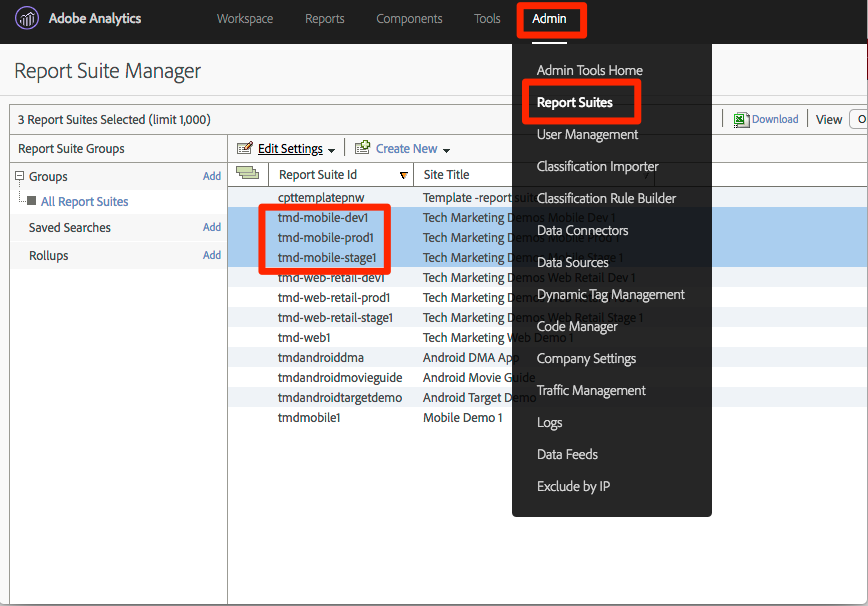

# 新增 Adobe Audience Manager

本課程將引導您使用伺服器端轉送，逐步啟用 Adobe Audience Manager。

[Adobe Audience Manager](https://experienceleague.adobe.com/docs/audience-manager/user-guide/aam-home.html) (AAM) 提供領先業界的線上受眾資料管理服務，為數位廣告商和發行商提供所需的工具，控制並運用其資料資產，協助促進銷售成果。

>[!NOTE]
>
>Adobe Experience Platform Launch正在以資料收集技術套裝的形式整合到Adobe Experience Platform中。 此介面已推出幾項術語變更，使用此內容時請務必注意：
>
> * platform launch（使用者端）現在是&#x200B;**[[!DNL tags]](https://experienceleague.adobe.com/docs/experience-platform/tags/home.html)**
> * platform launch伺服器端現在是&#x200B;**[[!DNL event forwarding]](https://experienceleague.adobe.com/docs/experience-platform/tags/event-forwarding/overview.html)**
> * Edge設定現在是&#x200B;**[[!DNL datastreams]](https://experienceleague.adobe.com/docs/experience-platform/edge/fundamentals/datastreams.html)**

## 學習目標

在本課程結束時，您將能夠：

1. 說明在網站中實施 Audience Manager 的兩種主要方式
1. 使用 Analytics 信標的伺服器端轉送來新增 Audience Manager
1. 驗證 Audience Manager 實施

## 必要條件

若要完成本課程，您需要：

1. 已完成[設定標籤](create-a-property.md)、[新增Adobe Analytics](analytics.md)和[新增身分識別服務](id-service.md)中的課程。

1. 擁有 Adobe Analytics 的管理員存取權，這樣才能為您用於本教學課程的報表套裝啟用伺服器端轉送。或者，您也可以請組織的現有管理員按照下列指示為您執行此操作。

1. 您的「Audience Manager 子網域」(也稱為「合作夥伴名稱」、「合作夥伴 ID」或「合作夥伴子網域」)。如果您已在網站上實施 Audience Manager，取得此資訊最簡單的方法就是前往您的實際網站，然後開啟 Debugger。子網域會顯示在 Audience Manager 區段的「摘要」標籤中：

   

如果您尚未實施 Audience Manager，請依照下列指示[取得 Audience Manager 子網域](https://experienceleague.adobe.com/docs/audience-manager-learn/tutorials/web-implementation/how-to-identify-your-partner-id-or-subdomain.html)。

## 實施選項

您可透過下列兩種方式在網站中實施 Audience Manager：

* **伺服器端轉送 (SSF)**：針對擁有 Adobe Analytics 的客戶，這是最簡單且建議使用的實施方法。Adobe Analytics 會在 Adobe 後端將資料轉送到 AAM，讓頁面上少一個請求。這也支援重要整合功能，且符合 Audience Manager 程式碼實施與部署的最佳做法。

* **用戶端 DIL**：此方法適用於沒有 Adobe Analytics 的客戶。DIL 程式碼 (資料整合程式庫程式碼、AAM JavaScript 設定程式碼) 會直接從網頁將資料傳送到 Audience Manager 中。

由於您已在本教學課程中部署 Adobe Analytics，因此將使用伺服器端轉送來部署 Audience Manager。如需伺服器端轉送的完整說明和需求清單，請參閱[本文件](https://experienceleague.adobe.com/docs/analytics/admin/admin-tools/server-side-forwarding/ssf.html?lang=zh-Hant)以熟悉運作方式、必要項目及驗證方法。

## 啟用伺服器端轉送

執行 SSF 實施有兩個主要步驟：

1. 在 Analytics Admin Console 中開啟「交換器」，針對&#x200B;*每個報表套裝*&#x200B;將資料從 Analytics 轉送至 Audience Manager。
1. 透過標籤將程式碼置於適當位置。 為了讓此功能正常運作，您需要安裝 Adobe Experience Platform Identity Service 擴充功能及 Analytics 擴充功能 (您實際上&#x200B;*不*&#x200B;需要 AAM 擴充功能，請見下文說明)。

### 在 Analytics Admin Console 中啟用伺服器端轉送

必須具備 Adobe Analytics Admin Console 中的設定，才能開始將資料從 Adobe Analytics 轉送至 Adobe Audience Manager。因為最多可能需要四個小時才能開始轉送資料，您應先執行此步驟。

#### 在 Analytics Admin Console 中啟用 SSF

1. 透過 Experience Cloud UI 登入 Analytics。如果您沒有 Analytics 的管理員存取權，需與 Experience Cloud 或 Analytics 管理員聯絡，請對方為您指派存取權或完成這些步驟。

   

1. 在Analytics的頂端導覽列中選擇&#x200B;**[!UICONTROL 管理員>報表套裝]**，然後在清單中選取（多選）您要轉送至Audience Manager的報表套裝。

   

1. 在「報表套裝」畫面中選取報表套裝後，選擇&#x200B;**[!UICONTROL 編輯設定>一般>伺服器端轉送]**。

   

   >[!WARNING]
   >
   >如上所述，您必須有管理員許可權才能看到此功能表專案。

1. 在「伺服器端轉送」頁面上，閱讀資訊並勾選方塊，為報表套裝&#x200B;**[!UICONTROL 啟用伺服器端轉送]**。

1. 按一下&#x200B;**[!UICONTROL 儲存]**

   

>[!NOTE]
>
>因為SSF必須對個別報表套裝啟用，實際在您網站的報表套裝中部署SSF時，請務必為您實際的報表套裝重複此步驟。
>
>此外，如果 SSF 選項呈現灰色，您需要將報表套裝對應至您的 Experience Cloud 組織，才能啟用此選項。這在[文件](https://experienceleague.adobe.com/docs/analytics/admin/data-governance/gdpr-view-settings.html)中皆有說明。

完成此步驟後，如果您已啟用 Adobe Experience Platform Identity Service，資料將會從 Analytics 轉送至 AAM。不過，若要完成程式，讓回應能夠正確地從AAM回到頁面(同時透過Audience Analytics功能回到Analytics)，您也必須在標籤中完成下列步驟。 別擔心，操作很簡單。

### 在標籤中啟用伺服器端轉送

這是啟用 SSF 的兩個步驟中的第二個步驟。您已在AnalyticsAdmin Console中切換開關，現在只需要新增程式碼即可，且只要勾選正確的方塊，就能讓標籤發揮作用。

>[!NOTE]
>
>若要將Analytics資料的伺服器端轉送實施到AAM中，我們實際上將會編輯/設定標籤中的Analytics擴充功能，**而非** AAM擴充功能。 AAM 擴充功能為用戶端 DIL 實施專用，適用於沒有 Adobe Analytics 的使用者。因此，當這些使用者請您進入 Analytics 擴充功能設定此功能時，請使用下列正確的步驟。

#### 在標籤中啟用SSF的方式

1. 前往&#x200B;**[!UICONTROL 擴充功能>已安裝]**，然後按一下以設定Analytics擴充功能。

   

1. 展開 `Adobe Audience Manager` 區段

1. 勾選方塊&#x200B;**[!UICONTROL 自動與Audience Manager]**&#x200B;共用Analytics資料。 這會將 Audience Manager 的「模組」(程式碼) 新增至 Analytics `AppMeasurement.js` 實施。

1. 新增您的「Audience Manager 子網域」(也稱為「合作夥伴名稱」、「合作夥伴 ID」或「合作夥伴子網域」)。請依照下列指示操作，[取得您的 Audience Manager 子網域](https://experienceleague.adobe.com/docs/audience-manager-learn/tutorials/web-implementation/how-to-identify-your-partner-id-or-subdomain.html)。

1. 按一下&#x200B;**[!UICONTROL 儲存至程式庫並建置]**

   

伺服器端轉送程式碼現已實施！

### 驗證伺服器端轉送

驗證伺服器端轉送是否正常運作的主要方法是，查看任何 Adobe Analytics 點擊的回應。稍後將會說明。同時，可檢查其他幾個項目，有助於確保此功能以所需的方式運作。

#### 驗證程式碼是否正確載入

標籤安裝用來處理轉送(尤其是從AAM轉送至頁面的回應)的程式碼，稱之為Audience Manager
「模組。」 我們可以使用 Experience Cloud Debugger 來確認該模組已載入。

1. 開啟 Luma 網站
1. 按一下瀏覽器中的 Debugger 圖示，開啟 Experience Cloud Debugger
1. 在「摘要」標籤上，向下捲動至「Analytics」區段
1. 確認 **AudienceManagement** 列於「模組」區段下方

   

#### 驗證 Debugger 中的合作夥伴 ID

接下來，也可以驗證 Debugger 是否從程式碼中取得正確的「合作夥伴 ID」(亦為「合作夥伴子網域」等名稱)。

1. 在 Debugger 中，仍在「摘要」標籤上，向下捲動至「Audience Manager」區段
1. 驗證「合作夥伴」底下的「合作夥伴 ID/子網域」。

   

>[!WARNING]
>
>您可能會注意到Debugger的「Audience Manager」區段會參照「DIL」(即「Data Integration Library」)，且通常會參照使用者端實施，而非我們在這裡實施的伺服器端方法。 事實上，AAM「模組」(用於此 SSF 方法) 使用許多與用戶端 DIL 程式庫相同的程式碼，因此 Debugger 目前會依此方法報告。如果您已按照本教學課程中的步驟進行，而且此驗證區段中的其餘項目正確無誤，即可確信伺服器端轉送運作正常。

#### 驗證 Analytics 請求和回應

請注意，這是關鍵所在。如果您沒有執行從 Analytics 到 Audience Manager 的資料伺服器端轉送，Analytics 信標就不會有回應 (2x2 像素除外)。不過，如果您執行 SSF，Analytics 請求和回應中就會有可驗證的項目，讓您知道運作正常。很可惜，目前 Experience Cloud Debugger 不支援顯示信標的回應。因此，您應使用其他除錯工具/封包 Sniffer (例如 Charles Proxy ) 或瀏覽器的開發工具。

1. 開啟瀏覽器中的開發人員工具，然後前往「網路」標籤
1. 在篩選欄位中輸入 `b/ss`，即可限制您看到的 Adobe Analytics 請求內容
1. 重新整理頁面以查看 Analytics 請求

   

1. 在 Analytics 信標 (請求) 中尋找「callback」參數。此參數的設定如下：`s_c_il[1].doPostbacks`

   

1. 您將會收到 Analytics 信標的回應。其中會包含 doPostbacks 的參照 (在請求中所呼叫)，最重要的是，應該含有一個「stuff」物件。這是將 AAM 區段 ID 傳回至瀏覽器時的位置。如果您有「stuff」物件，表示 SSF 正常運作！

   

>[!WARNING]
>
>請留意誤判的「成功」，如果有回應且一切看似正常運作，請&#x200B;**確定**&#x200B;您有該「stuff」物件。 如果沒有該物件，您可能會在回應中看到顯示 &quot;status&quot;:&quot;SUCCESS&quot; 的訊息。雖然聽起來不合理，但這實際上證明了它&#x200B;**並非**&#x200B;正常運作。如果您看到這個訊息，表示您已完成這第二個步驟（標籤中的程式碼），但AnalyticsAdmin Console中的轉送（此區段的第一個步驟）尚未完成。 在這個情況下，您需要確認已在 Analytics Admin Console 中啟用 SSF。如果您已啟用且尚未經過 4 個小時，請耐心等候。

[下堂課「Experience Cloud整合」>](integrations.md)
