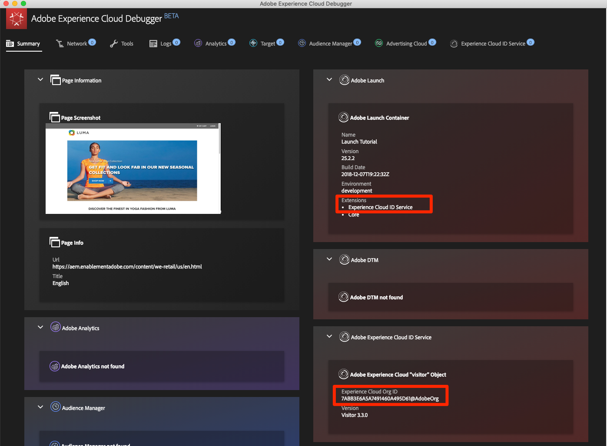

# 新增 Adobe Experience Platform Identity Service

本課程將引導您逐步實施 [Adobe Experience Platform Identity Service 擴充功能](https://experienceleague.adobe.com/docs/experience-platform/tags/extensions/adobe/id-service/overview.html?lang=zh-Hant)及傳送客戶 ID。

[Adobe Experience Platform Identity服務](https://experienceleague.adobe.com/docs/id-service/using/home.html?lang=zh-Hant)會在所有Adobe解決方案中設定通用的訪客ID，以強化Experience Cloud功能，例如解決方案之間的受眾共用。 您也可以將自己的客戶 ID 傳送至此服務，以啟用跨裝置目標鎖定與您客戶關係管理 (CRM) 系統的額外整合。

>[!NOTE]
>
>Adobe Experience Platform Launch正在以資料收集技術套裝的形式整合到Adobe Experience Platform中。 此介面已推出幾項術語變更，使用此內容時請務必注意：
>
> * platform launch（使用者端）現在是&#x200B;**[[!DNL tags]](https://experienceleague.adobe.com/docs/experience-platform/tags/home.html?lang=zh-Hant)**
> * platform launch伺服器端現在是&#x200B;**[[!DNL event forwarding]](https://experienceleague.adobe.com/docs/experience-platform/tags/event-forwarding/overview.html?lang=zh-Hant)**
> * Edge設定現在是&#x200B;**[[!DNL datastreams]](https://experienceleague.adobe.com/docs/experience-platform/edge/fundamentals/datastreams.html?lang=zh-Hant)**

## 學習目標

在本課程結束時，您將能夠：

* 新增 Identity Service 擴充功能
* 建立資料元素以收集客戶 ID
* 建立使用「設定客戶 ID」動作將客戶 ID 傳送至 Adobe 的規則
* 使用規則排序功能，區隔相同事件上引發的規則

## 必要條件

您應該已經完成[設定標籤](create-a-property.md)一節中的課程。

## 新增 Identity Service 擴充功能

由於這是您新增的第一個擴充功能，以下提供擴充功能的快速概述。擴充功能是標籤的核心功能之一。 擴充功能是由 Adobe、Adobe 合作夥伴或任何 Adobe 客戶所建立的整合功能，能針對您可部署至網站的標記新增數量無上限的全新選項。如果您將標籤當成作業系統，擴充功能就是您安裝的應用程式，讓標籤可以為您執行所需操作。

**新增 Identity Service 擴充功能的方式**

1. 在左側導覽中，按一下&#x200B;**[!UICONTROL 擴充功能]**

1. 按一下&#x200B;**[!UICONTROL 目錄]**，前往「擴充功能目錄」頁面

1. 請注意，目錄中提供各種可用的擴充功能

1. 在頂端的篩選器中，輸入「id」以篩選目錄

1. 在Adobe Experience Platform Identity服務的卡片上，按一下&#x200B;**[!UICONTROL 安裝]**

   

1. 請注意，系統已自動為您偵測到 Experience Cloud 組織 ID。

1. 保留所有預設設定，然後按一下&#x200B;**[!UICONTROL 儲存至程式庫並建置]**

   

>[!NOTE]
>
>每一版Identity Service擴充功能皆隨附特定版本的VisitorAPI.js，詳情請參閱擴充功能說明。 需藉由更新 Identity Service 擴充功能來更新 VisitorAPI.js 版本。

### 驗證擴充功能

Identity Service擴充功能是少數標籤擴充功能的其中之一，不必使用規則動作即可提出請求。 擴充功能會自動在網站第一個造訪的第一個頁面載入時，向 Identity Service 提出請求。請求 ID 之後，會儲存在開頭為「AMCV_」的第一方 Cookie 中。

**驗證 Identity Service 擴充功能的方式**

1. 開啟 [Luma 網站](https://luma.enablementadobe.com/content/luma/us/en.html)

1. 如[先前的課程](switch-environments.md)所述，確認Debugger將標籤屬性對應至&#x200B;*您的*&#x200B;開發環境。

1. 在Debugger的「摘要」標籤上，「標籤」區段應會顯示已實施Adobe Experience Platform Identity Service擴充功能。

1. 此外，在「摘要」標籤上，「Identity Service」區段應該會填入「資料收集」介面的擴充功能設定畫面上顯示的相同組織ID：

   

1. 擷取訪客 ID 的初始請求可能會顯示在 Debugger 的「Identity Service」標籤中。不過可能已請求過此項目，因此如果您沒有看到該請求，請不要擔心：
   

1. 在擷取 Visitor ID 的初始請求之後，ID 會儲存在名稱開頭為 `AMCV_` 的 Cookie 中。您可以執行下列操作，確認是否已設定 Cookie：
   1. 開啟瀏覽器的開發人員工具
   1. 前往 `Application` 標籤
   1. 展開左側的 `Cookies`
   1. 按一下 `https://luma.enablementadobe.com` 網域
   1. 尋找右側的 AMCV_ Cookie。您可能會看到自那時起已使用硬式編碼標籤屬性及對映至您自己的屬性載入Luma網站的數個。

      

完成了！您已新增第一個擴充功能！有關 Identity Service 設定選項的詳細資訊，請參閱[本文件](https://experienceleague.adobe.com/docs/id-service/using/id-service-api/configurations/function-vars.html?lang=zh-Hant)。

## 傳送客戶 ID

接下來要將[客戶 ID](https://experienceleague.adobe.com/docs/id-service/using/reference/authenticated-state.html?lang=zh-Hant) 傳送至 Identity Service。這可讓您[整合 CRM](https://experienceleague.adobe.com/docs/core-services/interface/customer-attributes/attributes.html?lang=zh-Hant??lang=zh-Hant) 與 Experience Cloud，且可跨裝置追蹤訪客。

在先前的[新增資料元素、規則和程式庫](add-data-elements-rules.md)課程中，您已建立資料元素並將其用於規則中。現在，您將使用這些相同的技巧，在訪客通過驗證時傳送客戶 ID。

### 建立客戶 ID 的資料元素

首先，請建立兩個資料元素：

1. `Authentication State`：擷取訪客是否已登入
1. `Email (Hashed)`：從資料層擷取雜湊版本的電子郵件地址 (用來作為客戶 ID)

**為 Authentication State 建立資料元素的方式**

1. 按一下左側導覽中的&#x200B;**[!UICONTROL 資料元素]**
1. 按一下&#x200B;**[!UICONTROL 新增資料元素]**&#x200B;按鈕

   

1. 將資料元素命名為 `Authentication State`
1. 針對&#x200B;**[!UICONTROL 資料元素型別]**，選取&#x200B;**[!UICONTROL 自訂程式碼]**
1. 按一下&#x200B;**[!UICONTROL 開啟編輯器]**&#x200B;按鈕

   

1. 在[!UICONTROL 編輯程式碼]視窗中，使用以下程式碼，根據 Luma 網站資料層中的屬性，傳回「logged in」或「logged out」值：

   ```javascript
   if (digitalData.user[0].profile[0].attributes.loggedIn)
       return "logged in"
   else
       return "logged out"
   ```

1. 按一下&#x200B;**[!UICONTROL 儲存]**&#x200B;以儲存自訂程式碼

   

1. 將所有其他設定保留為其預設值
1. 按一下&#x200B;**[!UICONTROL 儲存至資料庫]**&#x200B;以儲存資料元素並返回資料元素頁面。 完成所有變更並準備好進行驗證之前，我們不需要執行「建置」。

   

知道使用者的驗證狀態後，您就可以知道客戶 ID 何時應存在於頁面上以傳送至 Identity Service。下一個步驟是建立客戶 ID 本身的資料元素。在 Luma 示範網站上，使用雜湊版本的訪客電子郵件地址。

**為雜湊電子郵件新增資料元素的方式**

1. 按一下&#x200B;**[!UICONTROL 新增資料元素]**&#x200B;按鈕

   

1. 將資料元素命名為 `Email (Hashed)`
1. 針對&#x200B;**[!UICONTROL 資料元素型別]**，選取&#x200B;**[!UICONTROL JavaScript變數]**
1. 做為&#x200B;**[!UICONTROL JavaScript變數名稱]**，使用以下指向Luma網站資料層中變數的指標： `digitalData.user.0.profile.0.attributes.username`
1. 將所有其他設定保留為其預設值
1. 按一下&#x200B;**[!UICONTROL 儲存至資料庫]**&#x200B;以儲存資料元素

   

### 新增規則以傳送客戶 ID

Adobe Experience Platform Identity Service 會使用「設定客戶 ID」動作，在規則中傳遞客戶 ID。現在需建立一個規則，以便在訪客通過驗證時觸發此動作。

**新增規則以傳送客戶 ID 的方式**

1. 在左側導覽列中，按一下&#x200B;**[!UICONTROL 規則]**
1. 按一下&#x200B;**[!UICONTROL 新增規則]**&#x200B;以開啟規則產生器

   

1. 將規則命名為 `All Pages - Library Loaded - Authenticated - 10`

   >[!TIP]
   >
   >此命名慣例表示您會在使用者通過驗證時，在所有頁面頂端引發此規則，而且順序為「10」。 使用類似的命名慣例 (而非為動作中觸發的解決方案命名)，可讓您將實施所需的規則總數降到最低。

1. 在&#x200B;**[!UICONTROL 事件]**&#x200B;底下，按一下&#x200B;**[!UICONTROL 新增]**

   

   1. 針對&#x200B;**[!UICONTROL 事件型別]**，選取&#x200B;**[!UICONTROL 載入的程式庫（頁面頂端）]**
   1. 展開&#x200B;**[!UICONTROL 進階選項]**&#x200B;區段，並針對&#x200B;**[!UICONTROL 順序]**&#x200B;輸入`10`。 「順序」會控制相同事件所觸發的規則順序。順序較低的規則會在順序較高的規則之前引發。在此情況下，您會想在引發 Target 請求之前設定客戶 ID，您將在下一個課程中使用順序為 `50` 的規則進行此操作。
   1. 按一下&#x200B;**[!UICONTROL 保留變更]**&#x200B;按鈕以返回規則產生器

   

1. 在&#x200B;**[!UICONTROL 條件]**&#x200B;下，按一下&#x200B;**[!UICONTROL 新增]**

   

   1. 針對&#x200B;**[!UICONTROL 條件型別]**，選取&#x200B;**[!UICONTROL 值比較]**
   1. 按一下  圖示，開啟資料元素強制回應視窗

      

   1. 在資料元素強制回應視窗中，按一下&#x200B;**[!UICONTROL 驗證狀態]**，然後按一下&#x200B;**[!UICONTROL 選取]**

      

1. 確定運算子是 `Equals`
1. 在文字欄位中輸入「logged in」，會導致每當資料元素「Authentication State」的值為「logged in」時，就會引發規則。

1. 按一下&#x200B;**[!UICONTROL 保留變更]**

   

1. 在&#x200B;**[!UICONTROL 動作]**&#x200B;底下，按一下&#x200B;**[!UICONTROL 新增]**

   

   1. 為&#x200B;**[!UICONTROL 延伸模組]**&#x200B;選取&#x200B;**[!UICONTROL Experience Cloud識別碼服務]**
   1. 針對&#x200B;**[!UICONTROL 動作型別]**&#x200B;選取&#x200B;**[!UICONTROL 設定客戶ID]**
   1. 對於&#x200B;**[!UICONTROL 整合代碼]**，請輸入`crm_id`
   1. **[!UICONTROL 值]**&#x200B;請開啟資料元素選取器強制回應視窗，並選取`Email (Hashed)`
   1. 為&#x200B;**[!UICONTROL 驗證狀態]**&#x200B;選取&#x200B;**[!UICONTROL 已驗證]**
   1. 按一下&#x200B;**[!UICONTROL 保留變更]**&#x200B;按鈕以儲存動作並返回規則產生器

      

1. 按一下&#x200B;**[!UICONTROL 儲存至程式庫並建置]**&#x200B;按鈕以儲存規則

   

您現在已建立規則，當訪客通過驗證時，系統會將客戶 ID 作為 `crm_id` 變數傳出。由於您指定順序為 `10`，因此這個規則會先引發，再引發您於[新增資料元素、規則和程式庫](add-data-elements-rules.md)課程中建立的 `All Pages - Library Loaded` 規則 (其預設順序值為 `50`)。

### 驗證客戶 ID

若要驗證您所執行的操作，請登入 Luma 網站確認新規則的行為。

**登入 Luma 網站的方式**

1. 開啟 [Luma 網站](https://luma.enablementadobe.com/content/luma/us/en.html)

1. 如[先前的課程](switch-environments.md)所述，確認Debugger將標籤屬性對應至&#x200B;*您的*&#x200B;開發環境

   

1. 按一下Luma網站右上角的&#x200B;**[!UICONTROL 登入]**&#x200B;連結

   

1. 使用者名稱請輸入 `test@adobe.com`
1. 密碼請輸入 `test`
1. 按一下&#x200B;**[!UICONTROL 登入]**&#x200B;按鈕

   

1. 返回首頁

現在請確認已使用 Debugger 擴充功能將客戶 ID 傳送至該服務。

**驗證 Identity Service 是否有傳遞客戶 ID 的方式**

1. 確認顯示 Luma 網站的標籤清晰可見
1. 在 Debugger 中，前往「Adobe Experience Platform Identity Service」標籤
1. 展開您的組織 ID
1. 按一下含有 `Customer ID - crm_id` 值的儲存格
1. 在強制回應視窗中，請注意是否顯示客戶 ID 值和 `AUTHENTICATED` 狀態：

   

1. 請注意，您可以檢視 Luma 頁面原始碼並查看使用者名稱屬性，以確認雜湊電子郵件值。它應與您在 Debugger 中看到的值一致：

   

### 其他驗證秘訣

標籤也有豐富的主控台記錄功能。 若要開啟這些功能，請前往Debugger中的&#x200B;**[!UICONTROL 工具]**&#x200B;標籤，然後開啟&#x200B;**[!UICONTROL 標籤主控台記錄]**&#x200B;切換開關。


這會同時在瀏覽器主控台以及 Debugger 的「記錄」標籤中開啟主控台記錄功能。您應該會看到目前為止已建立的所有規則之記錄！請注意，新記錄項目會新增到清單頂端，這樣「所有頁面 - 程式庫已載入 - 已通過驗證 - 10」規則應該就會在「所有頁面 - 程式庫已載入」規則之前引發，並在 Debugger 的 Console Logging 中顯示於其下方：


[下堂課「新增Adobe Target」>](target.md)
