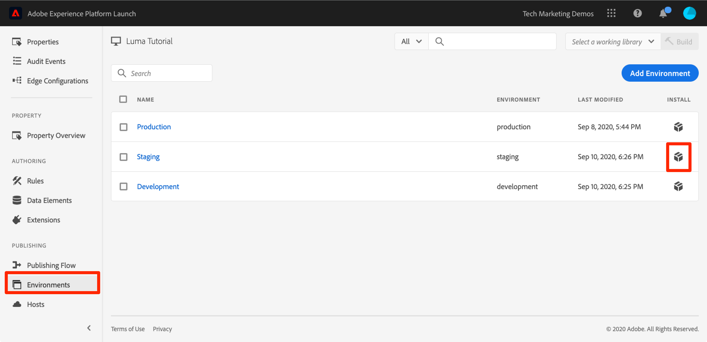

# Publish您的標籤屬性

現在您已於開發環境中實施 Adobe Experience Cloud 的某些重要解決方案，您可以開始瞭解發佈工作流程。

>[!NOTE]
>
>Adobe Experience Platform Launch正在以資料收集技術套裝的形式整合到Adobe Experience Platform中。 此介面已推出幾項術語變更，使用此內容時請務必注意：
>
> * platform launch（使用者端）現在是&#x200B;**[[!DNL tags]](https://experienceleague.adobe.com/docs/experience-platform/tags/home.html)**
> * platform launch伺服器端現在是&#x200B;**[[!DNL event forwarding]](https://experienceleague.adobe.com/docs/experience-platform/tags/event-forwarding/overview.html)**
> * Edge設定現在是&#x200B;**[[!DNL datastreams]](https://experienceleague.adobe.com/docs/experience-platform/edge/fundamentals/datastreams.html)**

## 學習目標

在本課程結束時，您將能夠：

1. 將開發程式庫發佈到測試環境
1. 使用 Debugger 將測試程式庫對應至生產環境網站
1. 將測試程式庫發佈到生產環境

## 發佈到測試環境

現在您已於開發環境中建立並驗證程式庫，您可以開始將其發佈到測試環境。

1. 移至&#x200B;**[!UICONTROL 發佈流程]**&#x200B;頁面

1. 開啟程式庫旁的下拉式清單，並選取&#x200B;**[!UICONTROL 提交以進行核准]**

   

1. 在對話方塊中按一下&#x200B;**[!UICONTROL Submit]**&#x200B;按鈕：

   

1. 您的程式庫現在會以未建置的狀態顯示在[!UICONTROL 已提交]欄中：

1. 開啟下拉式清單，然後選取&#x200B;**[!UICONTROL 為暫存環境建置]**：

   

1. 綠點圖示顯示之後，即可在測試環境中預覽程式庫。

在實際案例中，此程序的下一步通常是讓 QA 團隊在測試程式庫中驗證變更。他們可以使用 Debugger 執行此操作。

**驗證測試程式庫中變更的方式**

1. 在您的標籤屬性中，開啟[!UICONTROL 環境]頁面

1. 在[!UICONTROL 測試]列中，按一下「安裝」圖示 ，開啟強制回應視窗

   

1. 按一下「複製」圖示 ，將內嵌程式碼複製到剪貼簿

1. 按一下&#x200B;**[!UICONTROL 關閉]**&#x200B;以關閉強制回應視窗

   

1. 在 Chrome 瀏覽器中開啟 [Luma 示範網站](https://luma.enablementadobe.com/content/luma/us/en.html)

1. 按一下圖示，開啟[Experience PlatformDebugger擴充功能](https://chromewebstore.google.com/detail/adobe-experience-platform/bfnnokhpnncpkdmbokanobigaccjkpob)

   

1. 前往「工具」標籤

1. 在&#x200B;**[!UICONTROL AdobeLaunch >取代Launch內嵌程式碼]**&#x200B;區段中，貼上剪貼簿中的測試內嵌程式碼
1. 開啟&#x200B;**[!UICONTROL Apply over luma.enablementadobe.com]**&#x200B;引數

1. 按一下磁碟圖示以儲存

   Debugger](images/switchEnvironments-debugger-save.png)中顯示的中顯示的![標籤環境

在真實情境中，一旦 QA 團隊檢閱測試環境中的變更以進行簽核後，就可以發佈到生產環境。

## 發佈到生產環境

1. 前往[!UICONTROL 發佈]頁面

1. 在下拉式清單中按一下&#x200B;**[!UICONTROL 核准發佈]**：

   

1. 在對話方塊中按一下&#x200B;**[!UICONTROL 核准]**&#x200B;按鈕：

   

1. 程式庫現在會以未建置的狀態 (黃色圓點) 顯示在[!UICONTROL 已核准]欄中：

1. 開啟下拉式清單，選取&#x200B;**[!UICONTROL 建置和Publish至生產環境]**：

   

1. 在對話方塊中按一下&#x200B;**[!UICONTROL Publish]**：

   

1. 程式庫現在會出現在[!UICONTROL 已發佈]欄中：

   

完成了！您已完成本教學課程並在標籤中發佈第一個屬性！
