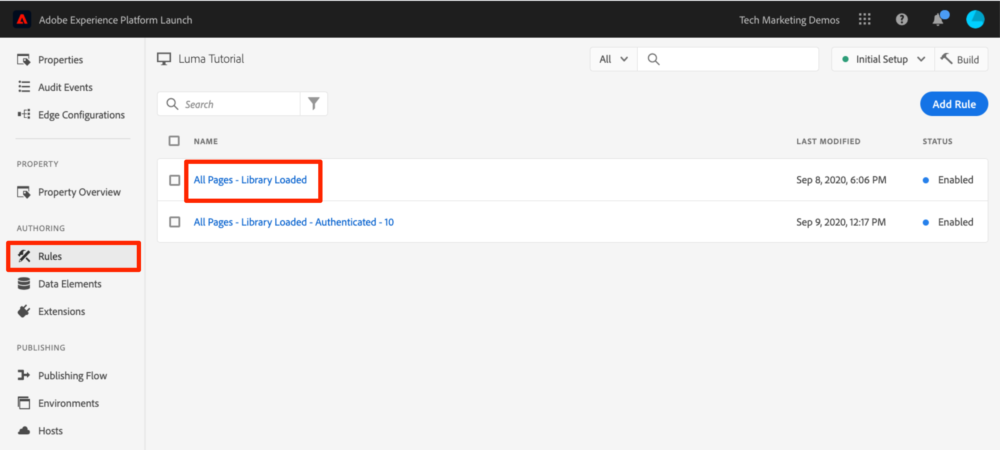
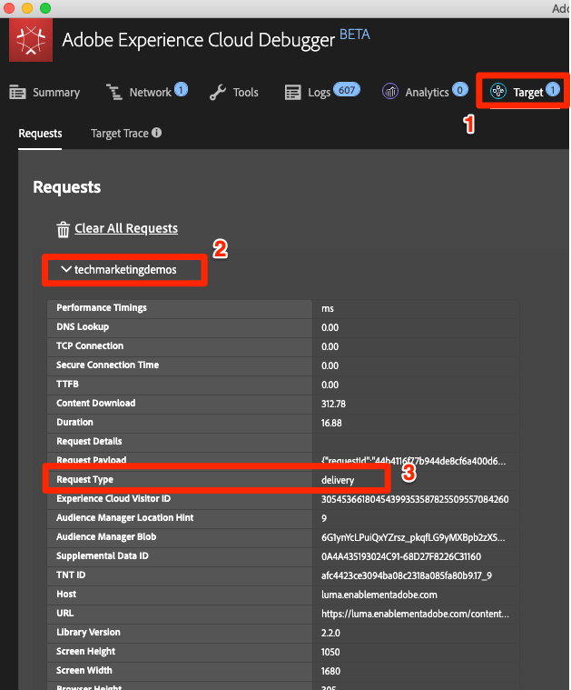
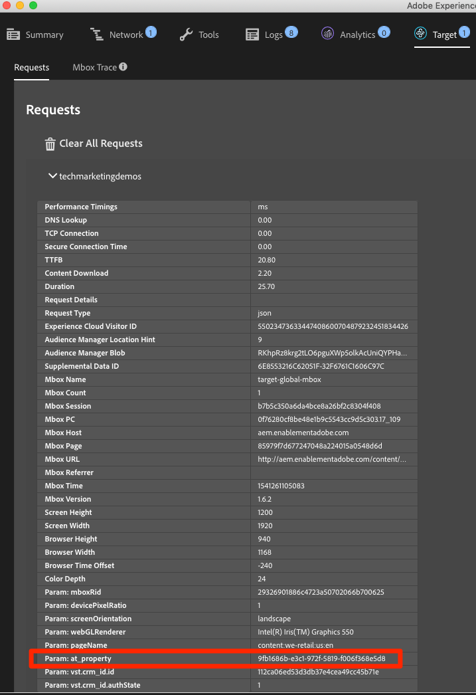

# 新增 Adobe Target

在本課程中，我們將透過頁面載入請求和自訂參數實施 [Adobe Target 擴充功能](https://experienceleague.adobe.com/docs/experience-platform/tags/extensions/adobe/target/overview.html?lang=zh-Hant)。

[Adobe Target](https://experienceleague.adobe.com/docs/target/using/target-home.html?lang=zh-Hant) 為 Adobe Experience Cloud 解決方案，提供一切所需工具，讓您量身打造及個人化您的客戶體驗，藉此為您的網頁以及行動網站、應用程式、社交媒體和其他數位頻道創造最高的收入。

>[!NOTE]
>
>Adobe Experience Platform Launch正在以資料收集技術套裝的形式整合到Adobe Experience Platform中。 此介面已推出幾項術語變更，使用此內容時請務必注意：
>
> * Platform Launch （使用者端）現在是&#x200B;**[!DNL tags]**
> * Platform Launch Server Side現在是&#x200B;**[!DNL event forwarding]**
> * Edge設定現在是&#x200B;**[!DNL datastreams]**

## 學習目標

在本課程結束時，您將能夠：

* 新增在將Target與非同步標籤內嵌程式碼搭配使用的情況下，可用來管理閃爍的預先隱藏程式碼片段
* 新增 Target v2 擴充功能
* 引發頁面載入請求 (先前稱為「全域 mbox」)
* 將參數新增至頁面載入請求
* 說明如何將輪廓和實體參數新增到頁面載入請求
* 使用必要的參數引發訂單確認請求
* 說明如何新增進階設定，例如 Library Header 和 Library Footer 程式碼
* 驗證 Target 實施

## 必要條件

若要完成本節中的課程，您必須先完成[設定標籤](create-a-property.md)和[新增Identity服務](id-service.md)中的課程。

## 新增 Target 預先隱藏程式碼片段

開始之前，我們需要稍微更新標籤內嵌程式碼。 非同步載入標籤內嵌程式碼時，必須等到Target程式庫完全載入並執行其內容交換後，頁面才能完成轉譯。 這可能會導致所謂的閃爍問題，發生此問題時，會先短暫地顯示預設內容，然後再更換為 Target 指定的個人化內容。若要避免發生這種閃爍問題，強烈建議在緊接標籤的非同步內嵌程式碼之前，以硬式編碼撰寫特殊的預先隱藏程式碼片段。

此作業已在 Luma 網站上完成，不過讓我們在範例頁面上執行，讓您瞭解實施情況。複製下列數行程式碼：

```html
<script>
   //prehiding snippet for Adobe Target with asynchronous tags deployment
   ;(function(win, doc, style, timeout) {
   var STYLE_ID = 'at-body-style';
   function getParent() {
      return doc.getElementsByTagName('head')[0];
   }
   function addStyle(parent, id, def) {
      if (!parent) {
      return;
      }
      var style = doc.createElement('style');
      style.id = id;
      style.innerHTML = def;
      parent.appendChild(style);
   }
   function removeStyle(parent, id) {
      if (!parent) {
      return;
      }
      var style = doc.getElementById(id);
      if (!style) {
      return;
      }
      parent.removeChild(style);
   }
   addStyle(getParent(), STYLE_ID, style);
   setTimeout(function() {
      removeStyle(getParent(), STYLE_ID);
   }, timeout);
   }(window, document, "body {opacity: 0 !important}", 3000));
</script>
```

開啟範例頁面，如下圖所示，將其貼到標籤內嵌程式碼的前面（如果行數不同，不必擔心）。 在此熒幕擷圖中，預先隱藏的程式碼片段已縮制：


重新載入範例頁面。您會發現頁面會先隱藏三秒再顯示。這是暫時性的行為，Target 部署後便會消失。此預先隱藏行為是由程式碼片段尾端的兩項設定所控制，雖然您可以自訂這些設定，但通常建議保留預設設定：

* `body {opacity: 0 !important}` 會指定在 Target 載入之前，要用於預先隱藏的 CSS 定義。根據預設，整個內文都會隱藏。如果您有一致的 DOM 結構以及可輕鬆識別的容器元素 (比方說，可將所有內容包裝在導覽下)，而且您絕不想測試或個人化導覽，則可使用此設定將預先隱藏限定為該容器元素。
* `3000` 會指定預先隱藏的逾時設定。根據預設，如果 Target 未在三秒後載入，則會顯示頁面。這種情況應該非常罕見。

如需詳細資訊以及瞭解如何取得未縮製的預先隱藏程式碼片段，請參閱[採用非同步部署的 Adobe Target 擴充功能](https://experienceleague.adobe.com/docs/experience-platform/tags/extensions/adobe/target/overview.html?lang=zh-Hant#adobe-target-extension-with-an-asynchronous-deployment)

## 新增 Target 擴充功能

Adobe Target 擴充功能支援將 Target 的 JavaScript SDK 用於現代網路 at.js 的用戶端實施。仍在使用Target舊版程式庫mbox.js [的客戶應升級至at.js 2.x](https://experienceleague.adobe.com/docs/target/using/implement-target/client-side/mbox-implement/migrate-mbox/target-atjs-implementation.html?lang=zh-Hant)，才能使用標籤。

Target v2 擴充功能包含兩個主要部分：

1. 管理核心程式庫設定的擴充功能設定
1. 規則動作，可執行下列操作：
   1. 載入 Target (at.js 2.x)
   1. 將參數新增至頁面載入請求
   1. 將參數新增至所有請求
   1. 引發頁面載入請求

在第一個練習中，我們將新增擴充功能並審視設定。在稍後的練習中，將會使用這些動作。

**新增擴充功能的方式**

1. 移至&#x200B;**[!UICONTROL 擴充功能>目錄]**
1. 在篩選器中輸入 `target` 以快速找到 Adobe Target 擴充功能。擴充功能有兩種：Adobe Target 和 Adobe Target v2。本教學課程將使用 v2 版的擴充功能，此擴充功能使用最新版 at.js (目前為 2.x)，最適合傳統網站和單頁應用程式 (SPA)。
1. 按一下&#x200B;**[!UICONTROL 安裝]**

   

1. 新增擴充功能時，會從 Target 介面匯入許多 (但並非全部) at.js 設定，如下圖所示。逾時是其中一項不會匯入的設定，新增擴充功能後該設定一律為 3000ms。在本教學課程中，請保留預設設定。請注意，左側會顯示目前擴充功能版本隨附的 at.js 版本。

1. 按一下&#x200B;**[!UICONTROL 儲存至資料庫]**

   

此時，Target 實際並未執行任何動作，因此沒有任何要驗證的內容。

>[!NOTE]
>
>每一版Target擴充功能都會隨附特定的at.js版本，詳情請見擴充功能說明中列出的資訊。 您可以更新 Target 擴充功能以更新 at.js 版本。

## 載入 Target 並引發頁面載入請求

行銷人員在測試及鎖定目標內容時，可使用 Target 控制頁面上的訪客體驗。由於這對於頁面的顯示而言至關重要，Target 應盡早載入，以將對頁面顯示的影響降至最低。在本節中，我們將載入 Target JavaScript 程式庫 at.js，並引發頁面載入請求 (在舊版 at.js 中稱為「全域 mbox」)。

您可以使用在「[新增資料元素、規則和程式庫](add-data-elements-rules.md)」一課中建立的 `All Pages - Library Loaded` 規則來實施 Target，因為它已在頁面載入時盡早觸發。

**載入 Target 的方式**

1. 前往左側導覽中的&#x200B;**[!UICONTROL Rules]**，然後按一下`All Pages - Library Loaded`以開啟規則編輯器

   

1. 在「動作」底下，按一下  以新增動作

   

1. 選取&#x200B;**[!UICONTROL 擴充功能> Adobe Target v2]**

1. 選取&#x200B;**[!UICONTROL 動作型別>載入目標]**

1. 按一下&#x200B;**[!UICONTROL 保留變更]**

   

新增載入 `Load Target` 動作後，at.js 隨即會在頁面上載入。不過在新增 `Fire Page Load Request` 動作之前，不會引發任何 Target 請求。

**引發頁面載入請求**

1. 在「動作」底下，再按一下  以新增另一個動作

   

1. 選取&#x200B;**[!UICONTROL 擴充功能> Adobe Target v2]**

1. 選取&#x200B;**[!UICONTROL 動作型別>引發頁面載入要求]**

1. 關於是否要隱藏頁面和用於預先隱藏的 CSS 選取器，有一些可供頁面載入請求使用的設定。這些設定可與頁面上以硬式編碼撰寫的預先隱藏程式碼片段搭配使用。保留預設設定。

1. 按一下&#x200B;**[!UICONTROL 保留變更]**

   

1. 新動作會依序新增至 `Load Target` 動作之後，且動作會依此順序執行。您可以拖放動作來重新排列順序，但在此案例中，`Load Target` 必須排在 `Fire Page Load Request` 之前。

1. 按一下&#x200B;**[!UICONTROL 儲存至程式庫並建置]**

   

### 驗證頁面載入請求

現在您已新增Target v2擴充功能並引發`Load Target`和`Fire Page Load Request`動作，因此應在使用標籤屬性的所有頁面上發出頁面載入請求。

**驗證「載入 Target」和「引發頁面載入請求」動作的方式**

1. 重新載入範例頁面。應該不會再發生延遲三秒才顯示頁面的情況。如果您使用 `file://` 通訊協定載入範例頁面，應在 Firefox 或 Safari 瀏覽器中執行此步驟，因為使用 `file://` 通訊協定時，Chrome 不會引發 Target 請求。

1. 開啟 [Luma 網站](https://luma.enablementadobe.com/content/luma/us/en.html)

1. 如[先前的課程](switch-environments.md)所述，確認Debugger將標籤屬性對應至&#x200B;*您的*&#x200B;開發環境

   

1. 前往 Debugger 的「摘要」標籤

1. 在 `Launch` 區段中，確認 `Target` 顯示在 `Extensions` 標題下方

1. 在 `Target` 區段中，確認您的 at.js 程式庫版本有顯示

   

1. 最後，前往 `Target` 標籤，展開用戶端程式碼，並確認您的頁面載入請求已出現：

   

恭喜！您已實施 Target！

## 新增參數

在 Target 請求中傳遞參數可將強大的功能新增到目標鎖定、測試及個人化活動。標籤擴充功能提供可傳遞引數的兩項動作：

1. `Add Params to Page Load Request`，會將參數新增至頁面載入請求 (相當於 [targetPageParams()](https://experienceleague.adobe.com/docs/target/using/implement-target/client-side/functions-overview/cmp-atjs-functions.html?lang=zh-Hant) 方法)

1. `Add Params to All Requests`，會在所有 Target 請求中新增參數，例如頁面載入請求，加上自訂程式碼動作或在網站上以硬式編碼撰寫的其他請求 (等同於 [targetPageParamsAll()](https://experienceleague.adobe.com/docs/target/using/implement-target/client-side/functions-overview/cmp-atjs-functions.html?lang=zh-Hant) 方法)

您可以在 `Load Target` 動作&#x200B;*前*&#x200B;使用這些動作，而且可以根據您的規則設定，在不同的頁面上設定不同參數。使用您在透過 Identity Service 設定客戶 ID 時使用的規則排序功能，在引發頁面載入請求的規則之前，設定 `Library Loaded` 事件的其他參數。
>[!TIP]
>
>由於大部分實施都會使用頁面載入請求來傳送活動，因此只使用`Add Params to Page Load Requests`動作通常便已足夠。

### 請求 (mbox) 參數

參數可用來將自訂資料傳遞至 Target，讓您的個人化功能更加豐富。參數最適合在瀏覽作業階段期間經常變更的屬性，例如頁面名稱、範本等，而且不會持續不變。

現在來將先前於`Page Name`新增資料元素、規則和程式庫[課程中建立的 &#x200B;](add-data-elements-rules.md) 資料元素新增為請求參數。

**新增請求參數的方式**

1. 前往左側導覽中的&#x200B;**[!UICONTROL Rules]**，然後按一下`All Pages - Library Loaded`以開啟規則編輯器。

   

1. 在「動作」底下，按一下  以新增動作

   

1. 選取&#x200B;**[!UICONTROL 擴充功能> Adobe Target v2]**

1. 選取&#x200B;**[!UICONTROL 動作型別>將引數新增至頁面載入要求]**

1. 輸入`pageName`作為&#x200B;**[!UICONTROL 名稱]**

1. 按一下 ，開啟資料元素強制回應視窗

1. 按一下 `Page Name` 資料元素

1. 按一下&#x200B;**[!UICONTROL 選取]**&#x200B;按鈕

   

1. 按一下&#x200B;**[!UICONTROL 保留變更]**

   

1. 按一下並拖曳 `Add Params to Page Load Request` 動作的左側邊緣，重新排列 `Fire Page Load Request` 動作前面的動作 (可在 `Load Target` 動作之前或之後)

1. 按一下&#x200B;**[!UICONTROL 儲存至程式庫並建置]**

   

#### 驗證請求參數

目前，使用 at.js 2.x 請求傳遞的自訂參數在 Debugger 中不易檢視，因此我們將運用瀏覽器的開發人員工具。

**驗證 pageName 請求參數的方式**

1. 重新載入Luma網站，確認已對應至您自己的標籤屬性
1. 開啟瀏覽器的開發人員工具
1. 按一下「網路」標籤
1. 將請求篩選為 `tt.omtrdc` (或 Target 請求的 CNAME&#39;d 網域)
1. 展開 `Headers` > `Request Payload` > `execute.pageLoad.parameters` 區段，驗證 `pageName` 參數和值


<!--Now go to the **[!UICONTROL Target]** tab in the Debugger. Expand your client code and look at the requests. You should see the new `pageName` parameter passed in the request:

-->

### 輪廓參數

與請求參數類似，輪廓參數是透過 Target 請求傳遞。不過，輪廓參數會儲存在 Target 訪客輪廓資料庫中，且在[訪客的輪廓期間](https://experienceleague.adobe.com/docs/target/using/audiences/visitor-profiles/visitor-profile-lifetime.html?lang=zh-Hant)持續存在。您可以在網站的某個頁面上設定這些參數，並用於其他頁面上的 Target 活動。以下是來自某個汽車網站的範例。當訪客前往車輛頁面時，您可以傳遞設定檔參數「profile.lastViewed=sportscar」，以記錄其對於該特定車輛的興趣。當訪客瀏覽到其他非車輛的頁面時，您可以根據其檢視的上一個車輛鎖定目標內容。輪廓參數適用於很少變更或只會在某些頁面上使用的屬性

在本教學課程中，您不需要傳遞任何輪廓參數，但工作流程幾乎與剛剛傳遞 `pageName` 參數時的做法相同。有一項差異是，您必須為輪廓參數名稱加上 `profile.` 前置詞。這就是「userType」輪廓參數在 `Add Params to Page Load Request` 動作中看起來的樣子：


### 實體參數

實體參數是 [推薦實施](https://experienceleague.adobe.com/docs/target/using/recommendations/plan-implement.html?lang=zh-Hant)中使用的特殊參數 ，主要原因有三：

1. 作為觸發產品建議的索引鍵。例如，使用「已檢視產品 X 的使用者也已檢視 Y」等建議演算法時，「X」是建議的「索引鍵」。這通常是訪客目前正在檢視的產品 SKU (`entity.id`) 或類別 (`entity.categoryId`)。
1. 收集訪客行為以支援建議演算法，例如「Recently Viewed Products」或「Most Viewed Products」。
1. 填入推薦目錄。推薦中包含您網站上所有產品或文章的資料庫，以便在建議活動內容中提供這些項目。例如，建議產品時，您通常會想要顯示產品名稱 (`entity.name`) 和影像 (`entity.thumbnailUrl`) 等屬性。某些客戶使用後端摘要填入其目錄，但也可以使用 Target 請求中的實體參數填入。

在本教學課程中，您不需要傳遞任何實體引數，但工作流程與先前傳遞`pageName`請求引數時的做法相同，只需將引數命名為以「entity」為前置詞的名稱， 並將參數對應至相關的資料元素即可。請注意，某些通用實體已保留必須使用的名稱 (例如用於產品 SKU 的 entity.id)。以下是在 `Add Params to Page Load Request` 動作中設定實體參數看起來的樣子：


### 新增客戶 ID 參數

透過 Adobe Experience Platform Identity Service 收集客戶 ID，讓您可使用 Adobe Experience Cloud 的[客戶屬性](https://experienceleague.adobe.com/docs/target/using/audiences/visitor-profiles/working-with-customer-attributes.html?lang=zh-Hant)功能，輕鬆將 CRM 資料匯入 Target。此外，還可以實現[跨裝置訪客拼接](https://experienceleague.adobe.com/docs/target/using/integrate/experience-cloud-device-co-op.html?lang=zh-Hant)，讓客戶在筆記型電腦和行動裝置之間切換時，仍能維持一致的使用體驗。

在引發頁面載入請求之前，必須先在 Identity Service 的 `Set Customer IDs` 動作中設定客戶 ID。為此，請確認您的網站上具備下列功能：

* 客戶ID必須可在標籤內嵌程式碼之前的頁面上使用
* 必須安裝 Adobe Experience Platform Identity Service 擴充功能
* 您必須在「載入的程式庫」(頁面頂端)」事件引發的規則中使用 `Set Customer IDs` 動作
* 在「設定客戶 ID」動作&#x200B;*之後*&#x200B;引發的規則中使用 `Fire Page Load Request` 動作

在上一堂課[新增 Adobe Experience Platform Identity Service](id-service.md) 中，您建立了 `All Pages - Library Loaded - Authenticated - 10` 規則以引發「設定客戶 ID」動作。由於此規則的 `Order` 設定為 `10`，因此會在頁面載入請求從 `Order` 設定為 `50` 的 `All Pages - Library Loaded` 規則引發之前設定客戶 ID。如此一來，您已實施用於 Target 的客戶 ID 集合！

#### 驗證客戶 ID

目前，使用 at.js 2.x 請求傳遞的自訂參數在 Debugger 中不易檢視，因此我們將運用瀏覽器的開發人員工具。

**驗證客戶 ID 的方式**

1. 開啟 [Luma 網站](https://luma.enablementadobe.com/content/luma/us/en.html)

1. 如[先前的課程](switch-environments.md)所述，確認Debugger將標籤屬性對應至&#x200B;*您的*&#x200B;開發環境

   

1. 使用 `test@test.com`/`test` 認證登入 Luma 網站
1. 返回 [Luma 首頁](https://luma.enablementadobe.com/content/luma/us/en.html)

1. 開啟瀏覽器的開發人員工具
1. 按一下「網路」標籤
1. 將請求篩選為 `tt.omtrdc` (或 Target 請求的 CNAME&#39;d 網域)
1. 展開 `Headers` > `Request Payload` > `id.customerIds.0` 區段，驗證客戶 ID 設定和值：


<!--
1. Open the Debugger
1. Go to the Target tab
1. Expand your client code
1. You should see parameters in the latest Target request for `vst.crm_id.id` and `vst.crm_id.authState`. `vst.crm_id.id` should have a value of the hashed email address and `vst.crm_id.authState` should have a value of `1` to represent `authenticated`. Note that `crm_id` is the `Integration Code` you specified in the Identity Service configuration and must align with the key you use in your [Customer Attributes data file](https://experienceleague.adobe.com/docs/core-services/interface/customer-attributes/t-crs-usecase.html?lang=zh-Hant):


-->

>[!WARNING]
>
>Adobe Experience Platform Identity Service可讓您將多個ID傳送至服務，但只有第一個ID會傳送至Target。

### 新增屬性代號參數

>[!NOTE]
>
>這是適用於Target Premium客戶的選用練習。

屬性代號是搭配 Target Premium [Enterprise User Permissions](https://experienceleague.adobe.com/docs/target/using/administer/manage-users/enterprise/property-channel.html?lang=zh-Hant) 功能使用的保留參數。它可用來定義不同的數位屬性，這樣 Experience Cloud 組織的不同成員就能獲派各個屬性的不同權限。例如，您可能希望一組使用者能在您的網站上設定 Target 活動，但不能在行動應用程式中設定。

Target屬性類似於標籤屬性和Analytics報表套裝。 如果企業擁有多個品牌、網站和行銷團隊，可能會使用不同的Target屬性、標籤屬性，以及適用於各個網站或行動應用程式的Analytics報表套裝。 標籤屬性是以其內嵌程式碼區別、Analytics報表套裝是以其報表套裝ID區別，而Target屬性是以其屬性代號引數區別。


屬性代號必須使用具有`targetPageParams()`函式的標籤中的自訂程式碼動作實作。 如果您透過單一標籤屬性使用不同的at_property值來實作多個網站，您可以透過資料元素管理at_property值。

若您是 Target Premium 客戶，且想在教學課程屬性中實施屬性代號，以下是可供使用的選用練習：

1. 在另一個標籤中，開啟 Target 使用者介面

1. 移至&#x200B;**[!UICONTROL 管理>屬性]**

1. 識別您要使用的屬性，然後按一下&#x200B;**[!UICONTROL &lt;/>]** （或建立新屬性）

1. 將`<script></script>`中的程式碼片段複製到剪貼簿

   

1. 在標籤標籤中，前往左側導覽的&#x200B;**[!UICONTROL 規則]**，然後按一下`All Pages - Library Loaded`以開啟規則編輯器。

   

1. 在「動作」底下，按一下 `Core - Custom Code` 動作以開啟 `Action Configuration`

   

1. 開啟程式碼編輯器，並從包含`targetPageParams()`函式的Target介面貼上程式碼
1. 按一下&#x200B;**[!UICONTROL 儲存]**&#x200B;按鈕

   

1. 勾選&#x200B;**[!UICONTROL 全域執行]**&#x200B;方塊，以便在全域範圍中宣告`targetPageParams()`
1. 按一下&#x200B;**[!UICONTROL 保留變更]**

   

1. 按一下&#x200B;**[!UICONTROL 儲存至程式庫並建置]**
   

>[!WARNING]
>
>如果您嘗試透過&#x200B;**[!UICONTROL 將引數新增至頁面載入請求]**&#x200B;動作新增`at_property`引數，引數將會填入網路請求中，但Target的視覺化體驗撰寫器(VEC)在載入頁面時無法自動偵測它。 一律使用[自訂程式碼]動作中的`targetPageParams()`函式填入`at_property`。

#### 驗證屬性代號

目前，使用 at.js 2.x 請求傳遞的自訂參數在 Debugger 中不易檢視，因此我們將運用瀏覽器的開發人員工具。

**驗證屬性代號參數的方式**

1. 開啟 [Luma 網站](https://luma.enablementadobe.com/content/luma/us/en.html)
1. 如[先前的課程](switch-environments.md)所述，確認Debugger將標籤屬性對應至&#x200B;*您的*&#x200B;開發環境

   

1. 開啟瀏覽器的開發人員工具
1. 按一下「網路」標籤
1. 將請求篩選為 `tt.omtrdc` (或 Target 請求的 CNAME&#39;d 網域)
1. 展開 `Headers` > `Request Payload` > `property.token` 區段以驗證值
   

<!--
1. Go to the `Target` tab
1. Expand your client code
1. You should see the parameter for "at_property" in every page load request request as you browse the site:

-->

## 新增自訂請求

### 新增訂單確認請求

訂單確認請求是用於傳送訂單詳細資訊給 Target 的特殊請求類型。包含三個特定請求參數 orderId、orderTotal 和 productPurchasedId，因而將一般 Target 請求變成訂購請求。除了提供收入報表以外，訂單請求也會執行下列動作：

1. 重新提交刪除重複的意外訂單
1. 篩選極端訂單 (其總計超過平均值的三個標準差的訂單)
1. 在背景使用不同的演算法來計算統計可信度
1. 建立特殊、可下載之個別訂單詳細資料的稽核報表

最佳做法是在所有訂單漏斗（甚至非零售網站）中使用訂單確認請求。 例如，銷售機會開發網站通常會有潛在客戶漏斗，其尾端會產生唯一的「lead id」。這些網站應將靜態值 (例如「1」) 用於 orderTotal 以實施訂單請求。

如果客戶將Analytics for Target (A4T)整合用於其大多數報表，則在使用Automated Personalization活動（不支援A4T）時，可能也想要實施訂單請求。 此外，訂單請求是Recommendations實施中的關鍵元素，可根據購買行為支援演演算法。 如需A4T支援的最新資訊，請參閱[檔案](https://experienceleague.adobe.com/docs/target/using/integrate/a4t/a4t.html?lang=zh-Hant#section_F487896214BF4803AF78C552EF1669AA)。

訂單確認請求應從只在訂單確認頁面或事件上觸發的規則引發，通常可與設定 Adobe Analytics 購買事件的規則組合。您必須使用核心擴充功能的「自訂程式碼」動作進行設定，使用相關資料元素來設定 orderId、orderTotal 和 productPurchasedId 參數。

現在來新增在 Luma 網站上引發訂單確認請求所需的資料元素和規則。由於您已建立多個資料元素，此處將提供簡略的指示。

**為 Order ID 建立資料元素的方式**

1. 按一下左側導覽中的&#x200B;**[!UICONTROL 資料元素]**
1. 按一下&#x200B;**[!UICONTROL 新增資料元素]**
1. 將資料元素命名為 `Order Id`
1. 選取&#x200B;**[!UICONTROL 資料元素型別> JavaScript變數]**
1. 使用 `digitalData.cart.orderId` 作為 `JavaScript variable name`
1. 勾選 `Clean text` 選項
1. 按一下&#x200B;**[!UICONTROL 儲存至資料庫]**
（在完成訂購確認請求的所有變更之前，不會建置程式庫）

**為 Cart Amount 建立資料元素的方式**

1. 按一下&#x200B;**[!UICONTROL 新增資料元素]**
1. 將資料元素命名為 `Cart Amount`
1. 選取&#x200B;**[!UICONTROL 資料元素型別> JavaScript變數]**
1. 使用 `digitalData.cart.cartAmount` 作為 `JavaScript variable name`
1. 勾選 `Clean text` 選項
1. 按一下&#x200B;**[!UICONTROL 儲存至資料庫]**

**為 Cart SKU (Target) 建立資料元素的方式**

1. 按一下&#x200B;**[!UICONTROL 新增資料元素]**
1. 將資料元素命名為 `Cart SKUs (Target)`
1. 選取&#x200B;**[!UICONTROL 資料元素型別>自訂程式碼]**
1. 針對 Target，SKU 必須是以逗號分隔的清單。此自訂程式碼會將資料層陣列重新格式化為適當的格式。在自訂程式碼編輯器中，貼入下列內容：

   ```javascript
   var targetProdSkus="";
   for (var i=0; i<digitalData.cart.cartEntries.length; i++) {
     if(i>0) {
       targetProdSkus = targetProdSkus + ",";
     }
     targetProdSkus = targetProdSkus + digitalData.cart.cartEntries[i].sku;
   }
   return targetProdSkus;
   ```

1. 勾選 `Force lowercase value` 選項
1. 勾選 `Clean text` 選項
1. 按一下&#x200B;**[!UICONTROL 儲存至資料庫]**

現在需要建立一個規則，以便使用這些資料元素作為訂購確認頁面上的參數來引發訂購確認請求。

**為「訂單確認」頁面建立規則的方式**

1. 按一下左側導覽中的&#x200B;**[!UICONTROL 規則]**
1. 按一下&#x200B;**[!UICONTROL 新增規則]**
1. 將規則命名為 `Order Confirmation Page - Library Loaded - 60`
1. 按一下&#x200B;**[!UICONTROL 事件>新增]**
   1. 選取&#x200B;**[!UICONTROL 事件型別>載入的程式庫（頁面頂端）]**
   1. 在&#x200B;**[!UICONTROL 進階選項]**&#x200B;下，將`Order`變更為`60`，使其在`Load Target`動作（在我們的`All Pages - Library Loaded`規則中，`Order`設定為`50`）之後引發
   1. 按一下&#x200B;**[!UICONTROL 保留變更]**
1. 按一下&#x200B;**[!UICONTROL 條件>新增]**
   1. 選取&#x200B;**[!UICONTROL 條件型別>不含查詢字串的路徑]**
   1. 對 `Path equals` 輸入 `thank-you.html`
   1. 開啟「規則運算式」選項，將邏輯從 `equals` 變更為 `contains` (您可使用 `Test` 功能，確認測試會連同 URL `https://luma.enablementadobe.com/content/luma/us/en/user/checkout/order/thank-you.html` 一起傳送)

      

   1. 按一下&#x200B;**[!UICONTROL 保留變更]**
1. 按一下&#x200B;**[!UICONTROL 動作>新增]**
   1. 選取&#x200B;**[!UICONTROL 動作型別>自訂程式碼]**
   1. 按一下&#x200B;**[!UICONTROL 開啟編輯器]**
   1. 將下列程式碼貼入 `Edit Code` 強制回應視窗中

      ```javascript
      adobe.target.getOffer({
        "mbox": "orderConfirmPage",
        "params":{
           "orderId": _satellite.getVar('Order Id'),
           "orderTotal": _satellite.getVar('Cart Amount'),
          "productPurchasedId": _satellite.getVar('Cart SKUs (Target)')
        },
        "success": function(offer) {
          adobe.target.applyOffer({
            "mbox": "orderConfirmPage",
            "offer": offer
          });
        },
        "error": function(status, error) {
          console.log('Error', status, error);
        }
      });
      ```

   1. 按一下&#x200B;**[!UICONTROL 儲存]**&#x200B;以儲存自訂程式碼
   1. 按一下&#x200B;**[!UICONTROL 保留變更]**&#x200B;保留動作
1. 按一下&#x200B;**[!UICONTROL 儲存至程式庫並建置]**

#### 驗證訂單確認請求

目前，使用 at.js 2.x 請求傳遞的自訂參數在 Debugger 中不易檢視，因此我們將運用瀏覽器的開發人員工具。

1. 開啟 [Luma 網站](https://luma.enablementadobe.com/content/luma/us/en.html)

1. 如[先前的課程](switch-environments.md)所述，確認Debugger將標籤屬性對應至&#x200B;*您的*&#x200B;開發環境

   

1. 瀏覽網站，然後將多項產品新增到購物車中
1. 繼續結帳
1. 在結帳過程中，只有 `First Name` 和 `Last Name` 是必填欄位

   

1. 在「檢閱訂單」頁面上，請務必按一下 `Place Order` 按鈕
1. 開啟瀏覽器的開發人員工具
1. 按一下「網路」標籤
1. 將請求篩選為 `tt.omtrdc` (或 Target 請求的 CNAME&#39;d 網域)
1. 按一下第二個請求
1. 展開 `Headers` > `Request Payload` > `execute.mboxes.0` 區段以驗證請求名稱和訂單參數：


<!--
1. Look in the Debugger
1. Go to the Target tab
1. Expand your client code
1. You should see the `orderConfirmPage` request as the latest Target request with the orderId, orderTotal, and productPurchasedId parameters populated with the details of your order

   link to "orderConfirmPage request with required parameters": images/target-debugger-orderConfirmPage.png 
-->

### 自訂請求

在某些罕見情況下，您可能需要提出頁面載入和訂單確認請求以外的Target請求。 例如，有時候您要用於個人化的重要資料，未在標籤內嵌程式碼之前的頁面上定義，而是可能會在頁面底部以硬式編碼撰寫，或從非同步API請求傳回。 雖然將此請求用於內容傳送並非最佳方法（因為頁面已顯示），此資料可使用其他請求傳送至Target。 此資料可用來讓訪客設定檔變得更加豐富以供後續使用（使用設定檔引數），或用來填入Recommendations目錄。

在這些情況下，請使用核心擴充功能中的「自訂程式碼」動作，利用[getOffer()](https://experienceleague.adobe.com/docs/target-dev/developer/client-side/at-js-implementation/functions-overview/adobe-target-getoffer.html?lang=zh-Hant)/[applyOffer()](https://experienceleague.adobe.com/docs/target-dev/developer/client-side/at-js-implementation/functions-overview/adobe-target-applyoffer.html?lang=zh-Hant)和[trackEvent()](https://experienceleague.adobe.com/docs/target-dev/developer/client-side/at-js-implementation/functions-overview/adobe-target-trackevent.html?lang=zh-Hant)方法引發要求。 這非常類似於您在[訂單確認請求](#order-confirmation-request)練習中所執行的操作，但您會使用不同的請求名稱，且不會使用特殊訂單引數。 從自訂程式碼發出Target請求之前，請務必使用&#x200B;**[!UICONTROL 載入Target]**&#x200B;動作。

## 程式庫標題和程式庫頁尾

Target 使用者介面中的「編輯 at.js」畫面有可以貼上自訂 JavaScript 的位置，可使其在 at.js 檔案之前或之後立即執行。Library Header 有時可透過 [targetGlobalSettings()](https://experienceleague.adobe.com/docs/target/using/implement-target/client-side/functions-overview/targetgobalsettings.html?lang=zh-Hant) 函數用來覆寫 at.js 設定，或透過[資料提供者](https://experienceleague.adobe.com/docs/target-learn/tutorials/integrations/use-data-providers-to-integrate-third-party-data.html?lang=zh-Hant)功能傳遞來自協力廠商的資料。Library Footer 有時用於新增 [at.js 自訂事件](https://experienceleague.adobe.com/docs/target-dev/developer/client-side/at-js-implementation/functions-overview/atjs-custom-events.html?lang=zh-Hant)接聽程式。

若要在標籤中複製此功能，只需使用核心擴充功能中的「自訂程式碼」動作，並將此動作排序在「載入Target」之前(Library Header)或之後(Library Footer)即可。 您可以使用與 `Load Target` 動作相同的規則執行此操作 (如下圖所示)，或使用具有事件或順序設定的個別規則，穩定地在包含 `Load Target` 的規則之前或之後引發：


若要深入瞭解自訂頁首和頁尾的使用案例，請參閱下列資源：

* [使用 dataProviders 將協力廠商資料整合至 Adobe Target](https://experienceleague.adobe.com/docs/target-learn/tutorials/integrations/use-data-providers-to-integrate-third-party-data.html?lang=zh-Hant)
* [實施 dataProviders 以將協力廠商資料整合至 Adobe Target](https://experienceleague.adobe.com/docs/target-learn/tutorials/integrations/implement-data-providers-to-integrate-third-party-data.html?lang=zh-Hant)
* [將回應代號和 at.js 自訂事件與 Adobe Target 搭配使用](https://experienceleague.adobe.com/docs/target-learn/tutorials/integrations/use-response-tokens-and-atjs-custom-events.html?lang=zh-Hant)

[下堂課「新增Adobe Analytics」>](analytics.md)
